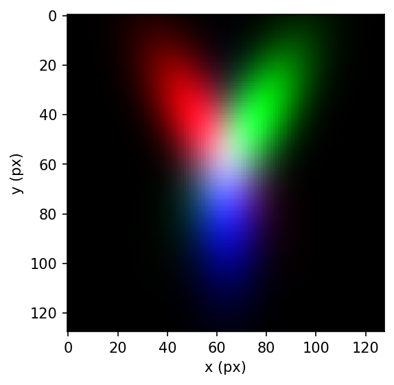
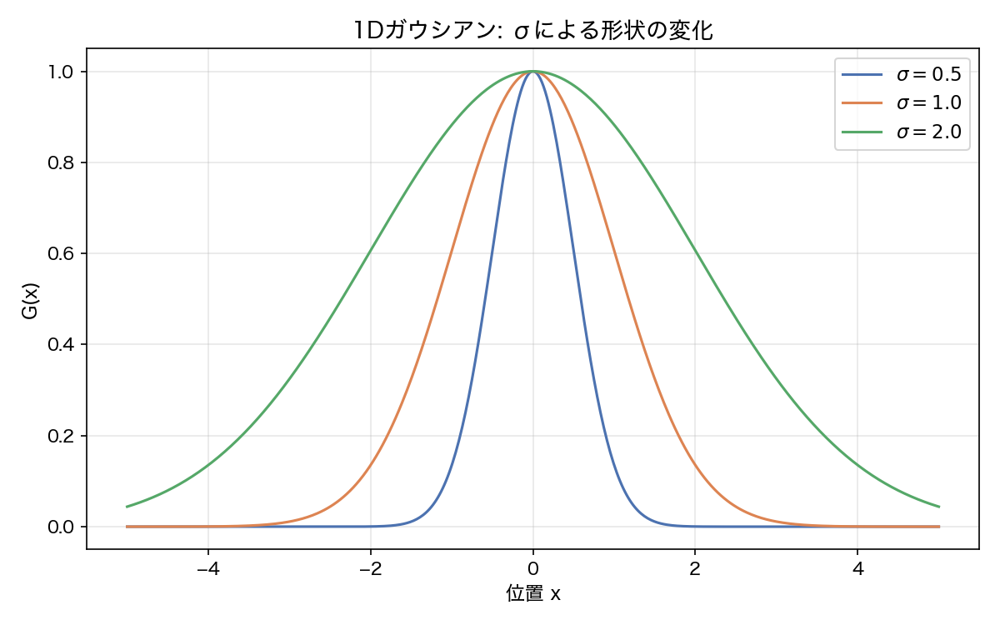
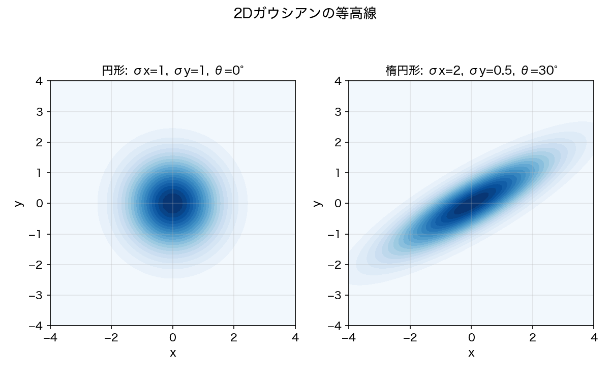
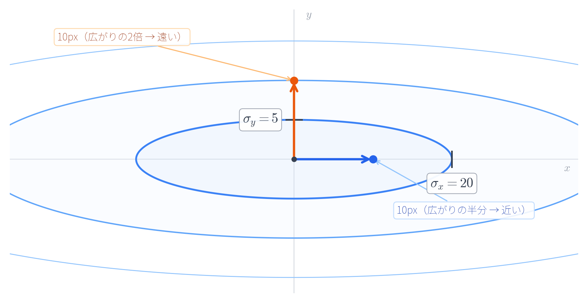
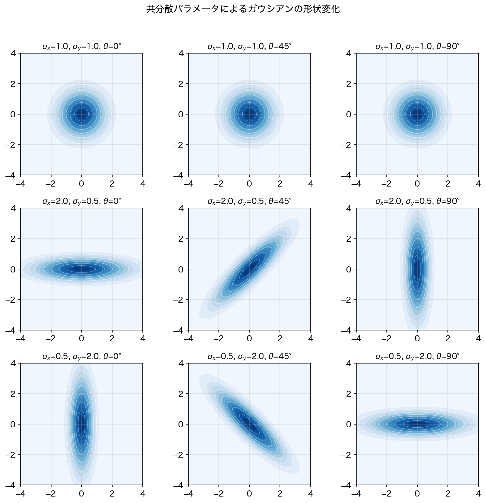
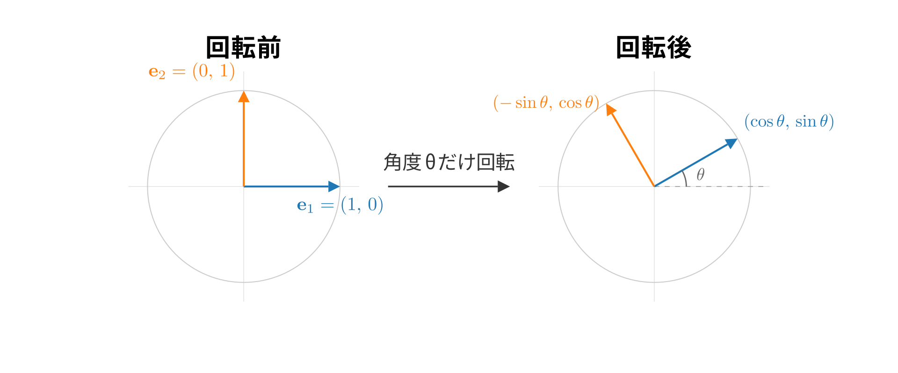
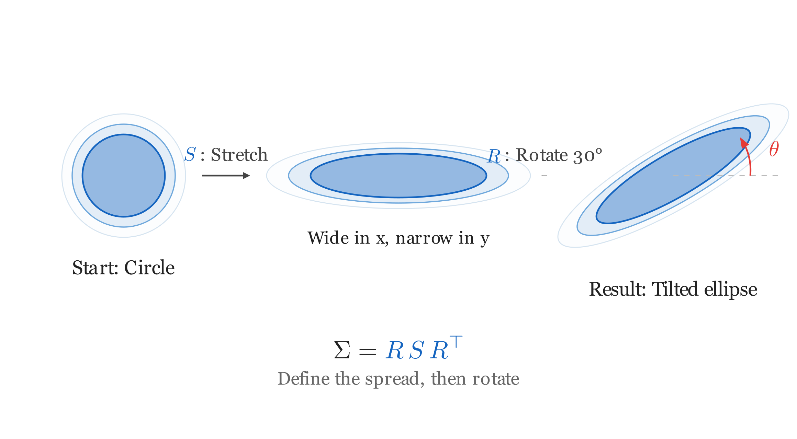
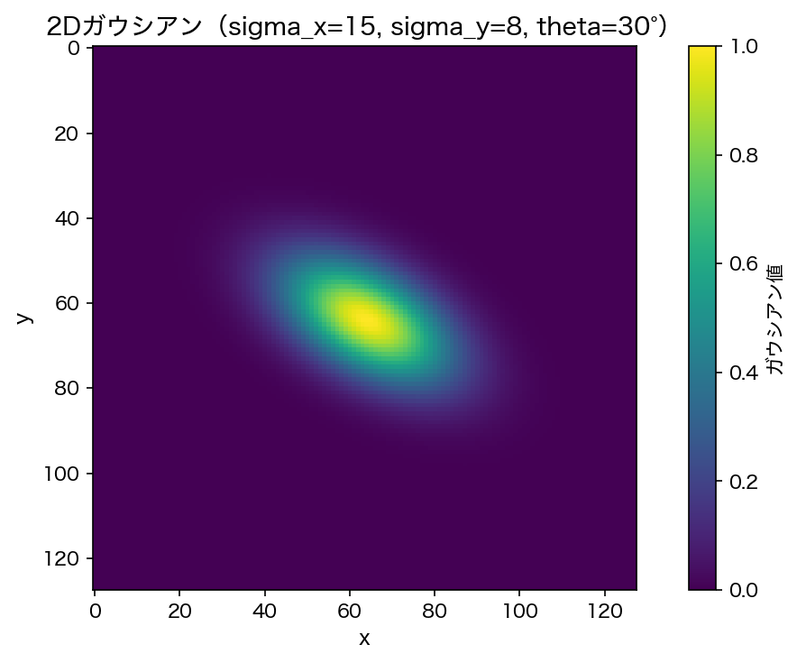
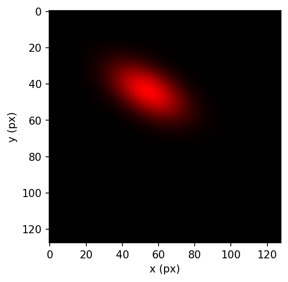

## What You'll Build in This Chapter

In this chapter, we'll use 2D Gaussian functions to draw "softly glowing ellipses" on an image. First we'll compute a single Gaussian correctly and turn it into an image, then layer multiple Gaussians to build a complete picture. The final goal is to blend three elliptical Gaussians—red, green, and blue—and produce an image like the one below, where the colors mix into each other.



A "Gaussian" is a function named after the mathematician Gauss. It has a bell shape: highest at the center, falling off smoothly as you move away. In statistics it's famous as the normal distribution, but in this chapter we'll forget about probability and treat it as "a smooth blob of light we can place inside an image." Let's start in the 2D world and build an intuition for how the parameters that define the shape map to the actual rendered result.

### Learning Goals

- Read the 2D Gaussian formula and explain how the mean and covariance determine its shape
- Assemble a covariance matrix from `sigma_x`, `sigma_y`, and `theta`
- Compute Gaussian values for all pixels at once using NumPy broadcasting
- Composite multiple colored Gaussians into a single image with a weighted sum

### Files Created or Modified in This Chapter

| File | Status | Description |
|---------|------|------|
| `gaussian2d.py` | New | Building blocks for computing 2D Gaussians |
| `render.py` | New | Function that renders Gaussians into an image via weighted sum (renderer v1) |
| `draw_gaussians.py` | New | Wrap-up script that draws three colored Gaussians and saves a PNG |

### Prerequisites

- None (this chapter is the starting point)

---

## 1.1 What Is a Gaussian Function?

### The 1D Gaussian: A Bell Curve

Let's start with the simplest case: the 1D Gaussian function. First we'll get a feel for what the function looks like, and then connect each symbol in the formula to what it represents. A Gaussian function traces a bell-shaped curve that is highest at the center and falls off smoothly as you move away from it. In statistics it's familiar as the "normal distribution," but here we'll use it not as a probability but simply as "the magnitude of a value at a given point." Start by looking at Figure 1.1 and notice how the shape changes as the spread changes.



Written as a formula, it looks like this.

$$
G(x) = \exp\!\left(-\frac{(x - \mu)^2}{2\sigma^2}\right) \tag{1.1}
$$

> **Note**: The normal distribution in statistics has a normalization factor of $1/(\sigma\sqrt{2\pi})$ in front, but we omit it here because we want the value at the center to be 1. In this chapter we want to treat "how strongly this point glows" as a value between 0 and 1, so this form is more convenient.

This formula has two parameters.

- **$\mu$ (mu)**: The center position — where the peak of the bell curve sits
- **$\sigma$ (sigma)**: The spread — the larger the value, the wider the bell curve

Figure 1.1 shows three bell curves with $\mu = 0$ fixed and different values of $\sigma$. The smaller $\sigma$ is, the sharper the peak; the larger it is, the more gently the curve spreads out. Every curve reaches its maximum value of 1 at the center ($x = \mu$) and rapidly approaches zero as you move away.

Thanks to this rapid decay, only the area near the center glows brightly in an image, while distant regions are barely affected. This is why a Gaussian looks like a "soft blob of light."

### From 1D to 2D: What Changes?

The 1D Gaussian returned a value for a single point $x$ on the number line. In 2D, it returns a value for a point $(x, y)$ on the plane.

What changes with this extension? Let's think it through concretely.

**In 1D**:
- Specifying a position: a single number $x$ on the number line
- Center: a single number $\mu$
- Spread: a single number $\sigma$ (it spreads by the same amount to the left and right)

**In 2D**:
- Specifying a position: a coordinate $(x, y)$ on the plane, i.e., a pair of numbers
- Center: a pair of numbers $(\mu_x, \mu_y)$
- Spread: this is where things change dramatically!

In 1D, spread only went "left and right," so a single number was enough. In 2D, however, the degrees of freedom for the spread increase considerably.

- Spread in the x direction ($\sigma_x$)
- Spread in the y direction ($\sigma_y$)
- Tilt of the ellipse (rotation angle $\theta$)

If $\sigma_x = \sigma_y$ the shape is circular; if $\sigma_x \neq \sigma_y$ it becomes elliptical. On top of that, $\theta$ lets us tilt the ellipse. We'll express these three degrees of freedom with a single matrix: the **covariance matrix** $\Sigma$.

### The 2D Gaussian Formula

Keeping the 1D property that "the value decreases as you move away from the center," the 2D formula also encodes the shape and orientation of the ellipse. First look at Figure 1.2 to see the difference between circular and elliptical Gaussians before diving into the formula. As you read on, keep in mind which symbol corresponds to which visual difference you saw in the figure.



The 2D Gaussian function is defined by the following equation.

$$
G(\mathbf{x}) = \exp\!\left(-\frac{1}{2}(\mathbf{x} - \boldsymbol{\mu})^\top \Sigma^{-1} (\mathbf{x} - \boldsymbol{\mu})\right) \tag{1.2}
$$

Let's go through the meaning of each symbol one by one.

| Symbol | Shape | Meaning |
|------|------|------|
| $\mathbf{x}$ | $(2, 1)$ | Coordinates of the point to evaluate. Column vector $\begin{pmatrix} x \\ y \end{pmatrix}$ |
| $\boldsymbol{\mu}$ | $(2, 1)$ | Center coordinates of the Gaussian. Column vector $\begin{pmatrix} \mu_x \\ \mu_y \end{pmatrix}$ |
| $\Sigma$ | $(2, 2)$ | Covariance matrix (determines the shape of the ellipse) |
| $\Sigma^{-1}$ | $(2, 2)$ | Inverse of the covariance matrix |

$\mathbf{x}$ and $\boldsymbol{\mu}$ are **column vectors**—two numbers stacked vertically. Writing $\mathbf{x}^\top$ turns it on its side into a row vector (1×2). The expression inside the exponent of Equation (1.2), $(\mathbf{x} - \boldsymbol{\mu})^\top \Sigma^{-1} (\mathbf{x} - \boldsymbol{\mu})$, is a matrix product of shapes (1×2) × (2×2) × (2×1), so the result is a scalar (a single number). In other words, no matter which point on the plane you plug in, you get back exactly one Gaussian value.

$\Sigma$ (the covariance matrix) is a 2×2 matrix that determines the shape and orientation of the ellipse, and $\Sigma^{-1}$ is its inverse. We'll cover how to assemble $\Sigma$ in detail in Section 1.2.

Let's look at what the exponent of Equation (1.2), $(\mathbf{x} - \boldsymbol{\mu})^\top \Sigma^{-1} (\mathbf{x} - \boldsymbol{\mu})$, actually computes.

A Gaussian is a function where "points near the center have large values, and points far away approach zero." To realize this property, we need to quantify how far each point is from the center. In the 1D Gaussian of Equation (1.1), that was $(x - \mu)^2 / \sigma^2$. In 2D, the exponent plays the same role.

The straightforward way to measure "distance from the center" in 2D would be the Pythagorean theorem: $(x - \mu_x)^2 + (y - \mu_y)^2$. But a Gaussian's ellipse spreads differently in the x and y directions. Take a look at Figure 1.8.



For an ellipse with $\sigma_x = 20, \sigma_y = 5$, a point 10 pixels away in the x direction (blue) lies inside the ellipse—half the spread ($10/20$). Meanwhile, a point 10 pixels away in the y direction (orange) sticks out beyond the ellipse—twice the spread ($10/5$). The same 10 pixels means a different "distance" as far as the ellipse is concerned.

So we divide the offset in each direction by its $\sigma$ before applying the Pythagorean theorem.

$$
\frac{(x - \mu_x)^2}{\sigma_x^2} + \frac{(y - \mu_y)^2}{\sigma_y^2}
$$

Dividing by $\sigma$ means offsets along a direction with large spread count for less, while offsets along a direction with small spread count for more. The term $(\mathbf{x} - \boldsymbol{\mu})^\top \Sigma^{-1} (\mathbf{x} - \boldsymbol{\mu})$ in Equation (1.2) is this same idea written in matrix form, which also handles the case where the ellipse is rotated. This quantity is called the **squared Mahalanobis distance**.

The left side of Figure 1.2 shows a circular Gaussian with $\sigma_x = \sigma_y$, and the right side an elliptical Gaussian with $\sigma_x \neq \sigma_y$. The contour lines represent "sets of points with equal Gaussian value." Points with the same Mahalanobis distance lie on the same contour line.

---

## 1.2 Building the Covariance Matrix

### Why Do We Need a Covariance Matrix?

The shape of an ellipse can be intuitively described by the three parameters $\sigma_x$, $\sigma_y$, and $\theta$. Yet the Gaussian formula requires a covariance matrix $\Sigma$. Why?

The reason is computational uniformity. With a covariance matrix, circles, ellipses, and tilted ellipses can all be computed by the same single Equation (1.2). No case-by-case handling is needed.

### Constructing the Covariance Matrix from $\sigma_x, \sigma_y, \theta$

First, look at Figure 1.3. It's a 3×3 grid where each row changes the ratio of $\sigma_x$ to $\sigma_y$, and each column changes the rotation angle $\theta$ through 0°, 45°, and 90°. Use this figure to see how changing $\sigma_x$, $\sigma_y$, and $\theta$ changes the shape and orientation of the ellipse before we get into assembling the covariance matrix.



::widget{name="ch1-covariance"}

The covariance matrix $\Sigma$ is computed with the following formula.

$$
\Sigma = R \, \Lambda \, R^\top \tag{1.3}
$$

Here $\Lambda$ (Lambda, the uppercase Greek letter) is the **diagonal matrix of variances** and $R$ is the **rotation matrix**, each defined as follows.

$$
\Lambda = \begin{pmatrix} \sigma_x^2 & 0 \\ 0 & \sigma_y^2 \end{pmatrix}, \quad R = \begin{pmatrix} \cos\theta & -\sin\theta \\ \sin\theta & \cos\theta \end{pmatrix} \tag{1.4}
$$

**$\Lambda$: the diagonal matrix of variances**

$\Lambda$ is the matrix that determines the shape of the ellipse before any rotation. The diagonal entry $\sigma_x^2$ represents the spread in the x direction, and $\sigma_y^2$ the spread in the y direction. For example, with $\sigma_x = 20, \sigma_y = 5$,

$$
\Lambda = \begin{pmatrix} 400 & 0 \\ 0 & 25 \end{pmatrix}
$$

which describes a wide ellipse that spreads a lot in x (400) and a little in y (25). If $\sigma_x = \sigma_y$, the diagonal entries are equal and the shape is circular.

$\Lambda$ only carries the spread along each axis, so its off-diagonal entries are always zero. Rotation information doesn't go into $\Lambda$—that's the job of $R$.

**$R$: the rotation matrix**

$$
R = \begin{pmatrix} \cos\theta & -\sin\theta \\ \sin\theta & \cos\theta \end{pmatrix}
$$

$R$ is the matrix that rotates a vector in the plane counterclockwise by angle $\theta$. Let's see why it has this form.



Rotate the rightward unit vector $(1, 0)$ counterclockwise by angle $\theta$, and the rotated coordinates are $(\cos\theta, \sin\theta)$—straight from the definition of the trigonometric functions. Likewise, rotating the upward vector $(0, 1)$ by $\theta$ gives $(-\sin\theta, \cos\theta)$.

Let's verify by plugging each into the matrix $R$. First, for $(1, 0)$, computing the product of the 2x2 matrix and the 2x1 vector element by element gives

$$
R \begin{pmatrix} 1 \\ 0 \end{pmatrix} = \begin{pmatrix} \cos\theta \cdot 1 + (-\sin\theta) \cdot 0 \\ \sin\theta \cdot 1 + \cos\theta \cdot 0 \end{pmatrix} = \begin{pmatrix} \cos\theta \\ \sin\theta \end{pmatrix}
$$

which matches the rotated coordinates. Similarly, for $(0, 1)$,

$$
R \begin{pmatrix} 0 \\ 1 \end{pmatrix} = \begin{pmatrix} -\sin\theta \\ \cos\theta \end{pmatrix}
$$

If $(1, 0)$ and $(0, 1)$ are rotated correctly, then any vector—being a combination of the two—is rotated correctly as well (since matrix multiplication distributes over the components). With $\theta = 30°$, we have $\cos 30° \approx 0.866$ and $\sin 30° = 0.5$, so $(1, 0)$ rotates to $(0.866, 0.5)$. Check it against Figure 1.6.

**$R \, \Lambda \, R^\top$: set the spread, then rotate**

With $\Lambda$ alone, the ellipse always stays aligned with the x and y axes. Rotating it by angle $\theta$ is what $R \, \Lambda \, R^\top$ does.



As Figure 1.7 shows, we first use $\Lambda$ to set the spread along each axis and create an axis-aligned ellipse, then use $R$ to rotate it to the desired angle. The intuition is a two-step process: "make the shape, then rotate it." Why this intuition turns into the formula $R \, \Lambda \, R^\top$ is derived in Appendix A.

### Implementation: `build_covariance_2d`

We'll turn Equations (1.3) and (1.4) directly into code. Create a new file `gaussian2d.py` and start with the following content.

```python exec file=gaussian2d.py
"""
Definition and evaluation of 2D Gaussian functions.
Chapter 1: 2D Gaussians
"""

import numpy as np


def build_covariance_2d(sigma_x, sigma_y, theta):
    """Build a 2x2 covariance matrix from a rotation angle and scales.

    Computes the covariance matrix as Sigma = R @ Lambda @ R^T,
    where Lambda = diag(sigma_x^2, sigma_y^2) is the diagonal matrix
    of variances and R is the rotation matrix for angle theta (radians).

    What this decomposition means:
      1. diag sets the "spread" along each axis, and
      2. R rotates the whole ellipse.

    Args:
        sigma_x: standard deviation in the x direction (amount of spread)
        sigma_y: standard deviation in the y direction (amount of spread)
        theta: rotation angle in radians; counterclockwise is positive

    Returns:
        (2, 2) covariance matrix
    """
    cos_t = np.cos(theta)
    sin_t = np.sin(theta)

    # Rotation matrix: counterclockwise rotation in 2D
    R = np.array([
        [cos_t, -sin_t],
        [sin_t,  cos_t],
    ])

    # Diagonal matrix of variances Λ: squared spread along each axis
    Lambda_ = np.array([
        [sigma_x ** 2, 0.0],
        [0.0, sigma_y ** 2],
    ])

    # Covariance matrix: apply the transforms in the order "spread → rotate"
    covariance = R @ Lambda_ @ R.T
    return covariance
```

Let's look closely at each line of the code.

- `np.cos(theta)`, `np.sin(theta)`: NumPy's trigonometric functions take their arguments in radians. Be careful—these are not degrees.
- `R = np.array([[cos_t, -sin_t], ...])`: The 2x2 rotation matrix. The first column corresponds to "where the x-axis points after rotation," and the second column to "where the y-axis points after rotation."
- `sigma_x ** 2`: The covariance matrix holds variances (squared standard deviations), not the standard deviations themselves.
- `R @ Lambda_ @ R.T`: `@` is the matrix multiplication operator, equivalent to `np.dot(R, Lambda_)`. `.T` is the transpose (swapping rows and columns). This is Equation (1.3)'s $R \, \Lambda \, R^\top$ written directly in code. The trailing underscore in the variable name avoids a collision with `lambda`, which is a reserved word in Python.

### Let's Run It

Now that it's implemented, let's check its behavior. We'll see how the output changes as we vary the parameters.

```python exec
import numpy as np
from gaussian2d import build_covariance_2d

# Circular (sigma_x = sigma_y, no rotation)
print(build_covariance_2d(10.0, 10.0, 0.0))
```

```text output
[[100.   0.]
 [  0. 100.]]
```

```python exec
# Wide ellipse (sigma_x > sigma_y, no rotation)
print(build_covariance_2d(20.0, 5.0, 0.0))
```

```text output
[[400.   0.]
 [  0.  25.]]
```

```python exec
# Rotated by 30 degrees
cov = build_covariance_2d(20.0, 5.0, np.pi / 6)
print(cov)
```

```text output
[[306.25       162.37976321]
 [162.37976321 118.75      ]]
```

For the circular case we get a diagonal matrix; for the wide ellipse the ratio of the diagonal entries changes; and with rotation, off-diagonal entries appear. The bottom-left and top-right off-diagonal entries match—the covariance matrix is always a symmetric matrix ($\Sigma = \Sigma^\top$).

> **Note**: To see why it's symmetric, take the transpose. Since the transpose of a product reverses the order, $(R \Lambda R^\top)^\top = (R^\top)^\top \Lambda^\top R^\top = R \Lambda R^\top$ (and $\Lambda^\top = \Lambda$ because $\Lambda$ is diagonal). Transposing gives back the original matrix—in other words, it's symmetric.

> **Going deeper: Covariance matrices and eigendecomposition**
>
> In the main text we constructed the covariance matrix from $\sigma_x, \sigma_y, \theta$ (that is, $\Sigma = R \, \Lambda \, R^\top$). Going the other way, how would we extract $\sigma_x, \sigma_y, \theta$ from a covariance matrix?
>
> That's what **eigendecomposition** does. A symmetric matrix $\Sigma$ can be decomposed as follows.
>
> $$\Sigma = V \Lambda V^\top$$
>
> Here $V$ is an orthogonal matrix whose columns are the eigenvectors, and $\Lambda$ is a matrix with the eigenvalues on its diagonal. Compare this with $\Sigma = R \, \Lambda \, R^\top$ from the main text—it has exactly the same form.
>
> - $V = R$ → the rotation angle $\theta$ can be recovered from the eigenvectors
> - $\Lambda$ is exactly the $\Lambda$ from the main text, with the eigenvalues $\sigma_x^2, \sigma_y^2$ (the variances) on the diagonal
>
> In NumPy, `np.linalg.eigh` performs the eigendecomposition of a symmetric matrix. This inverse transformation will come in handy in a later chapter when we visualize 3D Gaussians.

---

## 1.3 Rendering a 2D Gaussian with NumPy

In this section, we'll turn a single Gaussian into an image. The flow is: generate coordinates for every pixel, compute the Gaussian values all at once, and reshape the result back into the image shape `(H, W)`.

### Generating All Pixel Coordinates at Once

To turn a Gaussian into an image, we first need to "prepare coordinates for every pixel in the image, then evaluate the Gaussian at each coordinate." We could process pixels one at a time with a for loop, but the iteration count explodes as the resolution grows (for example, 512x512 means about 260,000 iterations). With NumPy array operations, we can process all coordinates in a single batch, which is fast.

**Creating a coordinate grid with `np.mgrid`**

`np.mgrid` is a NumPy feature that "generates grid-shaped coordinates in one go." Let's see how it behaves with a small example.

```python exec
import numpy as np
ys, xs = np.mgrid[0:3, 0:4]
print("ys =")
print(ys)
print("xs =")
print(xs)
```

```text output
ys =
[[0 0 0 0]
 [1 1 1 1]
 [2 2 2 2]]
xs =
[[0 1 2 3]
 [0 1 2 3]
 [0 1 2 3]]
```

`ys` is an array of each pixel's **row index** (y coordinate), and `xs` is an array of each pixel's **column index** (x coordinate), laid out as grids. For example, `ys[1][2]` is 1 and `xs[1][2]` is 2, corresponding to the coordinate $(x=2, y=1)$ of "the pixel at row 1, column 2."

**Flattening with `ravel` and bundling with `stack`**

The `evaluate_gaussian` function (we'll write it shortly) is designed to receive pixel coordinates in the shape `(number of pixels, 2)`. To get there, we flatten the two grids into 1D (`ravel`) and then bundle them into `[x, y]` pairs with `np.stack`.

```python exec
H, W = 128, 128
ys, xs = np.mgrid[0:H, 0:W]
pixels = np.stack([xs.ravel(), ys.ravel()], axis=1)

print("xs.shape:", xs.shape, "  # grid of column indices (x coordinates) per pixel")
print("ys.shape:", ys.shape, "  # grid of row indices (y coordinates) per pixel")
print("pixels.shape:", pixels.shape, "  # [x, y] coordinates of every pixel")
print("pixels[:4] =")
print(pixels[:4])
print("pixels[-4:] =")
print(pixels[-4:])
```

```text output
xs.shape: (128, 128)   # grid of column indices (x coordinates) per pixel
ys.shape: (128, 128)   # grid of row indices (y coordinates) per pixel
pixels.shape: (16384, 2)   # [x, y] coordinates of every pixel
pixels[:4] =
[[0 0]
 [1 0]
 [2 0]
 [3 0]]
pixels[-4:] =
[[124 127]
 [125 127]
 [126 127]
 [127 127]]
```

`xs` and `ys` are `(128, 128)` grids. `xs.ravel()` flattens them to `(16384,)`, and `np.stack([..., ...], axis=1)` bundles the two `(16384,)` arrays column-wise into `(16384, 2)`. Each row of `pixels` is one pixel's `[x, y]` coordinate: the first 4 rows are the top-left of the image (x=0,1,2,3 in the y=0 row), and the last 4 rows are the bottom-right (x=124,125,126,127 in the y=127 row). You can see that every pixel in the image is accounted for.

### The evaluate_gaussian Function

With the coordinates ready, the next step is to compute the Gaussian value at each pixel. What we're implementing is the 2D Gaussian function of Equation (1.2).

$$
G(\mathbf{x}) = \exp\!\left(-\frac{1}{2}(\mathbf{x} - \boldsymbol{\mu})^\top \Sigma^{-1} (\mathbf{x} - \boldsymbol{\mu})\right) \tag{1.2}
$$

`evaluate_gaussian` is responsible for evaluating one Gaussian over the prepared coordinates all at once. The inputs are pixel coordinates of shape `(H*W, 2)`, the Gaussian's center `mean`, and the inverse covariance matrix `cov_inv`; the output is the Gaussian value for each pixel, with shape `(H*W,)`. Instead of computing pixel by pixel with a for loop, we process all pixels together as a single array.

Add the following function to the end of `gaussian2d.py`.

```python exec file=gaussian2d.py mode=append
def evaluate_gaussian(pixels, mean, cov_inv):
    """Evaluate the Gaussian at every pixel in a single batch.

    Formula: G(x) = exp(-0.5 * (x - mu)^T Sigma^{-1} (x - mu))

    What this formula means:
      - (x - mu): the offset vector from each pixel to the center
      - The computation sandwiching Sigma^{-1}: a "squared distance"
        that accounts for the covariance (the squared Mahalanobis distance)
      - exp(-0.5 * ...): rapidly approaches zero as the distance grows

    Args:
        pixels: (H*W, 2) array of pixel coordinates
        mean: (2,) center coordinates of the Gaussian
        cov_inv: (2, 2) inverse of the covariance matrix

    Returns:
        (H*W,) Gaussian value at each pixel (in the range 0 to 1)
    """
    # Offset vectors from the center: (H*W, 2)
    diff = pixels - mean

    # Compute the squared Mahalanobis distance
    # Steps: diff @ cov_inv gives (H*W, 2), then take the
    #        element-wise product with diff and sum along each row.
    # This is equivalent to computing d^T @ cov_inv @ d for each row vector d.
    mahal = np.sum(diff @ cov_inv * diff, axis=1)  # (H*W,)

    return np.exp(-0.5 * mahal)
```

The heart of this function is the computation of `mahal`. We explained the meaning of Equation (1.2)'s exponent $(\mathbf{x} - \boldsymbol{\mu})^\top \Sigma^{-1} (\mathbf{x} - \boldsymbol{\mu})$ (the squared Mahalanobis distance) in Section 1.1. Here we'll look at what the NumPy expression `diff @ cov_inv * diff`, which performs this computation for all pixels at once, is actually doing.

First, let's sort out the shapes.

| Variable | Shape | Contents |
|------|------|------|
| `pixels` | `(H*W, 2)` | `(x, y)` coordinates of every pixel |
| `mean` | `(2,)` | Center of the Gaussian |
| `diff` | `(H*W, 2)` | Offset from each pixel to the center |
| `cov_inv` | `(2, 2)` | Inverse of the covariance matrix |
| `diff @ cov_inv` | `(H*W, 2)` | Offsets transformed by the per-direction scaling |
| `mahal` | `(H*W,)` | Squared Mahalanobis distance for each pixel |

**Step 1**: `diff = pixels - mean`

`pixels` has shape `(H*W, 2)`, where each row is one pixel's $(x, y)$ coordinate. `mean` is a vector of shape `(2,)`. This is a subtraction between arrays of different shapes, but NumPy automatically copies `mean` across all rows to match `(H*W, 2)` before computing (this mechanism is called **broadcasting**). The result is the offset vector from every pixel to the center, all in one go.

**Step 2**: `diff @ cov_inv`

`diff` is `(H*W, 2)` and `cov_inv` is `(2, 2)`, so the matrix product has shape `(H*W, 2)`. Multiplying each row of `diff` by `cov_inv` is carried out for all pixels at once.

**Step 3**: `* diff` then `np.sum(..., axis=1)`

From the `(H*W, 2)` result of Step 2 and the original `diff` `(H*W, 2)`, we want a single scalar per pixel (the squared Mahalanobis distance). In math terms this is the matrix product of $(1, 2)$ and $(2, 1)$—a vector dot product. In code we realize this dot product in two steps: an element-wise product (`*`) and a sum (`np.sum`).

Let's see it with concrete numbers. Take one pixel's `diff = [3, 1]` and `cov_inv = [[1, 0], [0, 4]]`. The result of Step 2 is `diff @ cov_inv = [3*1+1*0, 3*0+1*4] = [3, 4]`.

Now we take the dot product of this `[3, 4]` with the original `diff = [3, 1]`.

- `[3, 4] * [3, 1] = [9, 4]` … **element-wise product** (`*` multiplies elements at the same positions)
- `np.sum([9, 4]) = 13` … **sum** everything down to a single scalar

For all pixels, `* diff` multiplies element-wise while staying `(H*W, 2)`, and `np.sum(..., axis=1)` sums along the columns to get `(H*W,)`. With that, Equation (1.2)'s exponent $(\mathbf{x} - \boldsymbol{\mu})^\top \Sigma^{-1} (\mathbf{x} - \boldsymbol{\mu})$ is obtained for all pixels in one batch.

**Step 4**: `np.exp(-0.5 * mahal)`

Finally, we multiply the squared Mahalanobis distance by $-1/2$ and apply the exponential with `np.exp`. This corresponds to the $\exp(-\frac{1}{2} \cdots)$ of Equation (1.2), giving the Gaussian value `(H*W,)` for every pixel.

### Checking evaluate_gaussian

Let's pass in three pixels together and check the result of the batched computation. We compute Equation (1.2)'s $\Sigma^{-1}$ (the inverse covariance matrix) up front with `np.linalg.inv` before passing it in.

```python exec
import numpy as np
from gaussian2d import build_covariance_2d, evaluate_gaussian

cov = build_covariance_2d(10.0, 10.0, 0.0)
cov_inv = np.linalg.inv(cov)
mean = np.array([64.0, 64.0])

pixels = np.array([[64.0, 64.0],   # the center
                    [54.0, 54.0],   # a point slightly away from the center
                    [0.0, 0.0]])    # a far-away point
values = evaluate_gaussian(pixels, mean, cov_inv)
print("values:", values)
```

```text output
values: [1.00000000e+00 3.67879441e-01 1.62666462e-18]
```

The results for all three pixels come back in a single array. At the center the value is the maximum of 1, slightly away it's about 0.37, and far away it's essentially zero—the value decays as you move away from the center.

> **Note: The analytic formula for a 2x2 inverse**
>
> For a 2x2 matrix, the inverse has the following simple analytic formula.
>
> $$\begin{pmatrix} a & b \\ c & d \end{pmatrix}^{-1} = \frac{1}{ad - bc}\begin{pmatrix} d & -b \\ -c & a \end{pmatrix}$$
>
> The denominator $ad - bc$ is called the **determinant**, and when the determinant is zero, no inverse exists. The determinant of a covariance matrix $\Sigma$ is always positive (as long as $\sigma_x, \sigma_y > 0$), so the inverse always exists. `np.linalg.inv` is all we need here, but it's a useful mental map to have when you want to check "what's happening inside."

### Drawing a Single Gaussian

Now let's connect the input and output of `evaluate_gaussian` to actually building an image. The flow: create coordinates as `(H*W, 2)`, get Gaussian values of shape `(H*W,)` from `evaluate_gaussian`, and reshape back to the image shape with `reshape(H, W)`.

```python exec
import numpy as np
import matplotlib.pyplot as plt
from gaussian2d import build_covariance_2d, evaluate_gaussian

# Set the parameters
mean = np.array([64.0, 64.0])
cov = build_covariance_2d(sigma_x=15.0, sigma_y=8.0, theta=np.pi / 6)
cov_inv = np.linalg.inv(cov)

# Generate pixel coordinates for a 128x128 image
H, W = 128, 128
ys, xs = np.mgrid[0:H, 0:W]
pixels = np.stack([xs.ravel(), ys.ravel()], axis=1)  # (H*W, 2)

# Compute Gaussian values and reshape into an image
values = evaluate_gaussian(pixels, mean, cov_inv)  # (H*W,)
image = values.reshape(H, W)

# Display
plt.imshow(image, cmap="viridis")
plt.colorbar(label="Gaussian value")
plt.title("2D Gaussian (sigma_x=15, sigma_y=8, theta=30°)")
plt.show()
```

You should see an image that is brightest at the center, spreading out and darkening in an elliptical pattern. `plt.show()` opens a display window and waits until you close it. In an environment without a display, replace it with `plt.savefig("single_gaussian.png")` to inspect the result as an image file.



Try changing the values of `sigma_x`, `sigma_y`, and `theta` and see how the shape and tilt of the ellipse change. Note that because the image's y-axis increases from top to bottom, a rotation that is "counterclockwise" in math appears clockwise on screen. We'll cover this coordinate-system difference in detail in Chapter 7.

In the next section, 1.4, we'll bundle multiple Gaussians into an easy-to-handle form and then composite them into a single RGB image with a weighted sum.

---

## 1.4 Layering Multiple Gaussians

### The Gaussian2D Class

In Section 1.3 we got as far as rendering one Gaussian into an image. Next, we'll layer several of them. For that, rather than passing "where," "what shape," "what color," and "how opaque" around separately every time, it's much easier to bundle them into a single object. The `Gaussian2D` class is a container for those four pieces of information. Here we look at the following class, which completes `gaussian2d.py`.

```python exec file=gaussian2d.py mode=append
class Gaussian2D:
    """A class representing a 2D Gaussian.

    A single Gaussian is described by four parameters: where it is,
    what shape it has, what color it is, and how opaque it is.

    Attributes:
        mean: (2,) center coordinates [x, y]
        covariance: (2, 2) covariance matrix (the matrix from Section 1.2
            describing the ellipse's orientation and spread)
        color: (3,) RGB color. Each channel ranges from 0.0 (black) to 1.0 (full brightness)
        opacity: opacity. 0.0 is fully transparent, 1.0 is fully opaque
    """

    def __init__(self, mean, covariance, color=None, opacity=1.0):
        self.mean = np.array(mean, dtype=np.float64)              # (2,)
        self.covariance = np.array(covariance, dtype=np.float64)  # (2, 2)
        self.color = np.array(
            color if color is not None else [1.0, 1.0, 1.0],
            dtype=np.float64,
        )  # (3,)
        self.opacity = float(opacity)
```

Let's lay out the roles of the four attributes.

| Attribute | Shape | Meaning |
|------|------|------|
| `mean` | `(2,)` | Center coordinates $(x, y)$ |
| `covariance` | `(2, 2)` | Covariance matrix. Describes the ellipse's orientation and spread, as built in Section 1.2 |
| `color` | `(3,)` | RGB color. Each channel ranges from 0.0 (black) to 1.0 (full brightness) |
| `opacity` | Scalar | Opacity. 0.0 is fully transparent, 1.0 is fully opaque |

With these four attributes in place, we can pass "where to put a Gaussian, in what shape, and in what color" as a single object.

### Checking Gaussian2D

```python exec
from gaussian2d import Gaussian2D, build_covariance_2d

g = Gaussian2D(
    mean=[64, 64],
    covariance=build_covariance_2d(15.0, 15.0, 0.0),
    color=[1, 0, 0],  # red
    opacity=0.8,
)
print(f"Center: {g.mean}")
print(f"Color: {g.color}")
print(f"Opacity: {g.opacity}")
```

```text output
Center: [64. 64.]
Color: [1. 0. 0.]
Opacity: 0.8
```

You can see that the values passed as lists have been converted to NumPy arrays.

### Rendering with a Weighted Sum

Now we finally render multiple Gaussians into a single image. Here we think of each Gaussian as an RGB light source. A pixel's color can then be found by multiplying each Gaussian's color by a weight representing "how strongly it glows at this pixel" and adding everything up.

The simplest method is the **weighted sum**: multiply each Gaussian's color by a "weight" and sum them all.

$$
\mathbf{C}(\mathbf{x}) = \sum_{i=1}^{N} \alpha_i(\mathbf{x}) \cdot \mathbf{c}_i \tag{1.5}
$$

$\mathbf{C}(\mathbf{x})$ is the final RGB color of pixel $\mathbf{x}$ (a 3-dimensional vector). $N$ is the number of Gaussians, $\mathbf{c}_i$ is the RGB color vector, and $\alpha_i(\mathbf{x})$ is a weight defined as follows.

$$
\alpha_i(\mathbf{x}) = \text{opacity}_i \cdot G_i(\mathbf{x}) \tag{1.6}
$$

$\text{opacity}_i$ is the opacity of the $i$-th Gaussian (a constant between 0 and 1), and $G_i(\mathbf{x})$ is its Gaussian value at pixel $\mathbf{x}$ (a scalar between 0 and 1). Since $\alpha_i(\mathbf{x})$ is the product of the opacity and the Gaussian value, it's large near the Gaussian's center and small far away.

The intuitive meaning of this equation: "each pixel's RGB value is the weighted sum of each Gaussian's color vector." Because Gaussian values rapidly approach zero away from the center, distant Gaussians contribute almost nothing to the color. Pixels far from every Gaussian naturally end up black (zero).

### Implementation: `render_gaussians_weighted_sum`

This function goes in `render.py`. Create a new file `render.py` with the following content.

The function proceeds in four stages: 1. create the pixel coordinates, 2. evaluate each Gaussian at every pixel, 3. accumulate the colors with a weighted sum, and 4. reshape back to `(H, W, 3)` at the end. Let's start with the part that creates the pixel coordinates.

```python exec file=render.py
"""
Renderer v1: drawing Gaussians with a weighted sum.
Chapter 1: 2D Gaussians
"""

import numpy as np
from gaussian2d import evaluate_gaussian


def render_gaussians_weighted_sum(gaussians, H, W):
    """Render a set of Gaussians into a single image with a weighted sum.

    Each pixel's color is determined by the weighted sum:

        color = Σ (opacity_i * G_i(x) * color_i)

    Since Gaussian values rapidly approach zero away from the center,
    pixels beyond the reach of every Gaussian naturally become black.
    Where multiple Gaussians overlap, their colors add up and the
    result gets brighter.

    Args:
        gaussians: list of Gaussian2D objects
        H: image height in pixels
        W: image width in pixels

    Returns:
        (H, W, 3) RGB image (values in [0, 1])
    """
    # --- Generate the pixel coordinate grid ---
    # mgrid returns arrays of [row index, column index].
    # In image coordinates x=column and y=row, so we grab xs and ys separately.
    ys, xs = np.mgrid[0:H, 0:W]  # each (H, W)

    # Reshape to (H*W, 2): each row is one pixel's [x, y] coordinate
    pixels = np.stack([xs.ravel(), ys.ravel()], axis=1)
```

Creating the pixel coordinates works the same as in Section 1.3. With the coordinates ready, for each Gaussian we repeat: "evaluate the values → apply the weight → add the color."

The second half of `render_gaussians_weighted_sum` accumulates each Gaussian's weighted contribution, then finally clamps the values to the range `0` to `1` and reshapes back into the image shape.

```python
    # --- Accumulate the weighted sum ---
    image = np.zeros((H * W, 3), dtype=np.float64)

    for g in gaussians:
        # Compute the inverse of the covariance matrix
        cov_inv = np.linalg.inv(g.covariance)  # (2, 2)

        # Evaluate the Gaussian at every pixel in one batch
        gauss_val = evaluate_gaussian(pixels, g.mean, cov_inv)  # (H*W,)

        # α_i = opacity × Gaussian value
        alpha = g.opacity * gauss_val  # (H*W,)

        # Accumulate the weighted sum
        # alpha[:, np.newaxis] reshapes to (H*W, 1) so it broadcasts with the color (3,)
        image += alpha[:, np.newaxis] * g.color  # (H*W, 3)

    # Clip values to [0, 1] and reshape to (H, W, 3)
    image = np.clip(image, 0.0, 1.0)
    image = image.reshape(H, W, 3)

    return image
```

The for loop performs the following for each Gaussian.

1. Compute the inverse covariance matrix with `np.linalg.inv`
2. Evaluate the Gaussian at all pixels in one batch with `evaluate_gaussian`
3. Compute $\alpha_i(\mathbf{x})$ as `alpha = opacity * gauss_val`
4. Add `alpha × color` to `image`

A word on the `alpha[:, np.newaxis]` broadcasting. `alpha` is a vector of shape `(H*W,)`. Converting it to shape `(H*W, 1)` with `[:, np.newaxis]` means its product with `g.color` (shape `(3,)`) results in `(H*W, 3)`. Each pixel's $\alpha$ gets applied to all three RGB channels.

Let's look at an example with 3 pixels.

```
alpha = [0.8, 0.5, 0.1]  # shape (3,)
alpha[:, np.newaxis]      # shape (3, 1) → [[0.8], [0.5], [0.1]]
color = [1.0, 0.0, 0.0]  # red, shape (3,)

# (3, 1) × (3,) broadcasts to (3, 3)
alpha[:, np.newaxis] * color
# = [[0.8, 0.0, 0.0],
#    [0.5, 0.0, 0.0],
#    [0.1, 0.0, 0.0]]
```

You can see each pixel's $\alpha$ being applied to all three channels.

Finally, `np.clip(image, 0.0, 1.0)` clips the values to the range $[0, 1]$. Where multiple Gaussians overlap, the summed colors can exceed 1.0, but the values must stay within $[0, 1]$ to be displayed as an image.

### Checking render_gaussians_weighted_sum

Let's render just one Gaussian and check the output's shape and values.

```python exec
import numpy as np
import matplotlib.pyplot as plt
from gaussian2d import Gaussian2D, build_covariance_2d
from render import render_gaussians_weighted_sum

g = Gaussian2D(
    mean=[54, 44],  # x=54, y=44
    covariance=build_covariance_2d(15.0, 8.0, np.pi / 6),
    color=[1, 0, 0],  # red
    opacity=1.0,
)
image = render_gaussians_weighted_sum([g], H=128, W=128)
print(f"Image shape: {image.shape}")
print(f"Color at the center: {image[44, 54]}")   # mean=[54,44] → image[y=44, x=54]
print(f"Color at the corner: {np.round(image[0, 0], 4)}")

plt.imshow(image)
plt.show()
```

```text output
Image shape: (128, 128, 3)
Color at the center: [1. 0. 0.]
Color at the corner: [0. 0. 0.]
```

The output is an RGB image of shape `(H, W, 3)`. Notice that to read the color at the center, we write `image[44, 54]` for `mean = [54, 44]` (x=54, y=44). A 2D NumPy array is indexed like a matrix, in "row, column" order. In an image, rows are y and columns are x, so it's `image[y, x]`—the reverse order of `mean`'s `[x, y]`.



In Section 1.3 we displayed the Gaussian values through a colormap (viridis), but here the red we specified via `color` becomes the image's color directly. It's brightest at the center and decays toward black as you move away.

---

## 1.5 Putting It All Together: Drawing Three Colored Gaussians

To wrap up the chapter, let's composite red, green, and blue Gaussians into a single image and save it as a PNG file. Save the following as `draw_gaussians.py` and run it. The generated image is `figures/fig-01-04-weighted-sum-result.png`, identical to Figure 1.4 in the text.

```python exec file=draw_gaussians.py
"""
Chapter 1 wrap-up: draw three colored Gaussians and save a PNG.
"""

import numpy as np
import matplotlib.pyplot as plt
from pathlib import Path
from gaussian2d import Gaussian2D, build_covariance_2d
from render import render_gaussians_weighted_sum

H, W = 128, 128

# Arrange red, green, and blue elliptical Gaussians radiating from the center
gaussians = [
    Gaussian2D(
        mean=[54, 44],
        covariance=build_covariance_2d(24.0, 10.0, np.pi / 3),
        color=[1, 0, 0],  # red
        opacity=1.0,
    ),
    Gaussian2D(
        mean=[74, 44],
        covariance=build_covariance_2d(24.0, 10.0, -np.pi / 3),
        color=[0, 1, 0],  # green
        opacity=1.0,
    ),
    Gaussian2D(
        mean=[64, 72],
        covariance=build_covariance_2d(24.0, 10.0, np.pi / 2),
        color=[0, 0, 1],  # blue
        opacity=1.0,
    ),
]

# Render
image = render_gaussians_weighted_sum(gaussians, H, W)

# Save as PNG
output_path = Path(__file__).with_name("figures").joinpath("fig-01-04-weighted-sum-result.png")
fig, ax = plt.subplots(figsize=(4, 4))
ax.imshow(image)
ax.set_xlabel("x (px)")
ax.set_ylabel("y (px)")
fig.savefig(output_path, dpi=150, bbox_inches="tight", facecolor="white")
print(f"Saved {output_path.name}: {output_path}")
```

Running this generates `figures/fig-01-04-weighted-sum-result.png`.


The three elliptical Gaussians radiate out from the center, and additive RGB color mixing happens where they overlap. Red and green overlap into yellow, red and blue into magenta, green and blue into cyan, and near the middle where all three overlap, the color approaches white. This is exactly what it looks like when colors are added together by a weighted sum of Gaussians.

Giving `sigma_x` and `sigma_y` different values and rotating with `theta` produces tilted ellipses rather than circles. Play around with the parameters.

- Setting `sigma_x` and `sigma_y` to the same value turns the ellipses into circles
- Changing `theta` changes the tilt of each ellipse
- Lowering `opacity` weakens that Gaussian's contribution to the color

::widget{name="ch1-rgb-mixer"}

### Limitations of the Weighted Sum

This method is intuitive and simple, but a weighted sum cannot express the "front-to-back ordering" of Gaussians.

For example, if a semi-transparent blue Gaussian sits in front of a red one, a weighted sum simply adds their colors together. It cannot reproduce the natural appearance where "the Gaussian in front partially hides the one behind."

In Chapter 2, we'll introduce **alpha compositing** to solve this problem. Alpha compositing gives each Gaussian a "front-to-back order," allowing a Gaussian in front to occlude the ones behind it.

---

## What You Learned in This Chapter

- The **1D Gaussian** is a bell curve determined by two parameters: the center $\mu$ and the spread $\sigma$. Its value rapidly approaches zero away from the center
- In the **2D Gaussian**, the spread has three degrees of freedom—"x direction," "y direction," and "rotation angle"—expressed by the **covariance matrix** $\Sigma = R \, \Lambda \, R^\top$
- The **Mahalanobis distance** is a distance that accounts for the covariance, used to compute Gaussian values. NumPy matrix operations let us compute it for all pixels in one batch
- A **weighted sum** can composite multiple Gaussians into a single image, but it cannot express the front-to-back ordering between Gaussians
- In the next chapter, **alpha compositing** overcomes this limitation, achieving natural rendering where Gaussians in front occlude those behind
