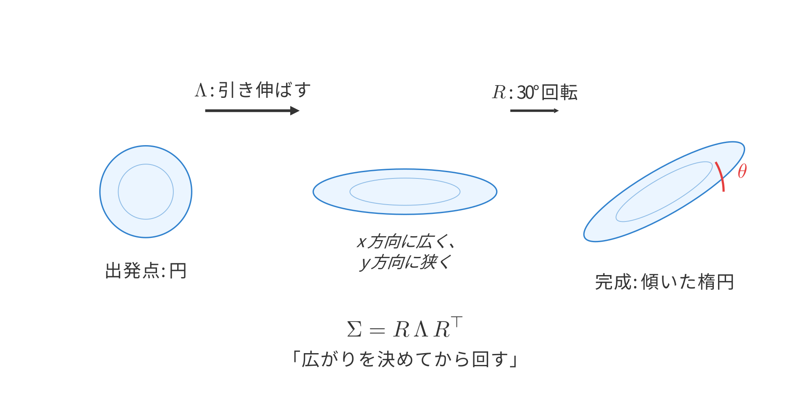

## この章で作るもの

この章では、2Dガウシアン関数を使って「ぼんやり光る楕円」を画像上に描きます。まず1つのガウシアンを正しく計算して画像にし、そのあとで複数のガウシアンを重ねて1枚の絵を作ります。最終的には、赤・緑・青の3つの楕円ガウシアンを重ね合わせ、色が混ざり合う次のような画像を得ることがゴールです。


「ガウシアン」とは、数学者ガウス（Gauss）の名前に由来する関数で、中心が最も高く、離れるほどなだらかに下がっていく釣り鐘型の形をしています。統計学では正規分布として有名ですが、この章では確率の話は忘れて、「画像の中に置ける、なめらかな光のかたまり」として扱います。まずは2次元の世界で、形を決めるパラメータと実際の描画結果の対応をつかみましょう。

### 学習目標

- 2Dガウシアン関数の数式を読み、平均と共分散が形をどう決めるか説明できる
- `sigma_x`、`sigma_y`、`theta` から共分散行列を組み立てられる
- NumPyのブロードキャストで、全ピクセルのガウシアン値を一括で計算できる
- 複数のカラーガウシアンを加重和で1枚の画像に合成できる

### この章で作成・修正するファイル

| ファイル | 種別 | 内容 |
|---------|------|------|
| `gaussian2d.py` | 新規 | 2Dガウシアンを計算するための部品 |
| `render.py` | 新規 | 加重和でガウシアンを画像に描画する関数（レンダラーv1） |
| `draw_gaussians.py` | 新規 | 3色ガウシアンを描いてPNG保存するまとめスクリプト |

### 前提知識

- なし（この章が出発点です）

---

## 1.1 ガウシアン関数とは何か

### 1次元のガウシアン: ベルカーブ

まずは最もシンプルな1次元のガウシアン関数から始めましょう。最初に「どんな形の関数なのか」をつかみ、そのあとで式の各記号が何を表すかを結びつけます。ガウシアン関数は、中心が最も高く、中心から離れるほどなだらかに下がっていく釣り鐘型の曲線を描きます。統計学では「正規分布」としておなじみですが、ここでは確率ではなく「ある点での値の大きさ」として使います。まずは図1.1を見て、広がりが変わると形がどう変わるかをつかんでください。


数式で書くと次のようになります。

$$
G(x) = \exp\!\left(-\frac{(x - \mu)^2}{2\sigma^2}\right) \tag{1.1}
$$

> **補足**: 統計学の正規分布では前に $1/(\sigma\sqrt{2\pi})$ の正規化係数がつきますが、ここでは中心で値を1にしたいので省略しています。この章では「その点がどれだけ強く光るか」を0〜1の値で扱いたいので、この形のほうが都合がよいのです。

この式にはパラメータが2つあります。

- **$\mu$（ミュー）**: 中心位置。ベルカーブのてっぺんがどこにあるか
- **$\sigma$（シグマ）**: 広がり。値が大きいほどベルカーブが横に広がる

図1.1は $\mu = 0$ に固定して $\sigma$ の値を変えた3本のベルカーブです。$\sigma$ が小さいほど鋭くとがり、大きいほどなだらかに広がります。どのカーブも中心（$x = \mu$）で値が最大の1になり、離れるほど急速にゼロへ近づきます。

この急速な減衰のおかげで、画像の中では中心付近だけが強く光り、遠くではほとんど影響しなくなります。これが「ぼんやりした光のかたまり」として見える理由です。

### 1次元から2次元へ: 何が変わるのか

1次元のガウシアンでは、数直線上の1点 $x$ に対して値を返しました。2次元では、平面上の点 $(x, y)$ に対して値を返します。

この拡張で何が変わるでしょうか。具体的に考えてみましょう。

**1次元の場合**:
- 位置の指定: 数直線上の1つの数 $x$
- 中心: 1つの数 $\mu$
- 広がり: 1つの数 $\sigma$（左右に同じ幅で広がる）

**2次元の場合**:
- 位置の指定: 平面上の座標 $(x, y)$、つまり2つの数のペア
- 中心: 2つの数のペア $(\mu_x, \mu_y)$
- 広がり: ここが大きく変わる！

1次元では広がりは「左右」しかなかったので1つの数で表現できました。しかし2次元では、広がりの自由度が大きく増えます。

- x方向の広がり（$\sigma_x$）
- y方向の広がり（$\sigma_y$）
- 楕円の傾き（回転角 $\theta$）

$\sigma_x = \sigma_y$ なら円形になり、$\sigma_x \neq \sigma_y$ なら楕円形になります。さらに $\theta$ で楕円を傾けられます。この3つの自由度を1つの行列、**共分散行列** $\Sigma$ で表現していきます。

### 2Dガウシアンの数式

1次元で見た「中心から離れるほど値が下がる」という性質を保ったまま、2次元では楕円の形と向きも式に入れます。まず図1.2を見て、円形と楕円形の違いを確認してから式に入ります。ここでは、図で見た形の違いがどの記号に対応するかを意識しながら読み進めてください。


2Dガウシアン関数は次の式で定義されます。

$$
G(\mathbf{x}) = \exp\!\left(-\frac{1}{2}(\mathbf{x} - \boldsymbol{\mu})^\top \Sigma^{-1} (\mathbf{x} - \boldsymbol{\mu})\right) \tag{1.2}
$$

各記号の意味を1つずつ確認しましょう。

| 記号 | 形状 | 意味 |
|------|------|------|
| $\mathbf{x}$ | $(2, 1)$ | 評価したい点の座標。列ベクトル $\begin{pmatrix} x \\ y \end{pmatrix}$ |
| $\boldsymbol{\mu}$ | $(2, 1)$ | ガウシアンの中心座標。列ベクトル $\begin{pmatrix} \mu_x \\ \mu_y \end{pmatrix}$ |
| $\Sigma$ | $(2, 2)$ | 共分散行列（楕円の形を決める） |
| $\Sigma^{-1}$ | $(2, 2)$ | 共分散行列の逆行列 |

$\mathbf{x}$ と $\boldsymbol{\mu}$ は2つの数を縦に並べた**列ベクトル**です。$\mathbf{x}^\top$ と書くとこれを横に倒した行ベクトル（1×2）になります。式(1.2)の指数の中身 $(\mathbf{x} - \boldsymbol{\mu})^\top \Sigma^{-1} (\mathbf{x} - \boldsymbol{\mu})$ は (1×2) × (2×2) × (2×1) の行列の積なので、結果はスカラー（1つの数値）になります。つまり、平面上のどの点を入れても、ガウシアンの値が1つ返ってくるということです。

$\Sigma$（共分散行列）は楕円の形と向きを決める2×2の行列です。$\Sigma^{-1}$ はその逆行列です。$\Sigma$ をどう組み立てるかはセクション1.2で詳しく扱います。

式(1.2)の指数部 $(\mathbf{x} - \boldsymbol{\mu})^\top \Sigma^{-1} (\mathbf{x} - \boldsymbol{\mu})$ が何を計算しているかを見ていきます。

ガウシアン関数は「中心に近い点ほど値が大きく、遠い点ほどゼロに近づく」関数でした。この性質を実現するには、各点が中心からどれだけ離れているかを数値にする必要があります。式(1.1)の1Dガウシアンではそれが $(x - \mu)^2 / \sigma^2$ でした。2Dでも同じ役割を果たすのが指数部です。

2Dでの「中心からの遠さ」を普通に求めるなら、ピタゴラスの定理で $(x - \mu_x)^2 + (y - \mu_y)^2$ と計算します。しかしガウシアンの楕円はx方向とy方向で広がりが違います。図1.8を見てください。


$\sigma_x = 20, \sigma_y = 5$ の楕円に対して、x方向に10ピクセル離れた点（青）は楕円の内側にあり、広がりの半分（$10/20$）です。一方、y方向に10ピクセル離れた点（オレンジ）は楕円の外側に飛び出しており、広がりの2倍（$10/5$）です。同じ10ピクセルでも、楕円にとっての「遠さ」が違います。

そこで、各方向のずれを $\sigma$ で割ってからピタゴラスの定理を適用します。

$$
\frac{(x - \mu_x)^2}{\sigma_x^2} + \frac{(y - \mu_y)^2}{\sigma_y^2}
$$

$\sigma$ で割ることで、広がりが大きい方向のずれは小さく、広がりが小さい方向のずれは大きく評価されます。式(1.2)の $(\mathbf{x} - \boldsymbol{\mu})^\top \Sigma^{-1} (\mathbf{x} - \boldsymbol{\mu})$ は、これを行列の形で書いたもので、楕円が回転している場合にも対応できます。この量は**マハラノビス距離の二乗**と呼ばれます。

図1.2の左は $\sigma_x = \sigma_y$ の円形ガウシアン、右は $\sigma_x \neq \sigma_y$ の楕円形ガウシアンです。等高線が「ガウシアン値が等しい点の集合」を表しています。マハラノビス距離が等しい点は同じ等高線上にあります。

---

## 1.2 共分散行列を組み立てる

### なぜ共分散行列が必要なのか

楕円の形は $\sigma_x$、$\sigma_y$、$\theta$ の3パラメータで直感的に表せます。しかしガウシアン関数の数式では共分散行列 $\Sigma$ が必要です。なぜでしょうか。

理由は計算の統一性にあります。共分散行列を使えば、円形でも楕円でも傾いた楕円でも、同じ1つの式(1.2)で計算できます。場合分けが不要になるのです。

### $\sigma_x, \sigma_y, \theta$ から共分散行列を構築する

まず図1.3を見てください。3行3列のグリッドで、行ごとに $\sigma_x$ と $\sigma_y$ の比率を変え、列ごとに回転角 $\theta$ を 0°・45°・90° と変化させています。$\sigma_x$、$\sigma_y$、$\theta$ を変えると楕円の形と向きがどう変わるか、この図で確認してから共分散行列の組み立て方に入ります。


::widget{name="ch1-covariance"}

共分散行列 $\Sigma$ は次の公式で計算します。

$$
\Sigma = R \, \Lambda \, R^\top \tag{1.3}
$$

ここで $\Lambda$（ラムダ、ギリシャ文字の大文字）は**分散の対角行列**、$R$ は**回転行列**で、それぞれ次のように定義されます。

$$
\Lambda = \begin{pmatrix} \sigma_x^2 & 0 \\ 0 & \sigma_y^2 \end{pmatrix}, \quad R = \begin{pmatrix} \cos\theta & -\sin\theta \\ \sin\theta & \cos\theta \end{pmatrix} \tag{1.4}
$$

**$\Lambda$: 分散の対角行列**

$\Lambda$ は回転なしの楕円の形を決める行列です。対角成分の $\sigma_x^2$ がx方向の広がり、$\sigma_y^2$ がy方向の広がりを表します。たとえば $\sigma_x = 20, \sigma_y = 5$ なら、

$$
\Lambda = \begin{pmatrix} 400 & 0 \\ 0 & 25 \end{pmatrix}
$$

となり、x方向に大きく（400）、y方向に小さく（25）広がる横長の楕円を表します。$\sigma_x = \sigma_y$ なら対角成分が等しくなり、円形になります。

$\Lambda$ は各軸方向の広がりだけを持つので、非対角成分は常にゼロです。回転の情報は $\Lambda$ には入れず、$R$ が担当します。

**$R$: 回転行列**

$$
R = \begin{pmatrix} \cos\theta & -\sin\theta \\ \sin\theta & \cos\theta \end{pmatrix}
$$

$R$ は平面上のベクトルを角度 $\theta$ だけ反時計回りに回転させる行列です。なぜこの形になるのか見てみます。


右向きの単位ベクトル $(1, 0)$ を角度 $\theta$ だけ反時計回りに回すと、回転後の座標は三角関数の定義そのものから $(\cos\theta, \sin\theta)$ です。同様に、上向きの $(0, 1)$ を $\theta$ 回すと $(-\sin\theta, \cos\theta)$ になります。

行列 $R$ にそれぞれ代入して確認しましょう。まず $(1, 0)$ の場合、2x2行列と2x1ベクトルの積を各要素について計算すると、

$$
R \begin{pmatrix} 1 \\ 0 \end{pmatrix} = \begin{pmatrix} \cos\theta \cdot 1 + (-\sin\theta) \cdot 0 \\ \sin\theta \cdot 1 + \cos\theta \cdot 0 \end{pmatrix} = \begin{pmatrix} \cos\theta \\ \sin\theta \end{pmatrix}
$$

となり、回転後の座標と一致します。$(0, 1)$ についても同様に、

$$
R \begin{pmatrix} 0 \\ 1 \end{pmatrix} = \begin{pmatrix} -\sin\theta \\ \cos\theta \end{pmatrix}
$$

$(1, 0)$ と $(0, 1)$ を正しく回転させられるなら、その組み合わせである任意のベクトルも正しく回転します（行列の積は各成分に分配できるので）。$\theta = 30°$ なら $\cos 30° \approx 0.866$、$\sin 30° = 0.5$ なので、$(1, 0)$ は $(0.866, 0.5)$ に回ります。図1.6で確認してみてください。

**$R \, \Lambda \, R^\top$: 広がりを決めてから回す**

$\Lambda$ だけだと楕円は常にx軸・y軸に沿った向きになります。これを角度 $\theta$ だけ回すのが $R \, \Lambda \, R^\top$ です。



図1.7のように、まず $\Lambda$ で各軸方向の広がりを決めて軸に沿った楕円を作り、次に $R$ で目的の角度まで回転させます。直感としては「形を作ってから回す」の2ステップです。なぜこの直感が $R \, \Lambda \, R^\top$ という公式になるのかは、付録Aで導出しています。

### 実装: `build_covariance_2d`

式(1.3)と式(1.4)をそのままコードにします。`gaussian2d.py` を新規作成し、まずは以下の内容から書き始めます。

```python exec file=gaussian2d.py
"""
2Dガウシアン関数の定義と評価。
第1章: 2Dガウシアン
"""

import numpy as np


def build_covariance_2d(sigma_x, sigma_y, theta):
    """回転角+スケールから2x2共分散行列を構築する。

    共分散行列を Sigma = R @ Lambda @ R^T で計算します。
    ここで Lambda = diag(sigma_x^2, sigma_y^2) は分散の対角行列です。
    R は角度 theta（ラジアン）の回転行列です。

    この分解の意味:
      1. diag で各軸方向の「広がり」を決め、
      2. R で楕円全体を回転させる。

    Args:
        sigma_x: x方向の標準偏差（広がりの大きさ）
        sigma_y: y方向の標準偏差（広がりの大きさ）
        theta: 回転角（ラジアン）。反時計回りが正

    Returns:
        (2, 2) の共分散行列
    """
    cos_t = np.cos(theta)
    sin_t = np.sin(theta)

    # 回転行列: 2Dの反時計回り回転
    R = np.array([
        [cos_t, -sin_t],
        [sin_t,  cos_t],
    ])

    # 分散の対角行列Λ: 各軸方向の広がりの二乗
    Lambda_ = np.array([
        [sigma_x ** 2, 0.0],
        [0.0, sigma_y ** 2],
    ])

    # 共分散行列: 「広がり → 回転」の順で変換を適用
    covariance = R @ Lambda_ @ R.T
    return covariance
```

コードの各行を詳しく見ていきましょう。

- `np.cos(theta)`, `np.sin(theta)`: NumPyの三角関数は引数をラジアンで受け取ります。度数法ではないので注意してください。
- `R = np.array([[cos_t, -sin_t], ...])`: 2x2の回転行列です。第1列が「回転後のx軸方向」、第2列が「回転後のy軸方向」に対応します。
- `sigma_x ** 2`: 共分散行列には分散（標準偏差の二乗）が入ります。標準偏差そのものではありません。
- `R @ Lambda_ @ R.T`: `@` は行列積の演算子で、`np.dot(R, Lambda_)` と同じです。`.T` は転置（行と列を入れ替える操作）です。式(1.3)の $R \, \Lambda \, R^\top$ をそのままコードに書けています。変数名の末尾のアンダースコアは、`lambda` がPythonの予約語のため衝突を避けるためです。

### 動かしてみよう

実装ができたら、挙動を確認しましょう。パラメータを変えたときに出力がどう変わるか見てみます。

```python exec
import numpy as np
from gaussian2d import build_covariance_2d

# 円形（sigma_x = sigma_y, 回転なし）
print(build_covariance_2d(10.0, 10.0, 0.0))
```

```text output
[[100.   0.]
 [  0. 100.]]
```

```python exec
# 横長楕円（sigma_x > sigma_y, 回転なし）
print(build_covariance_2d(20.0, 5.0, 0.0))
```

```text output
[[400.   0.]
 [  0.  25.]]
```

```python exec
# 30度回転
cov = build_covariance_2d(20.0, 5.0, np.pi / 6)
print(cov)
```

```text output
[[306.25       162.37976321]
 [162.37976321 118.75      ]]
```

円形のとき対角行列、横長のとき対角成分の比率が変わり、回転すると非対角成分が現れます。非対角成分が左下と右上で一致しており、共分散行列は常に対称行列（$\Sigma = \Sigma^\top$）です。

> **補足**: なぜ対称になるかは、転置を取ってみるとわかります。積の転置は逆順なので $(R \Lambda R^\top)^\top = (R^\top)^\top \Lambda^\top R^\top = R \Lambda R^\top$ です（$\Lambda$ は対角行列なので $\Lambda^\top = \Lambda$）。つまり転置しても元に戻る、すなわち対称行列です。

> **発展: 共分散行列と固有値分解**
>
> 本文では $\sigma_x, \sigma_y, \theta$ から共分散行列を構築しました（$\Sigma = R \, \Lambda \, R^\top$）。逆に、共分散行列から $\sigma_x, \sigma_y, \theta$ を取り出すにはどうすればよいでしょうか。
>
> それが**固有値分解**です。対称行列 $\Sigma$ は次のように分解できます。
>
> $$\Sigma = V \Lambda V^\top$$
>
> ここで $V$ は固有ベクトルを列に並べた直交行列、$\Lambda$ は固有値を対角に並べた行列です。本文の $\Sigma = R \, \Lambda \, R^\top$ と見比べると、まさに同じ形をしています。
>
> - $V = R$ → 固有ベクトルから回転角 $\theta$ が得られる
> - $\Lambda$ は本文の $\Lambda$ そのもので、固有値 $\sigma_x^2, \sigma_y^2$（分散）が対角に並ぶ
>
> NumPyでは `np.linalg.eigh` で対称行列の固有値分解ができます。この逆変換は、後の章で3Dガウシアンを可視化する際に役立ちます。

---

## 1.3 NumPyで2Dガウシアンを描画する

この節では、1つのガウシアンを画像にします。全ピクセルの座標を作り、ガウシアン値をまとめて計算し、結果を画像の形 `(H, W)` に戻すという流れです。

### ピクセル座標をまとめて作る

1つのガウシアンを画像にするには、まず「画像の全ピクセルについて座標を用意し、それぞれの座標でガウシアン値を計算する」という手順を踏みます。ピクセルを1つずつ for 文で処理することもできますが、画像の解像度が上がるとループ回数が急増します（例えば 512x512 なら約26万回）。NumPyの配列演算を使えば、全座標をまとめて一度に処理できるので高速です。

**座標の格子を作る `np.mgrid`**

`np.mgrid` は「格子状の座標を一括生成する」NumPy の機能です。小さい例で動きを見てみましょう。

```python exec
import numpy as np
ys, xs = np.mgrid[0:3, 0:4]
print("ys =")
print(ys)
print("xs =")
print(xs)
```

```text output
ys =
[[0 0 0 0]
 [1 1 1 1]
 [2 2 2 2]]
xs =
[[0 1 2 3]
 [0 1 2 3]
 [0 1 2 3]]
```

`ys` は各ピクセルの**行番号**（y座標）、`xs` は**列番号**（x座標）を格子状に並べた配列です。たとえば `ys[1][2]` は 1、`xs[1][2]` は 2 で、「1行2列目のピクセル」の座標 $(x=2, y=1)$ に対応します。

**1次元に並べ直す `ravel` と束ねる `stack`**

`evaluate_gaussian` 関数（このあとすぐ作ります）は、ピクセル座標を `(ピクセル数, 2)` の形で受け取る設計にします。そのために、2枚の格子を1次元に平坦化（`ravel`）してから、`np.stack` で `[x, y]` のペアに束ねます。

```python exec
H, W = 128, 128
ys, xs = np.mgrid[0:H, 0:W]
pixels = np.stack([xs.ravel(), ys.ravel()], axis=1)

print("xs.shape:", xs.shape, "  # 各ピクセルの列番号(x座標)の格子")
print("ys.shape:", ys.shape, "  # 各ピクセルの行番号(y座標)の格子")
print("pixels.shape:", pixels.shape, "  # 全ピクセルの[x, y]座標")
print("pixels[:4] =")
print(pixels[:4])
print("pixels[-4:] =")
print(pixels[-4:])
```

```text output
xs.shape: (128, 128)   # 各ピクセルの列番号(x座標)の格子
ys.shape: (128, 128)   # 各ピクセルの行番号(y座標)の格子
pixels.shape: (16384, 2)   # 全ピクセルの[x, y]座標
pixels[:4] =
[[0 0]
 [1 0]
 [2 0]
 [3 0]]
pixels[-4:] =
[[124 127]
 [125 127]
 [126 127]
 [127 127]]
```

`xs` と `ys` は `(128, 128)` の格子です。`xs.ravel()` で `(16384,)` に平坦化し、`np.stack([..., ...], axis=1)` で2つの `(16384,)` を列方向に束ねて `(16384, 2)` にしています。`pixels` の各行が1ピクセルの `[x, y]` 座標で、先頭4行は画像の左上（y=0の行の x=0,1,2,3）、末尾4行は右下（y=127の行の x=124,125,126,127）です。画像の全ピクセルが並んでいることがわかります。

### evaluate_gaussian 関数

座標ができたら、次は各ピクセルでガウシアン値を計算します。実装するのは式(1.2)の2Dガウシアン関数です。

$$
G(\mathbf{x}) = \exp\!\left(-\frac{1}{2}(\mathbf{x} - \boldsymbol{\mu})^\top \Sigma^{-1} (\mathbf{x} - \boldsymbol{\mu})\right) \tag{1.2}
$$

`evaluate_gaussian` が担当するのは、用意済みの座標に対して1つのガウシアンをまとめて評価する部分です。入力は `(H*W, 2)` 形状のピクセル座標、ガウシアンの中心 `mean`、共分散行列の逆行列 `cov_inv` で、出力は各ピクセルに対応する `(H*W,)` 形状のガウシアン値です。1ピクセルずつ for 文で計算する代わりに、全ピクセルを1本の配列としてまとめて処理します。

`gaussian2d.py` の末尾に以下の関数を追加します。

```python exec file=gaussian2d.py mode=append
def evaluate_gaussian(pixels, mean, cov_inv):
    """全ピクセルでガウシアン値を一括計算する。

    数式: G(x) = exp(-0.5 * (x - mu)^T Sigma^{-1} (x - mu))

    この式の意味:
      - (x - mu): 各ピクセルから中心までの差分ベクトル
      - Sigma^{-1} を挟んだ計算: 共分散を考慮した「距離の二乗」
        （マハラノビス距離の二乗）
      - exp(-0.5 * ...): 距離が大きいほど急速にゼロへ近づく

    Args:
        pixels: (H*W, 2) ピクセル座標の配列
        mean: (2,) ガウシアンの中心座標
        cov_inv: (2, 2) 共分散行列の逆行列

    Returns:
        (H*W,) 各ピクセルでのガウシアン値（0〜1の範囲）
    """
    # 中心からの差分ベクトル: (H*W, 2)
    diff = pixels - mean

    # マハラノビス距離の二乗を計算
    # 手順: diff @ cov_inv で (H*W, 2) を得て、
    #       diff との要素ごとの積をとり、行方向に合計する。
    # これは各行ベクトル d について d^T @ cov_inv @ d を計算するのと等価。
    mahal = np.sum(diff @ cov_inv * diff, axis=1)  # (H*W,)

    return np.exp(-0.5 * mahal)
```

この関数の核となるのが `mahal` の計算です。式(1.2)の指数部 $(\mathbf{x} - \boldsymbol{\mu})^\top \Sigma^{-1} (\mathbf{x} - \boldsymbol{\mu})$（マハラノビス距離の二乗）の意味は1.1節で説明しました。ここでは、この計算を全ピクセル分まとめて行う NumPy の式 `diff @ cov_inv * diff` が何をしているかを見ていきます。

先に形状を整理します。

| 変数 | 形状 | 中身 |
|------|------|------|
| `pixels` | `(H*W, 2)` | 全ピクセルの `(x, y)` 座標 |
| `mean` | `(2,)` | ガウシアンの中心 |
| `diff` | `(H*W, 2)` | 各ピクセルから中心への差分 |
| `cov_inv` | `(2, 2)` | 共分散行列の逆行列 |
| `diff @ cov_inv` | `(H*W, 2)` | 差分を方向ごとの尺度で変換した結果 |
| `mahal` | `(H*W,)` | 各ピクセルのマハラノビス距離の二乗 |

**ステップ1**: `diff = pixels - mean`

`pixels` は形状 `(H*W, 2)` で、各行が1ピクセルの $(x, y)$ 座標です。`mean` は形状 `(2,)` のベクトルです。形状が異なる配列どうしの引き算ですが、NumPy は自動的に `mean` を全行にコピーして `(H*W, 2)` に揃えてから計算します（この仕組みを**ブロードキャスト**と呼びます）。結果として、各ピクセルから中心への差分ベクトルが一括で得られます。

**ステップ2**: `diff @ cov_inv`

`diff` は `(H*W, 2)`、`cov_inv` は `(2, 2)` なので、行列積の結果は `(H*W, 2)` です。`diff` の各行に `cov_inv` を掛ける操作が、全ピクセル分まとめて実行されます。

**ステップ3**: `* diff` して `np.sum(..., axis=1)`

ステップ2で得られた `(H*W, 2)` と元の `diff` `(H*W, 2)` から、各ピクセルにつき1つのスカラー（マハラノビス距離の二乗）を求めます。数式では $(1, 2)$ と $(2, 1)$ の行列積、つまりベクトルの内積です。コードではこの内積を、要素ごとの積（`*`）と合計（`np.sum`）の2ステップで実現します。

具体的な数値で見てみましょう。1ピクセル分の `diff = [3, 1]`、`cov_inv = [[1, 0], [0, 4]]` とします。ステップ2の結果は `diff @ cov_inv = [3*1+1*0, 3*0+1*4] = [3, 4]` です。

この `[3, 4]` と元の `diff = [3, 1]` の内積を求めます。

- `[3, 4] * [3, 1] = [9, 4]` … **要素ごとの積**（`*` は同じ位置の要素同士を掛ける）
- `np.sum([9, 4]) = 13` … **合計**して1つのスカラーにする

全ピクセルの場合は、`* diff` で `(H*W, 2)` のまま要素ごとに掛けてから、`np.sum(..., axis=1)` で列方向に合計して `(H*W,)` にします。これで式(1.2)の指数部 $(\mathbf{x} - \boldsymbol{\mu})^\top \Sigma^{-1} (\mathbf{x} - \boldsymbol{\mu})$ が全ピクセル分一括で得られます。

**ステップ4**: `np.exp(-0.5 * mahal)`

最後に、マハラノビス距離の二乗に $-1/2$ を掛けて `np.exp` で指数関数を適用します。これが式(1.2)の $\exp(-\frac{1}{2} \cdots)$ に対応し、各ピクセルのガウシアン値 `(H*W,)` が得られます。

### evaluate_gaussian の動作確認

3つのピクセルをまとめて渡し、一括計算の結果を確認してみましょう。式(1.2)の $\Sigma^{-1}$（共分散行列の逆行列）は `np.linalg.inv` で事前に計算してから渡します。

```python exec
import numpy as np
from gaussian2d import build_covariance_2d, evaluate_gaussian

cov = build_covariance_2d(10.0, 10.0, 0.0)
cov_inv = np.linalg.inv(cov)
mean = np.array([64.0, 64.0])

pixels = np.array([[64.0, 64.0],   # 中心
                    [54.0, 54.0],   # 中心から少し離れた点
                    [0.0, 0.0]])    # 遠い点
values = evaluate_gaussian(pixels, mean, cov_inv)
print("values:", values)
```

```text output
values: [1.00000000e+00 3.67879441e-01 1.62666462e-18]
```

3ピクセル分の結果が1つの配列で返ってきます。中心で最大の1、少し離れると約0.37、遠く離れるとほぼゼロと、中心から離れるにつれて値が減衰していきます。

> **補足: 2x2逆行列の解析的公式**
>
> 2x2行列の場合、逆行列には次のシンプルな解析的公式があります。
>
> $$\begin{pmatrix} a & b \\ c & d \end{pmatrix}^{-1} = \frac{1}{ad - bc}\begin{pmatrix} d & -b \\ -c & a \end{pmatrix}$$
>
> 分母の $ad - bc$ は**行列式**（determinant）と呼ばれ、行列式がゼロのとき逆行列は存在しません。共分散行列 $\Sigma$ の行列式は（$\sigma_x, \sigma_y > 0$ なら）常に正なので、逆行列が必ず存在します。ここでは `np.linalg.inv` で十分ですが、「中で何が起きているか」を確かめたいときの見取り図として押さえておくと役立ちます。

### 1つのガウシアンを描いてみる

ここからは `evaluate_gaussian` の入力と出力を、実際の画像づくりにつなげます。座標を `(H*W, 2)` で作り、`evaluate_gaussian` で `(H*W,)` のガウシアン値を得て、`reshape(H, W)` で画像の形に戻すという流れです。

```python exec
import numpy as np
import matplotlib.pyplot as plt
from gaussian2d import build_covariance_2d, evaluate_gaussian

# パラメータを設定
mean = np.array([64.0, 64.0])
cov = build_covariance_2d(sigma_x=15.0, sigma_y=8.0, theta=np.pi / 6)
cov_inv = np.linalg.inv(cov)

# 128x128のピクセル座標を生成
H, W = 128, 128
ys, xs = np.mgrid[0:H, 0:W]
pixels = np.stack([xs.ravel(), ys.ravel()], axis=1)  # (H*W, 2)

# ガウシアン値を計算して画像に整形
values = evaluate_gaussian(pixels, mean, cov_inv)  # (H*W,)
image = values.reshape(H, W)

# 表示
plt.imshow(image, cmap="viridis")
plt.colorbar(label="ガウシアン値")
plt.title("2Dガウシアン（sigma_x=15, sigma_y=8, theta=30°）")
plt.show()
```

中心が最も明るく、楕円状に広がりながら暗くなっていく画像が表示されるはずです。`plt.show()` は表示ウィンドウを開き、そのウィンドウを閉じるまで待機します。画面を開けない環境では、`plt.savefig("single_gaussian.png")` に置き換えると画像ファイルとして確認できます。


`sigma_x`、`sigma_y`、`theta` の値を変えて、楕円の形や傾きがどう変わるか試してみてください。なお、画像のy軸は上から下に向かって増えるため、数学で「反時計回り」の回転が画面上では時計回りに見えます。この座標系の違いについては第7章で詳しく扱います。

次の1.4節では、複数のガウシアンを扱いやすい形にまとめてから、加重和で1枚のRGB画像へ合成します。

---

## 1.4 複数のガウシアンを重ねて描く

### Gaussian2Dクラス

1.3節では1つのガウシアンを画像に描画するところまでできました。次は、それを複数個重ねます。そのためには、「どこに」「どんな形で」「どんな色で」「どれくらい濃く」置くかを、毎回ばらばらに渡すより、1つのオブジェクトに束ねたほうが扱いやすくなります。`Gaussian2D` クラスは、その4つの情報をまとめる入れ物です。ここでは `gaussian2d.py` の最終形として、次のクラスを確認します。

```python exec file=gaussian2d.py mode=append
class Gaussian2D:
    """2Dガウシアンを表現するクラス。

    1つのガウシアンは「どこに」「どんな形で」「何色で」「どれくらい濃く」
    存在するかを4つのパラメータで表現します。

    Attributes:
        mean: (2,) 中心座標 [x, y]
        covariance: (2, 2) 共分散行列（1.2節で作った楕円の向き・広がりを表す行列）
        color: (3,) RGB色。各チャンネル0.0（黒）〜1.0（最大輝度）
        opacity: 不透明度。0.0で完全に透明、1.0で完全に不透明
    """

    def __init__(self, mean, covariance, color=None, opacity=1.0):
        self.mean = np.array(mean, dtype=np.float64)              # (2,)
        self.covariance = np.array(covariance, dtype=np.float64)  # (2, 2)
        self.color = np.array(
            color if color is not None else [1.0, 1.0, 1.0],
            dtype=np.float64,
        )  # (3,)
        self.opacity = float(opacity)
```

4つの属性の役割を整理しましょう。

| 属性 | 形状 | 意味 |
|------|------|------|
| `mean` | `(2,)` | 中心座標 $(x, y)$ |
| `covariance` | `(2, 2)` | 共分散行列。1.2節で作った楕円の向きと広がりを表す |
| `color` | `(3,)` | RGB色。各チャンネル0.0（黒）〜1.0（最大輝度） |
| `opacity` | スカラー | 不透明度。0.0で完全に透明、1.0で完全に不透明 |

この4属性がそろうと、「どこに、どんな形で、どんな色のガウシアンを置くか」を1つのオブジェクトで渡せます。

### Gaussian2D の動作確認

```python exec
from gaussian2d import Gaussian2D, build_covariance_2d

g = Gaussian2D(
    mean=[64, 64],
    covariance=build_covariance_2d(15.0, 15.0, 0.0),
    color=[1, 0, 0],  # 赤
    opacity=0.8,
)
print(f"中心: {g.mean}")
print(f"色: {g.color}")
print(f"不透明度: {g.opacity}")
```

```text output
中心: [64. 64.]
色: [1. 0. 0.]
不透明度: 0.8
```

リストで渡した値がNumPy配列に変換されていることがわかります。

### 加重和によるレンダリング

いよいよ複数のガウシアンを1枚の画像に描画します。ここでは各ガウシアンをRGBの光源のように考えます。すると、あるピクセルの色は「そのピクセルでどれだけ光っているか」という重みを各色に掛けて足し合わせれば求められます。

最もシンプルな方法が**加重和**です。各ガウシアンの色に「重み」を掛けて、全て足し合わせます。

$$
\mathbf{C}(\mathbf{x}) = \sum_{i=1}^{N} \alpha_i(\mathbf{x}) \cdot \mathbf{c}_i \tag{1.5}
$$

$\mathbf{C}(\mathbf{x})$ はピクセル $\mathbf{x}$ の最終的なRGB色（3次元ベクトル）です。$N$ はガウシアンの個数、$\mathbf{c}_i$ はRGB色ベクトル、$\alpha_i(\mathbf{x})$ は次のように定義される重みです。

$$
\alpha_i(\mathbf{x}) = \text{opacity}_i \cdot G_i(\mathbf{x}) \tag{1.6}
$$

$\text{opacity}_i$ は $i$ 番目のガウシアンの不透明度（0〜1の定数）、$G_i(\mathbf{x})$ はピクセル $\mathbf{x}$ でのガウシアン値（0〜1のスカラー）です。$\alpha_i(\mathbf{x})$ は不透明度とガウシアン値の積なので、ガウシアンの中心に近いほど大きく、離れるほど小さくなります。

この式の直感的な意味は、「各ピクセルのRGB値は、各ガウシアンの色ベクトルを重み付きで足したもの」ということです。ガウシアン値は中心から離れると急速にゼロへ近づくため、遠くのガウシアンはほとんど色に寄与しません。どのガウシアンからも遠いピクセルは自然に黒（ゼロ）になります。

### 実装: `render_gaussians_weighted_sum`

この関数は `render.py` に書きます。`render.py` を新規作成し、以下の内容を書きます。

この関数の処理手順は、1. ピクセル座標を作る、2. 各ガウシアンの値を全ピクセルで計算する、3. 色を加重和で足し合わせる、4. 最後に `(H, W, 3)` に戻す、の4段階です。まずはピクセル座標を作る部分から見ていきましょう。

```python exec file=render.py
"""
レンダラー v1: 加重和によるガウシアン描画。
第1章: 2Dガウシアン
"""

import numpy as np
from gaussian2d import evaluate_gaussian


def render_gaussians_weighted_sum(gaussians, H, W):
    """ガウシアン群を加重和で1枚の画像に描画する。

    各ピクセルの色を次の加重和で決定します:

        色 = Σ (opacity_i * G_i(x) * color_i)

    ガウシアン値は中心から離れると急速にゼロへ近づくため、
    どのガウシアンの影響も届かないピクセルは自然に黒になります。
    複数のガウシアンが重なる場所では色が加算され、明るくなります。

    Args:
        gaussians: Gaussian2D オブジェクトのリスト
        H: 画像の高さ（ピクセル）
        W: 画像の幅（ピクセル）

    Returns:
        (H, W, 3) のRGB画像（値域 [0, 1]）
    """
    # --- ピクセル座標グリッドを生成 ---
    # mgrid は [行インデックス, 列インデックス] の配列を返す。
    # 画像座標では x=列, y=行 なので、xs と ys を分けて取得する。
    ys, xs = np.mgrid[0:H, 0:W]  # それぞれ (H, W)

    # (H*W, 2) に整形: 各行が1ピクセルの [x, y] 座標
    pixels = np.stack([xs.ravel(), ys.ravel()], axis=1)
```

ピクセル座標の作り方は1.3節と同じです。座標ができたので、各ガウシアンについて「値を計算する → 重みを掛ける → 色を足す」を繰り返します。

`render_gaussians_weighted_sum` 関数の後半では、各ガウシアンの重みを蓄積し、最後に値を `0` から `1` の範囲へ収めて画像の形に戻します。

```python
    # --- 加重和を累積 ---
    image = np.zeros((H * W, 3), dtype=np.float64)

    for g in gaussians:
        # 共分散行列の逆行列を計算
        cov_inv = np.linalg.inv(g.covariance)  # (2, 2)

        # 全ピクセルでガウシアン値を一括計算
        gauss_val = evaluate_gaussian(pixels, g.mean, cov_inv)  # (H*W,)

        # α_i = 不透明度 × ガウシアン値
        alpha = g.opacity * gauss_val  # (H*W,)

        # 加重和を蓄積
        # alpha[:, np.newaxis] で (H*W, 1) に変換し、色 (3,) とブロードキャスト
        image += alpha[:, np.newaxis] * g.color  # (H*W, 3)

    # 値を [0, 1] にクリップして (H, W, 3) にリシェイプ
    image = np.clip(image, 0.0, 1.0)
    image = image.reshape(H, W, 3)

    return image
```

forループでは各ガウシアンについて次の処理を行います。

1. `np.linalg.inv` で共分散行列の逆行列を計算
2. `evaluate_gaussian` で全ピクセルのガウシアン値を一括計算
3. `alpha = opacity * gauss_val` で $\alpha_i(\mathbf{x})$ を計算
4. `image` に `alpha × color` を加算

`alpha[:, np.newaxis]` のブロードキャストについて補足します。`alpha` は形状 `(H*W,)` のベクトルです。`[:, np.newaxis]` で形状を `(H*W, 1)` に変換すると、`g.color`（形状 `(3,)`）との掛け算で結果は `(H*W, 3)` になります。各ピクセルの $\alpha$ がRGBの3チャネル全てに適用されるのです。

例えば3ピクセルの場合で考えてみましょう。

```
alpha = [0.8, 0.5, 0.1]  # 形状 (3,)
alpha[:, np.newaxis]      # 形状 (3, 1) → [[0.8], [0.5], [0.1]]
color = [1.0, 0.0, 0.0]  # 赤、形状 (3,)

# (3, 1) × (3,) → (3, 3) にブロードキャスト
alpha[:, np.newaxis] * color
# = [[0.8, 0.0, 0.0],
#    [0.5, 0.0, 0.0],
#    [0.1, 0.0, 0.0]]
```

各ピクセルの $\alpha$ が3チャネル全てに適用されていることがわかります。

最後に `np.clip(image, 0.0, 1.0)` で値を $[0, 1]$ の範囲にクリップします。複数のガウシアンが重なる場所では色が加算されて1.0を超えることがありますが、画像として表示するには $[0, 1]$ に収める必要があるためです。

### render_gaussians_weighted_sum の動作確認

1つだけレンダリングして、出力の形状と値を確認しましょう。

```python exec
import numpy as np
import matplotlib.pyplot as plt
from gaussian2d import Gaussian2D, build_covariance_2d
from render import render_gaussians_weighted_sum

g = Gaussian2D(
    mean=[54, 44],  # x=54, y=44
    covariance=build_covariance_2d(15.0, 8.0, np.pi / 6),
    color=[1, 0, 0],  # 赤
    opacity=1.0,
)
image = render_gaussians_weighted_sum([g], H=128, W=128)
print(f"画像の形状: {image.shape}")
print(f"中心の色: {image[44, 54]}")   # mean=[54,44] → image[y=44, x=54]
print(f"角の色: {np.round(image[0, 0], 4)}")

plt.imshow(image)
plt.show()
```

```text output
画像の形状: (128, 128, 3)
中心の色: [1. 0. 0.]
角の色: [0. 0. 0.]
```

形状が `(H, W, 3)` のRGB画像になっています。中心の色を取得するとき、`mean = [54, 44]`（x=54, y=44）に対して `image[44, 54]` と書いている点に注目してください。NumPyの2D配列は行列と同じ「行, 列」の順でアクセスします。画像では行がy、列がxなので `image[y, x]` となり、`mean` の `[x, y]` とは逆順になります。


1.3節ではガウシアン値をカラーマップ（viridis）で色付けして表示しましたが、ここでは `color` で指定した赤がそのまま画像の色になっています。中心が最も明るく、離れるにつれて黒へ減衰していきます。

---

## 1.5 まとめスクリプト: 3色ガウシアンを描く

この章の締めくくりとして、赤・緑・青の3色のガウシアンを1枚の画像に合成し、PNGファイルとして保存しましょう。以下を `draw_gaussians.py` として保存し、実行してください。生成される画像は `figures/fig-01-04-weighted-sum-result.png` で、本文の図1.4と同じ内容です。

```python exec file=draw_gaussians.py
"""
第1章まとめ: 3色ガウシアンを描いてPNG保存する。
"""

import numpy as np
import matplotlib.pyplot as plt
from pathlib import Path
from gaussian2d import Gaussian2D, build_covariance_2d
from render import render_gaussians_weighted_sum

H, W = 128, 128

# 赤・緑・青の楕円ガウシアンを中心から放射状に配置
gaussians = [
    Gaussian2D(
        mean=[54, 44],
        covariance=build_covariance_2d(24.0, 10.0, np.pi / 3),
        color=[1, 0, 0],  # 赤
        opacity=1.0,
    ),
    Gaussian2D(
        mean=[74, 44],
        covariance=build_covariance_2d(24.0, 10.0, -np.pi / 3),
        color=[0, 1, 0],  # 緑
        opacity=1.0,
    ),
    Gaussian2D(
        mean=[64, 72],
        covariance=build_covariance_2d(24.0, 10.0, np.pi / 2),
        color=[0, 0, 1],  # 青
        opacity=1.0,
    ),
]

# レンダリング
image = render_gaussians_weighted_sum(gaussians, H, W)

# PNG保存
output_path = Path(__file__).with_name("figures").joinpath("fig-01-04-weighted-sum-result.png")
fig, ax = plt.subplots(figsize=(4, 4))
ax.imshow(image)
ax.set_xlabel("x (px)")
ax.set_ylabel("y (px)")
fig.savefig(output_path, dpi=150, bbox_inches="tight", facecolor="white")
print(f"{output_path.name} を保存しました: {output_path}")
```

実行すると、`figures/fig-01-04-weighted-sum-result.png` が生成されます。


3つの楕円ガウシアンが中心から放射状に伸びており、重なり合う領域でRGBの加法混色が起きています。赤と緑が重なると黄色、赤と青でマゼンタ、緑と青でシアン、3色全てが重なる中央付近は白に近づきます。これはまさに、ガウシアンの加重和で色が足し合わされている様子です。

`sigma_x` と `sigma_y` を異なる値にし `theta` で回転させることで、円形ではなく傾いた楕円が生まれます。パラメータを変えて遊んでみましょう。

- `sigma_x` と `sigma_y` を同じ値にすると、楕円が円形に変わります
- `theta` を変えると、楕円の傾きが変わります
- `opacity` を小さくすると、そのガウシアンの色への寄与が弱まります

::widget{name="ch1-rgb-mixer"}

### 加重和の限界

この方法は直感的でシンプルですが、加重和ではガウシアン同士の「前後関係」を表現できません。

例えば、赤いガウシアンの手前に半透明の青いガウシアンがある場合、加重和では両者の色が単純に足し合わされるだけです。「手前のガウシアンが奥を部分的に隠す」という自然な見え方を再現できないのです。

次の第2章では、この問題を解決する**アルファ合成**を導入します。アルファ合成では各ガウシアンに「前後の順番」を与え、手前のガウシアンが奥のガウシアンを遮る効果を表現できます。

---

## この章で学んだこと

- **1Dガウシアン**は中心 $\mu$ と広がり $\sigma$ の2パラメータで決まるベルカーブ。中心から離れるほど値が急速にゼロへ近づく
- **2Dガウシアン**では広がりが「x方向」「y方向」「回転角」の3自由度を持ち、これを**共分散行列** $\Sigma = R \, \Lambda \, R^\top$ で表現する
- **マハラノビス距離**は共分散を考慮した距離で、ガウシアン値の計算に使う。NumPyの行列演算で全ピクセルを一括計算できる
- **加重和**で複数のガウシアンを1枚の画像に合成できるが、ガウシアン同士の前後関係は表現できない
- 次章の**アルファ合成**でこの限界を克服し、手前のガウシアンが奥を遮る自然な描画を実現する

