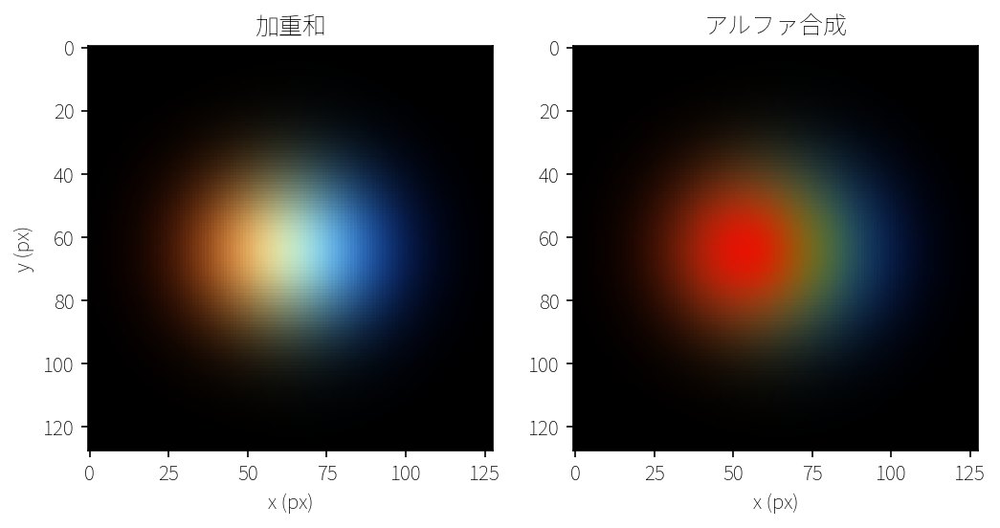
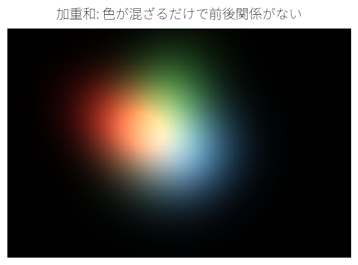
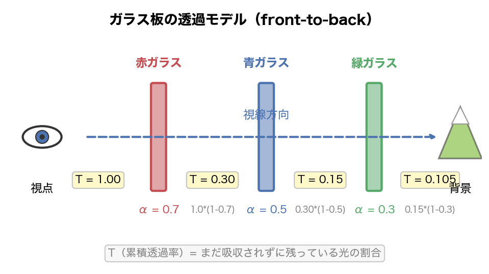
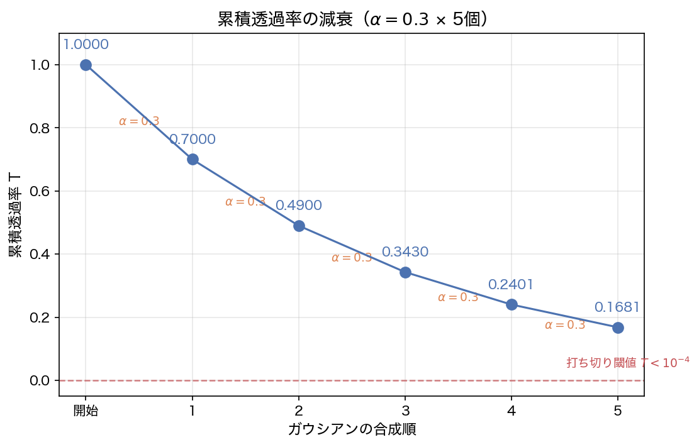
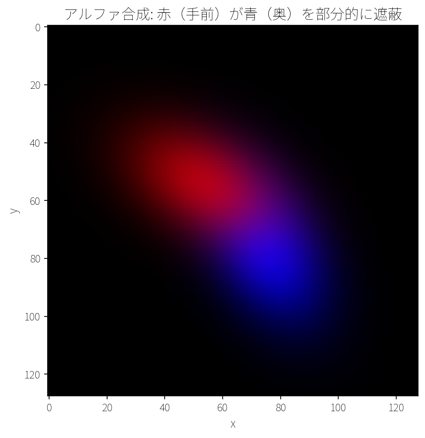

## この章で作るもの

第1章では加重和で複数のガウシアンを1枚の画像に合成しました。しかし加重和では「手前のガウシアンが奥を遮る」という前後関係を表現できませんでした。この章では**アルファ合成**（alpha compositing）を導入し、ガウシアンの前後関係を正しく描画できるレンダラーv2を作ります。

この章の最終成果物が次の画像です。



左が第1章で作った加重和、右がこの章で作るアルファ合成の結果です。加重和では全てのガウシアンの色が単純に足し合わされますが、アルファ合成では手前のガウシアンが奥のガウシアンを部分的に遮っています。実はこの前後関係の表現は、最終章で完成する3D Gaussian Splattingのレンダリングパイプラインでもそのまま使われます。たった数十行のコードですが、ここで作るアルファ合成が全16章を貫くレンダリングの土台になります。

### 学習目標

- アルファ合成が、光の透過と遮蔽をどう表しているかを説明できる
- 累積透過率 $T$ を使って、front-to-back 合成を実装できる
- `depth` の値でガウシアンを手前から奥に並べ替え、合成順を決められる
- 同じシーンを加重和とアルファ合成で比べ、見え方の違いを言葉で説明できる

### この章で作成・修正するファイル

| ファイル | 種別 | 内容 |
|---------|------|------|
| `gaussian2d.py` | 修正 | `Gaussian2D`クラスに`depth`属性を追加 |
| `render.py` | 修正 | `render_gaussians_alpha_composite`関数を追加（レンダラーv2） |
| `compare_renders.py` | 新規 | 加重和 vs アルファ合成の比較画像を生成するまとめスクリプト |

### 前提知識

- 第1章: 2Dガウシアンの定義と、加重和による描画

---

## 2.1 加重和の問題点

現実の世界を考えてみてください。不透明な赤い板の後ろに青い板を置いたら、青い板は見えません。半透明の赤いガラスの後ろなら、青が少し透けて見えます。このように現実の物体には「手前が奥を遮る」という前後関係があります。

しかし第1章の加重和には、こうした前後関係を表現する仕組みがありません。加重和は全てのガウシアンの色を単純に足し合わせるだけなので、どれが手前でどれが奥かという区別がそもそもないのです。



図2.1は重なったガウシアンを加重和で描画した結果です。色が混ざり合うだけで、どちらが手前かわかりません。この「遮蔽」と「透過」を正しく表現するために、この章ではアルファ合成という新しいアプローチを導入します。

---

## 2.2 アルファ合成の数学

### 半透明ガラスの比喩

アルファ合成の直感を掴むために、色のついた半透明ガラスを重ねる場面を想像してください。



あなたの目（視点）から奥を覗くと、手前のガラスから順番にその影響を受けます。最初は光が100%残っている状態から始めます。

1. 最初のガラス（赤、不透明度70%）: 光の70%が赤く染まり、残りの光は30%になる
2. 2枚目のガラス（青、不透明度50%）: 残りの光30%のうち50%が青く染まり（全体の15%）、残りの光は15%になる
3. 3枚目のガラス（緑、不透明度30%）: 残りの光15%のうち30%が緑に染まり（全体の4.5%）、残りの光は10.5%になる

ポイントは、各ガラスが色をつけられるのは**それより手前を通過してきた残りの光だけ**ということです。手前のガラスの不透明度が高いほど、奥のガラスの色が見える割合は小さくなります。

この「まだどれだけ光が残っているか」を追跡する量に**累積透過率** $T$ という名前をつけます。最初は $T = 1$（光が100%残っている）で、ガラスを1枚通過するたびに減っていきます。$T \approx 0$ になったら、それ以上奥に何があっても見えません。

### front-to-back 合成式

この直感を数式で表現しましょう。$N$ 個のガウシアンを手前（深度が小さい）から奥（深度が大きい）の順に並べ、$i$ 番目のガウシアンについて次の量を使います。

| 記号 | 意味 |
|------|------|
| $\mathbf{c}_i$ | $i$ 番目のガウシアンの色（RGB） |
| $\alpha_i(\mathbf{x})$ | $i$ 番目のガウシアンの不透明度 $\times$ ガウシアン値（(1.6)で定義） |
| $T_i(\mathbf{x})$ | $i$ 番目のガウシアンに到達するまでの累積透過率（この章で新登場） |

第1章の加重和（1.5）では全ガウシアンの色を単純に足していましたが、アルファ合成ではここに累積透過率 $T_i(\mathbf{x})$ が加わります。$T_i(\mathbf{x})$ は $i$ 番目のガウシアンに到達するまでに、光がどれだけ残っているかを表す量です。

$$
\mathbf{C}(\mathbf{x}) = \sum_{i=1}^{N} \alpha_i(\mathbf{x}) \cdot \mathbf{c}_i \cdot T_i(\mathbf{x}) \tag{2.1}
$$

加重和との違いは $T_i(\mathbf{x})$ の有無だけです。

累積透過率 $T_i(\mathbf{x})$ は次のように定義されます。

$$
T_i(\mathbf{x}) = \prod_{j=1}^{i-1} (1 - \alpha_j(\mathbf{x})) \tag{2.2}
$$

$\prod$（パイ）は $\sum$ の掛け算版です。$\sum$ が「全部足す」なら、$\prod$ は「全部掛ける」を意味します。つまり (2.2) は $(1 - \alpha_1) \times (1 - \alpha_2) \times \cdots \times (1 - \alpha_{i-1})$ という掛け算を一言で書いたものです。

$T_1 = 1$（最初のガウシアンには光が100%到達する）です。$T_i$ は $i$ 番目のガウシアンより前にある全てのガウシアンを通過した後に残る光の割合を表しています。

(2.1) と (2.2) は全ガウシアンをまとめて書いた式ですが、実際にこれを計算するときは、ガウシアンを手前から奥へ1つずつ処理するループになります。

```
C = 0, T = 1
for each gaussian i (手前から奥の順):
    C += c[i] * α[i] * T    # 今のガウシアンの色を、残りの光の分だけ足す
    T *= (1 - α[i])         # 残りの光を減らす
```

ポイントは `C` の更新を先に、`T` の更新を後にすることです。`T` を先に更新してしまうと、今のガウシアンの寄与を計算するときの $T$ の値が変わってしまいます。この2行のループは第5章でガウシアンのパラメータを自動調整（最適化）する際の計算の土台になり、さらに第15章ではこのループの各ステップを逆順にたどって高速化する手法を導入します。

### 累積透過率の推移

$\alpha = 0.3$ のガウシアンを5個重ねた場合の累積透過率 $T$ の推移を見てみましょう。

| ガウシアン | $T$（合成前） | 更新式 | $T$（合成後） |
|-----------|-------------|--------|-------------|
| 1番目 | 1.0000 | $\times (1 - 0.3)$ | 0.7000 |
| 2番目 | 0.7000 | $\times (1 - 0.3)$ | 0.4900 |
| 3番目 | 0.4900 | $\times (1 - 0.3)$ | 0.3430 |
| 4番目 | 0.3430 | $\times (1 - 0.3)$ | 0.2401 |
| 5番目 | 0.2401 | $\times (1 - 0.3)$ | 0.1681 |



$T$ はガウシアンが重なるたびに単調に減少します。$T$ が十分小さくなると（例えば $T < 10^{-4}$）、そのピクセルでは「この先に足される色の余地がほとんど残っていない」状態です。このとき後続のガウシアンの寄与は非常に小さいので、計算を途中で止められます。この**早期打ち切り**（early termination）は、描画結果を変えない範囲で計算量を減らす補助的な最適化です。

---

## 2.3 深度順ソートとレンダリング

### Gaussian2D に depth を追加する

アルファ合成では「手前から奥」の順番が必要です。そのためにガウシアンに**深度**（depth）を持たせましょう。

`gaussian2d.py` の `Gaussian2D` クラスを変更します。第1章からの変更点は2箇所です。

1. `Attributes` ドキュメントに `depth` の説明を追加
2. `__init__` に `depth` パラメータを追加し、`self.depth` に保存

```python exec
class Gaussian2D:
    """2Dガウシアンを表現するクラス。

    1つのガウシアンは「どこに」「どんな形で」「何色で」「どれくらい濃く」
    存在するかを5つのパラメータで表現します。

    Attributes:
        mean: (2,) 中心座標 [x, y]
        covariance: (2, 2) 共分散行列（楕円の形状を決定）
        color: (3,) RGB色 [0, 1]
        opacity: 不透明度 [0, 1]
        depth: 深度値（小さいほど手前。アルファ合成のソート用）
    """

    def __init__(self, mean, covariance, color=None, opacity=1.0, depth=0.0):
        self.mean = np.array(mean, dtype=np.float64)              # (2,)
        self.covariance = np.array(covariance, dtype=np.float64)  # (2, 2)
        self.color = np.array(
            color if color is not None else [1.0, 1.0, 1.0],
            dtype=np.float64,
        )  # (3,)
        self.opacity = float(opacity)
        self.depth = float(depth)  # 追加: 深度値（小さいほど手前）
```

`depth` はデフォルト値を `0.0` としているので、第1章のコードとの互換性は保たれます。この章では `depth` を「どの順番で合成するか」を表す値として手動で指定します。第7章でカメラモデルを導入したあとに、3D空間の位置から見た奥行きと結びつけます。

### 動作確認

```python exec
from gaussian2d import Gaussian2D, build_covariance_2d

cov = build_covariance_2d(15.0, 15.0, 0.0)
g = Gaussian2D(
    mean=[64, 64],
    covariance=cov,
    color=[1, 0, 0],
    opacity=0.8,
    depth=2.5,
)
print(f"深度: {g.depth}")
```

```text output
深度: 2.5
```

### render_gaussians_alpha_composite の実装

いよいよアルファ合成レンダラーを実装します。`render.py` に以下の関数を追加します。

第1章の `render_gaussians_weighted_sum` と同じく、ガウシアンごとのループの中で全ピクセルをNumPyの配列演算で一括処理する構造です。違いは、ガウシアンを深度順にソートし、累積透過率 $T$ を更新しながら色を蓄積する点です。実際に `render.py` に追加する関数をパートごとに見ていきましょう。

**深度順ソートと初期化**

```python exec file=render.py mode=append
def render_gaussians_alpha_composite(gaussians, H, W, bg_color=(0, 0, 0)):
    """[v2] 深度順ソート + front-to-back アルファ合成。

    ガウシアンを深度（depth属性）の昇順にソートし、手前から奥に向かって
    アルファ合成します。手前のガウシアンが奥のガウシアンを遮蔽する
    自然な前後関係を表現できます。

    合成式:
        C += c_i * alpha_i * T
        T *= (1 - alpha_i)

    ここで alpha_i = opacity_i * G_i(x) です。
    T（累積透過率）が 1e-4 未満になったピクセルは早期に打ち切ります。

    Args:
        gaussians: Gaussian2D オブジェクトのリスト（各要素にdepth属性が必要）
        H: 画像の高さ（ピクセル）
        W: 画像の幅（ピクセル）
        bg_color: 背景色 (R, G, B)。値域 [0, 1]

    Returns:
        (H, W, 3) のRGB画像（値域 [0, 1]）
    """
    # --- ピクセル座標グリッドを生成 ---
    ys, xs = np.mgrid[0:H, 0:W]
    pixels = np.stack([xs.ravel(), ys.ravel()], axis=1)  # (H*W, 2)

    # --- 深度順にソート（小さい = 手前） ---
    sorted_gaussians = sorted(gaussians, key=lambda g: g.depth)

    # --- front-to-back アルファ合成 ---
    image = np.zeros((H * W, 3), dtype=np.float64)       # 蓄積される色
    transmittance = np.ones(H * W, dtype=np.float64)      # 累積透過率 T
```

ピクセル座標の生成は第1章の `render_gaussians_weighted_sum` と同じ手順で、`np.mgrid` で2Dグリッドを作り、`ravel` で1次元に並べ、`np.stack` で `(H*W, 2)` の座標配列にまとめています。`sorted(..., key=lambda g: g.depth)` でガウシアンを `depth` の昇順（手前から奥）に並べ替えています。`key=lambda g: g.depth` は「各ガウシアン `g` の `depth` 属性を比較基準にする」という意味です。並べ替えた後、`image`（蓄積される色）と `transmittance`（累積透過率 $T$）を初期化します。$T$ は全ピクセルで1.0（光が100%通過する状態）から始まります。

**手前から順に色を蓄積する**

```python
    for g in sorted_gaussians:
        # T が十分小さいピクセルは全て処理済みなら打ち切り
        if np.max(transmittance) < 1e-4:
            break

        cov_inv = np.linalg.inv(g.covariance)
        gauss_val = evaluate_gaussian(pixels, g.mean, cov_inv)  # (H*W,)

        # alpha_i = opacity * ガウシアン値
        alpha = g.opacity * gauss_val  # (H*W,)

        # C += c_i * alpha_i * T
        image += (alpha * transmittance)[:, np.newaxis] * g.color

        # T *= (1 - alpha_i)
        transmittance *= (1.0 - alpha)
```

ループ内にはいくつかの処理がありますが、アルファ合成の中核は以下の2行です。

- `image += (alpha * transmittance)[:, np.newaxis] * g.color` … 擬似コードの `C += c[i] * α[i] * T` に対応
- `transmittance *= (1.0 - alpha)` … 擬似コードの `T *= (1 - α[i])` に対応

それ以外の行は `alpha` の計算（(1.6)の定義どおり）と早期打ち切りの判定です。各変数の形状を整理します。

| 変数 | 形状 | 中身 |
|------|------|------|
| `gauss_val` | `(H*W,)` | 各ピクセルでのガウシアン値 |
| `alpha` | `(H*W,)` | 各ピクセルでの $\alpha_i$ = 不透明度 × ガウシアン値 |
| `transmittance` | `(H*W,)` | 各ピクセルの累積透過率 $T$ |
| `g.color` | `(3,)` | 1個のRGB色ベクトル |
| `alpha * transmittance` | `(H*W,)` | 各ピクセルの重み $\alpha_i \cdot T$ |

`(alpha * transmittance)[:, np.newaxis] * g.color` のブロードキャストは、第1章の `render_gaussians_weighted_sum` で使った `alpha[:, np.newaxis] * g.color` と同じパターンです。`[:, np.newaxis]` で形状を `(H*W,)` から `(H*W, 1)` に変え、`g.color` の `(3,)` とブロードキャストすることで、各ピクセルの重みがRGB3チャネル全てに適用されます。

`if np.max(transmittance) < 1e-4: break` は早期打ち切りです。全ピクセルの累積透過率が $10^{-4}$ 未満、つまり「まだ奥が見える割合」が $0.01\%$ 未満まで減っていれば、残りのガウシアンを足しても変化はごく小さいのでループを抜けます。

> **補足:** 不透明度0.5のガウシアンが同じ場所に重なる場合、$T$ は1つごとに半分になるので、14個目で $T < 10^{-4}$ に達し打ち切りが起きます。この章では数個しかガウシアンを使いませんが、実写シーンの再構成（第9章以降）では1ピクセルに数百〜数千のガウシアンが重なることもあるため、たった14個で残りを全てスキップできる効果は非常に大きくなります。

**背景色を足して画像にする**

```python
    # 残った透過率で背景色を加算
    bg = np.array(bg_color, dtype=np.float64)
    image += transmittance[:, np.newaxis] * bg

    image = np.clip(image, 0.0, 1.0)
    image = image.reshape(H, W, 3)

    return image
```

全ガウシアンを処理した後、残った透過率 $T$ に背景色を掛けて加算します。どのガウシアンの影響も受けなかったピクセルは $T = 1$ のまま残るため、背景色がそのまま反映されます。

以上のパートをまとめると、`render.py` に追加する `render_gaussians_alpha_composite` 関数の全体像は次のとおりです。

```python exec file=render.py mode=append
def render_gaussians_alpha_composite(gaussians, H, W, bg_color=(0, 0, 0)):
    """[v2] 深度順ソート + front-to-back アルファ合成。

    ガウシアンを深度（depth属性）の昇順にソートし、手前から奥に向かって
    アルファ合成します。手前のガウシアンが奥のガウシアンを遮蔽する
    自然な前後関係を表現できます。

    合成式:
        C += c_i * alpha_i * T
        T *= (1 - alpha_i)

    ここで alpha_i = opacity_i * G_i(x) です。
    T（累積透過率）が 1e-4 未満になったピクセルは早期に打ち切ります。

    Args:
        gaussians: Gaussian2D オブジェクトのリスト（各要素にdepth属性が必要）
        H: 画像の高さ（ピクセル）
        W: 画像の幅（ピクセル）
        bg_color: 背景色 (R, G, B)。値域 [0, 1]

    Returns:
        (H, W, 3) のRGB画像（値域 [0, 1]）
    """
    # --- ピクセル座標グリッドを生成 ---
    ys, xs = np.mgrid[0:H, 0:W]
    pixels = np.stack([xs.ravel(), ys.ravel()], axis=1)  # (H*W, 2)

    # --- 深度順にソート（小さい = 手前） ---
    sorted_gaussians = sorted(gaussians, key=lambda g: g.depth)

    # --- front-to-back アルファ合成 ---
    image = np.zeros((H * W, 3), dtype=np.float64)       # 蓄積される色
    transmittance = np.ones(H * W, dtype=np.float64)      # 累積透過率 T

    for g in sorted_gaussians:
        # T が十分小さいピクセルは全て処理済みなら打ち切り
        if np.max(transmittance) < 1e-4:
            break

        cov_inv = np.linalg.inv(g.covariance)
        gauss_val = evaluate_gaussian(pixels, g.mean, cov_inv)  # (H*W,)

        # alpha_i = opacity * ガウシアン値
        alpha = g.opacity * gauss_val  # (H*W,)

        # C += c_i * alpha_i * T
        image += (alpha * transmittance)[:, np.newaxis] * g.color

        # T *= (1 - alpha_i)
        transmittance *= (1.0 - alpha)

    # 残った透過率で背景色を加算
    bg = np.array(bg_color, dtype=np.float64)
    image += transmittance[:, np.newaxis] * bg

    image = np.clip(image, 0.0, 1.0)
    image = image.reshape(H, W, 3)

    return image
```

### 動作確認

赤い楕円（手前、不透明度0.7）と青い楕円（奥）を少しずらして重ね、遮蔽と透過を確認しましょう。

```python exec
import numpy as np
from gaussian2d import Gaussian2D, build_covariance_2d
from render import render_gaussians_alpha_composite

cov_red = build_covariance_2d(20.0, 12.0, 0.5)
cov_blue = build_covariance_2d(12.0, 20.0, -0.5)
front = Gaussian2D(mean=[54, 54], covariance=cov_red, color=[1, 0, 0],
                   opacity=0.7, depth=1.0)
back = Gaussian2D(mean=[74, 74], covariance=cov_blue, color=[0, 0, 1],
                  opacity=1.0, depth=2.0)

image = render_gaussians_alpha_composite([back, front], H=128, W=128)
print(f"赤の中心: {np.round(image[54, 54], 3)}")
print(f"重なり部分: {np.round(image[64, 64], 3)}")
print(f"青の中心: {np.round(image[74, 74], 3)}")
```

```text output
赤の中心: [0.7   0.    0.096]
重なり部分: [0.526 0.    0.356]
青の中心: [0.224 0.    0.776]
```

赤の中心では赤が支配的で、青はわずかしか透けていません。青の中心では逆に青が支配的ですが、手前の赤の影響で少し暗くなっています。重なり部分では赤が手前にあるぶん青より強く出ています。リストには `[back, front]` と青を先に渡していますが、関数内で深度ソートするので結果は同じです。



## 2.4 まとめスクリプト: 加重和 vs アルファ合成

この章の締めくくりとして、同じガウシアン群を加重和とアルファ合成の両方でレンダリングし、比較画像を生成しましょう。以下を `compare_renders.py` として保存し、実行してください。

```python exec file=compare_renders.py
"""
第2章まとめ: 加重和 vs アルファ合成の比較画像を生成する。
"""

import numpy as np
import matplotlib
import matplotlib.pyplot as plt
from pathlib import Path
from gaussian2d import Gaussian2D, build_covariance_2d
from render import render_gaussians_weighted_sum, render_gaussians_alpha_composite

matplotlib.rcParams["font.family"] = "Noto Sans JP"

H, W = 128, 128

# 3つのガウシアンを前後関係付きで配置
# 赤（手前）、緑（中間）、青（奥）
gaussians = [
    Gaussian2D(
        mean=[54, 64],
        covariance=build_covariance_2d(18.0, 18.0, 0.0),
        color=[1, 0, 0],  # 赤
        opacity=0.9,
        depth=1.0,  # 手前
    ),
    Gaussian2D(
        mean=[64, 64],
        covariance=build_covariance_2d(18.0, 18.0, 0.0),
        color=[0, 1, 0],  # 緑
        opacity=0.9,
        depth=2.0,  # 中間
    ),
    Gaussian2D(
        mean=[74, 64],
        covariance=build_covariance_2d(18.0, 18.0, 0.0),
        color=[0, 0, 1],  # 青
        opacity=0.9,
        depth=3.0,  # 奥
    ),
]

# 加重和でレンダリング
image_weighted = render_gaussians_weighted_sum(gaussians, H, W)

# アルファ合成でレンダリング
image_alpha = render_gaussians_alpha_composite(gaussians, H, W)

# 2枚を横に並べて保存
output_path = Path(__file__).with_name("figures").joinpath("fig-02-04-weighted-vs-alpha.png")
fig, (ax1, ax2) = plt.subplots(1, 2, figsize=(8, 4))
ax1.imshow(image_weighted)
ax1.set_title("加重和")
ax1.set_xlabel("x (px)")
ax1.set_ylabel("y (px)")
ax2.imshow(image_alpha)
ax2.set_title("アルファ合成")
ax2.set_xlabel("x (px)")
fig.savefig(output_path, dpi=150, bbox_inches="tight", facecolor="white")
print(f"{output_path.name} を保存しました: {output_path}")
```

実行すると `figures/fig-02-04-weighted-vs-alpha.png` が生成されます。


左が加重和、右がアルファ合成の結果です。加重和では3色が対等に足し合わされて重なり部分が明るくなりますが、前後関係はありません。一方アルファ合成では、赤（`depth=1.0`）が最初に合成されるため緑や青が寄与できる光の量を先に減らし、奥にいくほど色が弱くなっています。

この差を一言でまとめると、加重和は「同じ場所に集まった色を全部足す」方式で、アルファ合成は「手前から順に見えるぶんだけ足す」方式です。3D Gaussian Splattingで必要になるのは後者です。カメラから見た順番で寄与を積み上げることで、遮蔽と透過が同じ計算の中で自然に表現できます。

::widget{name="ch2-alpha"}

---

## この章で学んだこと

- **加重和の限界**: 色を単純に足し合わせるだけでは、ガウシアンの前後関係を表現できない
- **アルファ合成**は `C += c[i] * α[i] * T`、`T *= (1 - α[i])` の2行で実装できる。累積透過率 $T$ が「まだ光がどれだけ通れるか」を追跡する
- **深度順ソート**により、手前から奥へ正しい順番で合成する。この章の `depth` はその順番を決める値であり、奥行きの計算そのものは第7章で扱う

