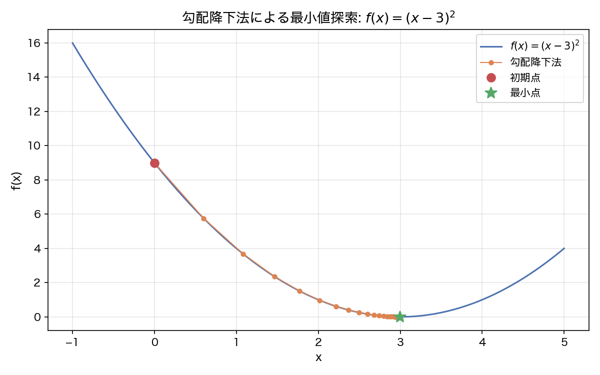
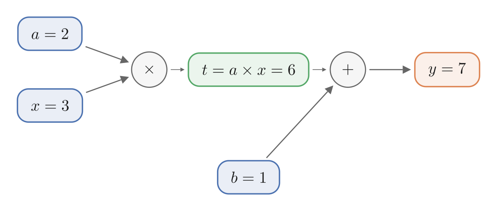
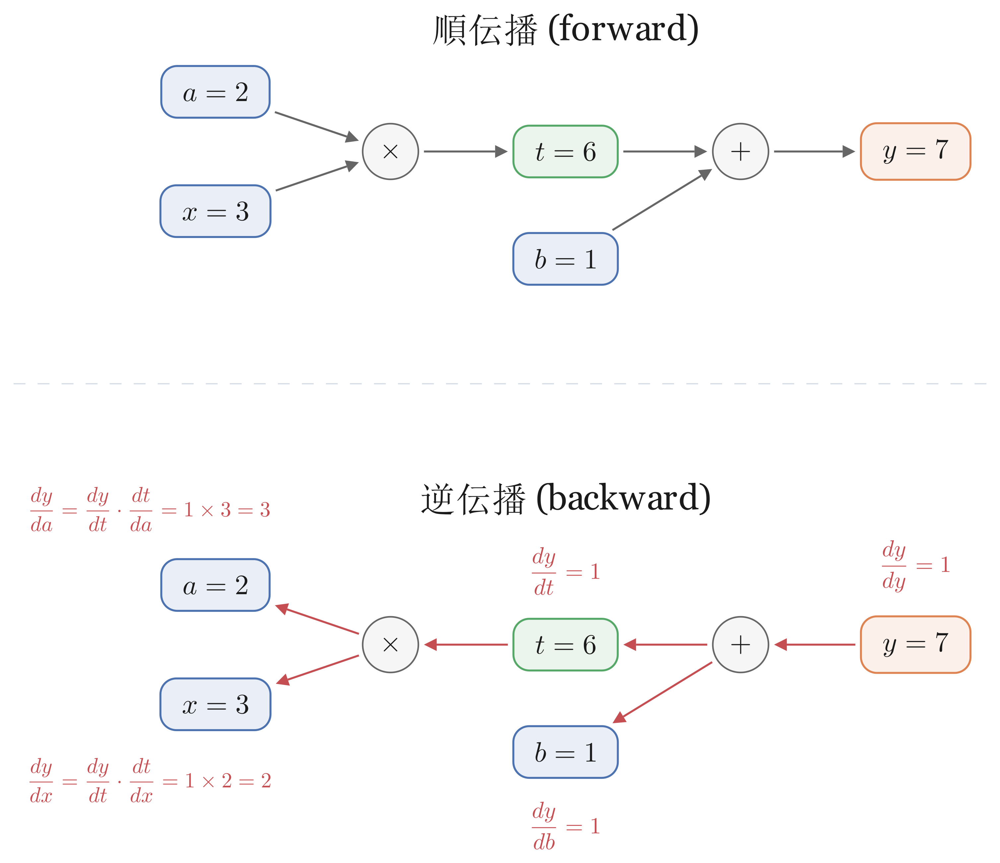

## この章で作るもの

第1-2章では2Dガウシアンを手動でパラメータ設定して描画しました。しかし3D Gaussian Splattingの本質は、パラメータを**自動で最適化**することにあります。数百のガウシアンの位置・形状・色を「目標画像に近づくように」調整したいのですが、全パラメータを手作業で合わせるのは不可能です。

そこで必要になるのが、「今のパラメータをどの方向にどれだけ動かせば、レンダリング結果が目標画像に近づくか」を自動で計算してくれる仕組みです。この章では、その仕組みである**スカラー自動微分エンジン**をゼロから構築します。具体的には `Value` クラスを実装し、最終的に簡単な関数を自動で最小化する体験をします。



図3.3はこの章の最終成果物です。関数 $f(x) = (x-3)^2$ の放物線上を、勾配降下法で初期点 $x=0$ から最小点 $x=3$ へ向かって降りていく軌跡が描かれています。この「勾配を計算して少しずつパラメータを更新する」プロセスが、第5章以降でガウシアンのパラメータ最適化に使われます。

**重要**: この章で作る `Value` クラスは、次の第4章で作る `Tensor` クラスの**プロトタイプ**です。`Value` の構造はそのまま `Tensor` に引き継がれるため、ここでの理解が以降の全ての章の土台になります。`Value` はスカラー専用の参照実装として `autograd.py` に残し、今後のデバッグや理解の助けとして活用します。

### 学習目標

- `Value` クラスの4つの属性（`data`, `grad`, `_backward`, `_prev`）の役割を説明できる
- 計算グラフの順伝播と逆伝播の流れを図に描いて説明できる
- 連鎖律を使った `_backward` クロージャを実装できる
- `scalar_grad_check` で自動微分の勾配が数値微分と一致することを検証できる
- 勾配降下法でスカラー関数のパラメータを自動で最適化できる

### この章で作成・修正するファイル

| ファイル | 種別 | 内容 |
|---------|------|------|
| `autograd.py` | 新規 | `Value` クラス（スカラー自動微分）と `scalar_grad_check` 関数 |
| `gradient_descent.py` | まとめスクリプト | 勾配降下法の軌跡をプロットする |

### 前提知識

- 第1-2章の内容（直接使わないが動機づけとして参照）
- 高校数学: 微分の基本（合成関数の微分=連鎖律）

---

## 3.1 なぜ自動微分が必要か

第2章で作ったアルファ合成レンダラーでは、ガウシアンの位置・形状・色・不透明度を全て手動で指定しました。3つのガウシアンなら手作業でも調整できますが、実際の3D Gaussian Splattingでは数千〜数百万のガウシアンを扱います。全パラメータを手動で調整するのは不可能です。

では、どうするか。目標画像（正解）と現在のレンダリング結果を比較し、その差を数値化します。この「目標との差の大きさ」を**損失**（loss）と呼びます。損失が小さいほど目標に近い、ということです。損失を最小化するようにパラメータを自動更新するのが**最適化**です。

最適化を行うには、「あるパラメータを少し動かしたら損失はどれだけ変わるか」を知る必要があります。この値を**勾配**（gradient）と呼びます。勾配がわかれば、パラメータをどの方向にどれだけ動かせば損失が減るかがわかります。

問題は、勾配をどうやって計算するかです。3つのアプローチがあります。

| 方法 | 概要 | 長所 | 短所 |
|------|------|------|------|
| 手動微分 | 数式を人間が解析的に微分 | 正確・高速 | 式が複雑になると困難 |
| 数値微分 | 微小な差分で近似 | 実装が簡単 | パラメータごとに計算をやり直す必要があり遅い |
| 自動微分 | 計算の過程を記録し、そこから勾配を逆算する | 正確・高速・汎用的 | 実装がやや複雑 |

3DGSを含め、勾配によるパラメータ最適化を行うシステムでは**自動微分**が広く使われています。さっそく3.2節から実装していきましょう。

---

## 3.2 計算グラフとValueクラス

### 計算グラフとは

自動微分を実現するために必要なのが**計算グラフ**（computation graph）です。計算を「ノード」（値）と「エッジ」（演算）で表現した有向グラフです。

例えば $y = a \times x + b$ という計算を考えましょう。$a = 2, x = 3, b = 1$ のとき、計算グラフは次のようになります。



図3.1の計算グラフでは、左から右へ値が流れていきます（順伝播）。まず $a$ と $x$ が乗算ノードに入り、中間結果 $a \times x = 6$ が生まれます。次に $6$ と $b = 1$ が加算ノードに入り、最終結果 $y = 7$ が得られます。

この計算グラフを記録しておけば、あとで勾配の計算に使えます。その方法は3.3節で説明します。まずは計算グラフを記録する仕組みを作りましょう。

### Valueクラスの設計

計算グラフの各ノードを表現する `Value` クラスを作ります。まずは順伝播（値の計算）に必要な2つの属性だけを持たせます。

| 属性 | 型 | 意味 |
|------|-----|------|
| `data` | `float` | ノードが保持するスカラー値 |
| `_prev` | `set` | このノードの入力ノードの集合（計算グラフの辺を記録する） |

### Valueクラスの実装: 骨格

`autograd.py` を新規作成します。まずは骨格部分です。

```python exec file=autograd.py
"""
スカラー自動微分エンジン: Valueクラス。
第3章: スカラー自動微分エンジン

micrograd方式のスカラー自動微分を実装する。
Valueクラスの構造（_backward、_prev、backward()）は
第4章のTensorクラスにそのまま引き継がれる。
"""

import math


class Value:
    """計算グラフのノード。スカラー値を保持する。

    Attributes:
        data: スカラー値（float）
        _prev: このノードの入力ノードの集合
    """

    def __init__(self, data):
        self.data = float(data)
        self._prev = set()

    def __repr__(self):
        return f"Value(data={self.data:.4f})"
```

まず `__init__` の中身を見ていきましょう。`self.data = float(data)` で入力を `float` に変換して保持します。整数 `Value(3)` を渡しても浮動小数点数として扱われます。`self._prev = set()` は入力ノードを記録するための空の集合です。この段階ではまだどの演算にも使われていないので空ですが、加算や乗算の中で入力ノードが登録されていきます。

動作を確認しましょう。`repr(a)` は Python の組み込み関数で、オブジェクトの詳細な文字列表現を返します。先ほど定義した `__repr__` メソッドが呼ばれ、`data` の値が表示されます。

```python exec
from autograd import Value

a = Value(2.0)
b = Value(3.0)
print(repr(a))
print(repr(b))
```

```text output
Value(data=2.0000)
Value(data=3.0000)
```

### 加算の実装

`autograd.py` の `Value` クラスに以下のメソッドを追加します。

Pythonでは `a + b` と書くと、自動的に `a.__add__(b)` が呼び出されます。つまり `__add__` メソッドを定義すれば、`Value` オブジェクト同士で `+` 演算子が使えるようになります。同様に `__mul__` を定義すれば `*` が使えます。この仕組みを**演算子オーバーロード**と呼びます。

```python
    # --- 四則演算 ---

    def __add__(self, other):
        other = other if isinstance(other, Value) else Value(other)
        out = Value(self.data + other.data)
        out._prev = {self, other}
        return out

    def __radd__(self, other):
        return self.__add__(other)
```

2つの `Value` の `data` を足して新しい `Value` を作り、`_prev` に入力ノードを記憶します。これで計算グラフの辺（図3.1のノード間をつなぐ矢印）が構築されます。

その他のポイント:

1. **`isinstance` チェック**: `Value(2.0) + 3` のように Python の数値と直接演算したいことがあります。`other` が `Value` でなければ自動的に `Value(other)` で包むことで、これを実現しています
2. **`__radd__`**: `__add__` は `Value(2.0) + 3` のように `+` の左側が `Value` のときに呼ばれます。逆に `3 + Value(2.0)` のように左側が数値の場合、Pythonは右側の `__radd__` を呼びます。加算は左右を入れ替えても結果が同じなので、`__add__` をそのまま呼んでいます

```python exec
from autograd import Value

a = Value(2.0)
b = Value(3.0)
c = a + b
print(repr(c))
```

```text output
Value(data=5.0000, grad=0.0000)
```

### 乗算の実装

`autograd.py` の `Value` クラスに続けて追加します。加算と同じパターンです。

```python
    def __mul__(self, other):
        other = other if isinstance(other, Value) else Value(other)
        out = Value(self.data * other.data)
        out._prev = {self, other}
        return out

    def __rmul__(self, other):
        return self.__mul__(other)
```

```python exec
a = Value(2.0)
b = Value(3.0)
c = a * b
print(repr(c))
```

```text output
Value(data=6.0000, grad=0.0000)
```

### y = a*x + b の計算グラフを作る

加算と乗算を組み合わせて、$y = a \times x + b$ の計算グラフを構築してみましょう。

```python exec
a = Value(2.0)
x = Value(3.0)
b = Value(1.0)
t = a * x
y = t + b
print(repr(y))
```

```text output
Value(data=7.0000)
```

$y = 2 \times 3 + 1 = 7$ が正しく計算されました。`_prev` をたどって計算グラフの構造を確認してみましょう。

```python exec
print("yの入力:", [repr(n) for n in y._prev])
print("a*xの入力:", [repr(n) for n in t._prev])
print("bの入力:", b._prev)
```

```text output
yの入力: [Value(data=6.0000), Value(data=1.0000)]
a*xの入力: [Value(data=2.0000), Value(data=3.0000)]
bの入力: set()
```

`y`(7.0) の入力は `a*x`(6.0) と `b`(1.0)、`a*x` の入力は `a`(2.0) と `x`(3.0)、`b` は入力がない末端ノードです。図3.1と同じ構造が `_prev` の連鎖として記録されています。次の3.3節では、この計算グラフを使って勾配を計算する方法を実装します。

---

## 3.3 連鎖律と逆伝播

3.2節で計算グラフを記録する仕組みを作りました。この節では、記録した計算グラフを逆方向にたどって勾配を計算する**逆伝播**（backpropagation）を実装します。逆伝播を理解するには**連鎖律**（chain rule）と**クロージャ**という2つの概念が必要です。まず連鎖律を学び、次にクロージャの仕組みを理解し、最後にトポロジカルソートで逆伝播を自動化します。

### 連鎖律と逆伝播の考え方

#### まず手計算で勾配を求める

$y = a \times x + b$ で $a = 2, x = 3, b = 1$ のとき、$\frac{dy}{da}$（$y$ を $a$ で微分した値）はいくつでしょうか。$y = ax + b$ なので $\frac{dy}{da} = x = 3$ です。同様に $\frac{dy}{dx} = a = 2$、$\frac{dy}{db} = 1$ です。

この手計算は $y = ax + b$ が簡単な式だからできました。しかし3DGSのように複雑な計算になると、全体を一度に微分するのは困難です。そこで計算グラフの各ステップに分解して、ステップごとの微分を組み合わせます。これが**連鎖律**（chain rule）です。

#### 連鎖律: ステップごとの微分の掛け算

高校数学で学ぶ合成関数の微分公式を思い出しましょう。$f(g(x))$ の微分は次のように分解できます。

$$
\frac{df}{dx} = \frac{df}{dg} \cdot \frac{dg}{dx}
$$

「外側の関数の微分 × 内側の関数の微分」です。これを計算グラフに当てはめてみましょう。

$y = a \times x + b$ の計算グラフ（図3.1）を2つのステップに分解します。

- ステップ1（乗算）: $t = a \times x$（中間結果）
- ステップ2（加算）: $y = t + b$

$\frac{dy}{da}$ を連鎖律で求めます。

$$
\frac{dy}{da} = \frac{dy}{dt} \cdot \frac{dt}{da}
$$

ステップ2の微分: $\frac{dy}{dt} = 1$（$y = t + b$ を $t$ で微分すると1）

ステップ1の微分: $\frac{dt}{da} = x = 3$（$t = a \times x$ を $a$ で微分すると $x$）

掛け合わせると $\frac{dy}{da} = 1 \times 3 = 3$ で、手計算の結果と一致します。

#### 逆伝播: 出力側から順に計算する

上の計算を、出力 $y$ の側から順にたどると次のようになります。まず起点として $y$ 自身の勾配を1とします（$y$ を $y$ で微分すると1）。

| 求める勾配 | 上流の勾配 | 局所的な微分 | 計算 | 結果 |
|-----------|-----------|-------------|------|------|
| $\frac{dy}{dt}$（中間結果 $t = a \times x$） | 1 | $y = t + b$ を $t$ で微分 → 1 | $1 \times 1$ | 1 |
| $\frac{dy}{db}$ | 1 | $y = t + b$ を $b$ で微分 → 1 | $1 \times 1$ | 1 |
| $\frac{dy}{da}$ | 1 | $t = a \times x$ を $a$ で微分 → $x = 3$ | $1 \times 3$ | 3 |
| $\frac{dy}{dx}$ | 1 | $t = a \times x$ を $x$ で微分 → $a = 2$ | $1 \times 2$ | 2 |

各行で「上流の勾配 × 局所的な微分」を計算して、入力側へ渡しています。この「出力から入力へ向かって勾配を伝播させる」処理が**逆伝播**（backpropagation）です。出力から1回たどるだけで全入力の勾配が求まるため、3DGSのようにパラメータが何千もある場面で効率的です。



図3.2の上段は順伝播（値の流れ）、下段は逆伝播（勾配の流れ）です。

ここで求めた勾配の意味を振り返っておきましょう。$\frac{dy}{da} = 3$ は「$a$ を1増やすと $y$ は3増える」、$\frac{dy}{dx} = 2$ は「$x$ を1増やすと $y$ は2増える」ということです。3.1節で述べた「パラメータをどの方向にどれだけ動かせば損失が減るか」を知るための値が、逆伝播で自動的に求まりました。

#### パターンの整理

各ノードでやっていることを整理すると、演算ごとに局所的な微分が決まっています。

- **加算** $p + q$: $p$ で微分すると1、$q$ で微分すると1
- **乗算** $p \times q$: $p$ で微分すると $q$、$q$ で微分すると $p$

逆伝播では、各ノードが「上流から受け取った勾配 × 局所的な微分」を計算して入力ノードに渡します。このパターンをコードにしていきましょう。

### Valueクラスに `grad` と `_backward` を追加する

逆伝播を実現するには、各ノードに `grad`（勾配を保持する値）と `_backward`（勾配を伝播させる関数）の2つの属性を追加する必要があります。`autograd.py` の `Value.__init__` を更新します。

```python
    def __init__(self, data):
        self.data = float(data)
        self.grad = 0.0
        self._backward = lambda: None  # デフォルトは何もしない
        self._prev = set()

    def __repr__(self):
        return f"Value(data={self.data:.4f}, grad={self.grad:.4f})"
```

`_backward` のデフォルトは「何もしない」関数です。入力ノード（ユーザーが直接作成した `Value`）は親を持たないので、勾配を伝播する先がありません。演算で新しい `Value` が生まれるとき、この `_backward` が適切な関数で上書きされます。

これで `Value` クラスの4つの属性が揃いました。

| 属性 | 型 | 意味 |
|------|-----|------|
| `data` | `float` | ノードが保持するスカラー値 |
| `grad` | `float` | 逆伝播で計算された勾配（初期値0） |
| `_backward` | 関数 | 上流勾配を入力ノードに伝播させるクロージャ |
| `_prev` | `set` | このノードの入力ノードの集合 |

### クロージャ: `_backward` を実装する準備

`_backward` の実装には**クロージャ**というPythonの仕組みを使います。まず簡単な例でクロージャとは何かを確認しましょう。

```python exec
def make_greeter(name):
    def greet():
        return f"Hello, {name}!"
    return greet

hello_alice = make_greeter("Alice")
hello_bob = make_greeter("Bob")
print(hello_alice())
print(hello_bob())
```

```text output
Hello, Alice!
Hello, Bob!
```

このコードでは、`make_greeter` の中で `greet` という関数を定義し、それを返しています。ポイントは `greet` 関数の中で使っている `name` です。`name` は `greet` 自身の変数ではなく、外側の `make_greeter` の引数です。Pythonでは、関数の中で定義された関数は、外側の変数を記憶します。`make_greeter("Alice")` が返した `greet` は `name = "Alice"` を、`make_greeter("Bob")` が返した `greet` は `name = "Bob"` を、それぞれ覚えています。`make_greeter` の実行が終わった後でも、返された関数を呼べば正しい `name` にアクセスできます。

この「外側の変数を記憶している関数」がクロージャです。

`_backward` もこの仕組みで動きます。`__add__` の内部で `_backward` 関数を定義すると、外側の変数である `self`、`other`、`out` を記憶してくれます。`__add__` の実行が終わった後でも `_backward()` を呼べば、それらの変数に正しくアクセスできます。

### 加算に `_backward` を追加する

3.2節で実装した `__add__` に `_backward` クロージャを追加します。`autograd.py` の `__add__` を以下のように更新してください。

```python
    def __add__(self, other):
        other = other if isinstance(other, Value) else Value(other)
        out = Value(self.data + other.data)
        out._prev = {self, other}

        def _backward():
            # d(a + b)/da = 1, d(a + b)/db = 1
            self.grad += 1.0 * out.grad
            other.grad += 1.0 * out.grad

        out._backward = _backward
        return out
```

コードの流れを追いましょう。まず `def _backward():` で関数を定義し、最後に `out._backward = _backward` でその関数を出力ノード `out` に保存しています。この `_backward` はクロージャなので、定義時の `self`、`other`、`out` を記憶しています。逆伝播のとき `out._backward()` を呼び出すと、記憶している変数を使って勾配を計算します。

`_backward` の中身を見てみましょう。逆伝播の表で確認したとおり、各ノードの勾配は「上流の勾配 × 局所的な微分」で求めます。

- `out.grad`: 上流から届いた勾配（逆伝播の表の「上流の勾配」列）
- 加算の局所的な微分: $a + b$ を $a$ で微分すると1、$b$ で微分しても1

この2つを掛けた `1.0 * out.grad` が入力ノードの勾配です。`self.grad` と `other.grad` にそれぞれ足し込んでいます。

### 乗算に `_backward` を追加する

同様に `__mul__` も更新します。

```python
    def __mul__(self, other):
        other = other if isinstance(other, Value) else Value(other)
        out = Value(self.data * other.data)
        out._prev = {self, other}

        def _backward():
            # d(a * b)/da = b, d(a * b)/db = a
            self.grad += other.data * out.grad
            other.grad += self.data * out.grad

        out._backward = _backward
        return out
```

加算と同じ「上流の勾配 × 局所的な微分」のパターンです。

- $a \times b$ を $a$ で微分すると $b$。コードでは `other.data`（相手の値）がこれに当たります
- $a \times b$ を $b$ で微分すると $a$。コードでは `self.data` です

それぞれに上流の勾配 `out.grad` を掛けて、入力ノードの `.grad` に足し込んでいます。

### 勾配の累積: なぜ `+=` が必要か

`_backward` で勾配更新に `=` ではなく `+=` を使っていることに気づいたでしょうか。`y = x + x` のように同じ変数 `x` が1つの演算の両方の入力になっている場合を考えてみてください。加算の `_backward` では `self.grad += 1.0 * out.grad` と `other.grad += 1.0 * out.grad` が実行されますが、`self` と `other` がどちらも同じ `x` を指しています。`+=` なら `x.grad` に1が2回加算されて正しく2になりますが、`=` だと2回目の代入で1回目の結果が上書きされ、勾配が1になってしまいます。$y = 2x$ なので $\frac{dy}{dx} = 2$ が正しい答えです。

この「同じ変数が複数の演算で使われたら勾配を足し合わせる」仕組みは、3DGSのように多数のパラメータが複雑に絡み合う計算でも正しく動きます。

### トポロジカルソートと `backward()`

#### なぜ順序が必要か

逆伝播を正しく行うには、計算グラフの**逆順**で `_backward` を呼ぶ必要があります。つまり、あるノードの `_backward` を呼ぶ前に、そのノードを使っている全ての後続ノードの `_backward` が完了していなければなりません。後続ノードが先に処理されていないと、`out.grad` にまだ上流の勾配が届いておらず、正しい値を下流に渡せないからです。この順序を決めるアルゴリズムが**トポロジカルソート**です。

**トポロジカルソート**とは、依存関係のある要素を「使う側を先に処理してから、使われる側を処理する」順番に並べるアルゴリズムです。料理のレシピで「野菜を切る→炒める→盛り付ける」と順序が決まるのと同じように、計算グラフでも「入力→中間結果→出力」の順序を自動的に決定します。この順序を逆にすれば「出力→中間結果→入力」となり、逆伝播の正しい実行順序が得られます。

#### 再帰による深さ優先探索

トポロジカルソートの実装には**再帰**を使います。再帰とは、関数が自分自身を呼ぶことです。計算グラフの各ノードに対して「まず自分の入力ノードを全て処理してから、自分をリストに追加する」という処理を再帰的に行うと、依存関係が自然に解決されます。この探索方法を**深さ優先探索**（DFS: Depth-First Search）と呼びます。

`autograd.py` の `Value` クラスに `backward()` メソッドを追加します。

```python
    # --- 逆伝播 ---

    def backward(self):
        """トポロジカルソートで計算グラフを逆順走査し、勾配を伝播する。"""
        # トポロジカルソート（深さ優先探索）
        topo = []
        visited = set()

        def build_topo(v):
            if v not in visited:
                visited.add(v)
                for parent in v._prev:
                    build_topo(parent)
                topo.append(v)

        build_topo(self)

        # 出力ノードの勾配を1に設定
        self.grad = 1.0

        # 逆順に_backwardを呼び出す
        for v in reversed(topo):
            v._backward()
```

`build_topo` は深さ優先探索で計算グラフを走査します。`build_topo(v)` が呼ばれると、まず `v` を `visited` に追加して重複訪問を防ぎ、`v` の入力ノード（`v._prev`）それぞれに対して `build_topo` を再帰的に呼び出します。全ての入力ノードを先に処理してから自分を `topo` に追加するので、依存関係が正しく解決されます。このリストを逆順にすれば、出力側から入力側への正しい順序が得られます。

`self.grad = 1.0` は「出力の出力に対する勾配は1」という起点です。$\frac{dy}{dy} = 1$ です。

#### `build_topo` のトレース

具体的に `y = a * x + b` での呼び出し順をトレースしてみましょう。3.2節のコードでは `t = a * x` と書いたので、計算グラフの構造は `y` の入力が `{t, b}`、`t` の入力が `{a, x}` です。

1. `build_topo(y)` が呼ばれる。`y` を `visited` に追加し、`y` の入力ノード `t` と `b` に対して再帰する
2. `build_topo(t)` が呼ばれる。`t` を `visited` に追加し、`t` の入力ノード `a` と `x` に対して再帰する
3. `build_topo(a)` が呼ばれる。`a` は入力ノードがないので再帰せず、`topo` に `a` を追加 → `topo = [a]`
4. `build_topo(x)` が呼ばれる。同様に `topo` に `x` を追加 → `topo = [a, x]`
5. `t` の入力を全て処理したので、`topo` に `t` を追加 → `topo = [a, x, t]`
6. `build_topo(b)` が呼ばれる。`topo` に `b` を追加 → `topo = [a, x, t, b]`
7. `y` の入力を全て処理したので、`topo` に `y` を追加 → `topo = [a, x, t, b, y]`

`reversed(topo)` で `[y, b, t, x, a]` の順に `_backward` が呼ばれ、出力側から入力側へ正しく勾配が伝播します。

#### $y = a \times x + b$ の逆伝播を実行する

先ほどの計算グラフで逆伝播を実行しましょう。

```python exec
from autograd import Value

a = Value(2.0)
x = Value(3.0)
b = Value(1.0)
y = a * x + b

y.backward()
print(f"a.grad = {a.grad}")
print(f"x.grad = {x.grad}")
print(f"b.grad = {b.grad}")
```

```text output
a.grad = 3.0
x.grad = 2.0
b.grad = 1.0
```

各勾配の意味を確認しましょう。

- $\frac{dy}{da} = x = 3$: $a$ を1増やすと $y$ は3増える
- $\frac{dy}{dx} = a = 2$: $x$ を1増やすと $y$ は2増える
- $\frac{dy}{db} = 1$: $b$ を1増やすと $y$ は1増える

これらは手計算の結果と完全に一致します。自動微分が正しく機能しています。

---

## 3.4 べき乗・exp・ReLU・残りの四則演算

### べき乗・exp・ReLUの追加

べき乗・exp・ReLUを追加します。それぞれの微分公式は以下のとおりです。

- **べき乗** $x^n$: $\frac{d}{dx} x^n = n x^{n-1}$
- **exp**: $\frac{d}{dx} e^x = e^x$（exp は自分自身が導関数という特別な性質）
- **ReLU** $\max(0, x)$: 入力が正ならそのまま通し、負なら0にする関数です。3DGSでは不透明度のような「負になってはいけない値」を非負に保つ場面で使います。場合分けのある関数でも自動微分が正しく動くことを確認する例にもなります。$x > 0$ なら勾配1、$x \leq 0$ なら勾配0です

これらの公式をそのまま `_backward` クロージャにします。`autograd.py` の `Value` クラスに追加してください。`__pow__` は `**` 演算子のオーバーロードで、`Value(3.0) ** 2` のように書けます。

```python
    # --- べき乗・指数関数・ReLU ---

    def __pow__(self, n):
        assert isinstance(n, (int, float)), "べき指数はint/floatのみ"
        out = Value(self.data ** n)
        out._prev = {self}

        def _backward():
            # d(x^n)/dx = n * x^(n-1)
            self.grad += n * (self.data ** (n - 1)) * out.grad

        out._backward = _backward
        return out

    def exp(self):
        val = math.exp(self.data)
        out = Value(val)
        out._prev = {self}

        def _backward():
            # d(exp(x))/dx = exp(x)
            self.grad += val * out.grad

        out._backward = _backward
        return out

    def relu(self):
        out = Value(max(0.0, self.data))
        out._prev = {self}

        def _backward():
            # d(relu(x))/dx = 1 if x > 0 else 0
            self.grad += (1.0 if self.data > 0 else 0.0) * out.grad

        out._backward = _backward
        return out
```

なお、`autograd.py` はNumPyに依存しないスカラー専用モジュールなので、ファイル先頭で `import math` し、標準ライブラリの `math.exp` を使っています。

それぞれの forward が正しいことを確認しておきましょう。

```python exec
from autograd import Value

print(Value(3.0) ** 2)        # べき乗
print(Value(1.0).exp())       # exp(1) = e
print(Value(3.0).relu())      # 正の入力
print(Value(-2.0).relu())     # 負の入力
```

```text output
Value(data=9.0000, grad=0.0000)
Value(data=2.7183, grad=0.0000)
Value(data=3.0000, grad=0.0000)
Value(data=0.0000, grad=0.0000)
```

forward は期待どおりです。backward も確認しましょう。

```python exec
from autograd import Value

# べき乗: d(x^2)/dx = 2x
x = Value(3.0)
y = x ** 2
y.backward()
print(f"べき乗: x.grad={x.grad}")

# exp: d(exp(x))/dx = exp(x)
x = Value(1.0)
y = x.exp()
y.backward()
print(f"exp: x.grad={x.grad:.4f}")

# ReLU (正): d(relu(x))/dx = 1
x = Value(3.0)
y = x.relu()
y.backward()
print(f"ReLU(正): x.grad={x.grad}")

# ReLU (負): d(relu(x))/dx = 0
x = Value(-2.0)
y = x.relu()
y.backward()
print(f"ReLU(負): x.grad={x.grad}")
```

```text output
べき乗: x.grad=6.0
exp: x.grad=2.7183
ReLU(正): x.grad=1.0
ReLU(負): x.grad=0.0
```

べき乗の勾配は $2 \times 3 = 6$、expの勾配は $e^1 \approx 2.7183$ で、いずれも微分公式どおりです。

::widget{name="ch3-autograd-graph"}

### 残りの四則演算と否定を追加する

減算・除算・否定を追加します。これらは既に実装した加算・乗算・べき乗の組み合わせで表現できるため、新しい `_backward` を書く必要がありません。

- `__sub__`（`-` 演算子）: 減算。`a - b` を `a + (-b)` として加算と否定に帰着
- `__truediv__`（`/` 演算子）: 除算。`a / b` を `a * b ** (-1)` として乗算とべき乗に帰着
- `__neg__`（単項 `-` 演算子）: 否定。`-a` を `a * (-1)` として乗算に帰着
- `__rsub__`, `__rtruediv__`: `__radd__` と同様に、左側が数値の場合（`3 - Value(2.0)` 等）に呼ばれます

```python
    def __sub__(self, other):
        # a - b = a + (-b)
        return self + (-other)

    def __rsub__(self, other):
        # other - self = (-self) + other
        return (-self) + other

    def __truediv__(self, other):
        # a / b = a * b^(-1)
        return self * other ** (-1)

    def __rtruediv__(self, other):
        # other / self = other * self^(-1)
        return other * self ** (-1)

    def __neg__(self):
        return self * (-1)
```

既存演算の組み合わせなので、新しい `_backward` はありません。backward が正しく動くことを確認しましょう。

```python exec
from autograd import Value

# 減算: d(a-b)/da = 1, d(a-b)/db = -1
a = Value(5.0)
b = Value(3.0)
c = a - b
c.backward()
print(f"減算: a.grad={a.grad}, b.grad={b.grad}")

# 除算: d(a/b)/da = 1/b, d(a/b)/db = -a/b^2
a = Value(6.0)
b = Value(3.0)
c = a / b
c.backward()
print(f"除算: a.grad={a.grad:.4f}, b.grad={b.grad:.4f}")

# 否定: d(-a)/da = -1
a = Value(4.0)
c = -a
c.backward()
print(f"否定: a.grad={a.grad}")
```

```text output
減算: a.grad=1.0, b.grad=-1.0
除算: a.grad=0.3333, b.grad=-0.6667
否定: a.grad=-1.0
```

減算の勾配は $a$ 側が1、$b$ 側が-1です。除算 $6 / 3$ の勾配は $a$ 側が $1/b = 1/3 \approx 0.3333$、$b$ 側が $-a/b^2 = -6/9 \approx -0.6667$ です。新しい `_backward` を書いていないのに、既存演算の組み合わせで正しい勾配が求まっています。

---

## 3.5 数値微分による検証

自動微分の結果が正しいことをどう保証するか。3.1節で触れた**数値微分**との比較です。数値微分は実装が簡単で間違いにくいので、自動微分の `_backward` が正しく実装できているかの「答え合わせ」に最適です。

具体的には**中心差分法**を使います。坂道の傾きを知りたいとき、1歩前と1歩後ろの高さの差を歩幅で割れば傾きがわかります。中心差分法はこの発想で、各パラメータを微小量 $\epsilon$ だけ前後にずらして関数値の差から勾配を近似します。

$$
\frac{f(x+\epsilon) - f(x-\epsilon)}{2\epsilon}
$$

> **補足: 数値微分だけではダメなのか**
> 数値微分が簡単で間違いにくいなら、最初から数値微分だけで良いのでは？と思うかもしれません。問題は速度です。数値微分はパラメータを1つずつ微小量ずらして関数を再計算するので、パラメータが $N$ 個あれば関数を $2N$ 回実行する必要があります。3DGSでは数千〜数百万のパラメータを扱うため、毎ステップ数百万回の再計算は現実的ではありません。自動微分なら1回の逆伝播で全パラメータの勾配が求まります。その代わり、演算ごとに `_backward` を正しく実装する手間がかかります。数値微分はその実装が合っているかを確認する「答え合わせ」の役割を担います。

### grad_check関数の実装

`autograd.py` の末尾（`Value` クラスの外）に以下の関数を追加します。コードは30行ほどありますが、やっていることは次の3ステップだけです。

1. **自動微分で勾配を計算する**: 入力値から `Value` を作り、関数を実行して `backward()` で勾配を取得
2. **数値微分で勾配を計算する**: 入力を1つずつ $\pm\epsilon$ ずらして中心差分法で勾配を近似
3. **両者を比較する**: 相対誤差（または絶対誤差）が十分小さければOK

```python exec
def scalar_grad_check(f, inputs, eps=1e-5):
    """数値微分と自動微分の勾配を比較する。

    中心差分法で数値勾配を計算し、自動微分の結果と比較します。

    Args:
        f: 検証したい演算を行う関数。Value のリストを受け取り Value を返す
        inputs: float のリスト（各入力の値）
        eps: 数値微分でずらす微小量

    Returns:
        True: 全ての勾配が一致（相対誤差 < 1e-5）
    """
    # --- ステップ1: 自動微分で勾配を計算 ---
    values = [Value(x) for x in inputs]
    out = f(values)
    out.backward()
    auto_grads = [v.grad for v in values]

    # --- ステップ2: 数値微分で勾配を計算（中心差分法） ---
    num_grads = []
    for i in range(len(inputs)):
        # +eps
        inputs_plus = list(inputs)
        inputs_plus[i] += eps
        values_plus = [Value(x) for x in inputs_plus]
        out_plus = f(values_plus)

        # -eps
        inputs_minus = list(inputs)
        inputs_minus[i] -= eps
        values_minus = [Value(x) for x in inputs_minus]
        out_minus = f(values_minus)

        # 中心差分: (f(x+eps) - f(x-eps)) / (2*eps)
        num_grad = (out_plus.data - out_minus.data) / (2 * eps)
        num_grads.append(num_grad)

    # --- ステップ3: 比較 ---
    all_ok = True
    for i, (ag, ng) in enumerate(zip(auto_grads, num_grads)):
        abs_err = abs(ag - ng)
        denom = max(abs(ag), abs(ng), 1e-8)
        rel_err = abs_err / denom
        if abs_err > 1e-5 and rel_err > 1e-5:
            print(f"  入力[{i}]: 自動微分={ag:.6f}, 数値微分={ng:.6f}, "
                  f"相対誤差={rel_err:.2e} [FAIL]")
            all_ok = False

    return all_ok
```

中心差分法は前方差分 $\frac{f(x+\epsilon) - f(x)}{\epsilon}$ より精度が高く、$O(\epsilon^2)$ の誤差で近似できます。

コード中の `inputs_plus = list(inputs)` は元のリストのコピーを作っています。コピーせずに `inputs` を直接変更すると、後続のループで元の値が失われてしまうためです。

比較は絶対誤差と相対誤差の**どちらかが十分小さければOK**としています。絶対誤差だけだと勾配が大きい場合に厳しすぎ、相対誤差だけだと勾配がゼロに近い場合（例: ReLUの負の領域）に不安定になるためです。`denom` の `1e-8` は両方がゼロのときにゼロ除算を防ぐ安全策です。

### 全演算をgrad_checkで検証する

```python exec
from autograd import Value, scalar_grad_check

# 加算
ok = scalar_grad_check(lambda v: v[0] + v[1], [2.0, 3.0])
print(f"加算: {'OK' if ok else 'FAIL'}")

# 乗算
ok = scalar_grad_check(lambda v: v[0] * v[1], [2.0, 3.0])
print(f"乗算: {'OK' if ok else 'FAIL'}")

# 減算
ok = scalar_grad_check(lambda v: v[0] - v[1], [5.0, 3.0])
print(f"減算: {'OK' if ok else 'FAIL'}")

# 除算
ok = scalar_grad_check(lambda v: v[0] / v[1], [6.0, 3.0])
print(f"除算: {'OK' if ok else 'FAIL'}")

# べき乗
ok = scalar_grad_check(lambda v: v[0] ** 3, [2.0])
print(f"べき乗: {'OK' if ok else 'FAIL'}")

# exp
ok = scalar_grad_check(lambda v: v[0].exp(), [1.5])
print(f"exp: {'OK' if ok else 'FAIL'}")

# ReLU
ok = scalar_grad_check(lambda v: v[0].relu(), [2.0])
print(f"ReLU: {'OK' if ok else 'FAIL'}")
```

```text output
加算: OK
乗算: OK
減算: OK
除算: OK
べき乗: OK
exp: OK
ReLU: OK
```

全演算で自動微分と数値微分が一致しました。

### 合成関数のgrad_check

より複雑な合成関数でも検証してみましょう。$f(x) = \exp(x^2 + 2x)$ を $x = 1$ で微分します。

手計算では、$f'(x) = (2x + 2) \cdot \exp(x^2 + 2x)$ なので $f'(1) = 4 \cdot e^3 \approx 80.3421$ です。

```python exec
def f(v):
    x = v[0]
    return (x ** 2 + 2 * x).exp()

ok = scalar_grad_check(f, [1.0])
print(f"exp(x^2+2x): {'OK' if ok else 'FAIL'}")

# 自動微分の値を直接確認
values = [Value(1.0)]
out = f(values)
out.backward()
print(f"自動微分の勾配: {values[0].grad:.4f}")
```

```text output
exp(x^2+2x): OK
自動微分の勾配: 80.3421
```

手計算の $4 \cdot e^3 \approx 80.3421$ と完全に一致しています。今後新しい演算を追加するたびに、この `scalar_grad_check`（第4章以降はテンソル版の `grad_check`）で正しさを確認する習慣をつけましょう。

---

## 3.6 勾配降下法で関数を最小化する

自動微分で勾配が計算できるようになったので、いよいよ**勾配降下法**（gradient descent）で関数を最小化してみましょう。更新則の実装、学習率の役割、収束の確認を実際に体験します。

### 勾配降下法のアルゴリズム

勾配降下法は以下の更新を繰り返すシンプルなアルゴリズムです。

$$
x \leftarrow x - \eta \cdot \frac{df(x)}{dx}
$$

$f(x)$ は最小化したい関数、$\frac{df(x)}{dx}$ はその勾配です。$\eta$（イータ）は**学習率**（learning rate）と呼ばれ、1回の更新でどれだけ動くかを制御します。勾配はパラメータを増やしたとき $f(x)$ が増える方向を指すので、勾配の**逆方向**に進むことで $f(x)$ を減らせます。式のマイナス符号がこの「逆方向」に対応しています。

> **補足**: 学習率のように、学習の挙動を制御するためにユーザーが事前に決める値を**ハイパーパラメータ**と呼びます。

### f(x) = (x - 3)^2 の最小化

$f(x) = (x - 3)^2$ を最小化します。明らかに最小点は $x = 3$ ですが、勾配降下法で自動的にたどり着けることを確認しましょう。

以下のコードでは、ループの各ステップで `Value(x_val)` を新しく作っています。`backward()` を呼ぶと `grad` に勾配が書き込まれるので、毎回新しい `Value` を作ることで前のステップの勾配をリセットしています。

```python exec
from autograd import Value

lr = 0.1  # 学習率
x_val = 0.0  # 初期値

for step in range(100):
    # 順伝播: 計算グラフを構築
    x = Value(x_val)
    f_x = (x - 3) ** 2

    # 逆伝播: 勾配を計算
    f_x.backward()

    # パラメータ更新
    x_val -= lr * x.grad

    if step < 5 or step == 99:
        print(f"step {step:3d}: x={x_val:.4f}, f(x)={f_x.data:.4f}, grad={x.grad:.4f}")
```

```text output
step   0: x=0.6000, f(x)=9.0000, grad=-6.0000
step   1: x=1.0800, f(x)=5.7600, grad=-4.8000
step   2: x=1.4640, f(x)=3.6864, grad=-3.8400
step   3: x=1.7712, f(x)=2.3593, grad=-3.0720
step   4: x=2.0170, f(x)=1.5099, grad=-2.4576
step  99: x=3.0000, f(x)=0.0000, grad=-0.0000
```

出力を追ってみましょう。ステップ0では $f'(0) = 2(0-3) = -6$ なので、$x$ は $0 - 0.1 \times (-6) = 0.6$ に更新されます。最小点に近づくほど勾配が小さくなり更新幅も縮まるため、ステップ99では $x \approx 3.0$ に収束し $f(x)$ はほぼ0になっています。

### 学習率の影響を実験する

学習率 $\eta$ は勾配降下法の最も重要なハイパーパラメータです。異なる学習率でどう収束が変わるか実験しましょう。

```python exec
from autograd import Value

for lr in [0.01, 0.1, 0.5, 1.1]:
    x_val = 0.0
    for step in range(30):
        x = Value(x_val)
        f_x = (x - 3) ** 2
        f_x.backward()
        x_val -= lr * x.grad
    print(f"lr={lr}: x={x_val:.4f}, f(x)={(x_val - 3)**2:.6f}")
```

```text output
lr=0.01: x=1.3635, f(x)=2.677978
lr=0.1: x=2.9963, f(x)=0.000014
lr=0.5: x=3.0000, f(x)=0.000000
lr=1.1: x=-709.1289, f(x)=507127.629179
```

- **学習率 0.01（小さすぎ）**: 30ステップでは $x \approx 1.36$ までしか進まず、収束が非常に遅い
- **学習率 0.1（適度）**: 30ステップで $x \approx 3.0$ にほぼ収束
- **学習率 0.5（大きめ）**: 1ステップの更新幅が大きく、こちらも素早く収束
- **学習率 1.1（大きすぎ）**: 更新が行き過ぎて最小点の反対側に飛び、$f(x)$ が50万を超えて発散

適切な学習率の選択は最適化の重要なテーマで、第5章以降でも繰り返し登場します。

---

## 3.7 まとめスクリプト: 勾配降下法の可視化

この章の締めくくりとして、勾配降下法の軌跡をプロットしましょう。以下を `gradient_descent.py` として保存し、実行してください。

```python exec file=gradient_descent.py
"""
第3章まとめ: 勾配降下法で f(x)=(x-3)^2 を最小化し、軌跡をプロットする。
"""

import numpy as np
import matplotlib
import matplotlib.pyplot as plt
from autograd import Value

# matplotlibで日本語を表示するにはフォントの指定が必要です。
# 利用可能なフォントを順に試し、見つかったものを使います。
for font in ["Hiragino Sans", "Noto Sans CJK JP", "IPAexGothic"]:
    try:
        matplotlib.font_manager.findfont(font, fallback_to_default=False)
        plt.rcParams["font.family"] = font
        break
    except ValueError:
        continue

# --- 勾配降下法 ---
lr = 0.1
x_val = 0.0
trajectory = [(x_val, (x_val - 3) ** 2)]

for step in range(30):
    x = Value(x_val)
    loss = (x - 3) ** 2
    loss.backward()
    x_val -= lr * x.grad
    trajectory.append((x_val, (x_val - 3) ** 2))

# --- プロット ---
xs = np.linspace(-1, 5, 200)
ys = (xs - 3) ** 2

fig, ax = plt.subplots(figsize=(8, 5), dpi=150)
ax.plot(xs, ys, color="#4C72B0", linewidth=1.5, label="$f(x) = (x-3)^2$")

# 軌跡をプロット
traj_x = [t[0] for t in trajectory]
traj_y = [t[1] for t in trajectory]
ax.plot(traj_x, traj_y, "o-", color="#DD8452", markersize=4, linewidth=1.0,
        label="勾配降下法")
ax.plot(traj_x[0], traj_y[0], "o", color="#C44E52", markersize=8, label="初期点")
ax.plot(traj_x[-1], traj_y[-1], "*", color="#55A868", markersize=12, label="最小点")

ax.set_xlabel("x", fontsize=11)
ax.set_ylabel("f(x)", fontsize=11)
ax.set_title("勾配降下法による最小値探索: $f(x) = (x-3)^2$", fontsize=13)
ax.legend(fontsize=10)
ax.grid(True, alpha=0.3)

plt.tight_layout()
plt.savefig("gradient_descent.png")
print("gradient_descent.png をカレントディレクトリに保存しました")
```

実行すると、カレントディレクトリに `gradient_descent.png` が生成されます。


図3.3は放物線 $f(x) = (x-3)^2$ 上を初期点 $x=0$ から最小点 $x=3$ へ向かって降りていく軌跡です。最初は大きなステップで進み、最小点に近づくにつれてステップが小さくなります。

この章ではパラメータが $x$ の1つだけでしたが、3DGSでは数千のガウシアンそれぞれに位置・形状・色などのパラメータがあり、画像の全ピクセルに対して計算を行います。`Value` クラスはスカラー1つずつに計算グラフを作るため、この規模には遅すぎます。次の第4章ではスカラーからテンソルに拡張し、配列全体を一括処理できるようにします。

---

## この章で学んだこと

- **自動微分**は計算グラフを記録し、連鎖律で逆伝播することで全パラメータの勾配を効率的に計算する
- **Valueクラス**の4つの属性（`data`、`grad`、`_backward`、`_prev`）が計算グラフのノードを表現する。この構造は第4章の `Tensor` クラスにそのまま引き継がれる
- 各演算の **`_backward` クロージャ**が局所的な勾配伝播を担い、**トポロジカルソート**で正しい順序で実行される
- **`scalar_grad_check`** で数値微分と比較することで、backward の正しさを保証できる。新しい演算を追加するたびに必ず検証する
- **勾配降下法**は $x \leftarrow x - \eta \cdot \frac{df(x)}{dx}$ の更新を繰り返すだけで関数を最小化できる

