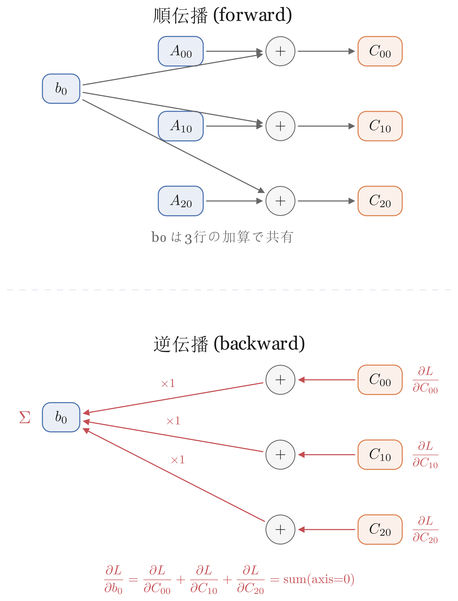

## この章で作るもの

第3章ではスカラー（1つの数値）専用の自動微分エンジン `Value` クラスを作りました。しかし、ガウシアンの計算にはベクトルや行列が不可欠です。中心座標は2次元ベクトル、共分散行列は2x2行列、色はRGBの3次元ベクトル。これらを1つずつスカラーに分解して計算するのは非効率です。そこで、ベクトルや行列をまとめて扱える **テンソル** に `Value` を拡張します。

テンソルとは、スカラー（0次元）、ベクトル（1次元）、行列（2次元）を一般化したN次元配列のことです。この章では `Value` クラスをテンソルに拡張した `Tensor` クラスを構築します。構造はほとんど変わりません。変わるのは `data` と `grad` が `float` から `np.ndarray` になることと、ブロードキャスト対応のbackwardが加わることだけです。

実装は要素単位演算（add〜pow）、数学関数（exp, log, sigmoid）、集約・形状操作（sum, mean, reshape, stack, unbind, getitem）の順に進め、全演算が揃ったところでgrad_checkによる一括検証を行います。

### 学習目標

- `Value` → `Tensor` の対応表を使い、構造がほぼ同じであることを説明できる
- ブロードキャストのbackwardが「勾配を `sum` で潰す」操作だと説明できる
- `Tensor` クラスの基本演算（16種）のforward/backwardを実装できる
- `grad_check` を使って、全演算の勾配が正しいことを検証できる

### この章で作成・修正するファイル

| ファイル | 種別 | 内容 |
|---------|------|------|
| `autograd.py` | 修正 | `Tensor` クラスを追加（`Value` クラスも参照実装として残す） |

### この章で追加する`Tensor`演算

| グループ | 演算 | 備考 |
|----------|------|------|
| 要素単位 | add, sub, mul, div, neg, pow | 6種。全てブロードキャスト対応 |
| 数学関数 | exp, log, sigmoid, abs | 4種。absは第5章のL1損失で使用 |
| 集約・形状 | sum, mean, reshape, stack, unbind, getitem | 6種。stack/unbindはモジュールレベル関数 |

合計16種の演算を実装します。

### 前提知識

- 第3章: スカラー自動微分の仕組み（計算グラフ、逆伝播、数値微分による検証）
- NumPyの基本操作（ブロードキャストは本文で改めて説明します）

---

## 4.1 Valueから`Tensor`へ: 対応表

第3章の `Value` クラスと、これから作る `Tensor` クラスの構造を並べて比較しましょう。第3章で整理した4つの属性がそのまま対応します。

| 属性 | Value（第3章） | `Tensor`（第4章） | 変わること |
|------|------------|-------------|----------|
| `data` | `float` | `np.ndarray` | スカラー → N次元配列 |
| `grad` | `float` | `np.ndarray` | スカラー → 同形状の配列 |
| `_backward` | クロージャで勾配伝播 | クロージャで勾配伝播 | 仕組みは**同じ**。中身に `_unbroadcast` が加わる |
| `_prev` | 入力ノードの集合 | 入力ノードの集合 | **変わらない** |
| `backward()` | トポロジカルソート | トポロジカルソート | **ほぼ同じ**（`1.0` → `np.ones_like` のみ） |

ポイントは3つです。

1. **`_backward` クロージャの仕組みは同じ**。各演算が「勾配をどう伝播するか」を関数として記録し、`backward()` で逆順に呼び出す構造はまったく変わりません
2. **`backward()` メソッドもほぼコピペで動く**。唯一の変更は起点の勾配が `1.0` から `np.ones_like(self.data)` になることだけです
3. **新しいのはブロードキャストのbackwardだけ**。NumPyのブロードキャストにより `(3, 4) + (4,)` のような異なる形状の演算ができますが、backwardでは勾配を `sum` で集約して元の形状に戻す必要があります。詳しくは4.3節で具体例を使って説明します

---

## 4.2 `Tensor`クラスの基本設計

### ファイル冒頭の修正

`autograd.py` のファイル冒頭を修正し、`import numpy as np` を追加します。

```python exec
"""
自動微分エンジン: ValueクラスとTensorクラス。
第4章: テンソル自動微分エンジン

Valueクラス（第3章）はスカラー専用の参照実装として残す。
Tensorクラスは data を np.ndarray に拡張し、
ブロードキャスト対応の backward を実装する。
"""

import math
import sys
import numpy as np

# 計算グラフが深くなるとbackward()の再帰的トポロジカルソートが
# Pythonのデフォルト再帰上限（1000）に達するため、上限を引き上げる
sys.setrecursionlimit(10000)
```

`sys.setrecursionlimit` は、後の章で計算グラフが大きくなったときに `backward()` の再帰呼び出しがPythonの上限に達するのを防ぎます。現時点では影響しませんが、後の章で計算グラフが深くなると必要になります。

`Value` クラスと `scalar_grad_check` 関数はそのまま残します。新しいコードは全てファイルの末尾に追加していきます。

### `Tensor`クラスの設計

`Tensor` クラスが持つ属性を整理します。第3章の `Value` クラスと同じ4つの属性に、テンソル固有の `requires_grad` が加わります。

| 属性 | 型 | 意味 |
|------|-----|------|
| `data` | `np.ndarray` | ノードが保持するN次元配列 |
| `grad` | `np.ndarray` | 逆伝播で計算された勾配（`data` と同じ形状） |
| `requires_grad` | `bool` | 勾配計算が必要かどうか |
| `_backward` | クロージャ | 勾配を伝播させる関数（`Value` と同じ仕組み） |
| `_prev` | `set` | このノードの入力ノードの集合（`Value` と同じ） |

### `Tensor`クラスの骨格

`autograd.py` に `Tensor` クラスの骨格を追加します。`scalar_grad_check` 関数の後に続けて記述してください。

```python exec file=autograd.py mode=append
class Tensor:
    """計算グラフのノード。N次元配列と勾配を保持する。

    Valueクラスのテンソル版。構造（_backward、_prev、backward()）は
    Valueと同一で、data と grad が np.ndarray に変わっただけ。

    Attributes:
        data: N次元配列（np.ndarray）
        grad: 逆伝播で計算された勾配（np.ndarray、同形状）
        requires_grad: 勾配計算が必要かどうか
        _backward: 勾配を伝播させるクロージャ
        _prev: このノードの入力ノードの集合
    """

    def __init__(self, data, requires_grad=False):
        if isinstance(data, np.ndarray):
            self.data = data.astype(np.float64)
        else:
            self.data = np.array(data, dtype=np.float64)
        self.requires_grad = requires_grad
        self.grad = np.zeros_like(self.data) if requires_grad else None
        self._backward = lambda: None
        self._prev = set()

    def __repr__(self):
        return f"Tensor(data={self.data}, grad={self.grad})"

    @property  # メソッドを属性のように括弧なしでアクセスできるようにする
    def shape(self):
        return self.data.shape

    @property
    def ndim(self):
        return self.data.ndim

    def zero_grad(self):
        """勾配をゼロクリアする。"""
        if self.requires_grad:
            self.grad = np.zeros_like(self.data)
```

まず `__init__` の中身を見ていきましょう。`data` の処理では、`np.ndarray` が渡されればそのまま `float64` に変換し、リストやスカラーが渡されれば `np.array` で配列に変換します。`Tensor([1.0, 2.0])` のようにリストを渡しても、`Tensor(np.array([1.0, 2.0]))` のようにNumPy配列を渡しても、どちらでも使えるようにしています。`_backward` と `_prev` は `Value` と同じ仕組みです。`_backward` は何もしない関数で初期化しておき、演算メソッド（`__add__` など）の中で勾配を伝播するクロージャに差し替えられます。`_prev` は空の集合で、同じく演算メソッドの中で入力ノードが登録されます。

`Value` にはなかった要素が2つあります。1つ目は `requires_grad` フラグです。これは「このテンソルは最適化対象のパラメータかどうか」を示すフラグで、PyTorchなど広く使われている自動微分ライブラリでも同じ名前のフラグがあります。`True` なら `grad` をゼロ配列で初期化し、`False`（デフォルト）なら `None` にします。第5章以降の学習ループでは、`requires_grad=True` のテンソルだけをオプティマイザに渡してパラメータ更新します。2つ目は `zero_grad()` メソッドです。勾配をゼロクリアする機能で、学習ループで毎ステップ勾配をリセットするために使います。

> **発展: PyTorchの `requires_grad` との違い**
> PyTorchでは `requires_grad` は単なるフラグではなく、勾配計算の制御に直接使われます。`requires_grad=False` のテンソルしか関わらない演算では計算グラフの構築自体がスキップされ、メモリと計算時間が節約されます。一方、この本の実装では `requires_grad` の値に関係なく全ノードに勾配が流れます（詳しくはこの節の `backward()` で説明します）。この最適化を入れるには全演算メソッドに `requires_grad` のチェック分岐を追加する必要があり、自動微分の仕組みを学ぶうえではノイズになるため、本書ではシンプルさを優先して省略しています。

`@property` を付けた `shape` と `ndim` メソッドは、`t.shape` のように括弧なしで呼び出せます。内部的にはメソッド呼び出しですが、属性のようにアクセスできるので便利です。

動作を確認します。

```python exec
from autograd import Tensor
import numpy as np

t = Tensor([1.0, 2.0, 3.0], requires_grad=True)
print(t)
print(f"shape: {t.shape}")
print(f"grad: {t.grad}")
```

```text output
Tensor(data=[1. 2. 3.], grad=[0. 0. 0.])
shape: (3,)
grad: [0. 0. 0.]
```

### backwardメソッド

第3章の `Value` と同じく `backward()` メソッドを `Tensor` クラスに追加します。`zero_grad()` メソッドの後に記述してください。`Value` の `backward()` とほぼ同一です。

```python
    # --- 逆伝播 ---

    def backward(self):
        """トポロジカルソートで計算グラフを逆順走査し、勾配を伝播する。"""
        topo = []
        visited = set()

        def build_topo(v):
            if v not in visited:
                visited.add(v)
                for parent in v._prev:
                    build_topo(parent)
                topo.append(v)

        build_topo(self)

        # 全ノードの勾配をゼロ初期化（中間ノードも含む）
        for v in topo:
            v.grad = np.zeros_like(v.data)

        # 出力ノードの勾配を1に設定
        self.grad = np.ones_like(self.data)

        # 逆順に_backwardを呼び出す
        for v in reversed(topo):
            v._backward()
```

`Value` との違いは2つです。

1. **起点の勾配**: `self.grad = 1.0` が `self.grad = np.ones_like(self.data)` になりました
2. **全ノードの勾配をゼロ初期化**: 逆伝播の前に、計算グラフ上の全ノードの `grad` をゼロ配列で初期化しています

> **補足**: 全ノードの `grad` をゼロ初期化しているのは、演算で生まれた中間ノードの `grad` が `None`（`requires_grad=False` のデフォルト）のままだと `self.grad += ...` で `TypeError` になるためです。`__init__` で最初から全テンソルをゼロ配列にしない理由は、`grad` が `None` であることを第5章のオプティマイザが「最適化対象ではない」マーカーとして使うからです。

トポロジカルソートのロジック自体は `Value` と一文字も変わっていません。

### なぜ `backward()` にはスカラーが必要か

第3章の `Value` は全てスカラーだったので意識する必要がありませんでしたが、テンソルでは大事なポイントがあります。逆伝播の目的は「1つの値を小さくするために各パラメータをどう動かすか」を求めることです。出力がスカラー（要素1つ）なら話は単純で、第3章と同じくその値に対する微分を計算すればよいだけです。しかし出力がベクトル $(y_1, y_2, y_3)$ だった場合、「$y_1$ に対する勾配」と「$y_2$ に対する勾配」は別の値になるため、どれを基準にするのか決まりません。

機械学習では、最終出力は必ず**損失関数のスカラー値**（1つの数値）です。そのため `backward()` は常にスカラー出力に対して呼び出します。

つまり `backward()` を呼ぶには、計算の最後にテンソルをスカラーに集約する演算が必要です。最も単純な集約演算が `sum()`（全要素の合計）です。実際の損失関数も、各ピクセルの誤差を合計や平均でスカラーにまとめる形になります。`backward()` メソッドの後に記述してください。

```python
    # --- 集約演算 ---

    def sum(self):
        out = Tensor(np.sum(self.data))
        out._prev = {self}

        def _backward():
            self.grad += np.broadcast_to(out.grad, self.shape)

        out._backward = _backward
        return out
```

`_backward` の中身を具体例で追ってみましょう。`x = [1.0, 2.0, 3.0]` に対して `s = sum(x) = 6.0` を計算した場合を考えます。`s` は全要素をただ足しただけなので、どの要素を1だけ増やしても `s` も1だけ増えます。つまり各要素の勾配は全て同じ値で、`s` の勾配（`out.grad = 1.0`）がそのまま全要素に配られます。

コード上では `out.grad` はスカラー `1.0` ですが、`self.grad` はベクトル（形状 `(3,)`）なので、そのままでは `+=` できません。`np.broadcast_to` はNumPyの関数で、配列を指定した形状にコピーして広げます。ここでは `1.0` を `[1.0, 1.0, 1.0]` にして形状を揃えています。

動作を確認します。

```python exec
from autograd import Tensor
import numpy as np

a = Tensor(np.array([1.0, 2.0, 3.0]), requires_grad=True)
s = a.sum()
s.backward()
print(f"sum = {s.data}")
print(f"a.grad = {a.grad}")
```

```text output
sum = 6.0
a.grad = [1. 1. 1.]
```

---

## 4.3 ブロードキャストのbackward

要素単位演算のbackwardを実装する前に、最も重要な概念である**ブロードキャストのbackward**を理解しましょう。

NumPyのブロードキャストは、形状の異なる配列同士の演算を可能にする便利な仕組みです。例えば `(3, 4)` の行列 `A` と `(4,)` のベクトル `b` を足す場合、次の2つの規則で形状を揃えます。

1. **次元数を揃える**: `A` は2次元 `(3, 4)` なのに `b` は1次元 `(4,)` です。NumPyは次元数が少ない方を `(1, 4)` とみなして2次元に揃えます
2. **サイズ1の軸をコピーして拡張する**: `(1, 4)` が `A` に合わせて3行にコピーされ `(3, 4)` になります

つまり `b` の各要素が3行分の計算に使われることになります。ここで `b[0]` に注目しましょう。`b[0]` は `C[0,0] = A[0,0] + b[0]`、`C[1,0] = A[1,0] + b[0]`、`C[2,0] = A[2,0] + b[0]` という3つの異なる出力を生み出します。最終的な損失 $L$ はスカラーなので、$b_0$ が $L$ に与える影響は、3つの出力を経由する経路の合計になります。

$$
\frac{\partial L}{\partial b_0} = \frac{\partial L}{\partial C_{00}} \cdot \frac{\partial C_{00}}{\partial b_0} + \frac{\partial L}{\partial C_{10}} \cdot \frac{\partial C_{10}}{\partial b_0} + \frac{\partial L}{\partial C_{20}} \cdot \frac{\partial C_{20}}{\partial b_0} \tag{4.1}
$$

> **補足: 偏微分の記号 $\partial$**
> 式 $(4.1)$ で新しい記号 $\partial$ が登場しました。第3章では変数が1つの微分 $d/dx$ を扱いましたが、テンソルでは要素が複数あります。$\frac{\partial L}{\partial b_0}$ は「$b_0$ 以外の全ての要素を固定して、$b_0$ だけを動かしたときの $L$ の変化率」を意味します。考え方は第3章の微分と同じで、他に変数があるときは「それ以外を固定する」ことを明示するために $d$ の代わりに $\partial$ を使います。

$C_{i0} = A_{i0} + b_0$ なので $\frac{\partial C_{i0}}{\partial b_0} = 1$ です。つまり式 $(4.1)$ は次のように簡略化されます。

$$
\frac{\partial L}{\partial b_0} = \frac{\partial L}{\partial C_{00}} + \frac{\partial L}{\partial C_{10}} + \frac{\partial L}{\partial C_{20}} \tag{4.2}
$$

ここで勾配テンソル $\frac{\partial L}{\partial C}$（形状 `(3, 4)`）を行列として書き出してみましょう。

$$
\frac{\partial L}{\partial C} = \begin{pmatrix} \frac{\partial L}{\partial C_{00}} & \frac{\partial L}{\partial C_{01}} & \frac{\partial L}{\partial C_{02}} & \frac{\partial L}{\partial C_{03}} \\ \frac{\partial L}{\partial C_{10}} & \frac{\partial L}{\partial C_{11}} & \frac{\partial L}{\partial C_{12}} & \frac{\partial L}{\partial C_{13}} \\ \frac{\partial L}{\partial C_{20}} & \frac{\partial L}{\partial C_{21}} & \frac{\partial L}{\partial C_{22}} & \frac{\partial L}{\partial C_{23}} \end{pmatrix} \tag{4.3}
$$

式 $(4.2)$ で求めた $\frac{\partial L}{\partial b_0}$ は、この行列の第0列（左端の列）を縦に足し合わせたものです。$b_1, b_2, b_3$ についても同様に各列を縦に足し合わせればよいので、結局 $\boldsymbol{b}$ の勾配は行列全体を行方向（`axis=0`）に `sum` したベクトル（形状 `(4,)`）になります。**ブロードキャストのbackwardは、コピーされた軸方向に勾配を `sum` する操作**です。

> **補足: ベクトルやテンソルの勾配とは**
> 第3章ではスカラー $x$ に対する勾配 $\frac{\partial L}{\partial x}$ を扱いました。テンソル（ベクトルや行列）に対する勾配も考え方は同じです。ベクトル $\boldsymbol{b} = (b_0, b_1, b_2, b_3)$ の勾配とは、各要素のスカラー勾配を同じ形状に並べたものです。
> $$\frac{\partial L}{\partial \boldsymbol{b}} = \left(\frac{\partial L}{\partial b_0},\ \frac{\partial L}{\partial b_1},\ \frac{\partial L}{\partial b_2},\ \frac{\partial L}{\partial b_3}\right)$$
> 行列やより高次元のテンソルでも同様に、各要素に対するスカラー勾配を元と同じ形状に並べたものが勾配テンソルです。`Tensor` クラスの `.grad` が `.data` と同じ形状になるのはこのためです。



図4.3はこの仕組みを計算グラフで示しています。forwardで `b[0]` が3行にコピーされて3つの加算に参加し、backwardでは各経路から戻ってきた勾配が `b[0]` に合流して合計されます。

::widget{name="ch4-broadcast"}

### `_unbroadcast` 関数の実装

この処理を行う `_unbroadcast(grad, shape)` 関数を実装します。第1引数 `grad` は逆伝播で流れてきた勾配、第2引数 `shape` は元のテンソルの形状です。この関数が勾配 `grad` を元の形状 `shape` に合わせて集約します。`autograd.py` の `scalar_grad_check` 関数の後、`Tensor` クラスの前に追加します。

```python exec
def _unbroadcast(grad, shape):
    """ブロードキャストされた勾配を元の形状に集約する。

    forward でブロードキャストにより形状が広がった場合、
    backward では広がった軸方向に sum して元の形状に戻す。

    Args:
        grad: 逆伝播で流れてきた勾配（np.ndarray）
        shape: 元のテンソルの形状（tuple）

    Returns:
        元の形状に集約された勾配（np.ndarray）
    """
    # 次元数の差分だけ先頭に軸が追加されたケースに対応
    while grad.ndim > len(shape):
        grad = grad.sum(axis=0)

    # サイズ1の軸（ブロードキャストで広がった軸）を集約
    for i, s in enumerate(shape):
        if s == 1:
            grad = grad.sum(axis=i, keepdims=True)

    return grad
```

`_unbroadcast` は2段階で動作します。

1. **次元数の調整**: `(4,)` + `(3, 4)` のように次元数が異なる場合、forwardでは `(4,)` が `(1, 4)` → `(3, 4)` に広がります。backwardでは逆に、勾配（形状 `(3, 4)`）の先頭の軸を `sum(axis=0)` で潰して `(4,)` に戻します。`sum(axis=0)` は各列を縦に足し合わせる操作で、3行4列の行列が4要素のベクトルになります
2. **サイズ1の軸の集約**: ブロードキャストは2次元に限らず、任意の次元数で動作します。例えば形状 `(2, 1, 3)` と `(2, 3, 3)` の3次元テンソル同士を足す場合、`(2, 1, 3)` の真ん中の軸（サイズ1）が3にコピーされて `(2, 3, 3)` に広がります。backwardではこの広がった軸を `sum(axis=1, keepdims=True)` で集約し、勾配を `(2, 3, 3)` から元の `(2, 1, 3)` に戻します。`keepdims=True` で次元数を保つのがポイントです

`keepdims=True` がなぜ必要かを具体例で確認しましょう。先ほどの `(2, 3, 3)` → `(2, 1, 3)` の集約では、サイズ1の軸は軸1です。もし `keepdims=True` なしで `sum(axis=1)` すると結果は `(2, 3)` になり、軸1が消えます。すると次に別の軸を `sum` しようとしたとき、軸のインデックスがずれてしまいます。`keepdims=True` を付けると結果は `(2, 1, 3)` のまま軸が保たれるので、複数の軸を順に処理しても正しく動きます。

動作を確認しましょう。

```python exec
from autograd import _unbroadcast
import numpy as np

# (3, 4) の勾配を (4,) に集約
grad = np.ones((3, 4))
result = _unbroadcast(grad, (4,))
print(result, result.shape)

# (2, 3, 3) の勾配を (2, 1, 3) に集約
grad = np.ones((2, 3, 3))
result = _unbroadcast(grad, (2, 1, 3))
print(result.shape)
```

```text output
[3. 3. 3. 3.] (4,)
(2, 1, 3)
```

1つ目は `(3, 4)` → `(4,)` に集約され、各要素が3（3行分の合計）になっています。2つ目は形状が `(2, 3, 3)` → `(2, 1, 3)` に戻っていることが確認できます。軸1の方向の3要素が合計され、サイズ1に集約されました。

---

## 4.4 要素単位演算のbackward

add, sub, mul, div, neg, pow の6つの要素単位演算を実装します。`Value` で作った演算のテンソル版です。

### 加算（add）

`Tensor` クラスにメソッドを追加します。

```python
    # --- 要素単位演算 ---

    def __add__(self, other):
        other = other if isinstance(other, Tensor) else Tensor(other)
        out = Tensor(self.data + other.data)
        out._prev = {self, other}

        def _backward():
            self.grad += _unbroadcast(out.grad, self.shape)
            other.grad += _unbroadcast(out.grad, other.shape)

        out._backward = _backward
        return out

    def __radd__(self, other):
        # 2 + tensor のように左辺がTensorでない場合に呼ばれる
        return self.__add__(other)
```

コードの流れを追いましょう。まず `other` が `Tensor` でなければ `Tensor` に変換します（`a + 1.0` のようにスカラーと演算できるようにするため）。次に `self.data + other.data` で NumPy の加算を実行し、結果を新しい `Tensor` に包みます。`out._prev = {self, other}` で入力ノードを記録するのは第3章の `Value` と同じです。

`_backward` では、加算の勾配（上流から届いた `out.grad` そのまま）を `self` と `other` に配ります。ここで `_unbroadcast` を挟んでいるのは、ブロードキャストで形状が広がった場合に元の形状に戻すためです。

`__radd__` は `2 + tensor` のように左辺が `Tensor` でない場合に Python が呼び出すメソッドで、引数を入れ替えて `__add__` に委譲しています。

```python exec
from autograd import Tensor
import numpy as np

a = Tensor(np.array([[1.0, 2.0], [3.0, 4.0]]), requires_grad=True)  # (2, 2)
b = Tensor(np.array([10.0, 20.0]), requires_grad=True)                # (2,)
c = a + b
print(f"c.data =\n{c.data}")
```

```text output
c.data =
[[11. 22.]
 [13. 24.]]
```

ブロードキャストにより `(2,)` のベクトルが `(2, 2)` に広がって加算されました。

この後に続く sub、mul、div なども全て同じ構造です。forward で NumPy の演算を実行し、`_backward` クロージャに局所勾配の計算を記録し、`_unbroadcast` で元の形状に戻す、という3ステップは全演算で共通です。演算ごとに変わるのは forward の計算と `_backward` 内の局所勾配の数式なので、このパターンを意識しながら読み進めてください。

### 減算（sub）

```python
    def __sub__(self, other):
        other = other if isinstance(other, Tensor) else Tensor(other)
        out = Tensor(self.data - other.data)
        out._prev = {self, other}

        def _backward():
            self.grad += _unbroadcast(out.grad, self.shape)
            other.grad += _unbroadcast(-out.grad, other.shape)

        out._backward = _backward
        return out

    def __rsub__(self, other):
        other = other if isinstance(other, Tensor) else Tensor(other)
        return other.__sub__(self)
```

減算の backward は加算とほぼ同じですが、`other` の勾配に `-` がつきます。$\frac{\partial(a - b)}{\partial b} = -1$ だからです。

`Value` では `a - b = a + (-b)` と既存演算の組み合わせで実装しました。しかしこの方法だと neg ノードと add ノードの2つが計算グラフに追加されます。減算を直接実装すれば1ノードで済みます。テンソルはスカラーより要素数が多くメモリ消費が大きいため、不要な中間ノードを減らすことが重要です。除算も同様に直接実装します。

### 乗算（mul）

```python
    def __mul__(self, other):
        other = other if isinstance(other, Tensor) else Tensor(other)
        out = Tensor(self.data * other.data)
        out._prev = {self, other}

        def _backward():
            self.grad += _unbroadcast(out.grad * other.data, self.shape)
            other.grad += _unbroadcast(out.grad * self.data, other.shape)

        out._backward = _backward
        return out

    def __rmul__(self, other):
        return self.__mul__(other)
```

乗算の局所勾配は `Value` と同じで、$\frac{\partial(a \cdot b)}{\partial a} = b$ です。テンソルでは要素ごとの積になります。

### 除算（div）

```python
    def __truediv__(self, other):
        other = other if isinstance(other, Tensor) else Tensor(other)
        out = Tensor(self.data / other.data)
        out._prev = {self, other}

        def _backward():
            self.grad += _unbroadcast(out.grad / other.data, self.shape)
            other.grad += _unbroadcast(
                -out.grad * self.data / (other.data ** 2), other.shape
            )

        out._backward = _backward
        return out

    def __rtruediv__(self, other):
        other = other if isinstance(other, Tensor) else Tensor(other)
        return other.__truediv__(self)
```

除算 $a / b$ の勾配は、$\frac{\partial}{\partial a} = \frac{1}{b}$、$\frac{\partial}{\partial b} = -\frac{a}{b^2}$ です。

### 否定（neg）とべき乗（pow）

```python
    def __neg__(self):
        out = Tensor(-self.data)
        out._prev = {self}

        def _backward():
            self.grad += -out.grad

        out._backward = _backward
        return out

    def __pow__(self, n):
        assert isinstance(n, (int, float)), "べき指数はint/floatのみ"
        out = Tensor(self.data ** n)
        out._prev = {self}

        def _backward():
            self.grad += n * (self.data ** (n - 1)) * out.grad

        out._backward = _backward
        return out
```

否定 $y = -x$ の勾配は $\frac{\partial y}{\partial x} = -1$、べき乗 $y = x^n$ の勾配は $\frac{\partial y}{\partial x} = n x^{n-1}$ です。入力が1つだけなのでブロードキャストは発生しません。

### 動作確認

要素単位演算が正しく動くことを確認しましょう。4.2節で説明した通り `backward()` はスカラーに対して呼ぶ必要があるので、演算結果に `.sum()` をつけてスカラーにしてから呼びます。ブロードキャスト付き加算の backward を試します。

```python exec
from autograd import Tensor
import numpy as np

a = Tensor(np.array([[1.0, 2.0], [3.0, 4.0]]), requires_grad=True)  # (2, 2)
b = Tensor(np.array([10.0, 20.0]), requires_grad=True)                # (2,)
c = (a + b).sum()
c.backward()
print(f"a.grad =\n{a.grad}")
print(f"b.grad = {b.grad}")
```

```text output
a.grad =
[[1. 1.]
 [1. 1.]]
b.grad = [2. 2.]
```

`a` の勾配は `(2, 2)` の全要素が1です。`b` の勾配は `(2,)` で各要素が2です。`b` の各要素は2行に渡って使われたので、勾配が2行分合計されて2になっています。これがブロードキャストのbackwardです。

---

## 4.5 数学関数のbackward

### exp

exp は入力値に応じて出力が急激に増大する関数で、後の章で損失関数やシグモイドの内部で使います。

微分は $\frac{d}{dx} e^x = e^x$ で、exp は自分自身が導関数になるという珍しい性質を持ちます。

```python
    # --- 数学関数 ---

    def exp(self):
        out = Tensor(np.exp(self.data))
        out._prev = {self}

        def _backward():
            self.grad += out.data * out.grad

        out._backward = _backward
        return out
```

`Value` の exp では `val = math.exp(self.data)` を使いましたが、`Tensor` では `np.exp` で配列全体を一括処理します。backward で `out.data` を使うのは、forward で計算した `exp(x)` の値をそのまま再利用できるからです。exp の勾配は出力値そのものなので、値が大きい要素ほど勾配も大きくなります。

### log

log は exp の逆関数で、大きな値の比較を扱いやすい尺度に変換します。後の章で損失関数に使います。

$\frac{d}{dx} \log(x) = \frac{1}{x}$

log の勾配は入力の逆数です。0に近い入力ほど勾配が大きくなり、入力が大きくなるほど勾配は小さくなります。

```python
    def log(self):
        out = Tensor(np.log(self.data))
        out._prev = {self}

        def _backward():
            self.grad += out.grad / self.data

        out._backward = _backward
        return out
```

### sigmoid

シグモイド関数は入力を 0 から 1 の範囲に変換する関数です。

$$
\text{sigmoid}(x) = \frac{1}{1 + e^{-x}}
$$

任意の実数を0から1の範囲に変換できるので、3DGSでは不透明度のように0から1に収まるべき値を扱うときに使います。

sigmoidの導関数には嬉しい性質があります。出力 $s = \text{sigmoid}(x)$ とおくと $\frac{ds}{dx} = s(1 - s)$ という形になり、出力値 $s$ そのものだけで導関数が表せます。forwardで計算した結果を再利用してbackwardが書けるということです。

> **発展: sigmoid導関数の導出**
> $s = \text{sigmoid}(x) = (1 + e^{-x})^{-1}$ から $u = 1 + e^{-x}$ とおくと $s = u^{-1}$ です。連鎖律を使って微分します。
> $$\frac{ds}{dx} = \frac{d}{dx} u^{-1} = -u^{-2} \cdot \frac{du}{dx}$$
> $\frac{du}{dx} = -e^{-x}$ なので、
> $$\frac{ds}{dx} = -u^{-2} \cdot (-e^{-x}) = \frac{e^{-x}}{(1 + e^{-x})^{2}}$$
> ここで $\frac{e^{-x}}{1 + e^{-x}} = \frac{(1 + e^{-x}) - 1}{1 + e^{-x}} = 1 - \frac{1}{1 + e^{-x}} = 1 - s$ です。よって $\frac{ds}{dx} = \frac{1}{1+e^{-x}} \cdot \frac{e^{-x}}{1+e^{-x}} = s(1 - s)$ という綺麗な形になります。

```python
    def sigmoid(self):
        sig = 1.0 / (1.0 + np.exp(-self.data))
        out = Tensor(sig)
        out._prev = {self}

        def _backward():
            self.grad += out.grad * sig * (1.0 - sig)

        out._backward = _backward
        return out
```

forward で計算した `sig` を backward でも再利用しています。

### abs

abs は次の第5章で L1 損失（予測と正解の差の絶対値の平均）を計算する際に使います。

$|x|$ の微分には**符号関数** $\text{sign}(x)$ が登場します。$\text{sign}(x)$ は入力の符号だけを返す関数で、$x > 0$ なら $+1$、$x < 0$ なら $-1$、$x = 0$ なら $0$ です。NumPyでは `np.sign` で計算できます。つまり、abs の勾配は入力の符号だけを返し、値の大きさには依存しません。

$$
\frac{d}{dx} |x| = \text{sign}(x) = \begin{cases} +1 & (x > 0) \\ -1 & (x < 0) \\ 0 & (x = 0) \end{cases}
$$

$x > 0$ なら $|x| = x$ なので微分は $+1$、$x < 0$ なら $|x| = -x$ なので微分は $-1$ です。$x = 0$ では数学的に微分不可能ですが、実用上 $x = 0$ にぴったり当たることはまずないので $\text{sign}(0) = 0$ として問題ありません。

```python
    def abs(self):
        out = Tensor(np.abs(self.data))
        out._prev = {self}

        def _backward():
            self.grad += out.grad * np.sign(self.data)

        out._backward = _backward
        return out
```

### 動作確認

```python exec
from autograd import Tensor
import numpy as np

# exp
t = Tensor(np.array([0.0, 1.0, 2.0]), requires_grad=True)
e = t.exp()
e.sum().backward()
print(f"exp data: {e.data}")
print(f"exp grad: {t.grad}")

# sigmoid
t2 = Tensor(np.array([-3.0, 0.0, 3.0]), requires_grad=True)
s = t2.sigmoid()
s.sum().backward()
print(f"sigmoid data: {s.data}")
print(f"sigmoid grad: {t2.grad}")
```

```text output
exp data: [1.         2.71828183 7.3890561 ]
exp grad: [1.         2.71828183 7.3890561 ]
sigmoid data: [0.04742587 0.5        0.95257413]
sigmoid grad: [0.04517666 0.25       0.04517666]
```

exp は $\frac{d}{dx}e^x = e^x$ なので出力と勾配が一致するのが正しい結果です。sigmoid は入力が -3, 0, 3 と変わっても出力が全て0から1に収まっています。

---

## 4.6 集約・形状操作のbackward

### sumの拡張: 軸指定対応

4.2節の `sum` は全要素を合計するだけでした。この節では軸指定（`axis`）と `keepdims` に対応した版に差し替えます。`axis=None` なら全要素の合計、`axis=0` なら行方向に合計、のように動きます。

まず `axis` と `keepdims` の挙動を確認しておきましょう。`(2, 3)` の配列に `sum(axis=0)` すると行方向に合計して `(3,)` になります。このとき集約した軸が**消えます**。一方 `keepdims=True` にすると軸がサイズ1で残り `(1, 3)` になります。

```python exec
import numpy as np
a = np.array([[1, 2, 3], [4, 5, 6]])  # (2, 3)
print(np.sum(a, axis=0).shape)
print(np.sum(a, axis=0, keepdims=True).shape)
```

```text output
(3,)
(1, 3)
```

backward では勾配を元の `(2, 3)` に戻す必要があります。`keepdims=True` なら勾配は `(1, 3)` なのでそのまま `broadcast_to` で `(2, 3)` に広げられます。しかし `keepdims=False`（デフォルト）だと勾配は `(3,)` で軸が消えています。このままでは `broadcast_to` できないので、消えた軸を復元する必要があります。

`np.expand_dims` は指定した位置にサイズ1の新しい軸を挿入するNumPyの関数です。要素の値は変わらず、形状だけが変わります。

```python exec
import numpy as np

a = np.array([10, 20, 30, 40])  # 形状 (4,)
b = np.expand_dims(a, axis=0)    # 形状 (1, 4)
print(f"{a.shape} → {b.shape}")
print(b)
```

```text output
(4,) → (1, 4)
[[10 20 30 40]]
```

これを使えば、`keepdims=False` で消えた軸を復元できます。backward の流れをまとめると次の2ステップです。

1. `expand_dims(axis=0)`: 勾配 `(3,)` → `(1, 3)` に軸を復元
2. `broadcast_to(shape=(2, 3))`: `(1, 3)` → `(2, 3)` に広げる

`keepdims=True` の場合は勾配が最初から `(1, 3)` なのでステップ1は不要です。

4.2節の `sum` メソッド全体（`# --- 集約演算 ---` のコメントから `return out` まで）を以下のコードで差し替えてください。

```python
    # --- 集約演算 ---

    def sum(self, axis=None, keepdims=False):
        out = Tensor(np.sum(self.data, axis=axis, keepdims=keepdims))
        out._prev = {self}

        def _backward():
            g = out.grad
            if axis is not None and not keepdims:
                if isinstance(axis, int):
                    g = np.expand_dims(g, axis=axis)
                else:  # axis が tuple の場合
                    for ax in sorted(axis):
                        g = np.expand_dims(g, axis=ax)
            self.grad += np.broadcast_to(g, self.shape)

        out._backward = _backward
        return out
```

`_backward` の中身は、先ほど説明した2ステップをそのままコードにしたものです。`isinstance(axis, int)` の `else` 分岐は `axis` が tuple の場合（`axis=(0, 2)` など複数軸の同時集約）に、消えた軸をそれぞれ復元する処理です。

```python exec
from autograd import Tensor
import numpy as np

a = Tensor(np.array([[1.0, 2.0, 3.0],
                      [4.0, 5.0, 6.0]]), requires_grad=True)  # (2, 3)
s = a.sum(axis=0)  # (3,) 各列の合計
print(f"sum(axis=0) = {s.data}")

total = s.sum()  # スカラー
total.backward()
print(f"a.grad =\n{a.grad}")
```

```text output
sum(axis=0) = [5. 7. 9.]
a.grad =
[[1. 1. 1.]
 [1. 1. 1.]]
```

全要素の合計に対する勾配なので、各要素の勾配は1です。

### mean

mean は sum を要素数 $n$ で割ったものなので、backward でも勾配を $n$ で割ります。コードは sum の backward に $n$ の計算と `/ n` が加わった形です。`axis=None` なら全要素数（`self.data.size`）、`axis` が整数なら集約した軸のサイズ（`self.data.shape[axis]`）、`axis` が tuple なら指定された軸のサイズを全て掛け合わせたものが $n$ になります。

```python
    def mean(self, axis=None, keepdims=False):
        out = Tensor(np.mean(self.data, axis=axis, keepdims=keepdims))
        out._prev = {self}

        def _backward():
            g = out.grad
            if axis is not None and not keepdims:
                if isinstance(axis, int):
                    g = np.expand_dims(g, axis=axis)
                else:
                    for ax in sorted(axis):
                        g = np.expand_dims(g, axis=ax)
            # 集約した軸の要素数 n を求める
            if axis is None:
                n = self.data.size
            elif isinstance(axis, int):
                n = self.data.shape[axis]
            else:
                n = 1
                for ax in axis:
                    n *= self.data.shape[ax]
            self.grad += np.broadcast_to(g, self.shape) / n  # sumとの違い: 平均なので要素数nで割る

        out._backward = _backward
        return out
```

```python exec
from autograd import Tensor
import numpy as np

a = Tensor(np.array([2.0, 4.0, 6.0]), requires_grad=True)
m = a.mean()
m.backward()
print(f"mean = {m.data}")
print(f"a.grad = {a.grad}")
```

```text output
mean = 4.0
a.grad = [0.33333333 0.33333333 0.33333333]
```

3要素の平均なので勾配は $1/3 \approx 0.333$ です。

### reshape

reshape は要素の並びを変えずに形状だけ変更します。backward は勾配を元の形状に戻すだけです。引数を `*shape` で受け取ることで `t.reshape(2, 3)` のように個別の引数でも、`t.reshape((2, 3))` のようにタプルでも呼べるようにしています。ただし後者の場合は `shape = ((2, 3),)` とタプルがネストするので、冒頭の `if` 文で中のタプルを取り出して `shape = (2, 3)` に揃えています。

```python
    # --- 形状操作 ---

    def reshape(self, *shape):
        # t.reshape(2, 3) だと shape = (2, 3)
        # t.reshape((2, 3)) だと shape = ((2, 3),) なので中身を取り出す
        if len(shape) == 1 and isinstance(shape[0], (tuple, list)):
            shape = tuple(shape[0])
        out = Tensor(self.data.reshape(shape))
        out._prev = {self}

        def _backward():
            self.grad += out.grad.reshape(self.shape)

        out._backward = _backward
        return out
```

```python exec
from autograd import Tensor
import numpy as np

a = Tensor(np.array([1.0, 2.0, 3.0, 4.0, 5.0, 6.0]), requires_grad=True)
print(a.reshape(2, 3).data)     # 個別の引数
print(a.reshape((2, 3)).data)   # タプルでも同じ結果

b = a.reshape(2, 3)
c = b.sum()
c.backward()
print(f"a.grad = {a.grad}")
```

```text output
[[1. 2. 3.]
 [4. 5. 6.]]
[[1. 2. 3.]
 [4. 5. 6.]]
a.grad = [1. 1. 1. 1. 1. 1.]
```

reshape 後に sum した勾配が正しく元の1次元形状に戻っています。

### stack

`stack` は同じ形状のテンソルのリストを新しい軸方向に積み重ねて1つのテンソルにする演算です。例えば、ガウシアンのRGBチャネルをそれぞれ別に計算してから1つのテンソルにまとめたい場合に使います。

NumPy で動きを確認しましょう。

```python exec
import numpy as np

r = np.array([1.0, 2.0])
g = np.array([3.0, 4.0])
b = np.array([5.0, 6.0])

rgb = np.stack([r, g, b], axis=0)  # (3, 2) に結合
print(f"shape: {rgb.shape}")
print(rgb)
```

```text output
shape: (3, 2)
[[1. 2.]
 [3. 4.]
 [5. 6.]]
```

3つの `(2,)` ベクトルが `(3, 2)` のテンソルに結合されました。backward では、この逆に勾配を分割して各テンソルに配ります。`Tensor` のメソッドではなく、モジュールレベルの関数として `autograd.py` に追加してください。

```python exec file=autograd.py mode=append
def stack(tensors, axis=0):
    """テンソルのリストを指定軸で結合する。

    Args:
        tensors: Tensor のリスト（全て同じ形状）
        axis: 結合する軸

    Returns:
        結合されたTensor
    """
    data = np.stack([t.data for t in tensors], axis=axis)
    out = Tensor(data)
    out._prev = set(tensors)

    def _backward():
        grads = np.split(out.grad, len(tensors), axis=axis)
        for t, g in zip(tensors, grads):
            t.grad += g.squeeze(axis=axis) if g.shape[axis] == 1 else g

    out._backward = _backward
    return out
```

forward は `np.stack` でリストを結合します。`_backward` では `np.split` で勾配を元のテンソルの個数に分割します。`np.split` は配列を指定した個数に等分割するNumPyの関数です。分割後の各断片はサイズ1の軸を持つので、`squeeze` でその軸を除去して元の形状に戻しています。

```python exec
from autograd import Tensor, stack
import numpy as np

a = Tensor(np.array([1.0, 2.0]), requires_grad=True)
b = Tensor(np.array([3.0, 4.0]), requires_grad=True)
c = Tensor(np.array([5.0, 6.0]), requires_grad=True)
s = stack([a, b, c])
print(f"stack =\n{s.data}")

total = s.sum()
total.backward()
print(f"a.grad = {a.grad}")
```

```text output
stack =
[[1. 2.]
 [3. 4.]
 [5. 6.]]
a.grad = [1. 1.]
```

### unbind

`unbind` は `stack` の逆で、テンソルを指定した軸方向に**全て分解してリストとして返す**操作です。インデックスを指定して1つ取り出すのではなく、軸に沿って全部バラします。

```python exec
import numpy as np

rgb = np.array([[1.0, 2.0], [3.0, 4.0], [5.0, 6.0]])  # (3, 2)
parts = [rgb[i] for i in range(rgb.shape[0])]  # 軸0に沿って全行をリストに分解
print(parts)
```

```text output
[array([1., 2.]), array([3., 4.]), array([5., 6.])]
```

`(3, 2)` のテンソルが `(2,)` のリスト3つに分解されました。`unbind` はこの操作を自動微分に対応させたものです。backward では各スライスの勾配を元のテンソルの該当位置に書き戻します。

```python exec
def unbind(tensor, axis=0):
    """テンソルを指定軸でスライスし、リストとして返す。

    Args:
        tensor: 分割するTensor
        axis: 分割する軸

    Returns:
        Tensor のリスト
    """
    slices = []
    n = tensor.data.shape[axis]
    for i in range(n):
        # 全軸を : で選択するインデックスを動的に構築し、指定軸だけ i に差し替える
        idx = [slice(None)] * tensor.ndim
        idx[axis] = i
        s = Tensor(tensor.data[tuple(idx)])
        s._prev = {tensor}
        slices.append(s)

    def make_backward(slice_tensor, index):
        def _backward():
            idx_put = [slice(None)] * tensor.ndim
            idx_put[axis] = index
            tensor.grad[tuple(idx_put)] += slice_tensor.grad
        return _backward

    for i, s in enumerate(slices):
        s._backward = make_backward(s, i)

    return slices
```

**forward の読み方**: NumPy例では `[rgb[i] for i in range(rgb.shape[0])]` で全行をリストに分解しました。`unbind` のforループもやっていることは同じで、`i=0` で0行目、`i=1` で1行目、`i=2` で2行目を取り出し、全てを `slices` リストに詰めます。

ただし `rgb[i]` のような書き方は軸0に固定されています。`unbind` は任意の軸に対応するため、どの軸のどの位置を取り出すかを動的に組み立てる必要があります。例えば形状 `(2, 3, 4)` の3次元テンソルを `axis=1` で分解する場合、`tensor[:, 0, :]`, `tensor[:, 1, :]`, `tensor[:, 2, :]` と書く必要がありますが、軸の位置はコードを書く時点では決まりません。

そこで使っているのが `slice(None)` です。これはPythonの `[:]`（その軸の全要素を選択する）に対応するオブジェクトです。`(2, 3, 4)` のテンソルで `axis=1, i=1` のときの `idx` の組み立てを追ってみましょう。

1. `[slice(None)] * tensor.ndim` → `[slice(None), slice(None), slice(None)]` : 全ての軸を「全要素選択」で初期化
2. `idx[axis] = i` → `idx[1] = 1` → `[slice(None), 1, slice(None)]` : 指定軸だけインデックスに差し替え
3. `tensor.data[tuple(idx)]` → `tensor.data[:, 1, :]` : 軸1の1番目だけ取り出し、他の軸はそのまま

これが `i=0, 1, 2` と繰り返されることで、任意の軸での分解が実現できます。

**backward の読み方**: forward が元のテンソルから各行を取り出す操作だったので、backward はその逆で、各スライスの勾配を元のテンソルの該当位置に書き戻します。先ほどの `(2, 3, 4)` で `axis=1` の例でいえば、`i=1` のスライスの勾配を `tensor.grad[:, 1, :] += slice_tensor.grad` のように元の位置に加算します。`idx_put` の組み立て方は forward の `idx` と全く同じ仕組みです。

> **補足: `make_backward` を使う理由**
> Pythonのクロージャはループ変数を**参照**で捕捉します。もし `make_backward` を使わずに直接ループ内で `_backward` を定義すると、全てのクロージャが同じ変数 `i` を参照してしまい、ループ終了時の最後の値（`n - 1`）が全スライスで使われてしまいます。`make_backward(s, i)` のように関数の引数として渡すことで、各呼び出し時点の値が確実にコピーされます。

動作を確認します。`unbind` で分解した各パーツに異なる重みをかけて合計し、backward で勾配が正しく元のテンソルに戻るかを見てみましょう。

```python exec
from autograd import Tensor, unbind
import numpy as np

t = Tensor(np.array([[1.0, 2.0], [3.0, 4.0], [5.0, 6.0]]), requires_grad=True)
parts = unbind(t, axis=0)
print(f"unbind[0] = {parts[0].data}")
print(f"unbind[1] = {parts[1].data}")
print(f"unbind[2] = {parts[2].data}")

y = (parts[0] + parts[1] * 2 + parts[2] * 3).sum()
y.backward()
print(f"t.grad =\n{t.grad}")
```

```text output
stack =
[[1. 2.]
 [3. 4.]
 [5. 6.]]
a.grad = [1. 1.]
unbind[0] = [1. 2.]
unbind[1] = [3. 4.]
t.grad =
[[1. 1.]
 [2. 2.]
 [3. 3.]]
```

unbind の勾配が正しく累積されています。parts[1] は係数2で使われたので勾配が2、parts[2] は係数3で使われたので勾配が3です。

### getitem

`getitem` は、テンソルから特定のインデックスの要素を取り出す演算です。NumPyでは `a[0]` や `a[:, 1]` のような角括弧によるインデクシングがこれに当たります。

`a[0]` は1次元配列なら「0番目の要素」ですが、多次元になると意味が変わります。形状 `(3, 4)` の配列に `a[0]` を適用すると0行目全体（形状 `(4,)`）が返ります。「各行の0番目の列」を取り出したい場合は `a[:, 0]` と書きます。`:` は「この次元は全てそのまま」を意味し、`a[:, 0]` は「最初の次元はそのまま残して、最後の次元の0番目を取り出す」操作です。

配列の次元が増えると `:` を並べるのが面倒になります。形状 `(2, 3, 4)` の3次元配列で最後の次元の0番目を取り出すには `a[:, :, 0]` と書く必要があります。NumPyにはこれを `a[..., 0]` と省略できる `...`（Ellipsis）という記法があります。`...` は「残りの次元は全てそのまま」を意味するので、`a[:, :, 0]` と `a[..., 0]` は同じ結果です。`...` を使うと次元数が変わっても同じコードで動きます。

backwardを考えましょう。4要素のベクトル $\boldsymbol{a} = [a_0, a_1, a_2, a_3]$ からインデックス2の要素を取り出して $b = a_2$ とします。後段から勾配 $\frac{\partial L}{\partial b}$ が流れてきたとき、$b$ に影響しているのは $a_2$ だけで、$a_0, a_1, a_3$ は出力に無関係です。したがって $a_2$ の勾配は $\frac{\partial L}{\partial b}$ をそのまま受け取り、それ以外はゼロになります。

$$
\frac{\partial L}{\partial \boldsymbol{a}} = \left[0,\; 0,\; \frac{\partial L}{\partial b},\; 0\right]
$$

これを実装に落とすと、「元の形状と同じゼロ配列を作り、取り出したインデックスの位置に勾配を書き込む」というパターンになります。NumPyの `np.add.at(配列, インデックス, 値)` は、配列の指定したインデックス位置に値を加算する関数です。整数でもスライスでも複数軸のインデックス（`..., :2, :2`）でも同じコードで該当箇所に勾配を書き込むため、インデックスの種類に応じた分岐が不要です。

メソッド名の `__getitem__` はPythonの特殊メソッドで、`t[..., 0]` のように角括弧を使うと自動的に呼ばれます。`__add__` や `__mul__` を定義して `+` や `*` を使えるようにしたのと同じ仕組みです。`autograd.py` の `Tensor` クラスに、`reshape` の後に以下を追加します。

```python
    # --- インデクシング ---

    def __getitem__(self, idx):
        """インデクシング演算（Ellipsis + 整数/スライス）。

        t[..., 0] や t[..., :2, :2] のような取り出しに使う。
        backwardの統一パターン:
            grad_input = np.zeros(orig_shape)
            np.add.at(grad_input, idx, grad_output)
        """
        out = Tensor(self.data[idx])
        out._prev = {self}

        def _backward():
            g = np.zeros_like(self.data)
            np.add.at(g, idx, out.grad)
            self.grad += g

        out._backward = _backward
        return out
```

動作を確認します。

```python exec
from autograd import Tensor
import numpy as np

t = Tensor(np.array([10.0, 20.0, 30.0, 40.0]), requires_grad=True)
v = t[..., 2]
print(f"v = {v.data}")

loss = v * 3.0
loss.backward()
print(f"t.grad = {t.grad}")
```

```text output
v = 30.0
t.grad = [0. 0. 3. 0.]
```

取り出されたインデックス2の位置に勾配 `3.0` が入り、他の位置はゼロです。

---

## 4.7 grad_checkで全演算を検証する

全16演算の実装が完了しました。ここで、全ての演算のbackwardが正しく動くことを体系的に検証します。

第3章の `scalar_grad_check` のテンソル版として `grad_check` 関数を用意しました。原理は同じで、各入力テンソルの各要素を1つずつ微小量ずらして数値微分を計算し、backwardの結果と比較します。`autograd.py` の末尾に追加してください。コードは付録Bに掲載しています。本書のGitHubリポジトリからダウンロードすることもできます。

`grad_check` に渡す関数は `lambda t: (t[0] + t[1]).sum()` のように書きます。この `t[0]` は Python リストの普通のインデックスアクセスで、`Tensor` の演算ではありません。`t` は `Tensor` のリストなので、`t[0]` で最初の `Tensor` を取り出しているだけです。

使い方を1つ試してみましょう。加算のbackwardを検証します。

```python exec file=autograd.py mode=append
from autograd import Tensor, grad_check
import numpy as np

ok = grad_check(lambda t: (t[0] + t[1]).sum(),
                [np.array([[1.0, 2.0], [3.0, 4.0]]), np.array([0.5, 1.5])])
print(f"add (broadcast): {'OK' if ok else 'FAIL'}")
```

```text output
add (broadcast): OK
```

OK が出れば、加算のbackwardは数値微分と一致しています。残りの15演算についても同じ要領で1つずつ検証できます。本書のリポジトリの `chapters/chapter-04/test.py` には全16演算の grad_check と代表的なブロードキャストパターンが登録されていて、実行すれば一括検証できます。

---

## この章で学んだこと

- **Value から `Tensor` への拡張**は構造的にほぼ同じ。`data` が `float` → `np.ndarray` になり、`_backward` にブロードキャスト集約が加わるだけ
- **ブロードキャストのbackward**は「勾配を sum で潰す」。forward で形状が広がった分だけ、backward で勾配を集約して元に戻す。これは「同じ変数を複数箇所で使うと勾配が累積される」原則のテンソル版
- **`_unbroadcast` 関数**が全てのブロードキャストパターン（次元追加+サイズ1軸の拡張）を統一的に処理する
- **テンソル版の `grad_check`** は各要素を1つずつ摂動して数値微分を計算し、backward と比較する。原理はスカラー版と同じだが、要素ごとに繰り返す
- 計16種の演算を実装した（要素単位6種: add, sub, mul, div, neg, pow + 数学関数4種: exp, log, sigmoid, abs + 集約・形状6種: sum, mean, reshape, stack, unbind, getitem）

