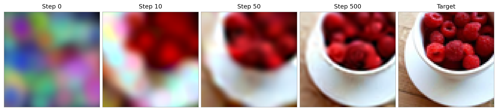
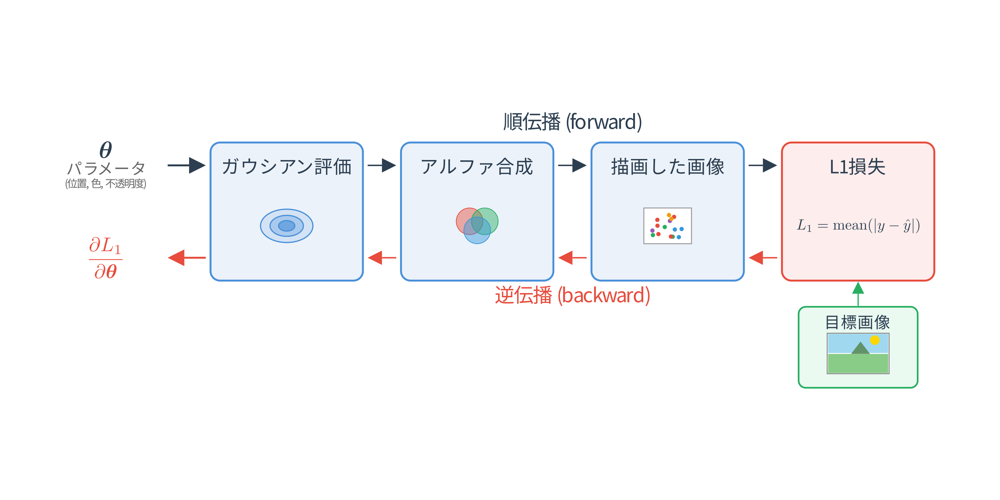
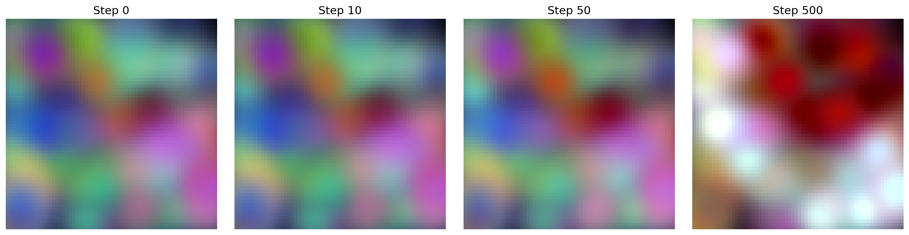
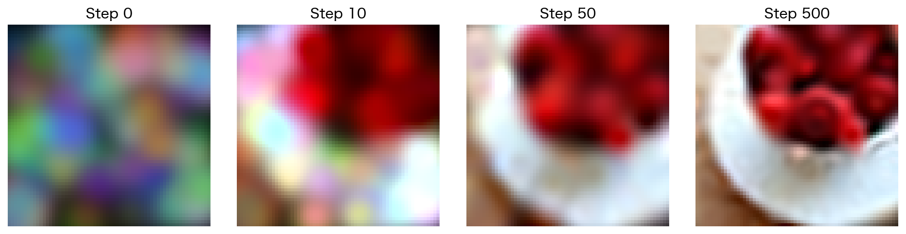
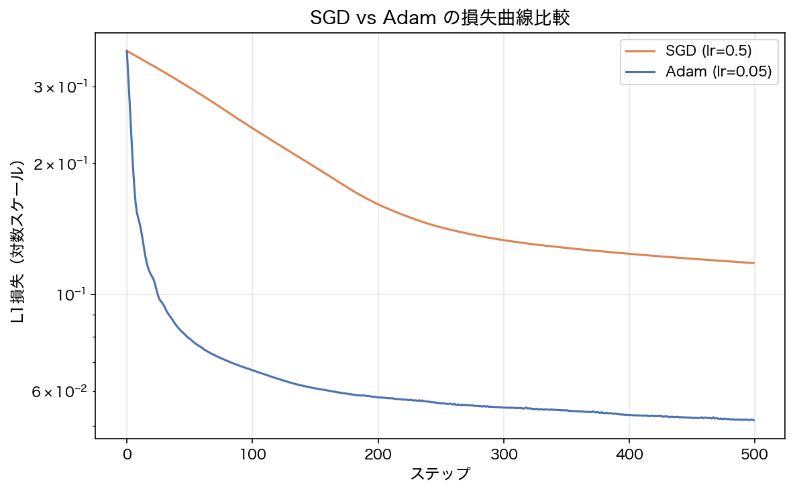
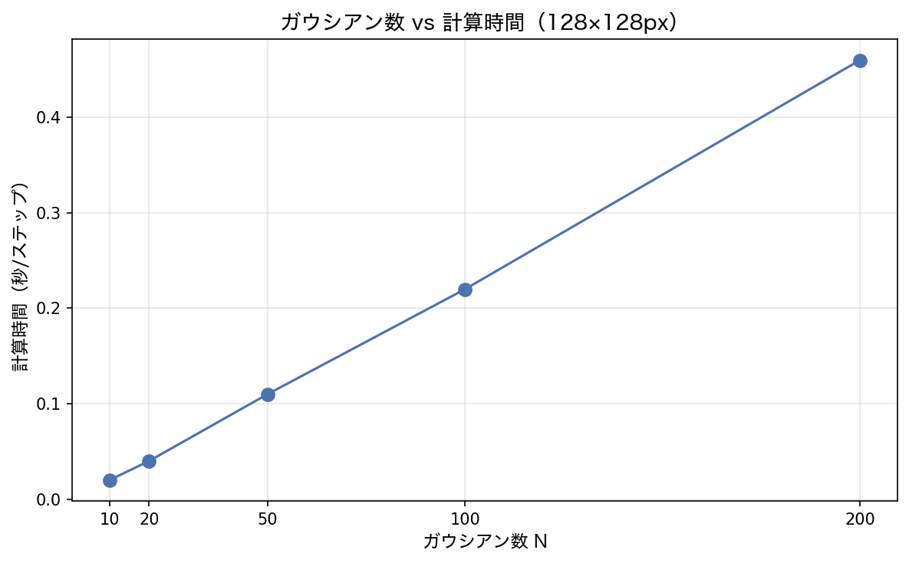

## この章で作るもの

第1〜2章で「ガウシアンを描く」方法を学び、第3〜4章で「勾配を自動計算する」エンジンを作りました。この章ではその2つを統合し、ガウシアンのパラメータを**自動で最適化**して目標画像に近づけます。つまり**学習**を体験します。

ランダムに配置された200個のガウシアンが、学習を繰り返すうちに目標画像（64x64ピクセルの写真）を再現していきます。図5.1の右端が目標画像で、左から右へ学習が進む様子を示しています。Step 0の初期状態ではランダムな位置・色のガウシアンが散らばっていますが、500ステップ後には目標画像にかなり近づいています。



この章は3DGSの学習パイプラインの2Dプロトタイプです。「損失の計算→勾配の逆伝播→パラメータの更新」という流れは、最終的に3Dガウシアンを学習する際もまったく同じです。

### 学習目標

- L1損失関数を定義し、自動微分で勾配を計算できる
- SGD/Adamオプティマイザを実装できる
- render.pyを`Tensor`対応に書き直し、逆伝播可能なレンダリングパイプラインを作れる
- 自動微分の計算グラフサイズとメモリの限界を体験する

### この章で作成・修正するファイル

| ファイル | 種別 | 内容 |
|---------|------|------|
| `loss.py` | 新規 | L1損失関数 |
| `optim.py` | 新規 | SGD, Adam オプティマイザ（リスト方式） |
| `render.py` | 修正 | `Tensor`版アルファ合成レンダラー **[v3]** を追加 |
| `autograd.py` | 修正 | `clear_graph` 関数を追加 |

### 前提知識

- 第1章: 2Dガウシアンの定義とパラメータ（位置、共分散行列、色）
- 第2章: front-to-backアルファ合成の仕組み
- 第4章: テンソル自動微分（要素単位演算、集約演算）

---

## 5.1 損失関数を定義する

### なぜ損失関数が必要なのか

「学習」とは、現在のパラメータで描画した画像と目標の画像を比べ、そのズレが小さくなる方向にパラメータを調整することです。このズレを数値化する関数が**損失関数**（loss function）です。

最もシンプルな損失関数が**L1損失**（Mean Absolute Error）です。描画した画像と目標画像の各ピクセルの差の絶対値を全ピクセル・全チャネルで足し合わせ、その平均を取ります。

$$
L_1 = \frac{1}{N} \sum_{i=1}^{N} |y_i - \hat{y}_i|
$$

ここで $y_i$ は目標画像のピクセル値、$\hat{y}_i$ は描画した画像のピクセル値、$N$ は全ピクセル数（高さ $\times$ 幅 $\times$ 3チャネル）です。

L1損失は `abs` 演算と `mean` 演算だけで計算できます。どちらも第4章で実装済みなので、新しい`Tensor`演算の追加は不要です。

### 実装

損失関数を管理する `loss.py` を新しく作成します。以下を `loss.py` に保存してください。

```python exec
"""
損失関数。
第5章: 2Dガウシアン画像フィッティング
"""

from autograd import Tensor


def l1_loss(predicted, target):
    """L1損失（平均絶対誤差）を計算する。

    L1損失 = mean(|predicted - target|)

    描画した画像と目標画像の各ピクセルの差の絶対値を平均します。

    Args:
        predicted: 描画した画像のTensor
        target: 目標画像のTensor（同じ形状）

    Returns:
        スカラーTensor（損失値）
    """
    diff = predicted - target
    return diff.abs().mean()
```

たった3行の関数ですが、`predicted - target` で `sub`、`.abs()` で `abs`、`.mean()` で `mean` と、3つの`Tensor`演算が連鎖しています。backwardを呼べば、これら全ての演算を逆にたどって勾配が計算されます。

### 動作確認

```python exec
import numpy as np
from autograd import Tensor
from loss import l1_loss

predicted = Tensor(np.array([0.3, 0.7, 0.5]), requires_grad=True)
target = Tensor(np.array([0.0, 1.0, 0.5]))
loss = l1_loss(predicted, target)
print(f"{loss.data:.1f}")
```

```text output
0.2
```

$|0.3 - 0.0| + |0.7 - 1.0| + |0.5 - 0.5| = 0.3 + 0.3 + 0.0 = 0.6$、平均すると $0.6 / 3 = 0.2$ です。

勾配も確認しましょう。

```python exec
loss.backward()
print(predicted.grad)
```

```text output
[ 0.33333333 -0.33333333  0.        ]
```

$0.3 > 0.0$ なので正方向のずれ → 勾配は正（減らすべき）。$0.7 < 1.0$ なので負方向のずれ → 勾配は負（増やすべき）。$0.5 = 0.5$ で差がゼロ → 勾配もゼロ。直感と一致しています。

---

## 5.2 ガウシアン評価を`Tensor`で書き直す

損失を計算するまでの流れを図5.2に示します。ガウシアンのパラメータ（位置、色、不透明度）をまとめて $\boldsymbol{\theta}$ と書きます。順伝播（forward）では $\boldsymbol{\theta}$ からガウシアンを評価し、アルファ合成で画像を描画し、目標画像との差から損失 $L_1$ を計算します。逆伝播（backward）では、損失から逆向きに計算をたどり、各パラメータの勾配 $\frac{\partial L_1}{\partial \boldsymbol{\theta}}$ を求めます。



勾配は「その方向にパラメータを動かすと損失が増える」方向を指しています。したがって、勾配の逆方向にパラメータを少しずつ動かせば、損失は小さくなり、描画結果は目標画像に近づいていきます。

逆伝播が機能するには、順伝播の全ての演算が計算グラフに記録されている必要があります。しかし、第1〜2章で作った描画パイプラインはNumPyで書かれているため、計算グラフが構築されません。そこで、描画パイプラインの全てを`Tensor`演算で書き直します。描画パイプラインは2つの部分からできていました。

1. **ガウシアン評価**（第1章）: 各ピクセルでガウシアンの強度 $G(x)$ を計算する
2. **アルファ合成**（第2章）: 複数のガウシアンの色を前後関係を考慮して合成する

この節ではまずガウシアン評価を`Tensor`化し、次の5.3節でアルファ合成を`Tensor`化します。

### 第1章の復習: ガウシアン評価

第1章で実装した `evaluate_gaussian` を振り返りましょう。この関数は、各ピクセル $\mathbf{x}$ でのガウシアン値を次の式で計算します（式(1.2)の再掲）。

$$
G(\mathbf{x}) = \exp\!\left(-\frac{1}{2} (\mathbf{x} - \boldsymbol{\mu})^\top \Sigma^{-1} (\mathbf{x} - \boldsymbol{\mu})\right)
$$

$(\mathbf{x} - \boldsymbol{\mu})^\top \Sigma^{-1} (\mathbf{x} - \boldsymbol{\mu})$ はマハラノビス距離の二乗です。中心 $\boldsymbol{\mu}$ からの距離を共分散行列 $\Sigma$ で「楕円的に」測り、距離が大きいほど指数関数で急速にゼロに近づきます。第1章ではこれをNumPy配列で実装し、全ピクセルを一括で計算していました。

### 評価関数の設計方針

この `evaluate_gaussian` を`Tensor`演算で書き直します。関数に登場するパラメータは中心座標 `mean` と共分散行列 `cov` の2つです。この章では `cov` は固定値として扱い、`mean` だけを学習対象にします。`cov` の最適化は第6章以降で扱いますが、そのときに勾配が `cov` まで流れるよう、逆行列 $\Sigma^{-1}$ の計算も`Tensor`演算で書いておきます。

この方針に沿って、本節では次の2つを順番に作ります。

1. **2x2 逆行列を`Tensor`演算で計算する補助関数** `invert_2x2_tensor`
2. **マハラノビス距離を`Tensor`演算で計算する本体** `evaluate_gaussian_tensor`

### 2x2 逆行列の`Tensor`版

まず、2x2 逆行列を`Tensor`演算で求める補助関数 `invert_2x2_tensor` を用意します。2x2 行列 $\Sigma = \begin{pmatrix} a & b \\ c & d \end{pmatrix}$ の逆行列は、第1章の補足で紹介した公式で求められます。

$$
\Sigma^{-1} = \frac{1}{ad - bc} \begin{pmatrix} d & -b \\ -c & a \end{pmatrix}
$$

右辺に登場するのは四則演算と、`(2, 2)` の行列を構成するための要素の取り出し・結合だけです。要素の取り出しには第4章で追加したインデクシング `t[0, 0]`、結合には `stack` を使います。

`render.py` の末尾に以下を追加します。

```python exec file=render.py mode=append
# render.py（追記）
# 冒頭の import に stack を追加
# from autograd import Tensor, stack

def invert_2x2_tensor(mat):
    """2x2 Tensor行列の逆行列をTensor演算で計算する。

    NumPyのnp.linalg.invを使うと勾配パスが切れるため、
    Tensor演算で逆行列を構築して勾配を流す。

    2x2行列 [[a, b], [c, d]] の逆行列は:
        1/(ad - bc) * [[d, -b], [-c, a]]
    """
    a = mat[0, 0]
    b = mat[0, 1]
    c = mat[1, 0]
    d = mat[1, 1]

    det = a * d - b * c

    row0 = stack([d / det, -b / det], axis=0)
    row1 = stack([-c / det, a / det], axis=0)
    return stack([row0, row1], axis=0)
```

NumPy の `np.linalg.inv` と結果が一致するか確認しましょう。

```python exec
import numpy as np
from autograd import Tensor
from render import invert_2x2_tensor

m = np.array([[3.0, 1.0], [0.5, 2.0]])
inv = invert_2x2_tensor(Tensor(m))
print(np.allclose(inv.data, np.linalg.inv(m)))
```

```text output
True
```

### マハラノビス距離の`Tensor`化

逆行列 $\Sigma^{-1}$ が`Tensor`で得られたので、残るはマハラノビス距離の二乗 $\mathbf{d}^\top \Sigma^{-1} \mathbf{d}$ の計算です（$\mathbf{d} = \mathbf{x} - \boldsymbol{\mu}$）。この式には行列積が含まれますが、`Tensor`クラスには行列積の演算（`matmul`）がまだありません（第6章で追加します）。そこで、**要素ごとの掛け算 `*` と `.sum`** の組み合わせで行列積を代用します。

まず1ピクセルの場合で考えてみましょう。数学上の行列積 $\Sigma^{-1} \mathbf{d}$ を、NumPyの配列操作で再現します。

具体例として $\Sigma^{-1} = \begin{pmatrix} 2 & 1 \\ 1 & 3 \end{pmatrix}$、$\mathbf{d} = (\mathbf{x} - \boldsymbol{\mu}) = \begin{pmatrix} 4 \\ 5 \end{pmatrix}$ とします。数学の行列積 $\Sigma^{-1} \mathbf{d}$ の結果は $\begin{pmatrix} 2 \times 4 + 1 \times 5 \\ 1 \times 4 + 3 \times 5 \end{pmatrix} = \begin{pmatrix} 13 \\ 19 \end{pmatrix}$ です。

同じ結果をNumPyの要素積 + sum で得てみます。NumPy上では $\mathbf{d}$ は `d = np.array([4, 5])` という形状 `(2,)` の1次元配列、$\Sigma^{-1}$ は形状 `(2, 2)` の2次元配列です。

**ステップ1**: `d` を `d.reshape(2, 1)` で2行1列に変形します。

**ステップ2**: `d.reshape(2, 1) * cov_inv` を計算します。形状 `(2, 1)` と `(2, 2)` の掛け算なので、NumPyのブロードキャストが働き、`(2, 1)` の各行が列方向にコピーされてから要素ごとに掛け算されます。この要素ごとの掛け算を**アダマール積**（記号 $\odot$）といいます。

$$
\begin{pmatrix} 4 & 4 \\ 5 & 5 \end{pmatrix} \odot \begin{pmatrix} 2 & 1 \\ 1 & 3 \end{pmatrix} = \begin{pmatrix} 8 & 4 \\ 5 & 15 \end{pmatrix}
$$

**ステップ3**: `.sum(axis=0)` で縦方向（行方向）に合計すると `[8+5, 4+15] = [13, 19]` になります。行列積 $\Sigma^{-1} \mathbf{d}$ と同じ結果です。この結果を `transformed` と呼ぶことにします。

**ステップ4**: マハラノビス距離の二乗は $\mathbf{d}^\top \Sigma^{-1} \mathbf{d}$ でした。$\Sigma^{-1} \mathbf{d}$ が `transformed` として求まったので、あとは `d` と `transformed` の内積を取れば完成です。内積もステップ2-3と同じように要素積 + sum で計算できます。`[4, 5] * [13, 19] = [52, 95]` を合計して `147` がマハラノビス距離の二乗です。

ここまでは1ピクセルだけで考えていましたが、実際には $H \times W$ 個の全ピクセルで同じ計算を一括で行います。全ピクセルの差分ベクトルをまとめると `diff` の形状は `(H*W, 2)` になります。axis=0がピクセル、axis=1が2次元座標です。

1ピクセルのときは `(2,)` → `(2, 1)` にreshapeしましたが、先頭にピクセル軸があるので `(H*W, 2)` → `(H*W, 2, 1)` にreshapeします。$\Sigma^{-1}$ は全ピクセルで共通なので、`(2, 2)` → `(1, 2, 2)` にreshapeしてピクセル軸方向にブロードキャストさせます。掛け算の結果は `(H*W, 2, 2)` になり、1ピクセルのときは `.sum(axis=0)` で縦方向に合計しましたが、今はaxis=0がピクセル軸なので、2次元座標の軸である `.sum(axis=1)` で合計します。ここまでで `transformed` の形状は `(H*W, 2)` です。

最後に `diff` と `transformed` の内積を取ります。どちらも `(H*W, 2)` なので、要素積 `diff * transformed` で `(H*W, 2)` になり、`.sum(axis=1)` で2次元座標の軸を合計すると `(H*W,)` のマハラノビス距離の二乗が得られます。

### `evaluate_gaussian_tensor` の実装

`invert_2x2_tensor` とマハラノビス距離の計算を組み合わせて `evaluate_gaussian_tensor` を作ります。`render.py` の末尾に続けて追加します。

```python exec file=render.py mode=append
# render.py（追記）

def evaluate_gaussian_tensor(pixels, mean, cov):
    """Tensor版ガウシアン評価関数。

    第1章で使った距離計算（マハラノビス距離）をTensor演算で計算して
    ガウシアン値を返します。2x2逆行列もTensor演算で構築するので、
    mean と cov の両方に勾配が自動微分で流れます。

    Args:
        pixels: (H*W, 2) ピクセル座標の np.ndarray（定数）
        mean: (2,) 中心座標の Tensor
        cov: (2, 2) 共分散行列の Tensor

    Returns:
        (H*W,) 各ピクセルでのガウシアン値の Tensor
    """
    P = pixels.shape[0]

    # 2x2 逆行列を Tensor 演算で計算し、共分散まで勾配を流す
    cov_inv = invert_2x2_tensor(cov)

    # 差分ベクトル: (H*W, 2)
    diff = Tensor(pixels) - mean.reshape(1, 2)  # ブロードキャスト

    # 要素積 + sum で行列積を代用
    diff_col = diff.reshape(P, 2, 1)     # (H*W, 2, 1)
    cov_inv_b = cov_inv.reshape(1, 2, 2)  # (1, 2, 2)
    transformed = (diff_col * cov_inv_b).sum(axis=1)  # (H*W, 2)
    mahal = (diff * transformed).sum(axis=1)           # (H*W,)

    return (mahal * (-0.5)).exp()
```

## 5.3 アルファ合成を`Tensor`で書き直す

### 第2章の復習: アルファ合成

ガウシアン評価を`Tensor`化できたので、次はアルファ合成です。第2章で実装した `render_gaussians_alpha_composite` の合成式を振り返りましょう。ガウシアンを深度の手前から順に処理し、各ピクセルの色を次のように計算しました。

$$
\mathbf{C}(\mathbf{x}) = \sum_{i=1}^{N} \alpha_i(\mathbf{x}) \cdot \mathbf{c}_i \cdot T_i(\mathbf{x}), \quad T_i(\mathbf{x}) = \prod_{j=1}^{i-1} (1 - \alpha_j(\mathbf{x}))
$$

$\mathbf{c}_i$ はガウシアン $i$ の色（RGB）、$\alpha_i(\mathbf{x})$ はそのピクセルでの不透明度 $\times$ ガウシアン値（式(1.6)で定義）、$T_i(\mathbf{x})$ は累積透過率（手前のガウシアンをどれだけ透過してきたか）です。手前のガウシアンが不透明なほど $T_i(\mathbf{x})$ は小さくなり、奥のガウシアンの寄与が減ります。この式をfront-to-backのループで実装したのが `render_gaussians_alpha_composite` でした。

式に登場する $\mathbf{c}_i$（色）と不透明度は、ガウシアン評価の節で扱った中心座標 $\boldsymbol{\mu}$ と合わせて、この章で学習するパラメータです。まとめると、学習対象は **中心座標・色・不透明度** の3つで、共分散と深度は固定です。これらのパラメータに勾配が流れるよう、合成処理全体を`Tensor`化します。

### アルファ合成の`Tensor`化

第2章で実装した `render_gaussians_alpha_composite` を`Tensor`演算で書き直します。処理の流れは第2章と同じで、ガウシアンを深度の手前から順にループし、各ガウシアンについて「ガウシアン値の計算 → 不透明度との掛け算 → 色の寄与を加算 → 累積透過率の更新」を繰り返します。違いは全ての演算を`Tensor`で行うことで、backwardで勾配が計算できるようになる点です。

`render.py` の末尾に続けて追加します。

```python exec file=render.py mode=append
def render_gaussians_alpha_composite_tensor(
        means, covs, colors, opacities, depths,
        H, W, bg_color=(0, 0, 0)):
    """[v3] Tensor版アルファ合成レンダラー。

    全ての計算がTensor演算で行われるため、backwardで勾配を計算できます。
    形状は (N, H*W) を標準として、ガウシアン軸（axis=0）でループします。

    Args:
        means: Tensor のリスト。各要素は (2,) の中心座標
        covs: Tensor のリスト。各要素は (2, 2) の共分散行列
        colors: Tensor のリスト。各要素は (3,) のRGB色
        opacities: Tensor のリスト。各要素は () のスカラー不透明度
        depths: float のリスト。深度値（ソート用、勾配不要）
        H: 画像の高さ（ピクセル）
        W: 画像の幅（ピクセル）
        bg_color: 背景色 (R, G, B)。値域 [0, 1]

    Returns:
        (H, W, 3) のRGB画像 Tensor
    """
    # ピクセル座標グリッドを生成（定数）
    ys, xs = np.mgrid[0:H, 0:W]
    pixels = np.stack([xs.ravel(), ys.ravel()], axis=1).astype(np.float64)
    P = H * W  # ピクセル数

    # 深度順にソート（インデックスを返す）
    order = sorted(range(len(depths)), key=lambda i: depths[i])

    # front-to-back アルファ合成（ループ版）
    image = Tensor(np.zeros((P, 3)))  # 蓄積される色
    T = Tensor(np.ones(P))            # 累積透過率

    for i in order:
        # ガウシアン値を計算: (H*W,)
        gauss_val = evaluate_gaussian_tensor(pixels, means[i], covs[i])

        # alpha_i = opacity * ガウシアン値: (H*W,)
        alpha = opacities[i] * gauss_val

        # 色の寄与: c_i * alpha_i * T
        # alpha * T の形状は (H*W,)、reshape で (H*W, 1) にして色 (3,) とブロードキャスト
        weight = (alpha * T).reshape(P, 1)  # (H*W, 1)
        image = image + weight * colors[i]  # (H*W, 3)

        # 累積透過率の更新: T *= (1 - alpha)
        T = T * (Tensor(np.ones(P)) - alpha)

    # 背景色を加算
    bg = Tensor(np.array(bg_color, dtype=np.float64))
    image = image + T.reshape(P, 1) * bg

    return image.reshape(H, W, 3)
```

コードの流れを上から順に見ていきましょう。

まずピクセル座標の生成と深度ソートを行います。ここは第2章と同じです。`image`（蓄積される色）を `(H*W, 3)` のゼロ行列、`T`（累積透過率）を `(H*W,)` の全1ベクトルで初期化します。

ループの中核は第2章と同じ2つの処理です。

- `image = image + weight * colors[i]` … 式(2.1)の $\mathbf{c}_i \cdot \alpha_i(\mathbf{x}) \cdot T_i(\mathbf{x})$ を蓄積
- `T = T * (Tensor(np.ones(P)) - alpha)` … 式(2.2)の $T_{i+1} = T_i \cdot (1 - \alpha_i)$ で累積透過率を更新

第2章では `image +=` や `T *=` と書いていましたが、`Tensor`の `+=` は計算グラフに記録されないため、`image = image + ...` のように新しい`Tensor`を作る形に変えています。

`weight` の計算では、`alpha * T` の形状 `(H*W,)` を `(H*W, 1)` にreshapeしてから `colors[i]` の `(3,)` とブロードキャストしています。これも第2章の `[:, np.newaxis]` と同じパターンで、各ピクセルの重みをRGB3チャネルに適用します。

ループ終了後、残った透過率 `T` に背景色を掛けて加算し、`(H*W, 3)` を `(H, W, 3)` にreshapeして画像として返します。

コードに登場する変数の形状と種別を整理しておきます。図5.2で見たように、逆伝播で勾配を求めるには、学習対象のパラメータから損失までの全ての演算が計算グラフでつながっている必要があります。途中にNumPyの演算が1つでも挟まると、そこで計算グラフが途切れて勾配が届かなくなります。そのため、中間変数（`gauss_val`, `alpha`, `T`, `image` 等）も全てTensorとして計算しています。一方、勾配が不要な定数（`pixels`, `bg`）はNumPy配列のままです。なお、形状の `H*W` は画像の `(H, W)` を1次元に平坦化したもので、最後に `(H, W, 3)` にreshapeして画像に戻します。

| 変数名 | 種別 | 形状 | 内容 |
|---------|------|------|------|
| `means[i]` | Tensor | `(2,)` | $\boldsymbol{\mu}_i$: 中心座標（学習対象） |
| `covs[i]` | Tensor | `(2, 2)` | $\Sigma_i$: 共分散行列（この章では固定） |
| `colors[i]` | Tensor | `(3,)` | $\mathbf{c}_i$: 色（学習対象） |
| `opacities[i]` | Tensor | `()` | 不透明度（学習対象） |
| `pixels` | NumPy | `(H*W, 2)` | 全ピクセルの座標（定数） |
| `image` | Tensor | `(H*W, 3)` | 蓄積される色（ゼロで初期化） |
| `T` | Tensor | `(H*W,)` | 累積透過率 $T_i(\mathbf{x})$（1で初期化） |
| `gauss_val` | Tensor | `(H*W,)` | ガウシアン値 $G_i(\mathbf{x})$ |
| `alpha` | Tensor | `(H*W,)` | $\alpha_i(\mathbf{x})$ = 不透明度 × ガウシアン値 |
| `weight` | Tensor | `(H*W, 1)` | `(alpha * T).reshape(P, 1)` |
| `bg` | NumPy | `(3,)` | 背景色（定数） |

### 動作確認

`Tensor`版レンダラーが第2章のNumPy版と同じ結果を返すか確認しましょう。

```python exec
import numpy as np
from autograd import Tensor
from gaussian2d import Gaussian2D, build_covariance_2d
from render import render_gaussians_alpha_composite, render_gaussians_alpha_composite_tensor

H, W = 16, 16
cov = build_covariance_2d(5, 5, 0)

# NumPy版（第2章）
g1 = Gaussian2D(mean=[8, 8], covariance=cov, color=[1, 0, 0], opacity=0.9, depth=0)
g2 = Gaussian2D(mean=[10, 10], covariance=cov, color=[0, 0, 1], opacity=0.9, depth=1)
image_np = render_gaussians_alpha_composite([g1, g2], H, W)

# Tensor版
means = [Tensor(np.array([8.0, 8.0])), Tensor(np.array([10.0, 10.0]))]
covs = [Tensor(cov), Tensor(cov)]
colors = [Tensor(np.array([1.0, 0.0, 0.0])), Tensor(np.array([0.0, 0.0, 1.0]))]
opacities = [Tensor(np.array(0.9)), Tensor(np.array(0.9))]
depths = [0.0, 1.0]
image_tensor = render_gaussians_alpha_composite_tensor(means, covs, colors, opacities, depths, H, W)

diff = np.abs(image_np - image_tensor.data).max()
print(f"最大差: {diff:.10f}")
```

```text output
最大差: 0.0000000000
```

NumPy版と`Tensor`版が完全に一致することを確認できました。

---

## 5.4 SGDオプティマイザの実装

### 勾配降下法のおさらいと複数パラメータへの拡張

第3章では、スカラー1つのパラメータ $x$ に対する勾配降下法を学びました。

$$
x \leftarrow x - \eta \cdot \frac{df(x)}{dx}
$$

今回は複数のガウシアンを使い、それぞれの位置・色・不透明度を学習するので、更新対象のパラメータが多数あります。とはいえ、やることは第3章と同じで、各パラメータについて「勾配の逆方向に学習率の分だけ動かす」を繰り返すだけです。パラメータが $\theta_1, \theta_2, \dots, \theta_M$ の $M$ 個あるなら、それぞれに同じ更新則を適用します。

$$
\theta_j \leftarrow \theta_j - \eta \cdot \frac{\partial L}{\partial \theta_j} \quad (j = 1, 2, \dots, M)
$$

これらをまとめてベクトル $\boldsymbol{\theta} = (\theta_1, \dots, \theta_M)$ と書くと、よりコンパクトに表現できます。$\nabla L(\boldsymbol{\theta})$（ナブラ $L$）は各パラメータの偏微分を並べたベクトル（勾配ベクトル）です。

$$
\boldsymbol{\theta} \leftarrow \boldsymbol{\theta} - \eta \cdot \nabla L(\boldsymbol{\theta}), \quad \nabla L(\boldsymbol{\theta}) = \left(\frac{\partial L}{\partial \theta_1}, \dots, \frac{\partial L}{\partial \theta_M}\right)
$$

見た目は変わりましたが、中身は上の各パラメータごとの更新則をまとめて書いただけです。

### 実装

この更新則をクラスとしてまとめたものが**オプティマイザ**（optimizer、最適化器）です。ここでは最もシンプルなオプティマイザである**SGD**（Stochastic Gradient Descent、確率的勾配降下法）を実装します。

> **補足**: 「確率的」とは本来、全データではなくランダムに選んだ一部（ミニバッチ）で勾配を近似することを指します。今回の実装では毎ステップ全ピクセルを使って損失を計算するので、厳密には単なる勾配降下法です。しかしPyTorchをはじめ多くのフレームワークでこの名前が使われているため、本教材でもSGDと呼ぶことにします。

新しく `optim.py` を作成し、以下を保存します。

```python exec file=optim.py
"""
オプティマイザ: SGD と Adam。
第5章: 2Dガウシアン画像フィッティング
"""

import numpy as np


class SGD:
    """確率的勾配降下法（SGD）。

    最も基本的な最適化手法。パラメータを勾配の逆方向に更新します。

        param.data -= lr * param.grad

    Args:
        params: 最適化対象の Tensor のリスト
        lr: 学習率（デフォルト 0.01）
    """

    def __init__(self, params, lr=0.01):
        self.params = params
        self.lr = lr

    def step(self):
        """パラメータを1ステップ更新する。"""
        for p in self.params:
            if p.grad is not None:
                p.data -= self.lr * p.grad

    def zero_grad(self):
        """全パラメータの勾配をゼロクリアする。"""
        for p in self.params:
            p.zero_grad()
```

`step()` メソッドの中身は `p.data -= self.lr * p.grad` の1行だけです。勾配の逆方向にパラメータを動かしています。

### 動作確認

```python exec
import numpy as np
from autograd import Tensor
from optim import SGD

p = Tensor(np.array([5.0, 3.0]), requires_grad=True)
p.grad = np.array([1.0, -2.0])

sgd = SGD([p], lr=0.1)
sgd.step()
print(p.data)
```

```text output
[4.9 3.2]
```

勾配が正の方向（1.0）のパラメータは減少し、勾配が負の方向（-2.0）のパラメータは増加しています。

---

## 5.5 計算グラフの解放

学習ループでは `backward()` を繰り返し呼びます。自動微分エンジンでは、各 `Tensor` が `_backward` クロージャと `_prev` 集合で計算グラフの参照を保持しています。`backward()` を呼んだ後もこれらの参照は自動的には解放されないため、イテレーションを重ねるたびに中間ノードが蓄積してメモリを圧迫します。

この問題を防ぐため、backward完了後に計算グラフの参照を解放する `clear_graph` 関数を作ります。`autograd.py` の末尾に追加します。

```python exec file=autograd.py mode=append
def clear_graph(tensor):
    """backward後に計算グラフの参照を解放してメモリリークを防ぐ。

    Args:
        tensor: backward() を呼んだ後の出力Tensor（通常は損失）
    """
    visited = set()

    def _clear(v):
        if v not in visited:
            visited.add(v)
            for p in v._prev:
                _clear(p)
            v._backward = lambda: None
            v._prev = set()

    _clear(tensor)
```

引数の `tensor` には `backward()` を呼んだ後の `Tensor`（つまり `loss`）を渡します。そこから `_prev` をたどって計算グラフの全ノードを再帰的に訪問し、各ノードの `_backward` と `_prev` をクリアします。`visited` は同じノードを二重に訪問しないための記録です。`backward()` が完了した時点で勾配は各ノードの `.grad` に格納済みなので、計算グラフの情報（`_backward` と `_prev`）はもう不要です。次のイテレーションの順伝播で新しい計算グラフが作られるため、古いグラフを安全に解放できます。

> **発展: なぜ `visited` が必要なのか**
>
> 計算グラフでは、1つの `Tensor` が複数の演算で使われると、複数のノードの `_prev` に同じ `Tensor` が入ります。アルファ合成のループで具体的に見てみましょう。
>
> ```
> alpha = opacities[i] * gauss_vals     ... (A)
> contribution = colors[i] * alpha      ... (B)
> image = image + contribution * T      ... (C)
> T = T * (1 - alpha)                   ... (D)
> ```
>
> `alpha` は (B) と (D) の両方で使われるので、(B) の結果ノードと (D) の結果ノードの `_prev` に同じ `alpha` が入ります。同様に `T` も (C) と (D) の両方で参照されます。`loss` から `_prev` を逆にたどると、(C) 経由と (D) 経由の2つのルートで同じ `alpha` や `T` に到達します。`visited` がないとそこから先を2回たどることになり、これがガウシアンごとに積み重なって処理が大幅に遅くなります。

---

## 5.6 最適化ループを回す

### 目標画像の準備

学習の目標として、実際の写真を使います。`target.png` は64x64ピクセルの小さな写真です。

<figure>

<figcaption>図5.3: 目標画像（64x64ピクセル）</figcaption>
</figure>

新しく `fit_image.py` を作成し、以下を保存します。

```python exec file=fit_image.py
import numpy as np
from PIL import Image

H, W = 64, 64
target_image = np.array(Image.open("target.png")).astype(np.float64) / 255.0
```

Pillow（`PIL`）はPythonの画像読み込みライブラリです。`Image.open` で画像ファイルを読み込み、`np.array` でNumPy配列に変換すると、各ピクセルのRGB値が0〜255の整数として格納された形状 `(H, W, 3)` の配列になります（3はRGBの3チャネル）。`/ 255.0` で割ることで0.0〜1.0の浮動小数点数に変換しています。これは第1章以来使ってきた色の表現（0.0〜1.0）に合わせるためです。つまり `target_image` は形状 `(64, 64, 3)` で値が0.0〜1.0の配列です。

### 学習パラメータの初期化

学習を始めるには、各ガウシアンのパラメータに何かしらの初期値を与える必要があります。目標画像のどこにどんな色のガウシアンを置けばよいかは事前には分からないので、ランダムな値で初期化し、学習によって正しい値を見つけさせます。写真を近似するにはそれなりの数のガウシアンが必要なので、N=200とします。

各パラメータを `Tensor` として作成し、`requires_grad=True` を指定して勾配計算の対象にします。共分散と深度は固定値なので `requires_grad` を指定しません。`fit_image.py` の続きに以下を追加します。

```python exec file=fit_image.py mode=append
from autograd import Tensor
from gaussian2d import build_covariance_2d

np.random.seed(42)
N = 200

means = [
    Tensor(np.random.rand(2) * np.array([W, H]), requires_grad=True)
    for _ in range(N)
]
covs = [Tensor(build_covariance_2d(5, 5, 0)) for _ in range(N)]  # 固定
colors = [Tensor(np.random.rand(3), requires_grad=True) for _ in range(N)]
opacities = [Tensor(np.array(0.5), requires_grad=True) for _ in range(N)]
depths = [float(i) for i in range(N)]
```

### 学習ループ

学習の1ステップは5つの処理で構成されます。

1. **勾配をゼロクリア**: 前回の勾配が残っていると加算されてしまうため
2. **順伝播**: ガウシアンを描画して画像を作り、損失を計算する
3. **逆伝播**: backwardで全パラメータの勾配を計算する
4. **計算グラフの解放**: 5.5節の `clear_graph` で中間ノードの参照を解放する
5. **パラメータ更新**: オプティマイザで勾配方向にパラメータを動かす

`fit_image.py` の続きに以下を追加します。

```python exec file=fit_image.py mode=append
from autograd import clear_graph
from render import render_gaussians_alpha_composite_tensor
from loss import l1_loss
from optim import SGD

# Pythonのリスト同士の + は結合です。200個+200個+200個 = 600個のTensorからなる1つのリストになります。
params = means + colors + opacities
optimizer = SGD(params, lr=0.5)  # 5.4節で実装
target = Tensor(target_image)

for step in range(501):
    # 1. 勾配をゼロクリア
    optimizer.zero_grad()

    # 2. 順伝播: 描画 → 損失計算
    pred = render_gaussians_alpha_composite_tensor(  # 5.3節で実装
        means, covs, colors, opacities, depths, H, W
    )
    loss = l1_loss(pred, target)  # 5.1節で実装

    # 3. 逆伝播
    loss.backward()

    # 4. 計算グラフの解放
    clear_graph(loss)  # 5.5節で実装

    # 5. パラメータ更新
    optimizer.step()

    if step % 100 == 0:
        # 描画結果を画像として保存
        img = np.clip(pred.data.reshape(H, W, 3), 0, 1)
        Image.fromarray((img * 255).astype(np.uint8)).save(f"sgd_step{step:03d}.png")
        print(f"Step {step:4d}: loss = {loss.data:.6f} -> sgd_step{step:03d}.png")
```

500ステップの実行には数分かかります（環境にもよりますが、1ステップ0.3〜1秒程度です）。100ステップごとに描画結果が画像ファイルとして保存されるので、学習の進み具合を目で確認できます。出力値は環境によって多少異なりますが、おおよそ以下のような傾向になります。

```
Step    0: loss = 0.322477 -> sgd_step000.png
Step  100: loss = 0.231986 -> sgd_step100.png
Step  200: loss = 0.171747 -> sgd_step200.png
Step  300: loss = 0.144383 -> sgd_step300.png
Step  400: loss = 0.135416 -> sgd_step400.png
Step  500: loss = 0.129008 -> sgd_step500.png
```



図5.4はSGDでの学習過程を示しています。500ステップ経過しても目標画像（図5.3）にはまだ遠く、全体的にぼやけた状態です。損失の数値を見ても、下がり方が遅く、ある程度のところで停滞しています。学習率を0.5と通常よりかなり大きく設定していますが、SGDでは学習率が唯一の調整パラメータなので、収束を速めるにはこれ以上大きくするしかありません。しかし大きすぎると発散するため、0.5がこの問題設定でのギリギリの値です。全てのパラメータに同じ学習率を使うので、パラメータの種類ごとに適切な更新量が異なる場合にも対応できません。

> **補足**: 色と不透明度は本来 $[0, 1]$ の範囲に収まるべき値ですが、勾配更新によってこの範囲を超えてしまう場合があります。超えても学習が大きく破綻するわけではありませんが、不自然な描画の原因になります。第6章でシグモイド関数を使ってパラメータの値域を制約する仕組みを導入します。

---

## 5.7 Adamオプティマイザの実装

### SGDの限界

SGDには2つの問題があります。

1つ目は**学習率の調整が難しい**ことです。学習率が大きすぎると最適値を飛び越えて発散し、小さすぎると収束が非常に遅くなります。ちょうどよい値を見つけても、学習の進行に伴って適切な学習率は変化するため、固定値では対応しきれません。

2つ目は**すべてのパラメータに同じ学習率が適用される**ことです。位置（mean）、色（color）、不透明度（opacity）は値のスケールが全く異なるため、本来はパラメータの種類ごとに学習率を変えたいところです。しかしSGDでは一律の学習率しか設定できません。

これらの問題を解決するのが**Adam**（Adaptive Moment Estimation）です。

### Adamのアイデア

Adamは過去の勾配の履歴から、2つの統計量を追跡します。

1. **1次モーメント** $m$（勾配の移動平均）: 過去の勾配を平均して、更新方向を滑らかにする。SGDは毎ステップの勾配をそのまま使うため更新方向がブレやすいが、移動平均をとることで安定する
2. **2次モーメント** $v$（勾配の二乗の移動平均）: パラメータごとに「勾配が普段どのくらいの大きさか」を追跡する

具体的な更新式を見ていきましょう。ステップ $t$ での勾配を $g_t = \frac{\partial L}{\partial \boldsymbol{\theta}}\big|_{t}$ と書きます。2つのモーメントは、過去の値と今回の勾配の加重平均で更新します。

$$
m_t = \beta_1 \cdot m_{t-1} + (1 - \beta_1) \cdot g_t
$$

$$
v_t = \beta_2 \cdot v_{t-1} + (1 - \beta_2) \cdot g_t^2
$$

$\beta_1 = 0.9$、$\beta_2 = 0.999$ が標準的な設定です。$\beta$ は「過去の履歴をどれだけ重視するか」の割合で、1に近いほど長い履歴を平均し、0に近いほど直近の勾配だけを見ます。

この2つのモーメントを使って、パラメータを次のように更新します。

$$
\boldsymbol{\theta}_t = \boldsymbol{\theta}_{t-1} - \eta \cdot \frac{\hat{m}_t}{\sqrt{\hat{v}_t} + \epsilon}
$$

$\hat{m}_t$、$\hat{v}_t$ は $m_t$、$v_t$ に補正をかけたもので、詳細は後述します。分子の $\hat{m}_t$ は勾配の移動平均で、更新の方向を決めます。分母の $\sqrt{\hat{v}_t}$ はそのパラメータの勾配の「普段の大きさ」です。$\epsilon = 10^{-8}$ はゼロ除算を防ぐための微小値です。

この更新式のポイントは、勾配を $\sqrt{\hat{v}_t}$（普段の大きさ）で割っている部分です。なぜこうするのでしょうか。

勾配の大きさは、損失がそのパラメータにどれだけ敏感かを表しています。例えば位置パラメータの勾配が100だとすると、これは位置を少し動かすだけで損失が大きく変わるという意味です。敏感なパラメータは慎重に小さく動かす必要があります。逆に、色パラメータの勾配が0.001であれば、損失は色の変化にほとんど反応しないので、大きく動かさないと学習が進みません。

$\sqrt{\hat{v}_t}$ で割る操作は、この感度の違いを自動的に調整します。勾配が普段100程度の位置パラメータは大きな $\sqrt{\hat{v}_t}$ で割られて控えめに更新され、勾配が普段0.001程度の色パラメータは小さな $\sqrt{\hat{v}_t}$ で割られて大きめに更新されます。各パラメータの感度が正規化されるため、1つの学習率 $\eta$ ですべてのパラメータをバランスよく更新できます。

更新式の $\hat{m}_t$、$\hat{v}_t$ は $m_t$、$v_t$ に**バイアス補正**をかけたものです。

$m$ と $v$ はゼロで初期化します。しかし移動平均は過去の値を重視する式なので、ゼロからスタートすると学習初期は値が本来より小さくなってしまいます。この「ゼロ初期化による過小評価」がバイアス（偏り）です。

具体的に見てみましょう。$t=1$ で勾配 $g_1$ が来たとき、$m_0 = 0$ なので $m_1 = 0.9 \times 0 + 0.1 \times g_1 = 0.1 \cdot g_1$ です。本来の勾配の10%しかありません。そこで $1 - \beta_1^t$ で割って補正します。

$$
\hat{m}_t = \frac{m_t}{1 - \beta_1^t}, \quad \hat{v}_t = \frac{v_t}{1 - \beta_2^t}
$$

$t=1$ の場合、$\hat{m}_1 = \frac{0.1 \cdot g_1}{1 - 0.9^1} = \frac{0.1 \cdot g_1}{0.1} = g_1$ となり、元の大きさに戻ります。$t$ が大きくなると $\beta^t \to 0$ で分母が1に近づくため、$m_t$ 自体が十分な履歴を反映するようになり、補正の影響は自然に消えます。

### 実装

`optim.py` の `SGD` クラスの後に以下の `Adam` クラスを追加します。

```python exec
class Adam:
    """Adam オプティマイザ。

    勾配の1次モーメント（移動平均）と2次モーメント（移動二乗平均）を
    追跡し、パラメータごとに適応的な学習率で更新します。

    リスト方式: パラメータの増減を想定しないシンプルな設計。
    各パラメータに対応するモーメントをリストで保持します。

    Args:
        params: 最適化対象の Tensor のリスト
        lr: 学習率（デフォルト 0.001）
        betas: モーメントの減衰率 (beta1, beta2)（デフォルト (0.9, 0.999)）
        eps: ゼロ除算防止の微小値（デフォルト 1e-8）
    """

    def __init__(self, params, lr=0.001, betas=(0.9, 0.999), eps=1e-8):
        self.params = params
        self.lr = lr
        self.beta1, self.beta2 = betas
        self.eps = eps
        self.t = 0  # タイムステップ（全パラメータ共通）
        # 1次モーメント（勾配の移動平均）
        self.m = [np.zeros_like(p.data) for p in params]
        # 2次モーメント（勾配の二乗の移動平均）
        self.v = [np.zeros_like(p.data) for p in params]

    def step(self):
        """パラメータを1ステップ更新する。"""
        self.t += 1
        for i, p in enumerate(self.params):
            if p.grad is None:
                continue
            g = p.grad

            # 1次モーメント更新: m = beta1 * m + (1 - beta1) * g
            self.m[i] = self.beta1 * self.m[i] + (1 - self.beta1) * g

            # 2次モーメント更新: v = beta2 * v + (1 - beta2) * g^2
            self.v[i] = self.beta2 * self.v[i] + (1 - self.beta2) * g ** 2

            # バイアス補正: 初期のゼロバイアスを修正
            m_hat = self.m[i] / (1 - self.beta1 ** self.t)
            v_hat = self.v[i] / (1 - self.beta2 ** self.t)

            # パラメータ更新
            p.data -= self.lr * m_hat / (np.sqrt(v_hat) + self.eps)

    def zero_grad(self):
        """全パラメータの勾配をゼロクリアする。"""
        for p in self.params:
            p.zero_grad()
```

`__init__` では、各パラメータに対応する $m$ と $v$ をゼロ配列のリストとして初期化しています。`self.t` はバイアス補正に使うステップ数で、全パラメータで共通です。

`step` メソッドが更新式をそのまま実装しています。各パラメータについて、まず $m$ と $v$ を今回の勾配 `p.grad` で更新し、バイアス補正をかけてから、パラメータを更新します。数式とコードを見比べると、各行が対応していることがわかります。

### 動作確認

SGDと同じ設定でAdamを使ってみましょう。5.6節の `fit_image.py` のオプティマイザを `SGD` から `Adam` に変え、学習率を0.05にします。以下の内容で `fit_image.py` を上書きし、実行してください。

```python exec
import numpy as np
from PIL import Image
from autograd import Tensor, clear_graph
from gaussian2d import build_covariance_2d
from render import render_gaussians_alpha_composite_tensor
from loss import l1_loss
from optim import Adam

H, W = 64, 64
target_image = np.array(Image.open("target.png")).astype(np.float64) / 255.0

np.random.seed(42)
N = 200

means = [
    Tensor(np.random.rand(2) * np.array([W, H]), requires_grad=True)
    for _ in range(N)
]
covs = [Tensor(build_covariance_2d(5, 5, 0)) for _ in range(N)]
colors = [Tensor(np.random.rand(3), requires_grad=True) for _ in range(N)]
opacities = [Tensor(np.array(0.5), requires_grad=True) for _ in range(N)]
depths = [float(i) for i in range(N)]

params = means + colors + opacities
optimizer = Adam(params, lr=0.05)
target = Tensor(target_image)

for step in range(501):
    optimizer.zero_grad()
    pred = render_gaussians_alpha_composite_tensor(
        means, covs, colors, opacities, depths, H, W
    )
    loss = l1_loss(pred, target)
    loss.backward()
    clear_graph(loss)
    optimizer.step()

    if step % 100 == 0:
        img = np.clip(pred.data.reshape(H, W, 3), 0, 1)
        Image.fromarray((img * 255).astype(np.uint8)).save(f"adam_step{step:03d}.png")
        print(f"Step {step:4d}: loss = {loss.data:.6f} -> adam_step{step:03d}.png")
```

```text output
Step    0: loss = 0.322477 -> adam_step000.png
Step  100: loss = 0.051567 -> adam_step100.png
Step  200: loss = 0.038197 -> adam_step200.png
Step  300: loss = 0.034719 -> adam_step300.png
Step  400: loss = 0.032056 -> adam_step400.png
Step  500: loss = 0.030634 -> adam_step500.png
```

SGDでは500ステップ後も0.13程度だった損失が、Adamでは0.03まで下がっています。



図5.5はAdamでの学習過程です。SGD（図5.4）と比べると、Step 50の時点で既に目標画像の輪郭が見え、Step 500では色と形がはっきり再現されています。



図5.6はSGDとAdamの損失曲線を比較したグラフです。縦軸は対数スケールで表示しています。Adamは序盤から急速に損失を下げ、SGDよりもはるかに良い最終損失に到達しています。以降の章ではAdamを標準のオプティマイザとして使います。

::widget{name="ch5-live-training"}

---

## 5.8 自動微分の限界を体験する

### 計算グラフのサイズ

ここまでの実装でガウシアンの学習が動くようになりました。しかし、ガウシアンの数や解像度を上げると、計算時間が急激に増大します。

その原因は**計算グラフのサイズ**です。`Tensor`版アルファ合成では、ガウシアン1つにつきH*Wピクセル分の`Tensor`ノードが作られます。N個のガウシアンを64x64pxでレンダリングすると、1回のforwardで作られるノード数はおおよそ $N \times 64 \times 64 \times \text{演算数}$ になります。backwardではこれを全て逆順にたどるため、ガウシアン数や解像度に比例して計算時間が増えます。

### 計算時間の実測

ガウシアン数を変えて、1回の学習ステップ（forward + backward + update）にかかる時間を測ってみましょう。解像度は128x128pxに上げて、よりリアルな条件で計測します。

```python exec
import time
import numpy as np
from autograd import Tensor, clear_graph
from gaussian2d import build_covariance_2d
from render import render_gaussians_alpha_composite_tensor
from loss import l1_loss
from optim import Adam

H_bench, W_bench = 128, 128
# 計算時間の計測が目的なので、目標画像は何でもよい（ゼロ画像で十分）
target_bench = Tensor(np.zeros((H_bench, W_bench, 3)))

for N in [10, 20, 50, 100, 200]:
    means = [Tensor(np.random.rand(2) * W_bench, requires_grad=True) for _ in range(N)]
    covs = [Tensor(build_covariance_2d(5, 5, 0)) for _ in range(N)]
    colors = [Tensor(np.random.rand(3), requires_grad=True) for _ in range(N)]
    opacities = [Tensor(np.array(0.5), requires_grad=True) for _ in range(N)]
    depths = [float(i) for i in range(N)]

    params = means + colors + opacities
    optimizer = Adam(params, lr=0.01)

    start = time.time()
    for _ in range(5):
        optimizer.zero_grad()
        pred = render_gaussians_alpha_composite_tensor(
            means, covs, colors, opacities, depths, H_bench, W_bench
        )
        loss = l1_loss(pred, target_bench)
        loss.backward()
        clear_graph(loss)
        optimizer.step()
    elapsed = (time.time() - start) / 5

    print(f"N={N:3d}: {elapsed:.2f} 秒/ステップ")
```

実行結果は環境によって異なりますが（CPUの種類やOSによって0.5倍〜2倍程度のばらつきがあります）、おおよそ以下のような傾向になります。

```
N= 10: 0.02 秒/ステップ
N= 20: 0.04 秒/ステップ
N= 50: 0.11 秒/ステップ
N=100: 0.22 秒/ステップ
N=200: 0.46 秒/ステップ
```



ガウシアン数に対してほぼ線形に計算時間が増加しています。200個で128x128pxの場合、1ステップ約0.5秒、500ステップで約4分です。今回の計測は解像度を固定していますが、実用では解像度も同時に上がります。計算量は $N \times H \times W$ の積なので、ガウシアン数を2倍にしつつ解像度も2倍にすれば $2 \times 2 \times 2 = 8$ 倍です。3D Gaussian Splattingの論文では数十万〜数百万のガウシアンを数百万ピクセルの解像度で扱うため、CPUの自動微分ではとても間に合いません。

第15章では、自動微分に任せていたレンダリングのbackwardを解析的に導出して書き直すことで、計算グラフのオーバーヘッドを減らし、3〜10倍の高速化を実現します。それでも実用規模にはGPUによる並列化が必要です。本書ではCPU + NumPyで全ての計算過程を追跡できることを優先しているため、解像度とガウシアン数を小さく抑えて実験します。実用規模の実装との関係は第16章で説明します。

---

## 章末まとめスクリプト

この章の最終成果物は、5.7節で完成した `fit_image.py` です。実行すると N=200 では数分程度かかります。

---

## この章で学んだこと

- **L1損失**は `|予測 - 目標|` の平均で、`Tensor` の `abs` と `mean` だけで実装できる
- 第1章・第2章のガウシアン評価とアルファ合成を**`Tensor`で書き直す**ことで、同じ描画処理にbackwardで勾配を流せるようになる
- **SGD**は `θ ← θ - η∇L` のシンプルなオプティマイザだが、学習率の調整が難しく、パラメータごとの感度の違いに対応できない
- backward後に **`clear_graph`** で計算グラフを解放しないと、イテレーションごとにメモリが蓄積する
- **Adam**は勾配の移動平均と移動二乗平均を追跡し、パラメータごとの感度を正規化することで学習率を自動調整する
- 自動微分の計算量は $N \times H \times W$ に比例して増大する。本書ではCPUで全ての計算を追跡できることを優先し、解像度とガウシアン数を抑えて実験する

