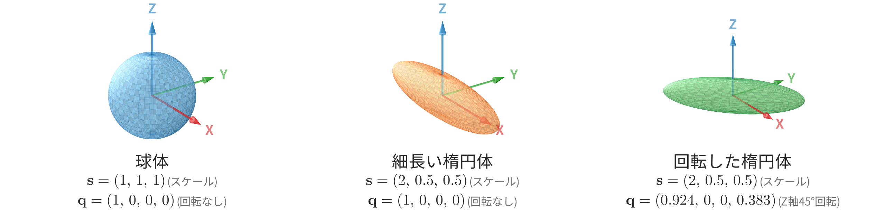
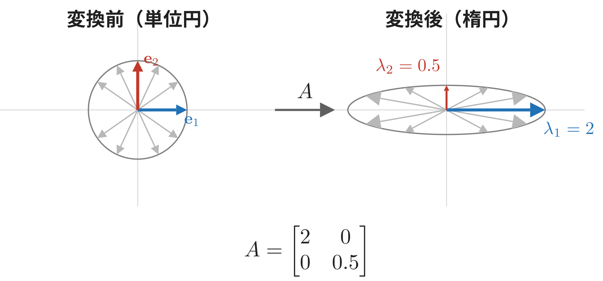
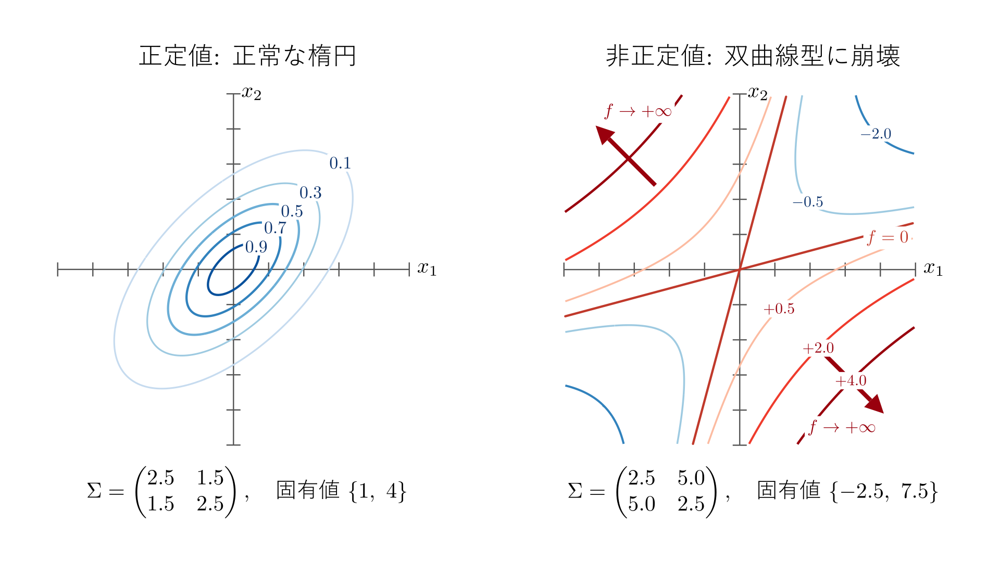
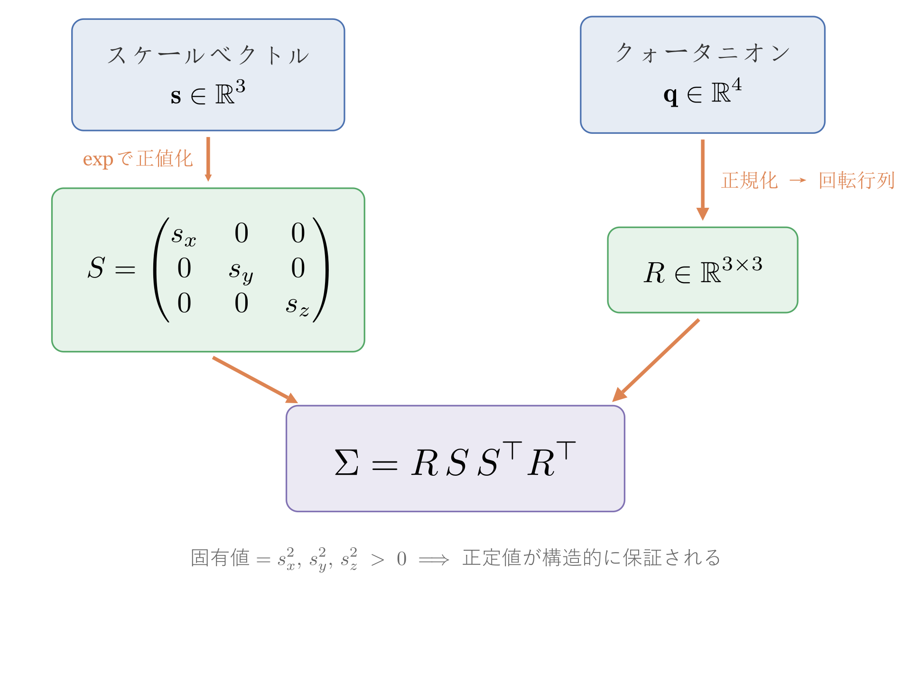
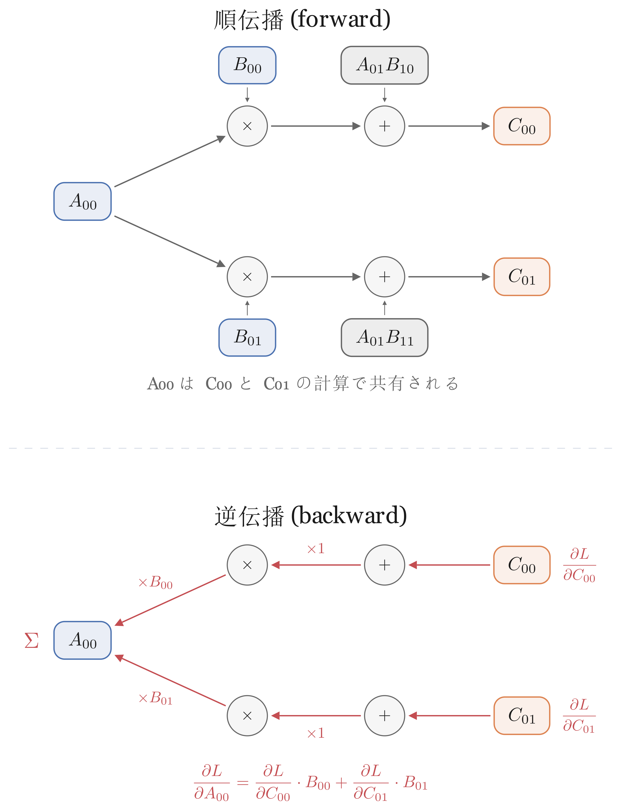
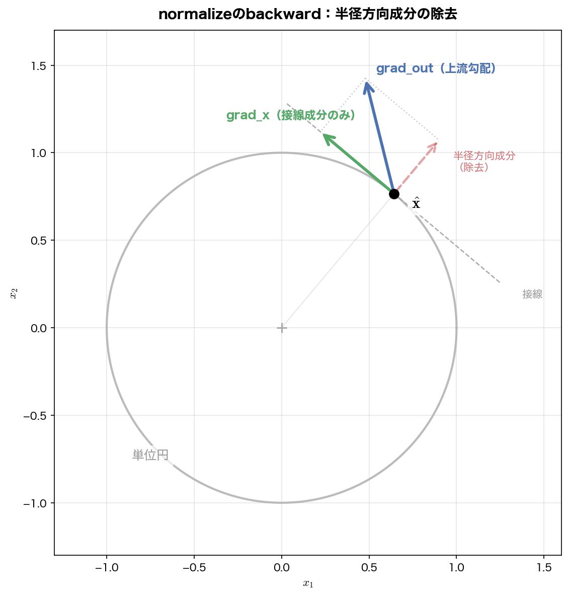
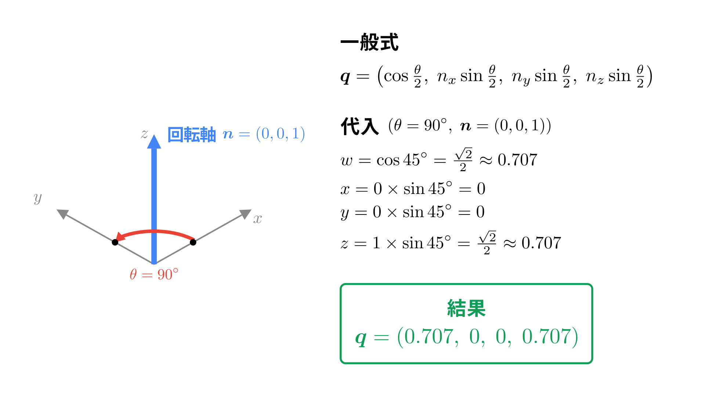

## この章で作るもの

第1章で2Dガウシアンを描き、第5章ではそれを画像にフィッティングしました。この章ではガウシアンを**2Dから3Dへ拡張**します。

第1章では、2Dガウシアンの形を決めるために各軸の広がり $(\sigma_x, \sigma_y)$ と回転角 $\theta$ を使い、そこから共分散行列 $\Sigma = R \, \Lambda \, R^\top$ を構築しました。3Dでもやることは同じです。各軸の広がりが3軸分に増えたものを**スケール** $(s_x, s_y, s_z)$ と呼び、回転角の代わりに**クォータニオン**（4つの数で3D回転を表す）を使って、同じように共分散行列 $\Sigma$ を構築します。



図6.1はスケールとクォータニオンを変えた3Dガウシアンの楕円体です。2つ目と3つ目はスケールが同じですが、クォータニオンで向きだけが変わっています。

これまでの章では、共分散行列 $\Sigma$ の各要素を直接最適化する場面はありませんでした。しかし今後、3Dガウシアンの形を学習で更新していくには $\Sigma$ を勾配降下法で最適化する必要があります。ここで問題になるのが、$\Sigma$ を直接最適化すると**正定値制約**が壊れてガウシアンの形が破綻することです。スケール + クォータニオンから $\Sigma$ を構築する方法なら、この制約が自動的に満たされます。

この章では、この安全な共分散行列の構築方法を実装します。また、実装に必要な`Tensor`演算（matmul、normalize、transpose）を追加します。

### 学習目標

- 3Dガウシアンのパラメータ構成（位置、共分散、色、不透明度）を理解する
- 共分散行列を直接最適化できない理由（正定値制約）を理解する
- スケールベクトル $\boldsymbol{s}$ + クォータニオン $\boldsymbol{q}$ による共分散行列の安全な構築を実装できる
- matmul、normalize、transposeのbackwardを実装しgrad_checkが通過する

### この章で作成・修正するファイル

| ファイル | 種別 | 内容 |
|---------|------|------|
| `gaussian3d.py` | 新規 | Gaussian3Dクラス、共分散行列構築 |
| `autograd.py` | 修正 | matmul, normalize, transpose を追加 |

### この章で追加する`Tensor`演算

| 演算 | forward | backward | 用途 |
|------|---------|----------|------|
| matmul (`@`) | `A @ B` | `dA=grad@B^T, dB=A^T@grad` | 共分散行列構築 |
| normalize | `x / ‖x‖` | `(grad - x_hat * dot(x_hat, grad)) / ‖x‖` | クォータニオン正規化 |
| transpose | 軸の入れ替え | 逆順の軸で転置 | `R^T` の計算 |

### 前提知識

- 第1章: 2D共分散行列の幾何学的意味（楕円の形と向き）
- 第4章: テンソル自動微分とブロードキャストの仕組み
- 第5章: 学習ループの基本（損失計算→逆伝播→パラメータ更新）

---

## 6.1 2Dから3Dへ

第1章では2Dガウシアンを次のように定義しました。

- 中心座標 $\mu \in \mathbb{R}^2$（平面上の位置）
- 共分散行列 $\Sigma \in \mathbb{R}^{2 \times 2}$（楕円の形を決める）

3Dガウシアンはこの自然な拡張です。

- 中心座標 $\mu \in \mathbb{R}^3$（3D空間内の位置）
- 共分散行列 $\Sigma \in \mathbb{R}^{3 \times 3}$（楕円体の形を決める）

> **補足**: $\mathbb{R}^3$ は「3つの実数の組」、$\mathbb{R}^{3 \times 3}$ は「3行3列の実数行列」を意味します。$\mu \in \mathbb{R}^3$ は「$\mu$ は3つの実数からなるベクトル」と読みます。

2Dでは楕円だったガウシアンの「等高線」が、3Dでは**楕円体**になります。第1章で `build_covariance_2d` がスケールと回転角から2x2共分散行列を構築したように、3Dでもスケールと回転から3x3共分散行列を構築します。ただし3Dの回転は2Dよりずっと複雑です。2Dでは回転角 $\theta$ の1つのパラメータで済みましたが、3Dでは3軸周りの回転を表す必要があるため、**クォータニオン**（4つの数）を使います。

3Dガウシアンの完全なパラメータセットは次の5つです。

| パラメータ | 形状 | 意味 |
|-----------|------|------|
| position $\mu$ | $(3,)$ | 3D空間での位置 |
| scale $\boldsymbol{s}$ | $(3,)$ | 各軸方向の大きさ |
| quaternion $\boldsymbol{q}$ | $(4,)$ | 楕円体の向き（回転） |
| opacity | $()$（スカラー） | 不透明度 $[0, 1]$ |
| color $c$ | $(3,)$ | RGB色（第10章で球面調和関数に拡張） |

---

## 6.2 共分散行列の正定値問題

### なぜ共分散行列を直接最適化できないのか

ガウシアンの形を決める共分散行列 $\Sigma$ には重要な制約があります。$\Sigma$ は**正定値行列**でなければなりません。

正定値行列を理解するために、**固有値**という概念を導入します。固有値は大学の線形代数で登場する概念ですが、次の直感だけ押さえておきましょう。固有値とは、行列が各方向にベクトルを何倍に伸ばすかを表す数です。2x2の行列なら2つ、3x3なら3つの固有値があり、それぞれが「この方向には何倍に伸びる」という伸び率に対応します。



図6.2は、行列 $A = \begin{bmatrix} 2 & 0 \\ 0 & 0.5 \end{bmatrix}$ を単位円上の各ベクトル $\mathbf{v}$ に掛けて $A\mathbf{v}$ を計算した結果です。グレーの一般的なベクトルは向きも長さも変わりますが、x軸方向のベクトル（青）は向きが変わらずに長さだけが2倍に、y軸方向のベクトル（赤）は向きが変わらずに長さだけが0.5倍になります。このように $A\mathbf{v} = \lambda \mathbf{v}$ が成り立つ（掛けても向きが変わらず、定数倍になる）特別なベクトル $\mathbf{v}$ を**固有ベクトル**、そのときの倍率 $\lambda$ を**固有値**と呼びます。図の例では $\lambda_1 = 2, \lambda_2 = 0.5$ です。

図6.2の行列 $A$ の固有値がそのまま「ベクトルの伸び率」だったのに対し、共分散行列 $\Sigma$ の固有値は楕円の長軸・短軸方向の「広がりの二乗」に対応します。

> **発展: なぜ共分散行列では「広がりの二乗」なのか**
>
> これは第1章で触れた共分散行列の構造から説明できます。第1章では $\Sigma = R \, \Lambda \, R^\top$ という形で共分散行列を構築し、対角行列 $\Lambda = \begin{pmatrix} \sigma_x^2 & 0 \\ 0 & \sigma_y^2 \end{pmatrix}$ にスケールの二乗を入れました。そもそもなぜ二乗なのかというと、1次元ガウシアン $\exp(-x^2/(2\sigma^2))$ の指数部に $x^2$ という二次式があるため、分母にも $\sigma^2$ が現れるからです。多次元化するとこの $\sigma^2$ の部分が $\Lambda$ の対角成分になります。この $\Sigma = R \, \Lambda \, R^\top$ の形はちょうど固有値分解 $\Sigma = V \Lambda V^\top$（第1章の発展コラムで紹介）と同じ構造で、$V = R$（固有ベクトル）、対角行列 $\Lambda$ に固有値が並びます。つまり共分散行列の固有値は定義上、$\Lambda$ の対角成分 = 広がりの二乗 になっているのです。

具体例で確認してみましょう。第1章の `build_covariance_2d` で、$\sigma_x = 2, \sigma_y = 1$、$45°$ 回転した楕円の共分散行列を作り、その固有値を NumPyの `np.linalg.eigvalsh`（対称行列の固有値を計算する関数）で求めます。

```python exec
import numpy as np
from gaussian2d import build_covariance_2d

cov_good = build_covariance_2d(2.0, 1.0, np.pi / 4)
print("共分散行列:")
print(cov_good)
print("固有値:", np.linalg.eigvalsh(cov_good))
```

```text output
共分散行列:
[[2.5 1.5]
 [1.5 2.5]]
固有値: [1. 4.]
```

固有値は $1$ と $4$ で、どちらも正です。これは入力した $\sigma_y^2 = 1^2 = 1$ と $\sigma_x^2 = 2^2 = 4$ と完全に一致しており、回転した楕円でも固有値が「軸方向の広がりの二乗」として正しく現れることを示しています。固有値が正であれば楕円体の各軸が正の長さを持ち、正常な楕円体になります。しかし固有値が負になると、広がりの長さ（$\sqrt{\text{固有値}}$）を実数として定義できなくなり、ガウシアンの形状が壊れてしまいます。**正定値行列**とは、全ての固有値が正の行列のことです。

最適化（勾配降下法）で $\Sigma$ の各要素を直接更新すると、この正定値制約がすぐに壊れます。例えば、先ほどの `cov_good` の非対角要素を $1.5$ から $5.0$ に変えるだけで、正定値性が壊れます。

```python exec
import numpy as np

# 非正定値行列（壊れた形状）
cov_bad = np.array([[2.5, 5.0], [5.0, 2.5]])
eigvals_bad = np.linalg.eigvalsh(cov_bad)
print("非正定値行列の固有値:", eigvals_bad)
```

```text output
非正定値行列の固有値: [-2.5  7.5]
```

`cov_bad` では固有値の1つが $-2.5$ と負になっています。「広がりの二乗」が負ということは、その方向の広がりが実数として定義できないことを意味します。この行列を共分散行列として使うと、ガウシアンの等高線が楕円ではなく双曲線型になり、値が無限大に発散する方向が生まれます。



図6.3は正定値行列と非正定値行列のガウシアンの等高線を比較しています。左の正定値行列（固有値 $1, 4$）は正常な楕円型の等高線を示していますが、右の非正定値行列（固有値 $-2.5, 7.5$）では等高線が双曲線型に壊れ、特定の方向に向かって値が増大しています。

勾配降下法では各要素を独立に少しずつ動かすので、$\Sigma$ の非対角要素が大きくなりすぎて正定値制約が破れる、ということが容易に起こります。そこで、**最適化するパラメータから共分散行列を構築する際に、固有値が負に落ちないことが構造的に保証される仕組み**が必要です。

ここまでで問題が明確になりました。共分散行列の要素を直接動かすと正定値制約が壊れる、ということです。では、どうすれば「どんなパラメータ値でも必ず正定値になる」構築方法を設計できるでしょうか。次のセクションで、3DGSの原論文が採用した解決策を見ていきます。

---

## 6.3 $R S S^\top R^\top$ 分解

### 2Dの場合: 第1章の構築はすでに固有値の非負性を保証していた

実は、固有値が負に落ちないことを自動的に保証する構築方法は、すでに第1章で目にしています。第1章では2Dの共分散行列を次のように構築していました。

$$
\Sigma_{2D} = R \, \Lambda \, R^\top, \quad \Lambda = \begin{pmatrix} \sigma_x^2 & 0 \\ 0 & \sigma_y^2 \end{pmatrix}
$$

ここで $R$ は2x2の回転行列、$\Lambda$ の対角にはスケールの二乗が入ります。この形はすでに固有値が負に落ちない構造になっています。$\sigma_x, \sigma_y$ がどんな実数値でも $\sigma_x^2, \sigma_y^2 \geq 0$ なので、$\Lambda$ の固有値は常に非負です。回転 $R$ は固有値を変えない（回転は向きを変えるだけで大きさを保存する）ので、$\Sigma_{2D}$ の固有値も非負になります。さらに $\sigma_x, \sigma_y \neq 0$ であれば固有値は全て正となり、$\Sigma_{2D}$ は正定値になります。

ポイントは**二乗を経由する**ことです。$\sigma_x, \sigma_y$ を勾配降下法で自由に更新しても、二乗を取った時点で必ず非負になるので、正定値制約が自動的に守られます。6.2節で問題だった「共分散行列の要素を直接動かす」アプローチでは、非対角要素が勝手に大きくなって正定値が壊れましたが、$R, \sigma_x, \sigma_y$ を最適化対象にすればこの問題は起きません。制約を壊しうるパラメータを、制約を壊しようがないパラメータに置き換えたわけです。

### 3Dへの拡張

3DGSでは、この2Dの構造をそのまま3Dに拡張します。各軸のスケールを対角に並べた行列 $S$ を

$$
S = \begin{pmatrix} s_x & 0 & 0 \\ 0 & s_y & 0 \\ 0 & 0 & s_z \end{pmatrix}
$$

とし、共分散行列を次のように書きます。

$$
\Sigma = R \cdot S \cdot S^\top \cdot R^\top \tag{6.1}
$$

ここで $R$ は楕円体の向きを決める3x3の回転行列です。$S$ の対角成分 $s_x, s_y, s_z$ は2Dの $\sigma_x, \sigma_y$ と同じ「各軸方向のスケール（標準偏差）」で、3D化によって3軸目 $s_z$ が加わった形です。記号が $\sigma$ から $s$ に切り替わったのは、3DGS原論文がスケールを小文字 $s$ で表記する慣習に合わせるためです。

> **補足: 式(6.1)の表記について**
>
> 式(6.1)の表記には、第1章の2D表記 $\Sigma = R \Lambda R^\top$ と見比べると気になる点が2つあります。
>
> 1. 2Dの $\Lambda$ は二乗済みの値(分散 $\sigma^2$)を対角に入れていましたが、3Dでは二乗なしの $s$ を経由しています。
> 2. $S$ は対角行列なので $S^\top = S$ が成り立ち、$SS^\top$ と $S^2$ は同じ行列です。それなら $S^2$ と書けばよいはずなのに、式では $SS^\top$ と書かれています。
>
> これらはどちらも後述の小節「サンドイッチ形式の行列積」で一緒に触れます。

この分解が3Dでも同じ性質（固有値が負に落ちないこと）を持つことを、2Dと同じ構造で確認しておきましょう。$S$ は対角行列なので $S^\top = S$ であり、$S \cdot S^\top$ を計算すると

$$
S \cdot S^\top = \begin{pmatrix} s_x^2 & 0 & 0 \\ 0 & s_y^2 & 0 \\ 0 & 0 & s_z^2 \end{pmatrix}
$$

となります。これは2Dの

$$
\Lambda = \begin{pmatrix} \sigma_x^2 & 0 \\ 0 & \sigma_y^2 \end{pmatrix}
$$

がそのまま3軸版に拡張された形で、各軸のスケールが二乗されて非負になっています。回転 $R$ は固有値を変えないので、$\Sigma = R S S^\top R^\top$ の固有値は $s_x^2, s_y^2, s_z^2$ です。$s_x, s_y, s_z$ がどんな実数値でも二乗すれば必ずゼロ以上になるので、$\Sigma$ の固有値が負になって「ガウシアンの形状が壊れる」ことは決してありません。さらに $s_x, s_y, s_z$ がいずれもゼロでなければ、固有値は全て正となり、6.2節の定義通り $\Sigma$ は正定値になります。

なお、ここでは「$s_x^2, s_y^2, s_z^2$ が固有値になるので正」という直感的な説明にとどめました。任意の非零ベクトル $v$ に対して $v^\top \Sigma v > 0$ という正定値の定義に基づく厳密な証明は、付録Cに掲載しています。



図6.4はこの章で組み立てるパイプラインの全体像です。左側の2本のルート（スケール $\boldsymbol{s}$ → $S$、クォータニオン $\boldsymbol{q}$ → $R$）でそれぞれ対角行列と回転行列を作り、それらを $(RS)(RS)^\top$ のサンドイッチ積に通して最終的な共分散行列 $\Sigma$ を得ます。

図中にはこの時点でまだ説明していない要素がいくつか含まれています。スケール側の $\exp$ は生パラメータを $(0, \infty)$ に写す活性化関数で、6.8 節で扱います。クォータニオン側の `normalize()` は生パラメータを単位クォータニオンに揃える演算で、6.5 節で扱います。クォータニオン $q$ から回転行列 $R$ への変換そのものは 6.7 節で説明します。現時点では「回転 + スケールをこういう形で組み立てる予定だ」という見通しとして眺めてください。

### サンドイッチ形式の行列積

$R S S^T R^T$ の計算には行列積（matmul）が必要です。`Tensor`クラスにはまだmatmulがないので、次のセクションで実装します。

ここで行列積の計算量を考えてみます。$\Sigma = R \cdot S \cdot S^\top \cdot R^\top$ を素直に左から計算すると、$R \cdot S$、$(RS) \cdot S^\top$、$(RSS^\top) \cdot R^\top$ の**3回**の行列積が必要です。一方、転置の公式 $(AB)^\top = B^\top A^\top$ を使えば

$$
\Sigma = R S S^\top R^\top = (RS)(RS)^\top
$$

と括り直せます。この形なら、$M = RS$ を**1回**計算したあとに $M \cdot M^\top$ を**1回**計算するだけで $\Sigma$ が得られ、行列積は合計**2回**で済みます（転置はメモリ上の読み替えだけで済むので計算コストには数えません）。3回から2回への削減ですが、Ch.8 以降で3Dガウシアンごとにこの計算が走るため、ガウシアン数が数千・数万になると無視できない差になります。

> **補足: 式(6.1)の表記について**
>
> 式(6.1)の最初の補足で挙げた2つの疑問、「なぜ二乗なしの $s$ を使うのか」と「なぜ $S^2$ ではなく $SS^\top$ と書くのか」は、どちらも $\Sigma$ を $(RS)(RS)^\top$ と括って行列積の回数を減らしたい、という一点から来ています。この形で書くためには $RS$ という「二乗前の行列」が表に出ている必要があり、そのために $S$ の対角は二乗前の $s_i$ で、表記も $S^2$ ではなく $SS^\top$ という形になっています。

> **発展: 半正定値性と正定値性、そして $s_i = 0$ の退化ケース**
>
> 本文では「$s_i \neq 0$ ならば正定値」という条件付きで議論しました。この条件の意味を整理しておきます。
>
> 対称行列 $\Sigma$ が**半正定値**（positive semidefinite）であるとは、全ての固有値が $\geq 0$、同値に言えば任意のベクトル $v$ に対して $v^\top \Sigma v \geq 0$ が成り立つことです。**正定値**（positive definite）はその厳密版で、全ての固有値が $> 0$、任意の**非零**ベクトル $v$ に対して $v^\top \Sigma v > 0$ が成り立つことを指します。$RSS^\top R^\top$ という構造単体が保証してくれるのは、$s_i^2 \geq 0$ から来る半正定値性までです。正定値性を言うには、そこから一歩踏み込んで $s_i \neq 0$（全ての $i$ について）を仮定する必要があります。
>
> もし $s_i = 0$ となった場合、対応する固有値 $s_i^2 = 0$ が現れて $\Sigma$ は退化します。$\det \Sigma = 0$ となり、逆行列 $\Sigma^{-1}$ が存在しません。幾何学的には、ガウシアンが $i$ 番目の主軸方向に厚みゼロに潰れ、3Dの楕円体ではなく、シート（$s_i$ が1つだけ0）、線（2つが0）、点（3つとも0）といった低次元の分布になります。
>
> では実際の3D Gaussian Splatting の学習過程でこのケースは起こるのでしょうか。6.8節で導入する通り、実装では生パラメータ $\tilde{s}_i$ に対して $s_i = \exp(\tilde{s}_i)$ という形でスケールを作ります。$\exp$ の値域は $(0, \infty)$ なので、$\tilde{s}_i$ がどんな有限の実数値であっても $s_i$ は厳密に正になります。したがって、通常の学習範囲では $s_i = 0$ が起こらず、$\Sigma$ は常に正定値です。
>
> もっとも、$\tilde{s}_i$ が極端に負の方向に振れれば、浮動小数点の丸めで $s_i$ が数値的にゼロに落ちる可能性までは否定できません。この点について、実際の3DGS パイプラインには複数の吸収機構があります。まず、ラスタライズで逆行列化するのは3D共分散そのものではなく、画面空間に射影した2D共分散の方です（射影処理は第8章 EWA Splatting で実装します）。さらに2D側では逆行列化の直前に対角へ小さな定数を加えるローパスフィルタが入る（これも第8章で実装）ため、退化に近い状態でも計算が破綻しません。加えて、退化しかけたガウシアンは第14章の Adaptive Density Control で pruning される経路もあり、長く最適化空間に残ることはありません。

---

## 6.4 matmulのbackward

### 行列で微分するとはどういうことか

共分散行列の構築には行列積 $\mathbf{C} = \mathbf{A} \mathbf{B}$ の微分が必要です。ここから先は $\mathbf{A}, \mathbf{B}, \mathbf{C}$ のような太字を行列を指す記号として使い、$A_{ij}$ のような添字付きの非太字はその $(i,j)$ 要素（スカラー）を指すことにします。

backwardの式を書く前に、「行列で微分する」という操作がそもそも何を意味するのかを確認しておきます。第4章のブロードキャストbackwardでも軽く触れましたが、matmul以降はこの考え方が中心になるので、改めて明示しておきます。

損失 $L$ はスカラーです。行列 $\mathbf{A}$ に対する $L$ の勾配 $\dfrac{\partial L}{\partial \mathbf{A}}$ とは、$\mathbf{A}$ の**各要素**に対するスカラー勾配を、$\mathbf{A}$ と同じ形状に並べた行列のことです。

$$
\frac{\partial L}{\partial \mathbf{A}} =
\begin{pmatrix}
\dfrac{\partial L}{\partial A_{00}} & \dfrac{\partial L}{\partial A_{01}} & \cdots \\[6pt]
\dfrac{\partial L}{\partial A_{10}} & \dfrac{\partial L}{\partial A_{11}} & \cdots \\
\vdots & \vdots & \ddots
\end{pmatrix}
$$

つまり「行列で微分する」とは、新しい数学的な操作ではなく、**要素ごとのスカラー微分を行列の形に並べ直す記法上の約束**にすぎません。第4章で`Tensor`クラスの `.grad` が `.data` と同じ形状を持つと説明しましたが、あれがまさにこの約束をそのまま実装に落としたものです。

### 1つの入力が複数の出力に影響するとき

行列で微分するとはどういうことかを押さえたうえで、行列積のbackwardを導く鍵になるもう1つの原理を見ます。

第3章・第4章で扱った `exp` や `sigmoid` のような要素ごとの演算では、入力 $x_1$ は出力 $y_1$ だけに影響し、$y_2$ には影響しませんでした。しかし行列積では事情が異なります。$\mathbf{A}$ の1つの要素 $A_{00}$ を動かすと、$\mathbf{C}$（$= \mathbf{A}\mathbf{B}$）の0行目の**全ての要素** $C_{00}, C_{01}, \ldots$ が変化します。このように1つの入力が複数の出力に影響する場合、連鎖律では**影響を受ける全ての出力からの勾配を足し合わせ**ます。

$$
\frac{\partial L}{\partial A_{ik}} = \sum_j \frac{\partial L}{\partial C_{ij}} \cdot \frac{\partial C_{ij}}{\partial A_{ik}}
$$

これは第4章のブロードキャストbackwardで登場した「拡張された軸について和を取る」操作と同じ原理です。ブロードキャストでは1つの入力要素がコピーされて複数の出力要素に使われるため、backward時にコピー先の勾配を全て足し合わせる必要がありました。matmulでも $A_{ik}$ という1つの入力が $\mathbf{C}$ の $i$ 行の複数の要素に現れるため、やはり全ての出力先からの勾配を足し合わせます。計算グラフの視点では、**1つの変数が複数の出力に枝分かれしているときはbackward時に各枝からの勾配を合流させる**という統一的な原理があり、ブロードキャストもmatmulもその現れ方の違いにすぎません。`Tensor`クラスで勾配を `+=` で累積しているのも同じ理由です。

この枝分かれと合流の構造を計算グラフで描くと図6.7のようになります。上段の順伝播では $A_{00}$ から2本の枝が出て、それぞれ $B_{00}, B_{01}$ との掛け算を経て $C_{00}, C_{01}$ に到達します。下段の逆伝播では、$C_{00}, C_{01}$ から戻ってきた勾配がそれぞれ $B_{00}, B_{01}$ 倍されて $A_{00}$ で合流します。第4章の図4.3（ブロードキャストbackward）と見比べると、枝の数だけ勾配を合流させるという骨格がそのまま繰り返されていることがわかります。



この「全出力の寄与を合算する」原理は、この章で後ほど実装する normalize のbackwardでも同じ形で現れます。

### 具体例で理解する matmul backward

以上の枝分かれと合流の原理が、行列形式にきれいにまとまることを小さな数値例で確かめます。$\mathbf{A} = \begin{pmatrix}1&2\\3&4\end{pmatrix}$、$\mathbf{B} = \begin{pmatrix}5&6\\7&8\end{pmatrix}$ とし、backwardの途中で上流から $\mathbf{C}$ の位置まで流れてきた勾配が

$$
\frac{\partial L}{\partial \mathbf{C}} = \begin{pmatrix}2 & 3\\ 1 & 4\end{pmatrix}
$$

だったとします。$A_{00}$ は図6.7の通り $C_{00}, C_{01}$ の両方に枝分かれしているので、それぞれの上流勾配に $B_{00}, B_{01}$ を掛けて合流させると

$$
\frac{\partial L}{\partial A_{00}} = \frac{\partial L}{\partial C_{00}} \cdot B_{00} + \frac{\partial L}{\partial C_{01}} \cdot B_{01} = 2 \cdot 5 + 3 \cdot 6 = 28
$$

となります。同じく $A_{01}$ も $C_{00}, C_{01}$ に枝分かれしますが、掛かる係数が $B_{10}, B_{11}$ に変わります。

$$
\frac{\partial L}{\partial A_{01}} = \frac{\partial L}{\partial C_{00}} \cdot B_{10} + \frac{\partial L}{\partial C_{01}} \cdot B_{11} = 2 \cdot 7 + 3 \cdot 8 = 38
$$

$\mathbf{A}$ の下の行 $A_{10}, A_{11}$ は $C_{10}, C_{11}$ に枝分かれするので、上流勾配が $\partial L/\partial C_{10}, \partial L/\partial C_{11}$（つまり $1, 4$）に切り替わって

$$
\frac{\partial L}{\partial A_{10}} = \frac{\partial L}{\partial C_{10}} \cdot B_{00} + \frac{\partial L}{\partial C_{11}} \cdot B_{01} = 1 \cdot 5 + 4 \cdot 6 = 29
$$

$$
\frac{\partial L}{\partial A_{11}} = \frac{\partial L}{\partial C_{10}} \cdot B_{10} + \frac{\partial L}{\partial C_{11}} \cdot B_{11} = 1 \cdot 7 + 4 \cdot 8 = 39
$$

となります。

要素ごとの結果を $\mathbf{A}$ と同じ形状に並べると、$\mathbf{A}$ 全体に対する勾配行列は

$$
\frac{\partial L}{\partial \mathbf{A}} = \begin{pmatrix}28 & 38\\ 29 & 39\end{pmatrix}
$$

となります。一方、$\partial L/\partial \mathbf{C}$ と $\mathbf{B}^\top$ の行列積を要素ごとに文字のまま書き下してみると、

$$
\frac{\partial L}{\partial \mathbf{C}} \, \mathbf{B}^\top = \begin{pmatrix}\dfrac{\partial L}{\partial C_{00}} & \dfrac{\partial L}{\partial C_{01}}\\[6pt] \dfrac{\partial L}{\partial C_{10}} & \dfrac{\partial L}{\partial C_{11}}\end{pmatrix} \begin{pmatrix}B_{00} & B_{10}\\ B_{01} & B_{11}\end{pmatrix} = \begin{pmatrix}\dfrac{\partial L}{\partial C_{00}} B_{00} + \dfrac{\partial L}{\partial C_{01}} B_{01} & \dfrac{\partial L}{\partial C_{00}} B_{10} + \dfrac{\partial L}{\partial C_{01}} B_{11}\\[10pt] \dfrac{\partial L}{\partial C_{10}} B_{00} + \dfrac{\partial L}{\partial C_{11}} B_{01} & \dfrac{\partial L}{\partial C_{10}} B_{10} + \dfrac{\partial L}{\partial C_{11}} B_{11}\end{pmatrix}
$$

となります。右辺の4つの成分をよく見ると、先ほど $A_{00}, A_{01}, A_{10}, A_{11}$ について別々に書き下したスカラー式とそれぞれぴたり同じ形をしています。つまり、要素ごとに連鎖律で合流させて得られる4つの計算が、ちょうど $\partial L/\partial \mathbf{C}$ と $\mathbf{B}^\top$ の行列積の4つの成分に収まっているわけです。ここに具体値を代入すれば

$$
\frac{\partial L}{\partial \mathbf{C}} \, \mathbf{B}^\top = \begin{pmatrix}2 & 3\\ 1 & 4\end{pmatrix} \begin{pmatrix}5 & 7\\ 6 & 8\end{pmatrix} = \begin{pmatrix}28 & 38\\ 29 & 39\end{pmatrix}
$$

となり、要素ごとの計算で得た $\partial L/\partial \mathbf{A}$ にぴたりと一致します。つまり、個別に枝分かれ先からの勾配を合流させて計算した結果が、$\partial L/\partial \mathbf{C}$ と $\mathbf{B}^\top$ の行列積という1つの式でまとめて書けているわけです。

$\mathbf{A}$ や $\mathbf{B}$ のサイズが大きくなっても同じ構造がそのまま広がるだけなので、一般に

$$
\frac{\partial L}{\partial \mathbf{A}} = \frac{\partial L}{\partial \mathbf{C}} \, \mathbf{B}^\top
$$

という行列の等式が成り立ちます。

$\mathbf{B}$ の勾配も同じ要領で求まります。今度は $B_{kj}$ を動かすと $\mathbf{C}$ の $j$ 列の全要素が影響を受けるので、列方向に枝分かれ先からの勾配を合流させることになり、結果は

$$
\frac{\partial L}{\partial \mathbf{B}} = \mathbf{A}^\top \, \frac{\partial L}{\partial \mathbf{C}}
$$

となります。まとめると、matmulのbackward公式は次の通りです。

$$
\frac{\partial L}{\partial \mathbf{A}} = \frac{\partial L}{\partial \mathbf{C}} \, \mathbf{B}^\top, \quad \frac{\partial L}{\partial \mathbf{B}} = \mathbf{A}^\top \, \frac{\partial L}{\partial \mathbf{C}}
$$

実装上、もう一点だけ補足しておきます。ここまでの議論は2次元の行列同士の積を前提に書いてきましたが、実際の`Tensor`では形状 `(N, 3, 3)` のように先頭に追加の軸が付いた3次元以上の配列を扱うことがあります。たとえば第5章の2Dガウシアンの`render`では、$N$ 個のガウシアンごとの値を先頭の軸に並べて一気に処理していました。これと同じように、このあと共分散行列を作るときも「ガウシアン1個あたりの $3 \times 3$ 行列が $N$ 個分並んでいる」という配列を扱うことになります。NumPyの `@` 演算子はこの形を自然に扱ってくれて、最後の2次元だけで行列積を計算し、先頭の軸はそのまま保ちます。

転置のほうはもう少し注意が必要で、NumPyの `.T` は全ての軸を一括で入れ替えてしまうため、先頭の軸まで一緒に動いてしまい期待と違う形になります。そこで最後の2軸だけを入れ替える `np.swapaxes(X, -2, -1)` を使います。これで「先頭の軸の並びを保ったまま、各行列だけを転置する」という操作になります。

### 実装

`autograd.py` の `Tensor` クラスに、`reshape` メソッドの後に以下を追加します。

```python
    # --- 行列演算 ---

    def matmul(self, other):
        """行列積 self @ other を計算する。

        バッチ次元にも対応。最後の2次元で行列積を行い、
        先頭の次元はブロードキャストされる。

        backward:
            dL/d(self) = dL/d(out) @ other^T
            dL/d(other) = self^T @ dL/d(out)
        """
        other = other if isinstance(other, Tensor) else Tensor(other)
        out = Tensor(self.data @ other.data)
        out._prev = {self, other}

        def _backward():
            # dL/dA = grad @ B^T
            g_self = out.grad @ np.swapaxes(other.data, -2, -1)
            self.grad += _unbroadcast(g_self, self.shape)

            # dL/dB = A^T @ grad
            g_other = np.swapaxes(self.data, -2, -1) @ out.grad
            other.grad += _unbroadcast(g_other, other.shape)

        out._backward = _backward
        return out

    def __matmul__(self, other):
        return self.matmul(other)
```

`__matmul__` を定義することで、`A @ B` という `@` 演算子が使えるようになります。

ここで `_unbroadcast` を通しているのは、先頭の軸がブロードキャストされた場合に対処するためです。たとえば `self` の形状が `(3, 4)`、`other` の形状が `(N, 4, 5)` の場合、NumPyの `@` は `self` を仮想的に $N$ 個コピーして `(N, 3, 4)` に揃えたうえで行列積を計算します。このとき backward で得られる `g_self` の形状は `(N, 3, 4)` で、本来の `self` の形状 `(3, 4)` より軸が1つ多い状態です。これは `self` の各要素が $N$ 個の出力にコピーして使われたということであり、section 6.4 冒頭で見た「1つの入力が複数の出力に枝分かれしたら勾配を全て足し合わせる」という原則そのままです。`_unbroadcast` はこの余分な先頭軸について和を取り、元の形状 `(3, 4)` に戻してくれる関数で、第4章でブロードキャストのbackwardを実装したときに作ったものをそのまま使っています。

### 動作確認

```python exec
import numpy as np
from autograd import Tensor

A = Tensor(np.array([[1.0, 2.0], [3.0, 4.0]]), requires_grad=True)
B = Tensor(np.array([[5.0, 6.0], [7.0, 8.0]]), requires_grad=True)
C = A @ B
print(C.data)
```

```text output
[[19. 22.]
 [43. 50.]]
```

$C_{00} = 1 \times 5 + 2 \times 7 = 19$、$C_{01} = 1 \times 6 + 2 \times 8 = 22$ のように計算されています。

勾配も確認しましょう。`C.sum()` をスカラーにしてからbackwardを呼びます。

```python exec
loss = C.sum()
loss.backward()
print(A.grad)
print(B.grad)
```

```text output
[[11. 15.]
 [11. 15.]]
[[4. 4.]
 [6. 6.]]
```

$\mathbf{A}$ の勾配を手計算で確認します。`C.sum()` の勾配は全要素が1の行列なので、$\dfrac{\partial L}{\partial \mathbf{C}} = \begin{pmatrix}1&1\\1&1\end{pmatrix}$ です。先ほど導いた公式に代入すると

$$
\frac{\partial L}{\partial \mathbf{A}} = \frac{\partial L}{\partial \mathbf{C}} \, \mathbf{B}^\top = \begin{pmatrix}1&1\\1&1\end{pmatrix} \begin{pmatrix}5&7\\6&8\end{pmatrix} = \begin{pmatrix}11&15\\11&15\end{pmatrix}
$$

となり、`A.grad` の出力と一致しています。$\mathbf{B}$ の勾配も同様に確認します。

$$
\frac{\partial L}{\partial \mathbf{B}} = \mathbf{A}^\top \, \frac{\partial L}{\partial \mathbf{C}} = \begin{pmatrix}1&3\\2&4\end{pmatrix} \begin{pmatrix}1&1\\1&1\end{pmatrix} = \begin{pmatrix}4&4\\6&6\end{pmatrix}
$$

こちらも `B.grad` の出力と一致しています。

---

## 6.5 normalize演算の追加

### なぜnormalizeが必要か

6.8節でクォータニオンから回転行列を構築する際に、ベクトルの長さを1に揃える normalize 演算が必要になります。先に`Tensor`演算として追加しておきましょう。

normalize は、ベクトル $\boldsymbol{x}$ を各要素の二乗和の平方根（ベクトルの長さ）で割る操作です。

$$
\hat{\boldsymbol{x}} = \frac{\boldsymbol{x}}{\|\boldsymbol{x}\|}, \quad \|\boldsymbol{x}\| = \sqrt{x_1^2 + x_2^2 + \cdots + x_n^2}
$$

$\|\boldsymbol{x}\|$ はベクトルの長さを表す記号で、**ノルム**（norm）とも呼びます。結果の $\hat{\boldsymbol{x}}$ は必ず長さ1になります。

### backwardの幾何学的意味

normalizeのbackwardを理解するために、まず「ベクトルの勾配」の意味を整理しましょう。

第5章では、各パラメータのスカラー勾配 $\frac{\partial L}{\partial \theta_j}$ を使って「勾配の逆方向にパラメータを動かす」と学びました。ベクトルの勾配 $\frac{\partial L}{\partial \hat{\boldsymbol{x}}}$ は、各成分の偏微分を並べたベクトルです。このベクトルが指す方向は「$\hat{\boldsymbol{x}}$ をその方向に動かすと損失 $L$ が最も速く増える方向」を意味します。逆方向に動かせば損失が最も速く減ります。

この勾配 $\frac{\partial L}{\partial \hat{\boldsymbol{x}}}$ は、後続の計算から逆伝播で流れてきたもので、2次元空間上のどんな方向も向きえます。ところが $\hat{\boldsymbol{x}}$ は normalize の出力なので、必ず長さ1です。2次元なら単位円の円周上、3次元なら単位球の表面上の点です（何次元のベクトルでも同じ考え方が使えます）。

ここで問題が生じます。勾配が「右上に動かせば損失が減る」と言っていても、$\hat{\boldsymbol{x}}$ は円周上にしかいられないので、円の外側に向かっては動けません。そこで、勾配のうち**半径方向の成分**（円の中心から外に向かう方向）を除去し、**円周に沿った接線方向の成分**だけを残します。これが normalize の backward です。



図6.5はこの様子を示しています。元の勾配ベクトル（青）から半径方向成分（赤破線）を引いて、接線方向成分（緑）だけが残ります。

この考え方を式にすると、次の射影（ある方向の成分だけを取り出す操作）公式になります。

$$
\frac{\partial L}{\partial \boldsymbol{x}} = \frac{1}{\|\boldsymbol{x}\|} \left( \frac{\partial L}{\partial \hat{\boldsymbol{x}}} - \hat{\boldsymbol{x}} \left\langle \hat{\boldsymbol{x}},\, \frac{\partial L}{\partial \hat{\boldsymbol{x}}} \right\rangle \right)
$$

各項の意味を確認しましょう。$\langle \boldsymbol{a}, \boldsymbol{b} \rangle = \sum_i a_i b_i$ はベクトルの内積を表す記号です（NumPyでは `np.sum(a * b)` で計算できます）。

1. $\left\langle \hat{\boldsymbol{x}},\, \frac{\partial L}{\partial \hat{\boldsymbol{x}}} \right\rangle$ は内積でスカラーになります。これが勾配の半径方向の大きさです
2. そのスカラーを $\hat{\boldsymbol{x}}$ に掛けると半径方向の成分ベクトルになります。それを元の勾配から引いた $\frac{\partial L}{\partial \hat{\boldsymbol{x}}} - \hat{\boldsymbol{x}} \left\langle \hat{\boldsymbol{x}},\, \frac{\partial L}{\partial \hat{\boldsymbol{x}}} \right\rangle$ が接線方向の成分です
3. 全体を $\frac{1}{\|\boldsymbol{x}\|}$ 倍します。normalize は入力を $\|\boldsymbol{x}\|$ で割って長さ1に縮めているので、入力を1動かしても出力は $\frac{1}{\|\boldsymbol{x}\|}$ しか動きません。この縮小の分だけ、勾配も小さくなります

> **発展: 偏微分による射影公式の確認**
>
> 上では「半径方向を除去して接線方向だけ残す」という幾何学的な考え方から射影公式を導きました。ここでは、実際に偏微分を計算して同じ式が得られることを確認します。
>
> normalize でも、matmul と同じ「1つの入力が複数の出力に影響する」構造が現れます。$x_1$ を少し動かすとノルム $\|\boldsymbol{x}\|$ が変化し、$\hat{x}_1 = x_1/\|\boldsymbol{x}\|$ だけでなく $\hat{x}_2 = x_2/\|\boldsymbol{x}\|$ も変わります。6.4節で学んだ通り、このような場合は連鎖律で全ての出力成分からの寄与を足し合わせます。
>
> $$\frac{\partial L}{\partial x_j} = \sum_i \frac{\partial L}{\partial \hat{x}_i} \frac{\partial \hat{x}_i}{\partial x_j}$$
>
> 2成分 $\boldsymbol{x} = (x_1, x_2)$ の具体例で計算してみましょう。$\hat{x}_1 = x_1 / \|\boldsymbol{x}\|$ を $x_1$ で偏微分するには、**商の微分公式** $(f/g)' = (f'g - fg') / g^2$ を使います。
>
> $\frac{\partial \hat{x}_1}{\partial x_1}$（同じ成分での偏微分）では、$f = x_1$, $g = \|\boldsymbol{x}\|$ なので $f' = 1$、$g' = \frac{x_1}{\|\boldsymbol{x}\|}$ です。商の微分公式に代入すると、
>
> $$\frac{\partial \hat{x}_1}{\partial x_1} = \frac{1 \cdot \|\boldsymbol{x}\| - x_1 \cdot \frac{x_1}{\|\boldsymbol{x}\|}}{\|\boldsymbol{x}\|^2} = \frac{1}{\|\boldsymbol{x}\|}\left(1 - \hat{x}_1^2\right)$$
>
> $\frac{\partial \hat{x}_1}{\partial x_2}$（異なる成分での偏微分）では、$f = x_1$ なので $f' = 0$、$g' = \frac{x_2}{\|\boldsymbol{x}\|}$ です。
>
> $$\frac{\partial \hat{x}_1}{\partial x_2} = \frac{0 - x_1 \cdot \frac{x_2}{\|\boldsymbol{x}\|}}{\|\boldsymbol{x}\|^2} = \frac{-\hat{x}_1 \hat{x}_2}{\|\boldsymbol{x}\|}$$
>
> 連鎖律で $\frac{\partial L}{\partial x_1}$ を求めます。$g_1 = \frac{\partial L}{\partial \hat{x}_1}$、$g_2 = \frac{\partial L}{\partial \hat{x}_2}$ とおくと、
>
> $$\frac{\partial L}{\partial x_1} = g_1 \cdot \frac{1 - \hat{x}_1^2}{\|\boldsymbol{x}\|} + g_2 \cdot \frac{-\hat{x}_2 \hat{x}_1}{\|\boldsymbol{x}\|} = \frac{1}{\|\boldsymbol{x}\|}\left(g_1 - \hat{x}_1(g_1 \hat{x}_1 + g_2 \hat{x}_2)\right)$$
>
> 括弧内の $g_1 \hat{x}_1 + g_2 \hat{x}_2$ は内積 $\langle \hat{\boldsymbol{x}}, \boldsymbol{g} \rangle$ そのものです。よって $\frac{\partial L}{\partial x_1} = \frac{1}{\|\boldsymbol{x}\|}(g_1 - \hat{x}_1 \langle \hat{\boldsymbol{x}}, \boldsymbol{g} \rangle)$ となり、射影公式の第1成分と一致します。

### 実装

`autograd.py` の `Tensor` クラスに、`matmul` の後に以下を追加します。

```python
    def normalize(self, axis=-1):
        """normalize: x / ||x|| を計算し、長さ1のベクトルにする。

        backward: 勾配から半径方向成分を除去し、接線方向だけ残す。
            grad_x = (grad_out - x_hat * dot(x_hat, grad_out)) / ||x||
        """
        # ノルムを計算（keepdimsで形状を維持）
        norm = np.sqrt(np.sum(self.data ** 2, axis=axis, keepdims=True))
        norm = np.maximum(norm, 1e-12)  # ゼロ除算防止
        x_hat = self.data / norm
        out = Tensor(x_hat)
        out._prev = {self}

        def _backward():
            # 半径方向成分: x_hat * dot(x_hat, grad_out)
            dot = np.sum(x_hat * out.grad, axis=axis, keepdims=True)
            # 接線方向のみ残す
            self.grad += (out.grad - x_hat * dot) / norm

        out._backward = _backward
        return out
```

forwardでは、まず各要素を二乗して合計し、平方根を取ることでノルム `norm`（= $\|\boldsymbol{x}\|$）を求めます。`np.maximum(norm, 1e-12)` はノルムがほぼ0のときにゼロ除算を防ぐ安全策です。`x_hat = self.data / norm` で各要素をノルムで割り、長さ1のベクトル $\hat{\boldsymbol{x}}$ を得ます。

backwardの各行と射影公式の対応を確認しましょう。

- `dot = np.sum(x_hat * out.grad, ...)` が内積 $\left\langle \hat{\boldsymbol{x}},\, \frac{\partial L}{\partial \hat{\boldsymbol{x}}} \right\rangle$ です。勾配の半径方向の大きさを求めています
- `out.grad - x_hat * dot` が $\frac{\partial L}{\partial \hat{\boldsymbol{x}}} - \hat{\boldsymbol{x}} \left\langle \hat{\boldsymbol{x}},\, \frac{\partial L}{\partial \hat{\boldsymbol{x}}} \right\rangle$ です。勾配から半径方向成分を引いて、接線方向だけを残しています
- `/ norm` が $\frac{1}{\|\boldsymbol{x}\|}$ です。normalize がノルムで割って縮めている分を勾配にも反映しています

### 動作確認

```python exec
import numpy as np
from autograd import Tensor

v = Tensor(np.array([3.0, 4.0]))
n = v.normalize()
print(n.data)
```

```text output
[0.6 0.8]
```

$\|v\| = \sqrt{9 + 16} = 5$ なので、$[3/5, 4/5] = [0.6, 0.8]$ です。

matmulのときと同じように、backwardの結果を手計算で確認しましょう。`n.sum()` をスカラーにしてからbackwardを呼びます。

```python exec
loss = n.sum()
loss.backward()
print(v.grad)
```

```text output
[ 0.032 -0.024]
```

射影公式に数値を代入して確認します。$\hat{\boldsymbol{x}} = [0.6, 0.8]$、$\|\boldsymbol{x}\| = 5$ です。`sum` の勾配は全要素が1なので $\frac{\partial L}{\partial \hat{\boldsymbol{x}}} = [1, 1]$ です。

1. 内積 $\left\langle \hat{\boldsymbol{x}},\, \frac{\partial L}{\partial \hat{\boldsymbol{x}}} \right\rangle = \langle [0.6, 0.8],\, [1, 1] \rangle = 0.6 \times 1 + 0.8 \times 1 = 1.4$
2. 半径方向を除去 $\frac{\partial L}{\partial \hat{\boldsymbol{x}}} - \hat{\boldsymbol{x}} \left\langle \hat{\boldsymbol{x}},\, \frac{\partial L}{\partial \hat{\boldsymbol{x}}} \right\rangle = [1, 1] - [0.6, 0.8] \times 1.4 = [0.16, -0.12]$
3. ノルムで割る $\frac{1}{\|\boldsymbol{x}\|} \times [0.16, -0.12] = \frac{1}{5} \times [0.16, -0.12] = [0.032, -0.024]$

手計算の結果と `v.grad` が一致しています。

---

## 6.6 transpose演算の追加

共分散行列の構築では $(RS)^T$（回転スケール合成の転置）を計算する必要があります。そこで、`Tensor`クラスに `transpose` 演算を追加します。

`transpose` のbackwardを考えましょう。forwardで軸を入れ替えたなら、backwardでは**逆の順序で軸を入れ替えれば**勾配が元の形状に戻ります。`np.transpose` は引数で軸の並び順を指定します。例えば `np.transpose(A, (1, 0))` と書くと「新しい軸0を元の軸1に、新しい軸1を元の軸0にする」、つまり行と列を入れ替えます。backwardでは「元の軸がどこに行ったか」を逆引きする `inv_axes` を計算して `np.transpose` に渡すことで、勾配を元の形状に戻します。

`autograd.py` の `Tensor` クラスに、`normalize` の後に以下を追加します。

```python
    def transpose(self, *axes):
        """軸を入れ替える。np.transpose と同じインターフェース。"""
        if len(axes) == 1 and isinstance(axes[0], (tuple, list)):
            axes = tuple(axes[0])
        out = Tensor(np.transpose(self.data, axes))
        out._prev = {self}

        # 逆順の軸を計算
        inv_axes = [0] * len(axes)
        for i, a in enumerate(axes):
            inv_axes[a] = i

        def _backward():
            self.grad += np.transpose(out.grad, inv_axes)

        out._backward = _backward
        return out
```

コードを上から順に見ていきましょう。

**引数の正規化**（2-3行目）: `*axes` は可変長引数なので、`t.transpose(1, 0)` と呼ぶと `axes = (1, 0)` になります。一方 `t.transpose((1, 0))` とタプルで渡すと `axes = ((1, 0),)` とタプルが二重に包まれてしまいます。最初の `if` 文はこの二重包みをほどいて、どちらの呼び方でも `axes = (1, 0)` に統一するための処理です。

**forward**（4行目）: `np.transpose(self.data, axes)` で軸を入れ替えた結果を出力とします。

**`inv_axes` の計算**（7-9行目）: backwardで勾配を元の形状に戻すために、forwardの軸入れ替えの**逆操作**を求めます。まず `[0] * len(axes)` で軸の数だけ0を並べた配列を作り、ループで `inv_axes[a] = i` と埋めていきます。これは「forwardで位置 `i` に行った軸 `a` を、backwardでは位置 `i` から元の位置 `a` に戻す」という意味です。

3次元の例 `axes = (2, 0, 1)` でステップごとに追ってみましょう。

- `i=0, a=2`: 元の軸2が位置0に行く → `inv_axes[2] = 0`
- `i=1, a=0`: 元の軸0が位置1に行く → `inv_axes[0] = 1`
- `i=2, a=1`: 元の軸1が位置2に行く → `inv_axes[1] = 2`

結果: `inv_axes = [1, 2, 0]`。`axes = (2, 0, 1)` とは異なる値です。形状の変化で確認しましょう。元の配列が形状 `(2, 3, 4)` のとき、`np.transpose(data, (2, 0, 1))` で `(4, 2, 3)` になります。backwardでは `np.transpose(grad, (1, 2, 0))` で `(4, 2, 3)` を `(2, 3, 4)` に戻します。

**backward**（11-12行目）: こうして求めた `inv_axes` を使い、`np.transpose(out.grad, inv_axes)` で勾配を元の軸順序に戻して `self.grad` に加算します。

簡単な例で動作を確認しましょう。

```python exec
import numpy as np
from autograd import Tensor

m = Tensor(np.array([[1.0, 2.0, 3.0], [4.0, 5.0, 6.0]]))
print(m.data.shape)
print(m.transpose(1, 0).data)
```

```text output
(2, 3)
[[1. 4.]
 [2. 5.]
 [3. 6.]]
```

$(2, 3)$ の行列が $(3, 2)$ に転置されました。

backwardで勾配の形状が元に戻ることを確認しましょう。

```python exec
m = Tensor(np.array([[1.0, 2.0, 3.0], [4.0, 5.0, 6.0]]), requires_grad=True)
mt = m.transpose(1, 0)  # (2, 3) → (3, 2)
loss = mt.sum()
loss.backward()
print(m.grad.shape)
print(m.grad)
```

```text output
(2, 3)
[[1. 1. 1.]
 [1. 1. 1.]]
```

勾配の形状が元の `(2, 3)` に戻っています。`sum` の勾配は全要素1なので、値は全て1です。

---

## 6.7 クォータニオンと回転行列

### クォータニオンとは

3Dの回転を表す方法はいくつかありますが、3DGSでは**クォータニオン**（四元数）を使います。クォータニオンは4つの数 $\boldsymbol{q} = (w, x, y, z)$ で表される数学的な対象で、そのうち**ノルムが1のもの**、すなわち $\|\boldsymbol{q}\| = 1$ を満たすクォータニオンを**単位クォータニオン**と呼びます。3D回転に対応するのはこの単位クォータニオンだけです。

> **補足**: 本書では3DGS原論文と同じ $(w, x, y, z)$ 順（スカラー部 $w$ が先頭）を採用しています。一部のライブラリ（Unity、glTFなど）では $(x, y, z, w)$ 順を使いますが、本書では $(w, x, y, z)$ 順だけ把握しておいてください。第9章でCOLMAPデータを読み込む際に、外部データの順序と本書の順序の対応を改めて確認します。

単位クォータニオンは、3D回転を**1本の軸を中心とした1回の回転**として表します。どんな複雑な回転でも、ある1本の軸を中心とした1回の回転で同じ結果を得られます。回転軸の方向（3次元の単位ベクトル）と回転角（スカラー）で合わせて4つのパラメータになります。

> **補足: なぜ3つのパラメータではないのか**
>
> x軸・y軸・z軸それぞれの回転角を指定するオイラー角なら3つのパラメータで済みます。しかしオイラー角には、特定の姿勢で2つの回転軸が重なり、3つの角度があるのに2方向にしか回転できなくなる「ジンバルロック」という問題があります。クォータニオンは4つのパラメータを使う代わりに、この問題が起きません。

具体的には、回転軸を単位ベクトル $\boldsymbol{n} = (n_x, n_y, n_z)$、回転角を $\theta$ とすると、対応するクォータニオンは次の式で求まります。

$$
\boldsymbol{q} = \left(\cos\frac{\theta}{2},\; n_x \sin\frac{\theta}{2},\; n_y \sin\frac{\theta}{2},\; n_z \sin\frac{\theta}{2}\right)
$$

スカラー部 $w = \cos(\theta/2)$ が回転角の情報を、ベクトル部 $(x, y, z)$ が回転軸の情報を持ちます。$\boldsymbol{n}$ が単位ベクトルであれば、この式から構成したクォータニオンは自動的に $\|\boldsymbol{q}\| = 1$ を満たします。実際、4成分の二乗和を計算すると

$$
\cos^2\frac{\theta}{2} + \sin^2\frac{\theta}{2}\,(n_x^2 + n_y^2 + n_z^2) = \cos^2\frac{\theta}{2} + \sin^2\frac{\theta}{2} = 1
$$

となります（$\boldsymbol{n}$ が単位ベクトルなので $n_x^2 + n_y^2 + n_z^2 = 1$、最後に $\cos^2 + \sin^2 = 1$ を使いました）。

しかし最適化では、回転軸と回転角を切り離してクォータニオンの4成分 $(w, x, y, z)$ を自由に動かすため、1ステップ更新するだけでノルムは1から外れてしまいます。そこで最適化する生のクォータニオンを forward の中で `normalize` に通し、単位クォータニオンに戻してから回転行列を構築します。`normalize` は`Tensor`演算として実装したので、正規化を通じて勾配も自動的に流れます。こうすれば生パラメータがどんな値でも、常に有効な3D回転として扱えます。

> **発展: なぜ $(n_x, n_y, n_z, \theta)$ ではなくクォータニオンなのか**
>
> 回転軸と回転角をそのまま $(n_x, n_y, n_z, \theta)$ として保持しない理由を説明します。$(n_x, n_y, n_z, \theta)$ から回転行列を求める式はRodrigues公式と呼ばれ、次の形をしています。
>
> $$R = I + \sin\theta \, [\boldsymbol{n}]_\times + (1 - \cos\theta) \, [\boldsymbol{n}]_\times^2$$
>
> ここで $[\boldsymbol{n}]_\times$ は $\boldsymbol{n}$ から作る行列です（詳細は省略します）。$\theta = 0$（回転なし）のとき $\sin\theta = 0$、$1 - \cos\theta = 0$ なので、$\boldsymbol{n}$ を含む項が全て消えて $R = I$ になります。このとき $\boldsymbol{n}$ の成分で微分しても、掛かっている $\sin\theta$ がゼロなので勾配もゼロになり、最適化で回転方向を学習できません。一方、クォータニオンから回転行列への変換式は $w, x, y, z$ の足し算と掛け算だけで構成されており、恒等回転 $\boldsymbol{q} = (1, 0, 0, 0)$ でも全ての成分に対して勾配が流れます。



図6.5はクォータニオンの4つの数と回転の関係を視覚的に示しています。3D空間内の回転軸ベクトル $\mathbf{n} = (n_x, n_y, n_z)$ と回転角 $\theta$ から、クォータニオンの各成分がどう決まるかを矢印で対応づけています。スカラー部 $w$ は回転角 $\theta$ のみで決まり（$\cos(\theta/2)$）、ベクトル部 $(x, y, z)$ は回転軸の方向 $\mathbf{n}$ と回転角 $\theta$ の両方で決まります（$\mathbf{n} \sin(\theta/2)$）。回転角が $0$ のとき $w = 1$、$(x, y, z) = (0, 0, 0)$ となり、「回転なし」のクォータニオン $(1, 0, 0, 0)$ に一致します。

各軸周りの回転でクォータニオンの値がどうなるか、具体例を表で確認しましょう。

| 回転 | 回転軸 $(n_x, n_y, n_z)$ | $\theta$ | $\boldsymbol{q} = (w, x, y, z)$ |
|------|--------------------------|----------|---------------------|
| 回転なし | -- | $0°$ | $(1, 0, 0, 0)$ |
| x軸周り90° | $(1, 0, 0)$ | $90°$ | $(\frac{\sqrt{2}}{2}, \frac{\sqrt{2}}{2}, 0, 0)$ |
| y軸周り90° | $(0, 1, 0)$ | $90°$ | $(\frac{\sqrt{2}}{2}, 0, \frac{\sqrt{2}}{2}, 0)$ |
| z軸周り90° | $(0, 0, 1)$ | $90°$ | $(\frac{\sqrt{2}}{2}, 0, 0, \frac{\sqrt{2}}{2})$ |
| z軸周り180° | $(0, 0, 1)$ | $180°$ | $(0, 0, 0, 1)$ |

z軸周り180度の行を補足すると、$w = \cos(180°/2) = \cos(90°) = 0$、$z = \sin(90°) = 1$ なので $\boldsymbol{q} = (0, 0, 0, 1)$ となります。

表を見ると、回転軸が $(1, 0, 0)$ のときはベクトル部の $x$ 成分だけが非ゼロになり、回転角が大きくなるほど $w$ が小さく（$\cos(\theta/2)$ が減少）なることが分かります。

### クォータニオンから回転行列への変換

単位クォータニオン $\boldsymbol{q} = (w, x, y, z)$ から3x3の回転行列 $R$ を構築する変換式は次の通りです。

$$
R = \begin{pmatrix} 1 - 2(y^2 + z^2) & 2(xy - wz) & 2(xz + wy) \\ 2(xy + wz) & 1 - 2(x^2 + z^2) & 2(yz - wx) \\ 2(xz - wy) & 2(yz + wx) & 1 - 2(x^2 + y^2) \end{pmatrix}
$$

各要素は $w, x, y, z$ の二次式なので、`Tensor`演算の `*`（要素ごとの積）と `+`、`-` だけで計算できます。行列積は不要で、この行列をそのままコードに写せば動きます。この式の導出は付録Dにまとめています。

::widget{name="ch6-ellipsoid"}

### 実装

`gaussian3d.py` に以下を保存します。

```python exec
"""
3Dガウシアン表現。
第6章: 3Dガウシアン表現

スケールベクトルとクォータニオンから共分散行列を安全に構築する。
sigmoid/exp活性化で制約付きパラメータを扱う。
"""

import numpy as np
from autograd import Tensor, stack


def quaternion_to_rotation_matrix(q):
    """クォータニオンから3x3回転行列を構築する。

    入力はnormalize済みの単位クォータニオン (w, x, y, z) を想定。
    呼び出し元（build_covariance_3d）でnormalize()を適用してから渡す。

    Args:
        q: (4,) のTensor。クォータニオン [w, x, y, z]

    Returns:
        (3, 3) の回転行列Tensor
    """
    # 成分を取り出す
    w = q[0]  # スカラー部
    x = q[1]
    y = q[2]
    z = q[3]

    # 回転行列の9要素を計算
    # 第1行
    r00 = 1.0 - (y * y + z * z) * 2.0
    r01 = (x * y - w * z) * 2.0
    r02 = (x * z + w * y) * 2.0

    # 第2行
    r10 = (x * y + w * z) * 2.0
    r11 = 1.0 - (x * x + z * z) * 2.0
    r12 = (y * z - w * x) * 2.0

    # 第3行
    r20 = (x * z - w * y) * 2.0
    r21 = (y * z + w * x) * 2.0
    r22 = 1.0 - (x * x + y * y) * 2.0

    # stack で (3, 3) の行列を組み立てる
    row0 = stack([r00, r01, r02], axis=0)  # (3,)
    row1 = stack([r10, r11, r12], axis=0)  # (3,)
    row2 = stack([r20, r21, r22], axis=0)  # (3,)
    R = stack([row0, row1, row2], axis=0)   # (3, 3)

    return R
```

9要素の各式は上記の行列の要素と直接対応しています。例えば `r00 = 1 - 2(y^2 + z^2)` は行列の $(0, 0)$ 要素です。成分の取り出しには第4章で実装した getitem（`q[0]`）、行列の組み立てには同じく第4章の `stack` を使います。全て`Tensor`演算なので、backwardで勾配が `q` の各成分まで自動的に流れます。

### 動作確認

単位クォータニオン $\boldsymbol{q} = (1, 0, 0, 0)$ は「回転なし」を表すので、回転行列は単位行列になるはずです。

```python exec
import numpy as np
from autograd import Tensor
from gaussian3d import quaternion_to_rotation_matrix

q = Tensor(np.array([1.0, 0.0, 0.0, 0.0]))
R = quaternion_to_rotation_matrix(q)
print(R.data)
```

```text output
[[1. 0. 0.]
 [0. 1. 0.]
 [0. 0. 1.]]
```

単位行列が得られました。

もう1つ、具体的な回転で変換式が正しいか検算しましょう。z軸周り90度の回転を考えます。先ほどの表から $\boldsymbol{q} = (\frac{\sqrt{2}}{2}, 0, 0, \frac{\sqrt{2}}{2})$ です（回転軸 $(0, 0, 1)$、$\theta = 90°$ なので $w = \cos(45°) = \frac{\sqrt{2}}{2}$、$z = \sin(45°) = \frac{\sqrt{2}}{2}$）。

z軸周り90度の回転行列は、x軸がy軸方向に、y軸が-x軸方向に移ることから、$\begin{pmatrix}0 & -1 & 0 \\ 1 & 0 & 0 \\ 0 & 0 & 1\end{pmatrix}$ です。確認してみましょう。

```python exec
import numpy as np
import math
from autograd import Tensor
from gaussian3d import quaternion_to_rotation_matrix

# z軸周り90度回転のクォータニオン
angle = math.pi / 2  # 90度
q_z90 = Tensor(np.array([math.cos(angle/2), 0.0, 0.0, math.sin(angle/2)]))
R_z90 = quaternion_to_rotation_matrix(q_z90)
print(np.round(R_z90.data, 4))
```

```text output
[[ 0. -1.  0.]
 [ 1.  0.  0.]
 [ 0.  0.  1.]]
```

期待通りの回転行列が得られました。`np.round(..., 4)` で小数第4位に丸めているのは、$\cos(\pi/4)$ などの浮動小数点計算に $10^{-17}$ レベルの誤差が乗って、本来 $0$ になるべき要素が `-0.0` や `1e-17` のような見づらい値で表示されるのを避けるためです。

---

## 6.8 Gaussian3Dクラスの実装

### 活性化関数によるパラメータ化

クラスの実装に入る前に、スケール $s$ と不透明度 opacity をどう持たせるかを決めておきます。3DGSはこれらを直接最適化対象とせず、制約のない生パラメータに**活性化関数**を適用して作り出すというパラメータ化を採用します。ここで「活性化関数」とは、ニューラルネットワークで各ニューロンの出力を整形するのに使われる関数の呼び方で、ここではそれを借りて「生のパラメータに関数を適用して実際に使う量に変換する関数」の意味で使います。スケールには $\exp$ を、opacity には sigmoid を活性化関数として使い、それぞれ**exp 活性化**、**sigmoid 活性化**と呼びます。生パラメータを数式中ではチルダ付きで書き、実際の量との関係を次のように定めます。

$$
s_x = \exp(\tilde{s}_x), \quad s_y = \exp(\tilde{s}_y), \quad s_z = \exp(\tilde{s}_z)
$$

$$
\text{opacity} = \text{sigmoid}(\widetilde{\text{opacity}})
$$

最適化対象は $\tilde{s}, \widetilde{\text{opacity}}$ の方で、どちらも $(-\infty, \infty)$ の任意の実数値を取れます。活性化関数を通した後の $s$ は $\exp$ の値域 $(0, \infty)$ に、opacity は sigmoid の値域 $(0, 1)$ に必然的に収まります。そしてどちらの関数も全域で滑らかかつ微分可能なので、勾配降下法が安定して進みます。sigmoid は第5章で `Tensor` クラスに実装した `sigmoid` メソッドをそのまま使えます。

> **補足**: コードでは生パラメータを `scale_raw`、`opacity_raw` と呼び、活性化関数を通した後の値を `scale`、`opacity` と呼んで区別します。

### 共分散行列の構築

クォータニオンから回転行列への変換ができたので、共分散行列 $\Sigma = R S S^T R^T$ を構築する関数を実装します。6.3節で説明した通り、$RS$ を先に計算して $\Sigma = (RS)(RS)^T$ とすることで行列積の回数を減らします。

この関数で注意が必要なのは、対角行列 $S$ の構築方法です。NumPyの `np.diag` を使えば1行で対角行列を作れますが、`np.diag` はNumPyの関数であり`Tensor`の `_backward` が定義されないため、勾配伝播が途切れてしまいます。スケール成分に勾配を流すには、全て`Tensor`演算で組み立てる必要があります。そこで `stack` でゼロとスケール値を手動で配置して対角行列を構築します。`stack` を何度も呼ぶのは冗長に感じるかもしれませんが、自動微分に対応した対角行列構築としてはこれが最も素直な方法です。

`gaussian3d.py` の `quaternion_to_rotation_matrix` の後に以下を追加します。

```python exec
def build_covariance_3d(scale_raw, quaternion_raw):
    """スケールとクォータニオンから3D共分散行列を構築する。

    共分散行列 Sigma = R @ S @ S^T @ R^T
    ここで S = diag(exp(scale_raw))、R はクォータニオンから構築した回転行列。

    exp活性化によりスケールは常に正、normalize()により
    クォータニオンは常に単位クォータニオンとなり、
    共分散行列は常に正定値が保証される。

    Args:
        scale_raw: (3,) のTensor。exp前のスケールパラメータ
        quaternion_raw: (4,) のTensor。正規化前のクォータニオン

    Returns:
        (3, 3) の共分散行列Tensor（正定値保証）
    """
    # スケール: exp で正値を保証
    scale = scale_raw.exp()  # (3,)

    # 対角行列 S を構築（np.diagは勾配が流れないためstackで組み立てる）
    s0, s1, s2 = scale[0], scale[1], scale[2]
    zero = Tensor(np.array(0.0))
    S_row0 = stack([s0, zero, zero], axis=0)
    S_row1 = stack([zero, s1, zero], axis=0)
    S_row2 = stack([zero, zero, s2], axis=0)
    S = stack([S_row0, S_row1, S_row2], axis=0)  # (3, 3)

    # クォータニオン正規化 → 回転行列
    q = quaternion_raw.normalize()  # 単位クォータニオン
    R = quaternion_to_rotation_matrix(q)    # (3, 3)

    # 共分散行列: Sigma = R @ S @ S^T @ R^T
    # S は対角行列なので S^T = S、よって R @ S @ S^T @ R^T = (RS)(RS)^T
    RS = R @ S            # (3, 3)
    RS_T = RS.transpose(1, 0)  # (RS)^T: (3, 3)
    cov = RS @ RS_T            # (3, 3)

    return cov
```

この関数の中で行われている処理を整理しましょう。

1. `scale_raw.exp()`: 生パラメータに exp を適用して正のスケール値を得る
2. `stack` で対角行列 $S$ を組み立てる。`stack` は`Tensor`演算なのでbackwardが定義されており、スケール成分 `s0, s1, s2` に勾配が自動的に伝播します。`zero` は `requires_grad=False` の定数なので勾配計算には影響せず、複数の `stack` で使い回しても問題ありません
3. `quaternion_raw.normalize()`: 生クォータニオンを単位クォータニオンに正規化
4. `quaternion_to_rotation_matrix(q)`: 単位クォータニオンから回転行列 $R$ を構築
5. `RS = R @ S`: 回転とスケールを合成
6. `cov = RS @ RS.transpose(1, 0)`: $(RS)(RS)^T$ で正定値共分散行列を得る

全て`Tensor`演算で構成されているので、`cov` からbackwardを呼べば `scale_raw` と `quaternion_raw` の勾配が自動計算されます。

### 動作確認

`scale_raw = [0, 0, 0]`（exp後のスケール $= [1, 1, 1]$）と単位クォータニオンの組み合わせでは、共分散行列は単位行列になるはずです。

```python exec
import numpy as np
from autograd import Tensor
from gaussian3d import build_covariance_3d

scale_raw = Tensor(np.array([0.0, 0.0, 0.0]))
quat_raw = Tensor(np.array([1.0, 0.0, 0.0, 0.0]))
cov = build_covariance_3d(scale_raw, quat_raw)
print(cov.data)
```

```text output
[[1. 0. 0.]
 [0. 1. 0.]
 [0. 0. 1.]]
```

回転付きのケースも試しましょう。x軸周りに45度回転し、各軸のスケールを変えます。

```python exec
import math
scale_raw = Tensor(np.array([math.log(2.0), math.log(1.0), math.log(0.5)]))
q45 = Tensor(np.array([math.cos(math.pi/8), math.sin(math.pi/8), 0.0, 0.0]))
cov = build_covariance_3d(scale_raw, q45)
print(np.round(cov.data, 4))
eigvals = np.linalg.eigvalsh(cov.data)
print("固有値:", np.round(eigvals, 4))
```

```text output
[[4.    0.    0.   ]
 [0.    0.625 0.375]
 [0.    0.375 0.625]]
固有値: [0.25 1.   4.  ]
```

固有値は全て正（$0.25, 1.0, 4.0$）です。これらは $\exp(\tilde{s})$ の二乗に等しく（$0.5^2 = 0.25$、$1.0^2 = 1.0$、$2.0^2 = 4.0$）、正定値性が保証されていることが確認できます。

### Gaussian3Dクラス

最後に、3Dガウシアンの全パラメータをまとめて管理するクラスを実装します。生パラメータを保持し、活性化関数を通して制約付きパラメータを取得するメソッドを提供します。

`gaussian3d.py` の末尾に以下を追加します。

```python exec file=gaussian3d.py mode=append
class Gaussian3D:
    """3Dガウシアンを表現するクラス。

    最適化に適した生パラメータ（requires_grad=True）と、
    活性化関数を通した制約付きパラメータを持つ。

    生パラメータ（最適化対象）:
        position: (3,) 3D位置座標
        scale_raw: (3,) exp前のスケール。exp(scale_raw) が実際のスケール
        quaternion_raw: (4,) 正規化前のクォータニオン
        opacity_raw: () sigmoid前の不透明度。sigmoid(opacity_raw) が実際の不透明度
        color: (3,) RGB色 [0, 1]

    Attributes:
        params: 全ての学習パラメータのリスト
    """

    def __init__(self, position, scale_raw, quaternion_raw,
                 opacity_raw, color):
        """
        Args:
            position: (3,) の配列またはリスト
            scale_raw: (3,) の配列またはリスト
            quaternion_raw: (4,) の配列またはリスト
            opacity_raw: スカラー値
            color: (3,) の配列またはリスト
        """
        self.position = Tensor(position, requires_grad=True)
        self.scale_raw = Tensor(scale_raw, requires_grad=True)
        self.quaternion_raw = Tensor(quaternion_raw, requires_grad=True)
        self.opacity_raw = Tensor(opacity_raw, requires_grad=True)
        # 色は第10章で球面調和関数に拡張するため、この段階では生パラメータのまま扱う
        self.color = Tensor(color, requires_grad=True)

        # 全パラメータをリストにまとめる
        self.params = [
            self.position,
            self.scale_raw,
            self.quaternion_raw,
            self.opacity_raw,
            self.color,
        ]

    def get_covariance(self):
        """共分散行列を計算する。正定値が保証される。"""
        return build_covariance_3d(self.scale_raw, self.quaternion_raw)

    def get_opacity(self):
        """不透明度を [0, 1] の範囲で返す。"""
        return self.opacity_raw.sigmoid()

    def get_scale(self):
        """正のスケール値を返す。"""
        return self.scale_raw.exp()
```

`Gaussian3D` クラスの設計ポイントは次の通りです。

- **生パラメータを `requires_grad=True` で保持**: 最適化対象として勾配が計算される
- **`params` リスト**: 全ての学習パラメータを1つのリストにまとめ、オプティマイザに渡しやすくする
- **`get_*` メソッド**: 活性化関数を通して制約付きの値を返す。`get_covariance()` は呼ぶたびに計算グラフが構築される

### 動作確認

```python exec
import numpy as np
from gaussian3d import Gaussian3D

g = Gaussian3D(
    position=[1.0, 2.0, 3.0],
    scale_raw=[0.0, 0.0, 0.0],
    quaternion_raw=[1.0, 0.0, 0.0, 0.0],
    opacity_raw=0.0,
    color=[1.0, 0.0, 0.0],
)

print(f"opacity: {g.get_opacity().data:.1f}")
print(f"scale: {g.get_scale().data}")
print(f"covariance:\n{g.get_covariance().data}")
```

```text output
opacity: 0.5
scale: [1. 1. 1.]
covariance:
[[1. 0. 0.]
 [0. 1. 0.]
 [0. 0. 1.]]
```

- `opacity_raw = 0.0` → $\text{sigmoid}(0) = 0.5$
- `scale_raw = [0, 0, 0]` → $\exp([0, 0, 0]) = [1, 1, 1]$
- 単位クォータニオン + 単位スケール → 単位行列

パラメータ数も確認しましょう。

```python exec
print(f"パラメータ数: {len(g.params)}")
for p in g.params:
    print(f"  shape={p.shape}, requires_grad={p.requires_grad}")
```

```text output
パラメータ数: 5
  shape=(3,), requires_grad=True
  shape=(3,), requires_grad=True
  shape=(4,), requires_grad=True
  shape=(), requires_grad=True
  shape=(3,), requires_grad=True
```

5つのパラメータ（position, scale_raw, quaternion_raw, opacity_raw, color）が全て `requires_grad=True` で登録されています。

---

## 章末まとめスクリプト

以下を `build_3d_gaussian.py` として保存し、実行してください。基本パラメータの確認と、10個のランダムガウシアンで共分散行列が常に正定値になることを検証します。

```python exec file=build_3d_gaussian.py
"""第6章 章末まとめ: 3Dガウシアン表現と共分散行列の正定値性検証。"""

import numpy as np
from autograd import Tensor
from gaussian3d import Gaussian3D, build_covariance_3d

print("=== 3Dガウシアン表現 ===\n")

# --- 1. 基本的なGaussian3Dの作成 ---
g = Gaussian3D(
    position=[1.0, 2.0, 3.0],
    scale_raw=[0.0, 0.0, 0.0],
    quaternion_raw=[1.0, 0.0, 0.0, 0.0],
    opacity_raw=0.0,
    color=[1.0, 0.0, 0.0],
)
print("--- 基本パラメータ ---")
print(f"position: {g.position.data}")
print(f"opacity: {g.get_opacity().data:.1f}")
print(f"scale: {g.get_scale().data}")
print(f"covariance:\n{g.get_covariance().data}\n")

# --- 2. ランダムパラメータで正定値性を検証 ---
print("--- 正定値性の検証（10個のランダムガウシアン） ---")
np.random.seed(42)
all_pd = True
for i in range(10):
    scale_raw = Tensor(np.random.randn(3), requires_grad=True)
    quat_raw = Tensor(np.random.randn(4), requires_grad=True)
    cov = build_covariance_3d(scale_raw, quat_raw)
    eigvals = np.linalg.eigvalsh(cov.data)
    if np.any(eigvals < -1e-10):
        print(f"  ガウシアン {i}: 負の固有値 {eigvals} [FAIL]")
        all_pd = False

if all_pd:
    print("  全て正定値 [OK]")
```

実行すると次のような出力が得られます。

```
=== 3Dガウシアン表現 ===

--- 基本パラメータ ---
position: [1. 2. 3.]
opacity: 0.5
scale: [1. 1. 1.]
covariance:
[[1. 0. 0.]
 [0. 1. 0.]
 [0. 0. 1.]]

--- 正定値性の検証（10個のランダムガウシアン） ---
  全て正定値 [OK]
```

`opacity_raw=0.0` を sigmoid に通して 0.5、`scale_raw=[0,0,0]` を exp に通して `[1,1,1]`、単位クォータニオン + 単位スケールで共分散行列が単位行列になっていることが確認できます。10個のランダムガウシアンでも共分散行列は全て正定値になり、$R S S^\top R^\top$ 分解による構成が機能していることが確かめられます。本章で追加した `matmul`・`normalize`・`transpose`・`build_covariance_3d` の grad_check は本書のリポジトリの `chapters/chapter-06/test.py` に登録されていて、実行すれば一括検証できます。

---

## この章で学んだこと

- **3Dガウシアン**は位置 $\mu$、共分散行列 $\Sigma$、色 $c$、不透明度で表現される。共分散行列は3D楕円体の形状と向きを決める
- **共分散行列を直接最適化すると正定値制約が壊れる**。$R S S^\top R^\top$ 分解を使えば、任意のスケール・クォータニオンパラメータから常に正定値な共分散行列を構築できる
- **クォータニオンによる3D回転表現**: 4成分 $\boldsymbol{q} = (w, x, y, z)$ で3D回転を表す。回転軸 $\boldsymbol{n}$ と回転角 $\theta$ から $\boldsymbol{q} = (\cos(\theta/2),\, \boldsymbol{n}\sin(\theta/2))$ で構成し、$w, x, y, z$ の二次式から回転行列 $R$ を直接組み立てられる（行列積不要）
- **制約付きパラメータの扱い方**: 生パラメータに**活性化関数**（スケールに $\exp$、不透明度に sigmoid）や **forward 内の `normalize`**（クォータニオンの単位ノルム化）を通すことで、無制約な最適化から制約を満たすパラメータを作り出す
- **matmul の backward** は $\dfrac{\partial L}{\partial \mathbf{A}} = \dfrac{\partial L}{\partial \mathbf{C}}\,\mathbf{B}^\top$、$\dfrac{\partial L}{\partial \mathbf{B}} = \mathbf{A}^\top\,\dfrac{\partial L}{\partial \mathbf{C}}$。形状を追えば自然に導出できる
- **normalize の backward** は「円や球の表面に沿った方向だけ残す」操作。勾配のうち半径方向成分を除去し、接線方向だけを残す

