## この章で作るもの

第6章で3Dガウシアンを定義しました。しかし、3D空間に浮かぶ楕円体をそのまま画面に表示することはできません。**カメラ**を通して3Dの世界を2Dの画像に変換する仕組みが必要です。この章では**ピンホールカメラモデル**を理解・実装し、3D空間の点をカメラで撮影して2D画像上のピクセル座標を得る方法を学びます。

なお、この章で扱うのは3D空間の「点」をカメラで撮影してピクセル座標を得る処理です。ガウシアンの「楕円体」を2Dに射影する処理は次章（EWA Splatting）で行います。

### 学習目標

- ワールド座標系・カメラ座標系・画像座標系の関係を理解する
- ピンホールカメラモデル（焦点距離、主点）を理解し実装できる
- 外部パラメータ（W, t）と内部パラメータ（K）による座標変換を実装できる
- 透視投影（Zで割る = 遠近法）の直感を掴む

### この章で作成・修正するファイル

| ファイル | 種別 | 内容 |
|---------|------|------|
| `camera.py` | 新規 | Cameraクラス（外部・内部パラメータ、座標変換） |

### 前提知識

- 第6章: 3Dガウシアンの表現（位置、共分散、色）と3D座標系
- 第4章: テンソル自動微分（行列演算を含む）

---

## 7.1 3Dの世界をカメラで撮影する

### なぜカメラモデルが必要なのか

第5章では2Dガウシアンを2D画像にフィッティングしました。しかし3DGSの目標は、**複数の写真から3Dシーンを再構成する**ことです。そのためには、3D空間のガウシアンを「カメラで撮影したらどう見えるか」を計算する必要があります。

この「3Dの世界を2D画像に変換する」処理を**投影**（projection）と呼びます。投影には、カメラの位置・向き・レンズの性質を数学的にモデル化した**カメラモデル**が必要です。最も基本的なカメラモデルが、この章で実装する**ピンホールカメラモデル**です。

### ピンホールカメラの原理

ピンホールカメラは、暗箱に小さな穴（ピンホール）を開けただけの最も単純なカメラです。3D空間の各点から出た光線がピンホールを通り、暗箱の反対側の面（画像平面）に像を結びます。穴が十分に小さければ、各点からの光線は1本だけ通るので、ぼやけない鮮明な像が得られます。

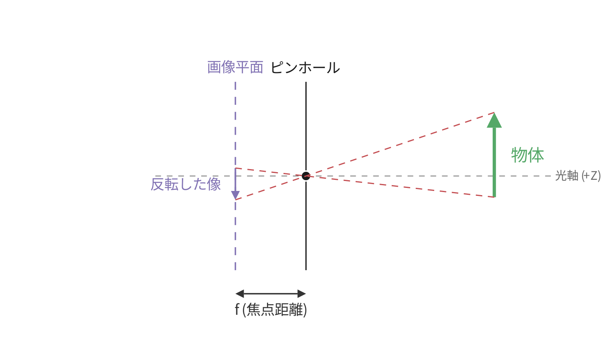

図7.1はピンホールカメラの原理を示しています。3D空間の物体からの光線がピンホール（小さな穴）を通って画像平面に像を結びます。実際のカメラでは像が上下反転しますが、コンピュータビジョンでは画像平面をピンホールの**前方**（被写体側）に移動させた**仮想画像平面**モデルを使い、上下反転を回避します。

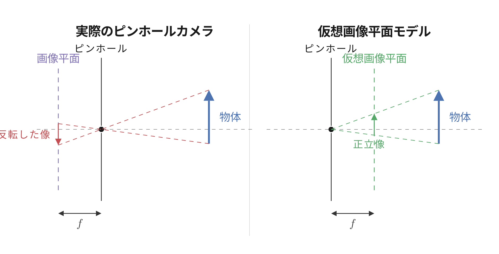

図7.2の左パネルは実際のピンホールカメラです。画像平面がピンホールの**後方**にあるため、光線が交差して像が上下反転します。右パネルが仮想画像平面モデルです。画像平面をピンホールの**前方**に、ピンホールから同じ距離だけ移動させます。こうすると、3D空間の点とピンホールを結ぶ直線がピンホールに到達する前に仮想画像平面と交わるため、像は反転せず正立像になります。以降の実装はすべてこの仮想画像平面モデルに基づきます。

> **発展: 実際のカメラとイメージセンサー**
>
> 現代のスマートフォンやデジタルカメラはピンホールではなく**レンズ**を通して光を集めます。ピンホールだけだと穴を通る光量が少なくて画像が暗くなりノイズだらけになってしまうので、レンズで大量の光を一点に集めて明るくシャープな像を作るというわけです。そして本文で「画像平面」と呼んでいた幾何学的な面には、実物のカメラでは**イメージセンサー**が置かれています。センサーは格子状に並んだ受光素子の集まりで、1つ1つがそのまま1ピクセルになります。3D空間の点が画像平面上のどこに落ちるか、という本章で扱う計算は「その点がセンサー上のどのピクセルに写るか」と同じ意味です。レンズ特有の歪み（広角レンズで直線が曲がって見える等）はカメラキャリブレーションで別途補正するので、幾何計算自体はピンホールモデルで正確に扱えます。3DGSも含む多くのコンピュータビジョン手法は、補正済みの画像を入力としてこのピンホールモデル上で幾何計算を行う、という構成になっています。

---

## 7.2 座標系と変換パイプライン

3D空間の点をピクセル座標に変換するには、3つの座標系を順番に通過させます。

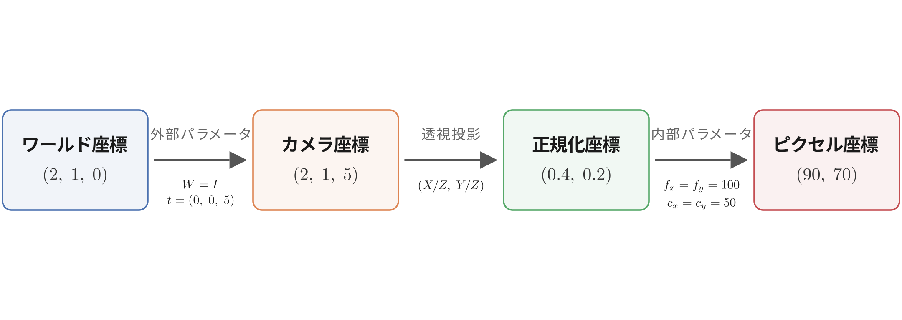

図7.3は変換パイプラインの全体像です。各段階を順に見ていきましょう。

> **発展: 本書で使う座標系の規約**
>
> 3D空間の座標系は右手系/左手系と上方向の取り方で複数の規約があり、Unity や Blender、OpenGL などはそれぞれ異なります。本書は**右手系で Y 下向き**（X 右・Y 下・Z 前方）を採用します。これは OpenCV と COLMAP の規約で、COLMAP データをそのまま扱うため、また 3DGS の主要な実装がこの規約を使っているためです。ワールド座標系とカメラ座標系が同じ Y 下向きなので、カメラが被写体をまっすぐ捉えるときの $\mathbf{W}$ は単位行列で済みます。

### 3つの座標系

**ワールド座標系**は3Dシーン全体の基準となる座標系です。3Dガウシアンの `position` はこの座標系で定義されています。

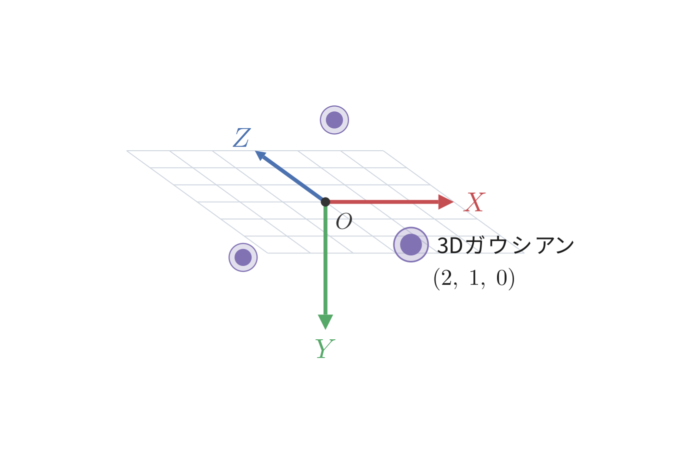

**カメラ座標系**はカメラを原点とし、カメラの光軸をZ軸正方向とする座標系です。カメラを構えている自分自身の視点で考えると分かりやすいでしょう。モニター画面に向かって右がX正方向、下がY正方向、画面の奥（カメラから被写体へ向かう方向）がZ正方向です。Y軸が「下」なのは、画像のピクセル座標が左上を原点として下に増えるのに合わせるためです。

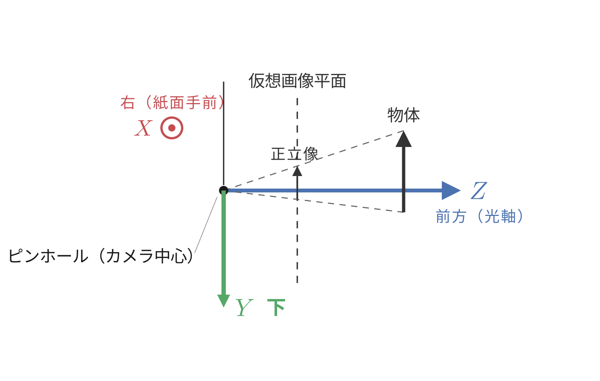

**ピクセル座標系**は画像平面上の座標系で、左上を原点とし、右方向がu軸、下方向がv軸です。最終的に欲しいのはこの座標です。

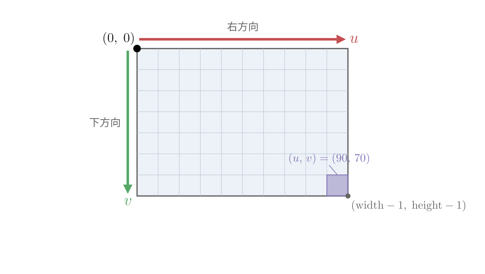

### 変換の3段階

1. **ワールド → カメラ**（外部パラメータ $\mathbf{W}$, $\mathbf{t}$）: カメラの位置と向きに基づいて座標を変換
2. **カメラ → 正規化座標**（透視投影 $X/Z$, $Y/Z$）: 奥行き $Z$ で割って遠近法を適用
3. **正規化座標 → ピクセル**（内部パラメータ $f_x$, $f_y$, $c_x$, $c_y$）: 焦点距離と主点でスケーリング

具体的な数値で追跡してみましょう。ワールド原点から $(2, 1, 0)$ の位置にある点を、カメラが $(0, 0, -5)$ に置かれて $+Z$ 方向を向いて撮影する場合を考えます（カメラに回転はなし）。

以下の表に出てくる $\mathbf{W}$・$\mathbf{t}$・$f_x$・$f_y$・$c_x$・$c_y$ は 7.3 節と 7.4 節で説明します。

| 段階 | 座標 | 説明 |
|------|------|------|
| ワールド座標 | $(2, 1, 0)$ | 3D空間の位置 |
| カメラ座標 | $(2, 1, 5)$ | $\mathbf{W} = I$, $\mathbf{t} = (0, 0, 5)$ で変換した結果。カメラから見て前方5mに点がある |
| 正規化座標 | $(2/5, 1/5) = (0.4, 0.2)$ | $Z = 5$ で割った |
| ピクセル座標 | $(0.4 \times 100 + 50, 0.2 \times 100 + 50) = (90, 70)$ | $f_x = f_y = 100$, $c_x = c_y = 50$ の場合 |

---

## 7.3 外部パラメータ: 回転と平行移動

### カメラの位置と向きを表現する

外部パラメータ（extrinsic parameters）は、ワールド座標系におけるカメラの位置と向きを表します。2つの要素で構成されます。

- **回転行列 $\mathbf{W}$**（3x3）: カメラの向きに合わせてワールド座標の軸を回し直す行列
- **並進ベクトル $\mathbf{t}$**（3要素）: ワールド原点をカメラから見た位置

> **補足: 回転行列の記号について**
>
> コンピュータビジョンの教科書ではカメラの回転行列を $R$ と書くのが一般的ですが、本書では第6章でガウシアン自身の回転行列を $R$ と定義しています。混同を避けるため、カメラの回転行列は $\mathbf{W}$ と表記します。3DGS原論文でも同じ記法が使われています。

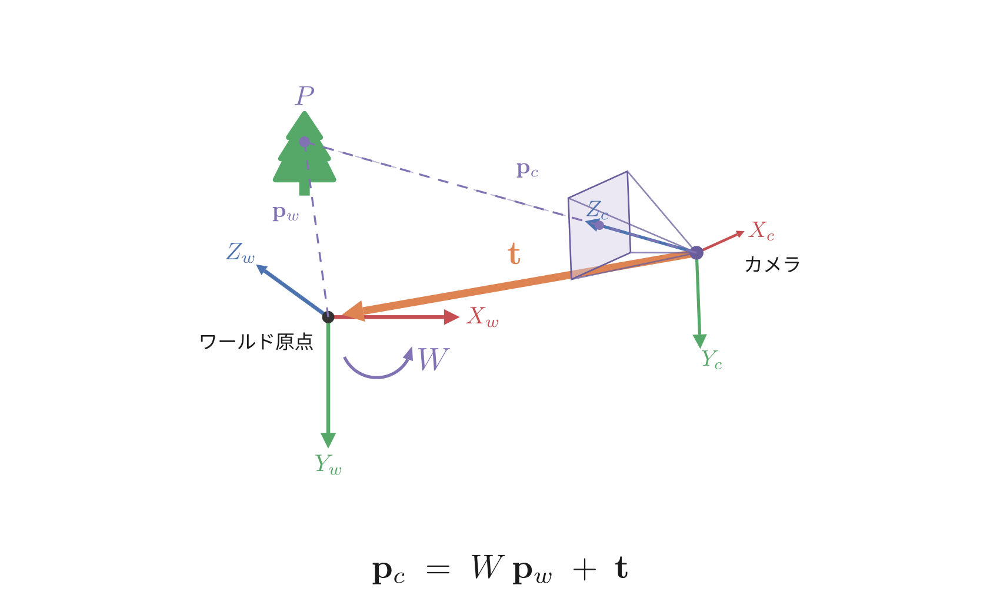

ワールド座標 $\mathbf{p}_w$ からカメラ座標 $\mathbf{p}_c$ への変換は次の式です。

$$
\mathbf{p}_c = \mathbf{W} \mathbf{p}_w + \mathbf{t} \tag{7.1}
$$

$\mathbf{W}$ が座標軸を回転させ、$\mathbf{t}$ が原点をずらします。具体例で確認しましょう。カメラがワールド座標 $(0, 0, -5)$ に置かれ、回転なし（$\mathbf{W} = I$）の場合を考えます。カメラは $Z$ 正方向を見ているので、ワールド原点はカメラの**前方5m**にあります。よって $\mathbf{t} = (0, 0, 5)$ です。カメラの位置 $(0, 0, -5)$ と**符号が逆**になる点に注意してください。

式(7.1)で実際に計算してみます。

- **ワールド原点** $(0, 0, 0)$: $\mathbf{p}_c = (0, 0, 0) + (0, 0, 5) = (0, 0, 5)$ → カメラの前方5m
- **カメラ自身の位置** $(0, 0, -5)$: $\mathbf{p}_c = (0, 0, -5) + (0, 0, 5) = (0, 0, 0)$ → カメラ座標の原点

どちらも正しい結果です。$\mathbf{t}$ は「カメラから見たワールド原点の位置」なので、$+\mathbf{t}$ で足すのが正しい方向です。$-\mathbf{t}$ にすると、ワールド原点がカメラの後方 $(0, 0, -5)$ になってしまいます。

**ここまでのポイント**: 外部パラメータは回転行列 $\mathbf{W}$ と並進ベクトル $\mathbf{t}$ の2つです。$\mathbf{p}_c = \mathbf{W} \mathbf{p}_w + \mathbf{t}$ でワールド座標をカメラ座標に変換します。$\mathbf{W} = I$（回転なし）の場合、$\mathbf{t}$ はカメラ位置の符号反転です。

> **発展: 同次座標による統一表現**
>
> 他の教科書やライブラリでは、$\mathbf{W}$ と $\mathbf{t}$ を1つの4x4行列にまとめて書くことがあります。座標 $(x, y, z)$ に1を追加した $(x, y, z, 1)$ を**同次座標**と呼び、これを使うと回転と平行移動を1回の行列積で表現できます。
>
> $$W2C = \begin{pmatrix} \mathbf{W} & \mathbf{t} \\ \mathbf{0} & 1 \end{pmatrix}$$
>
> この書き方は左上に $\mathbf{W}$（3x3）、右上に $\mathbf{t}$（3x1）を並べた**ブロック行列**です。本書ではこの形式を直接使いませんが、3Dビジョンの資料で頻出する表記なので、ここで形を見ておきましょう。

---

## 7.4 内部パラメータとピンホール投影

### 焦点距離と主点

内部パラメータ（intrinsic parameters）は、カメラのレンズの性質を表します。ピンホールカメラモデルでは4つのパラメータがあります。

- **焦点距離** $f_x$, $f_y$: ピンホールから画像平面までの物理的な距離を、センサーのピクセルサイズで割った値です。たとえば物理的な焦点距離が 5mm でセンサーの1ピクセルが 0.01mm なら、$f_x = 5\,\text{mm} \div 0.01\,\text{mm/pixel} = 500\,\text{pixel}$ です。mm同士が約分されて単位がピクセルになります。値が大きいほど望遠、小さいほど広角です。$f_x$ と $f_y$ の2つがあるのは、カメラセンサーのピクセルが正方形でない場合に $f_x \neq f_y$ となるためです。多くのカメラでは $f_x \approx f_y$ ですが、一般的なモデルとして両方を保持します
- **主点** $c_x$, $c_y$: 光軸（ピンホールを通ってセンサーに垂直に当たる線）がセンサー上で交わる点のピクセル座標です。たとえば 640x480 の画像なら $c_x = 320$, $c_y = 240$ のように画像の中心付近になります

> **発展: カメラ行列K**
>
> これら4つのパラメータを3x3の**カメラ行列**（内部パラメータ行列）$K$ にまとめて書くこともあります。
>
> $$K = \begin{pmatrix} f_x & 0 & c_x \\ 0 & f_y & c_y \\ 0 & 0 & 1 \end{pmatrix}$$
>
> 本書の実装では $K$ を行列として保持せず、各パラメータを個別に使いますが、3Dビジョンの資料で頻出する表記なので形を見ておくとよいでしょう。

### 透視投影: Zで割る = 遠近法

カメラ座標 $(X, Y, Z)$ からピクセル座標 $(u, v)$ への変換は、次の2ステップです。

**ステップ1: 正規化座標（$Z$ で割る）**

$$
x' = \frac{X}{Z}, \quad y' = \frac{Y}{Z}
$$

**ステップ2: ピクセル座標（焦点距離と主点でスケーリング）**

$$
u = f_x \cdot x' + c_x = f_x \cdot \frac{X}{Z} + c_x
$$
$$
v = f_y \cdot y' + c_y = f_y \cdot \frac{Y}{Z} + c_y
$$

ステップ1の「$Z$ で割る」が**透視投影**の核心です。これだけで遠近法（遠いものほど小さく見える）が実現します。

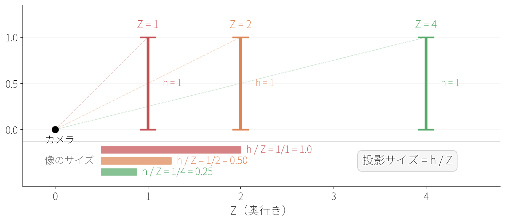

図7.8は透視投影の直感的な説明です。同じサイズの物体（高さ1）を $Z = 1, 2, 4$ の距離に置くと、投影後のサイズは $1/Z$ に比例して $1, 0.5, 0.25$ になります。距離が2倍になると見かけの大きさは半分、4倍なら1/4です。これが「$Z$ で割る」という単純な操作が遠近法を生む仕組みです。

なお、透視投影は深度 $Z$ が正（カメラの前方）であることを前提としています。$Z \leq 0$ の点はカメラの後ろにあるため投影できません。実用的には、$Z$ が小さすぎる点（カメラに近すぎる点）もフィルタリングする必要がありますが、この章では単純なケースのみ扱います。

### 焦点距離の直感

焦点距離 $f_x$, $f_y$ は「どれだけズームしているか」を表します。

- **焦点距離が大きい**（例: $f_x = 500$）→ 望遠レンズ。狭い範囲を拡大して撮影
- **焦点距離が小さい**（例: $f_x = 50$）→ 広角レンズ。広い範囲を撮影

焦点距離を変えると、投影後の座標 $u = f_x \cdot X/Z + c_x$ のスケールが変わります。$f_x$ が大きいほど $X/Z$ のわずかな差が大きなピクセル差になり、望遠レンズで撮影した時のように物体が大きく写ります。

### Cameraクラスの実装

ここまでの理論を `Camera` クラスとして実装しましょう。カメラパラメータは学習で変化させる対象ではなく固定値なので、`Tensor` ではなく通常のNumPy配列とPythonの数値で扱います。

`camera.py` に以下を保存します。

```python exec
"""
カメラモデルと座標変換。
第7章: カメラモデルと座標変換

ピンホールカメラモデルを実装する。
外部パラメータ（W, t）でワールド→カメラ座標変換を、
内部パラメータ（fx, fy, cx, cy）でカメラ座標→ピクセル座標変換を行う。
"""

import numpy as np


class Camera:
    """ピンホールカメラモデル。

    外部パラメータ（カメラの位置と向き）と内部パラメータ（レンズの性質）を
    保持し、ワールド座標系の3D点をピクセル座標に変換する。

    Attributes:
        W: (3, 3) 回転行列（ワールド→カメラ）
        t: (3,) 並進ベクトル（ワールド→カメラ）
        fx: x方向の焦点距離（ピクセル単位）
        fy: y方向の焦点距離（ピクセル単位）
        cx: 主点のx座標（ピクセル単位）
        cy: 主点のy座標（ピクセル単位）
        width: 画像の幅（ピクセル）
        height: 画像の高さ（ピクセル）
    """

    def __init__(self, W, t, fx, fy, cx, cy, width, height):
        """
        Args:
            W: (3, 3) 回転行列（ワールド→カメラ）
            t: (3,) 並進ベクトル（ワールド→カメラ）
            fx: x方向の焦点距離（ピクセル単位）
            fy: y方向の焦点距離（ピクセル単位）
            cx: 主点のx座標（ピクセル単位）
            cy: 主点のy座標（ピクセル単位）
            width: 画像の幅（ピクセル）
            height: 画像の高さ（ピクセル）
        """
        self.W = np.array(R, dtype=np.float64)   # (3, 3)
        self.t = np.array(t, dtype=np.float64)   # (3,)
        self.fx = float(fx)
        self.fy = float(fy)
        self.cx = float(cx)
        self.cy = float(cy)
        self.width = int(width)
        self.height = int(height)

    def world_to_camera(self, points_w):
        """ワールド座標をカメラ座標に変換する。

        カメラ座標 = R @ ワールド座標 + t

        Args:
            points_w: (N, 3) ワールド座標の点群

        Returns:
            (N, 3) カメラ座標の点群
        """
        # (N, 3) @ (3, 3)^T + (3,) = (N, 3)
        points_c = points_w @ self.W.T + self.t
        return points_c

    def project(self, points_c):
        """カメラ座標をピクセル座標に投影する。

        透視投影: u = fx * X/Z + cx, v = fy * Y/Z + cy

        Args:
            points_c: (N, 3) カメラ座標の点群

        Returns:
            pixels: (N, 2) ピクセル座標 [u, v]
            depths: (N,) 深度値 Z
        """
        X = points_c[:, 0]  # (N,)
        Y = points_c[:, 1]  # (N,)
        Z = points_c[:, 2]  # (N,)

        # 透視投影: Zで割ることで遠近法を実現
        u = self.fx * X / Z + self.cx  # (N,)
        v = self.fy * Y / Z + self.cy  # (N,)

        pixels = np.stack([u, v], axis=1)  # (N, 2)
        depths = Z                          # (N,)

        return pixels, depths
```

`Camera` クラスは2つのメソッドを持ちます。

- `world_to_camera`: ワールド座標→カメラ座標。数式 $\mathbf{p}_c = \mathbf{W} \mathbf{p}_w + \mathbf{t}$ の $\mathbf{p}_w$ は `(3, 1)` の列ベクトルですが、点群は `(N, 3)` の配列（各行が1点の行ベクトル）です。このまま `R @ points_w` とすると `(3, 3) @ (N, 3)` で形状が合いません。$(AB)^T = B^T A^T$ を使うと $\mathbf{W} \mathbf{p}_w$ の転置は $\mathbf{p}_w^T \mathbf{W}^T$ となり、行ベクトルに $\mathbf{W}^T$ を右から掛ける形になります。これで `points_w @ W.T + t` と書け、形状は `(N, 3) @ (3, 3) → (N, 3)` で成立します
- `project`: カメラ座標→ピクセル座標。$Z$ で割って焦点距離・主点でスケーリング。深度 $Z$ も返します（後のソートやフィルタリングに使用）

### 動作確認: 基本的な投影

7.2節で手計算した例をコードで確認しましょう。ワールド座標 $(2, 1, 0)$ の点を、$(0, 0, -5)$ に置いたカメラで撮影します。

```python exec
import numpy as np
from camera import Camera

# カメラを (0, 0, -5) に配置（回転なし）
cam = Camera(
    W=np.eye(3),                  # 回転なし
    t=np.array([0.0, 0.0, 5.0]),  # カメラが Z=-5 にいるので t=(0,0,5)
    fx=100.0, fy=100.0,           # 焦点距離
    cx=50.0, cy=50.0,             # 主点（画像中心）
    width=100, height=100,
)

# ワールド座標の1点
points_w = np.array([[2.0, 1.0, 0.0]])

# カメラ座標に変換
points_c = cam.world_to_camera(points_w)
print("カメラ座標:", points_c)
```

```text output
カメラ座標: [[2. 1. 5.]]
```

ワールド座標 $(2, 1, 0)$ に $\mathbf{t} = (0, 0, 5)$ が加わり、カメラ座標は $(2, 1, 5)$ です。カメラから見て前方5mの位置に点があることがわかります。

```python exec
# ピクセル座標に投影
pixels, depths = cam.project(points_c)
print("ピクセル座標:", pixels)
print("深度:", depths)
```

```text output
ピクセル座標: [[90. 70.]]
深度: [5.]
```

$u = 100 \times 2/5 + 50 = 90$、$v = 100 \times 1/5 + 50 = 70$。7.2節の数値例と一致しています。

---

## 7.5 3D点群をカメラで撮影する

カメラモデルの理論を理解し、`Camera` クラスとして実装しました。ここからは実際に3D点群をカメラで撮影して、透視投影の効果を確認しましょう。

### 立方体の8頂点を投影する

理論の確認として、立方体（正六面体）の8つの頂点を異なるカメラ位置から投影してみましょう。これにより、透視投影が3D形状を2D画像にどう写すかを可視化できます。

以下を `project_cube.py` に保存します。まず、立方体の8頂点と12本の辺を定義します。

```python exec
import numpy as np
import math
import matplotlib.pyplot as plt
from camera import Camera

# 立方体の8頂点（中心が原点、辺の長さ2）
vertices = np.array([
    [-1, -1, -1],
    [ 1, -1, -1],
    [ 1,  1, -1],
    [-1,  1, -1],
    [-1, -1,  1],
    [ 1, -1,  1],
    [ 1,  1,  1],
    [-1,  1,  1],
], dtype=np.float64)

# 立方体の12本の辺（頂点のインデックスペア）
edges = [
    (0,1),(1,2),(2,3),(3,0),  # 底面
    (4,5),(5,6),(6,7),(7,4),  # 上面
    (0,4),(1,5),(2,6),(3,7),  # 縦の辺
]
```

### 正面からの撮影

立方体の前方にカメラを置いて撮影します。カメラを $Z = -5$ の位置に置き、$Z$ 正方向を向かせます。

7.3節で説明した通り、$\mathbf{t}$ は「ワールド原点をカメラから見た位置」です。カメラが $Z = -5$（ワールド座標）にあり回転なし（$\mathbf{W} = I$）なので、ワールド原点はカメラの前方 $Z = +5$ にあります。よって $\mathbf{t} = (0, 0, 5)$ です。

```python exec
# 正面カメラ: 立方体の前方 Z=-5 に配置
cam_front = Camera(
    W=np.eye(3),
    t=np.array([0.0, 0.0, 5.0]),
    fx=200.0, fy=200.0,
    cx=150.0, cy=150.0,
    width=300, height=300,
)

points_c = cam_front.world_to_camera(vertices)
pixels, depths = cam_front.project(points_c)
print("正面カメラからの投影:")
for i, (p, d) in enumerate(zip(pixels, depths)):
    print(f"  頂点{i}: pixel=({p[0]:.1f}, {p[1]:.1f}), depth={d:.1f}")
```

```text output
正面カメラからの投影:
  頂点0: pixel=(100.0, 100.0), depth=4.0
  頂点1: pixel=(200.0, 100.0), depth=4.0
  頂点2: pixel=(200.0, 200.0), depth=4.0
  頂点3: pixel=(100.0, 200.0), depth=4.0
  頂点4: pixel=(116.7, 116.7), depth=6.0
  頂点5: pixel=(183.3, 116.7), depth=6.0
  頂点6: pixel=(183.3, 183.3), depth=6.0
  頂点7: pixel=(116.7, 183.3), depth=6.0
```

手前の面（頂点0-3、$Z_c = 4$）は100x100ピクセルの正方形として写り、奥の面（頂点4-7、$Z_c = 6$）は67x67ピクセルのより小さい正方形として写っています。$Z$ が大きい（遠い）ほど小さく写る、透視投影の効果がはっきり見えます。

投影結果を可視化しましょう。先ほど定義した `edges` を使って、頂点と辺を2D画像上に描画します。

```python exec
fig, ax = plt.subplots(figsize=(5, 5))

# 辺を描画
for i, j in edges:
    ax.plot([pixels[i, 0], pixels[j, 0]],
            [pixels[i, 1], pixels[j, 1]],
            color="#4C72B0", linewidth=2, alpha=0.7)

# 頂点を描画
ax.scatter(pixels[:, 0], pixels[:, 1], color="#C44E52", s=50, zorder=5)

ax.set_xlim(0, 300)
ax.set_ylim(300, 0)  # 画像座標系（上が0）
ax.set_xlabel("u (ピクセル)")
ax.set_ylabel("v (ピクセル)")
ax.set_title("正面から")
ax.set_aspect("equal")
ax.grid(alpha=0.15)
plt.tight_layout()
plt.savefig("cube_front.png", dpi=150)
plt.close()
```

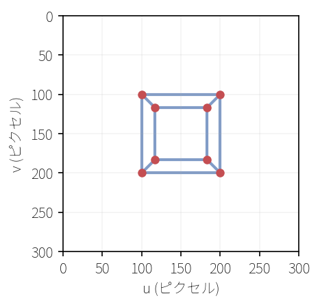

### 斜めからの撮影

次に、カメラを斜めの位置に動かしてみましょう。`project_cube.py` の続きに追加します。$\mathbf{W}$ をY軸周り30度の回転行列に変え、$\mathbf{t} = (0, 0, 5)$ はそのまま維持します。$\mathbf{t} = (0, 0, 5)$ は「ワールド原点がカメラの正面5mにある」という意味なので、$\mathbf{W}$ を変えるとカメラはワールド原点を正面に捉えたまま弧を描くように位置を移動します。

```python exec file=project_cube.py mode=append
# Y軸周りに30度回転する回転行列
angle = math.radians(30)
cos_a, sin_a = math.cos(angle), math.sin(angle)
R_y30 = np.array([
    [ cos_a, 0, sin_a],
    [     0, 1,     0],
    [-sin_a, 0, cos_a],
])
```

> **補足: Y軸周り回転行列の構造**
>
> 第6章ではクォータニオンから回転行列を構築しましたが、ここでは回転角を直接指定して回転行列を書いています。Y軸周りの3D回転は、Y座標を変えずにX-Z平面内で2D回転を行う操作です。上の行列の2行目を見ると $(0, 1, 0)$ で、入力の Y 成分がそのまま出力の Y 成分になります。残りの四隅に $\cos$ と $\sin$ が入っていて、ここが X-Z 平面内の2D回転を担っています。
>
> $\sin$ の符号が第1章の回転行列と逆になっている点に気づいたかもしれません。第1章の $\begin{pmatrix} \cos\theta & -\sin\theta \\ \sin\theta & \cos\theta \end{pmatrix}$ は「点を $\theta$ だけ回す」行列でした。ここでの $\mathbf{W}$ はその転置です。カメラがY軸周りに30度回転した世界を見ているとき、世界の側を逆に-30度回せば同じ見え方になります。「カメラを回す」と「世界を逆に回す」が転置の関係にあるため、$\sin$ の符号が逆転しています。

この回転行列を使ってカメラを作り、まずカメラ座標への変換結果を確認します。正面カメラでは $\mathbf{W} = I$ なのでカメラ座標は自明でしたが、回転が入ると `points_w @ W.T + t` の効果が見えます。

```python exec
# 斜めカメラ: 回転 + カメラの前方5mに立方体
cam_oblique = Camera(
    R=R_y30,
    t=np.array([0.0, 0.0, 5.0]),
    fx=200.0, fy=200.0,
    cx=150.0, cy=150.0,
    width=300, height=300,
)

points_c = cam_oblique.world_to_camera(vertices)
print("斜めカメラのカメラ座標（頂点0, 1）:")
print(f"  頂点0: ({points_c[0, 0]:.4f}, {points_c[0, 1]:.4f}, {points_c[0, 2]:.4f})")
print(f"  頂点1: ({points_c[1, 0]:.4f}, {points_c[1, 1]:.4f}, {points_c[1, 2]:.4f})")
```

```text output
斜めカメラのカメラ座標（頂点0, 1）:
  頂点0: (-1.3660, -1.0000, 4.6340)
  頂点1: (0.3660, -1.0000, 3.6340)
```

頂点0のカメラ座標を手計算で確認しましょう。ワールド座標 $(-1, -1, -1)$ に対して `points_w @ W.T + t` を計算します。

`points_w @ W.T` は各点の行ベクトルと $\mathbf{W}^T$ の各列の内積です。$\mathbf{W}^T$ の各列は $\mathbf{W}$ の対応する行と同じです（転置により行と列が入れ替わるため）。

1. $X_c$: $\mathbf{W}^T$ の第0列は $\mathbf{W}$ の第0行 $(0.866, 0, 0.5)$。内積は $(-1)(0.866) + (-1)(0) + (-1)(0.5) = -1.366$
2. $Z_c$: $\mathbf{W}^T$ の第2列は $\mathbf{W}$ の第2行 $(-0.5, 0, 0.866)$。内積は $(-1)(-0.5) + (-1)(0) + (-1)(0.866) = -0.366$
3. $\mathbf{t}$ を加算: $Z_c = -0.366 + 5 = 4.634$

出力の $(-1.3660, -1.0000, 4.6340)$ と一致しています。

カメラ座標が求まったので、ピクセル座標に投影します。

```python exec
pixels, depths = cam_oblique.project(points_c)
print("\n斜めカメラからの投影:")
for i, (p, d) in enumerate(zip(pixels, depths)):
    print(f"  頂点{i}: pixel=({p[0]:.1f}, {p[1]:.1f}), depth={d:.1f}")
```

```text output
斜めカメラからの投影:
  頂点0: pixel=(91.0, 106.8), depth=4.6
  頂点1: pixel=(170.1, 95.0), depth=3.6
  頂点2: pixel=(170.1, 205.0), depth=3.6
  頂点3: pixel=(91.0, 193.2), depth=4.6
  頂点4: pixel=(138.5, 118.6), depth=6.4
  頂点5: pixel=(200.9, 112.7), depth=5.4
  頂点6: pixel=(200.9, 187.3), depth=5.4
  頂点7: pixel=(138.5, 181.4), depth=6.4
```

カメラが回転したことで、立方体の2つの面が見えるようになりました。右側の面（頂点1, 2, 5, 6側）が近くに、左側の面（頂点0, 3, 4, 7側）が遠くに写っています。正面のときと同じ描画コードで可視化します。

```python exec
fig, ax = plt.subplots(figsize=(5, 5))

for i, j in edges:
    ax.plot([pixels[i, 0], pixels[j, 0]],
            [pixels[i, 1], pixels[j, 1]],
            color="#4C72B0", linewidth=2, alpha=0.7)

ax.scatter(pixels[:, 0], pixels[:, 1], color="#C44E52", s=50, zorder=5)

ax.set_xlim(0, 300)
ax.set_ylim(300, 0)
ax.set_xlabel("u (ピクセル)")
ax.set_ylabel("v (ピクセル)")
ax.set_aspect("equal")
ax.grid(alpha=0.15)
plt.tight_layout()
plt.savefig("cube_oblique.png", dpi=150)
plt.close()
```

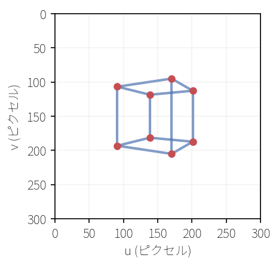

### カメラのワールド座標位置を求める

外部パラメータ $\mathbf{W}$, $\mathbf{t}$ からカメラ自身のワールド座標位置を逆算できます。$\mathbf{p}_c = \mathbf{W} \mathbf{p}_w + \mathbf{t}$ でカメラ原点（$\mathbf{p}_c = 0$）に対応するワールド座標を求めると、$\mathbf{p}_w = -\mathbf{W}^T \mathbf{t}$ です。

正面カメラ（$\mathbf{W} = I$）と斜めカメラ（$\mathbf{W} = R_{y30}$）の両方で計算してみましょう。`project_cube.py` の続きです。

```python exec
# 正面カメラ: R = I, t = (0, 0, 5)
R_front = np.eye(3)
t = np.array([0.0, 0.0, 5.0])
cam_pos_front = -R_front.T @ t
print("正面カメラのワールド座標位置:", cam_pos_front)

# 斜めカメラ: R = R_y30（前のブロックで定義済み）
cam_pos_oblique = -R_y30.T @ t
print("斜めカメラのワールド座標位置:", np.round(cam_pos_oblique, 4))
```

```text output
正面カメラのワールド座標位置: [ 0.  0. -5.]
斜めカメラのワールド座標位置: [ 2.5     0.     -4.3301]
```

正面カメラは $\mathbf{W} = I$ なので $-\mathbf{W}^T \mathbf{t} = -\mathbf{t} = (0, 0, -5)$ です。7.3節で述べた通り、$\mathbf{t}$ の符号を反転するだけでカメラ位置が得られます。斜めカメラでは $\mathbf{W}^T$ が掛かるため、カメラの位置は $(2.5, 0, -4.33)$ とX方向にもずれています。$\mathbf{W}$ を変えてカメラの向きを変えたことで、同じ $\mathbf{t}$ でもワールド座標上のカメラ位置が変わることが分かります。


### 焦点距離の効果

最後に、焦点距離を変えたときの効果を確認しましょう。望遠（fx=400）と広角（fx=80）で同じ立方体を斜めカメラから投影して並べます。

```python exec
fig, axes = plt.subplots(1, 2, figsize=(7, 3.5))

for ax, (fx, title) in zip(axes, [(400, "望遠 (fx=400)"), (80, "広角 (fx=80)")]):
    cam = Camera(
        R=R_y30, t=np.array([0.0, 0.0, 5.0]),
        fx=fx, fy=fx, cx=150.0, cy=150.0,
        width=300, height=300,
    )
    pc = cam.world_to_camera(vertices)
    px, _ = cam.project(pc)

    for i, j in edges:
        ax.plot([px[i, 0], px[j, 0]], [px[i, 1], px[j, 1]],
                color="#4C72B0", linewidth=2, alpha=0.7)
    ax.scatter(px[:, 0], px[:, 1], color="#C44E52", s=25, zorder=5)

    ax.set_xlim(0, 300)
    ax.set_ylim(300, 0)
    ax.set_aspect("equal")
    ax.grid(alpha=0.15)
    ax.set_title(title)

plt.tight_layout()
plt.savefig("focal_comparison.png", dpi=150)
plt.close()
```

焦点距離が5倍（80→400）になると、投影サイズも5倍になります。焦点距離が画像上の物体の大きさを直接制御していることが分かります。

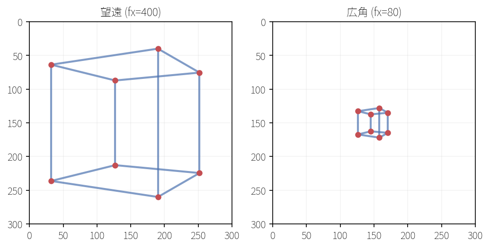

以上で、本章で段階的に構築してきた `project_cube.py` が完成しました。次章ではこのカメラモデルを使って、3Dガウシアンを2Dへ射影する EWA Splatting を実装します。

::widget{name="ch7-camera-projection"}

---

## この章で学んだこと

- **ピンホールカメラモデル**は3D→2D変換の基本。ピンホールを通る光線が画像平面に像を結ぶ原理をモデル化したもの
- **座標変換パイプライン**は3段階: ワールド座標 →（外部パラメータ $\mathbf{W}$, $\mathbf{t}$）→ カメラ座標 →（透視投影 $X/Z$, $Y/Z$）→ 正規化座標 →（内部パラメータ $f_x$, $f_y$, $c_x$, $c_y$）→ ピクセル座標
- **透視投影は「$Z$ で割る」だけ**の単純な式だが、遠近法という豊かな視覚効果を生む。距離が2倍になれば見かけの大きさは半分になる
- **焦点距離**はズームの度合いを制御する。大きいほど望遠、小さいほど広角

