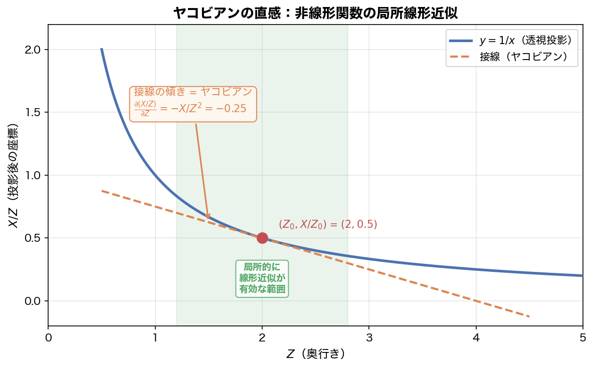
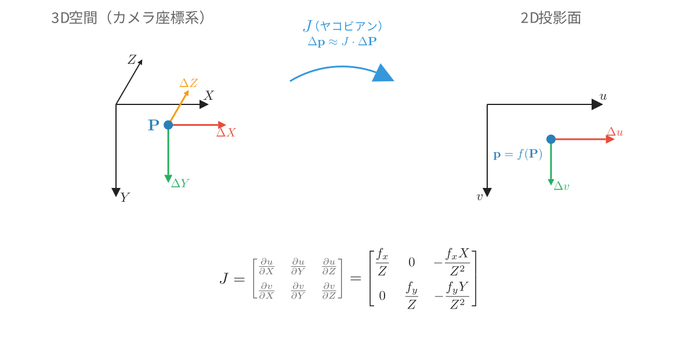
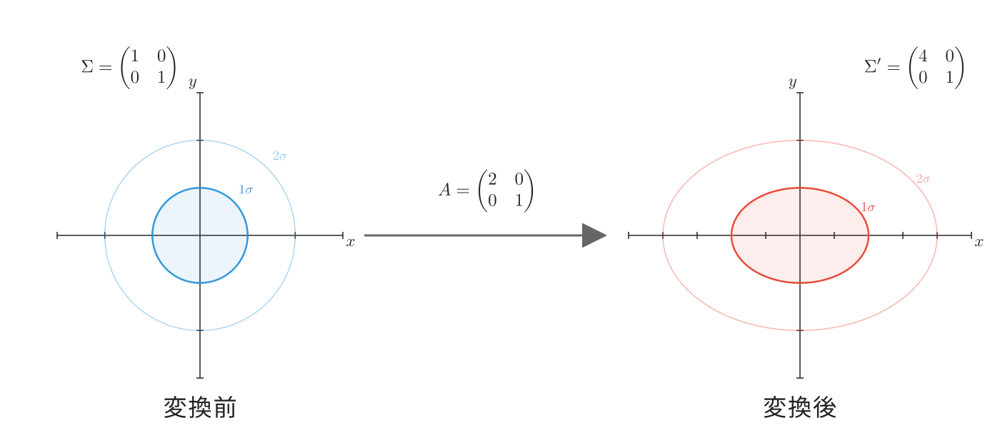
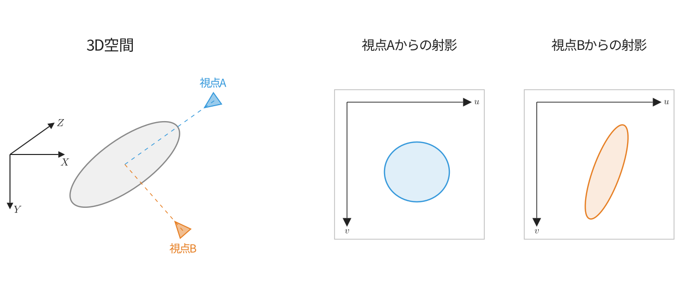
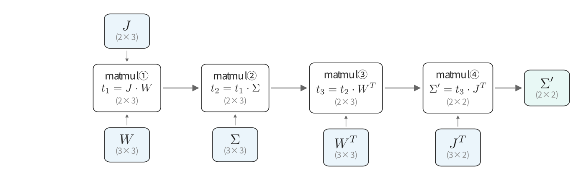
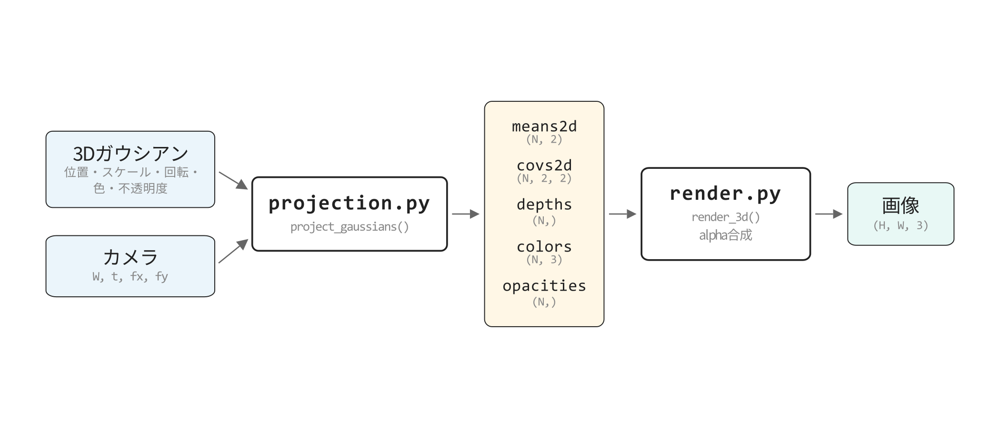
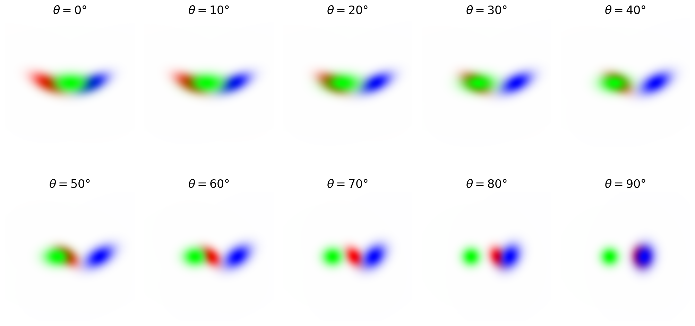

## この章で作るもの

第6章で3Dガウシアン（楕円体）を定義し、第7章でカメラモデルを実装しました。第7章の透視投影を使えば楕円体の中心を2D画像上の点に射影できますが、楕円体の広がり方（共分散）を2Dに変換する方法がまだありません。

ここでガウシアンの便利な性質が役に立ちます。ガウシアンに行列を掛けると、結果もまたガウシアンになります。つまり3Dガウシアンを適切な行列で変換すれば、直接2Dガウシアンが得られるのです。この性質のおかげで、3D共分散行列（$3 \times 3$）から2D共分散行列（$2 \times 2$）への変換が行列演算1回で完了します。3DGSがシーン表現にガウシアンを採用した理由の1つもここにあります。

この章では、この性質を活かした**EWA Splatting**というアルゴリズムを実装します。ガウシアン1つあたりの射影が行列の掛け算で済み、しかもその計算は微分可能なので自動微分で勾配を流せます。これにより、3Dガウシアンを任意のカメラ視点から2D画像に効率的にレンダリングし、学習できるようになります。

> **補足: なぜ点ごとの透視投影ではだめなのか**
>
> 楕円体上の点を大量にサンプリングして1つずつ透視投影すれば、2D上の形は原理的には得られます。しかし3DGSでは数百〜数千のガウシアンを毎フレーム描画し、学習中はそれを何千回も繰り返すため、ガウシアン1つにつき大量の点を投影する方法では計算が追いつきません。さらに、点のサンプリングを介した経路では勾配の逆伝播を追跡するのも困難です。行列演算1回で済むEWA Splattingは、速度と微分可能性の両方を解決します。

### 学習目標

- ヤコビアンによる局所線形近似の数式を理解し、透視投影ヤコビアンを導出できる
- EWA Splatting $\Sigma' = J W \Sigma W^T J^T$ を導出過程とともに理解する
- projection.pyとrender.pyを分離した3Dレンダリングパイプラインを構築できる

### この章で作成・修正するファイル

| ファイル | 種別 | 内容 |
|---------|------|------|
| `projection.py` | 新規 | project_gaussians関数（3D→2D射影） |
| `render.py` | 修正 | render_3d追加 **[v4]** |

### 前提知識

- 第7章: カメラモデルと透視投影
- 第6章: 3Dガウシアンの共分散行列の構築方法

---

## 8.1 ヤコビアン: 非線形変換の局所線形近似

第7章の透視投影で、3D空間の点を2D画像上のピクセルに射影できるようになりました。この章では、3Dガウシアンをカメラで撮影したとき2D画像上にどのような楕円として映るかを計算します。楕円体に透視投影を適用すれば2Dの形が得られそうですが、透視投影は**非線形**な変換なので単純な行列演算では実行できません。そこで、透視投影を**線形近似**して行列演算で扱えるようにします。その近似の道具が**ヤコビアン**です。線形近似の結果、3Dガウシアンの共分散行列から2Dガウシアンの共分散行列への変換が行列演算だけで完了するようになります。

「線形」「非線形」とは何か、なぜ線形だと行列演算で済むのかを順に見ていきましょう。

### 線形と非線形

**線形**（linear）とは、入力を $k$ 倍すると出力も $k$ 倍になる性質のことです。$y = 3x$ は線形です。$x$ を2倍にすれば $y$ も2倍になります。行列の掛け算 $\mathbf{y} = M\mathbf{x}$ も線形です。変換が線形であれば、共分散行列も行列演算だけで変換できます。

一方、$y = 1/x$ や $y = x^2$ は**非線形**です。$x$ を2倍にしても $y$ は2倍になりません。透視投影の式 $u = f_x \cdot X / Z$ は $Z$ が分母にあるため非線形であり、そのままでは共分散を行列演算で変換できません。

しかし、非線形な関数でもある点のごく近くに限れば線形で近似できます。この近似に使う行列がヤコビアンです。ガウシアンの中心点でヤコビアンを求めれば、その近くでは透視投影を線形とみなせるので、共分散の変換が行列演算で完了します。具体的な変換の式は8.2節で導出しますが、まずこの節ではヤコビアン自体を理解しましょう。

### 透視投影は非線形

第7章で実装した透視投影の式は $u = f_x \cdot X/Z + c_x$ でした。ここでは微分を考えるので、定数の加算 $c_x$ は省略して $u = f_x \cdot X/Z$ と書きます（$c_x$ を加えても微分すると消えるため）。同様に $v = f_y \cdot Y/Z$ です。

先ほど述べたとおり、この式は $X$ に対しては線形ですが、$Z$ に対しては非線形です。$Z$ を少し動かしたときの $u$ の変化量は $Z$ の値によって異なります。$Z = 2$ のときと $Z = 10$ のときでは、同じだけ $Z$ を動かしても $u$ の変化量が違います。

しかし、非線形な関数でも、ある特定の点の**ごく近く**では直線で近似できます。曲線上の1点で接線を引くイメージです。



この図は透視投影の $X/Z$ を簡略化して、$f(Z) = X/Z$（$X = 1$ で固定）の曲線を描いています。曲線上の点 $Z_0 = 2$ で接線を引くと、$Z_0$ の近くでは曲線と接線がほぼ一致します。この接線の傾きが微分値 $f'(Z_0) = -X/Z_0^2 = -1/4 = -0.25$ であり、「$Z$ を微小量 $\Delta Z$ 動かすと投影結果は約 $-0.25 \cdot \Delta Z$ だけ変化する」ことを意味します。1変数なら接線の「傾き」ですが、透視投影は $(X, Y, Z)$ の3変数から $(u, v)$ の2変数への変換です。この多変数版の「傾き」を行列にまとめたものが**ヤコビアン**（Jacobian matrix）です。以降は単に**ヤコビアン**と呼びます。

### ヤコビアンの定義

透視投影 $\mathbf{f}(X, Y, Z) = (u, v)$ のように、入力が $n$ 個、出力が $m$ 個の関数の各偏微分を行列にまとめたものがヤコビアンです。$m \times n$ の行列で、各要素は次のように定義されます。

$$
J_{ij} = \frac{\partial f_i}{\partial x_j}
$$

$J_{ij}$ は「入力の第 $j$ 成分を微小量動かしたとき、出力の第 $i$ 成分がどれだけ変化するか」を表します。

透視投影の場合、出力が $(u, v)$ の2つ、入力が $(X, Y, Z)$ の3つなので、ヤコビアンは $2 \times 3$ の行列です。

$$
J = \begin{pmatrix} \frac{\partial u}{\partial X} & \frac{\partial u}{\partial Y} & \frac{\partial u}{\partial Z} \\ \frac{\partial v}{\partial X} & \frac{\partial v}{\partial Y} & \frac{\partial v}{\partial Z} \end{pmatrix}
$$

### 透視投影ヤコビアンの導出

各偏微分を解析的に導出しましょう。偏微分は「注目する変数以外を定数として微分する」操作でした（第4章）。

それでは $u = f_x \cdot X/Z$ の各偏微分を1つずつ計算していきましょう。

**$\partial u / \partial X$**: $Z$ を定数として扱い、$X$ で微分します。

$$
\frac{\partial u}{\partial X} = \frac{f_x}{Z}
$$

$X$ の係数 $f_x / Z$ がそのまま出てきます。

**$\partial u / \partial Y$**: $u = f_x \cdot X / Z$ には $Y$ が含まれていません。

$$
\frac{\partial u}{\partial Y} = 0
$$

$u$ は $Y$ に無関係なのでゼロです。横方向の投影結果は縦方向のカメラ座標に影響されません。

**$\partial u / \partial Z$**: $u = f_x \cdot X \cdot Z^{-1}$ を $Z$ で偏微分します。$X$ は定数として扱います。$Z^{-1}$ を $Z$ で微分すると $(-1) \cdot Z^{-2} = -1/Z^2$ です（べき乗の微分 $x^n \to nx^{n-1}$ で $n = -1$）。

$$
\frac{\partial u}{\partial Z} = f_x \cdot X \cdot (-Z^{-2}) = -\frac{f_x X}{Z^2}
$$

$Z$ が大きくなると $u$ は小さくなる（遠ざかると小さく映る）ので、負の値になるのは直感に合います。

同様に $v = f_y \cdot Y / Z$ についても計算します。

$$
\frac{\partial v}{\partial X} = 0, \quad \frac{\partial v}{\partial Y} = \frac{f_y}{Z}, \quad \frac{\partial v}{\partial Z} = -\frac{f_y Y}{Z^2}
$$

### 透視投影ヤコビアン

以上をまとめると、透視投影のヤコビアンは次のようになります。

$$
J = \begin{pmatrix} \frac{f_x}{Z} & 0 & -\frac{f_x X}{Z^2} \\ 0 & \frac{f_y}{Z} & -\frac{f_y Y}{Z^2} \end{pmatrix}
$$



図8.1はこのヤコビアンの幾何学的な意味を示しています。3D空間での微小変位 $\Delta \mathbf{P}$ がヤコビアン $J$ を通じて2D投影面上の微小変位 $\Delta \mathbf{p}$ に変換されます。行列の構造を見ると、$X$ を動かすと $u$ のみが変化し（1行目の $f_x/Z$）、$Y$ を動かすと $v$ のみが変化します（2行目の $f_y/Z$）。一方、$Z$ を動かすと $u$ と $v$ の両方が変化します（$-f_x X / Z^2$ と $-f_y Y / Z^2$、奥行きが変わると投影位置が全体的にずれるため）。

重要な性質として、**ヤコビアンは点の位置 $(X, Y, Z)$ に依存**します。つまり、点ごとに異なるヤコビアンが得られます。$Z$ が大きい（遠い）点ほど $f_x / Z$ が小さくなり、3D空間での微小な動きが2D上ではより小さく映ります。これは遠くの物体ほど「動きにくく見える」という日常的な経験と一致します。

導出結果をNumPyで確認してみましょう。点 $(1, 2, 5)$、焦点距離 $f_x = f_y = 100$ でヤコビアンを手計算で組み立てます。

```python exec
import numpy as np

fx, fy = 100.0, 100.0
X, Y, Z = 1.0, 2.0, 5.0

J = np.array([
    [fx / Z,    0.0, -fx * X / Z**2],
    [   0.0, fy / Z, -fy * Y / Z**2],
])
print(J)
```

```text output
[[ 20.   0.  -4.]
 [  0.  20.  -8.]]
```

$f_x / Z = 100 / 5 = 20$、$-f_x X / Z^2 = -100 \cdot 1 / 25 = -4$ など、導出した式と一致しています。

第3章の数値微分と同じ中心差分法でも検算できます。各入力を $\pm\epsilon$ だけずらして出力の変化率を計算します。

```python exec
eps = 1e-6

def project(X, Y, Z):
    return np.array([fx * X / Z, fy * Y / Z])

J_numerical = np.zeros((2, 3))
J_numerical[:, 0] = (project(X + eps, Y, Z) - project(X - eps, Y, Z)) / (2 * eps)
J_numerical[:, 1] = (project(X, Y + eps, Z) - project(X, Y - eps, Z)) / (2 * eps)
J_numerical[:, 2] = (project(X, Y, Z + eps) - project(X, Y, Z - eps)) / (2 * eps)
print(np.round(J_numerical, 4))
```

```text output
[[ 20.   0.  -4.]
 [  0.  20.  -8.]]
```

解析的に導出した値と一致しています。8.3節ではこの計算をバッチ処理する `compute_jacobian` 関数として実装します。

---

## 8.2 EWA Splattingの導出

8.1節で透視投影のヤコビアンを導出しました。このヤコビアンを使って、第6章で構築した3D共分散行列 $\Sigma$（$3 \times 3$）を2D共分散行列 $\Sigma'$（$2 \times 2$）に変換する式を導出しましょう。

### 線形な変換と共分散の関係

ガウシアンに行列 $A$ による線形な変換を適用すると、共分散行列はどう変わるでしょうか。



図8.5の例を見てみましょう。変換前のガウシアンは共分散 $\Sigma = \begin{pmatrix} 1 & 0 \\ 0 & 1 \end{pmatrix}$ の円形です。このガウシアン上の各点 $(x, y)$ に行列 $A = \begin{pmatrix} 2 & 0 \\ 0 & 1 \end{pmatrix}$ を掛けます。

$$
\begin{pmatrix} x' \\ y' \end{pmatrix} = \begin{pmatrix} 2 & 0 \\ 0 & 1 \end{pmatrix} \begin{pmatrix} x \\ y \end{pmatrix} = \begin{pmatrix} 2x \\ y \end{pmatrix}
$$

各点のx座標が2倍になるので、円が横長の楕円に変形します。変換後のx方向の分散は $1 \to 4$（$= 2^2$）に増えています。

変換後の共分散 $\Sigma'$ は、次の式で変換前の $\Sigma$ から計算できます。

$$
\Sigma' = A \Sigma A^T
$$

図8.5の例で確認してみましょう。

$$
\Sigma' = A \Sigma A^T = \begin{pmatrix} 2 & 0 \\ 0 & 1 \end{pmatrix} \begin{pmatrix} 1 & 0 \\ 0 & 1 \end{pmatrix} \begin{pmatrix} 2 & 0 \\ 0 & 1 \end{pmatrix} = \begin{pmatrix} 4 & 0 \\ 0 & 1 \end{pmatrix}
$$

x方向の分散が $2^2 = 4$ 倍になっており、図と一致します。この例では $A$ が対角行列だったので2乗が見えやすいですが、$A$ が回転を含む一般の行列でもこの式は成り立ちます。

この $A \Sigma A^T$ という「両側から挟む」構造は、第6章で $R S S^T R^T$ として登場したサンドイッチ積と同じ形です。あのときは回転 $R$ でスケール行列を挟みましたが、今回は任意の行列 $A$ で共分散行列を挟んでいます。


### 透視投影への適用

ここまでの例は2D→2Dの変換（$2 \times 2$ の行列 $A$）でしたが、$\Sigma' = A \Sigma A^T$ の式は $A$ が長方形の行列でも成り立ちます。透視投影は3D→2Dの変換なので、$A$ が $2 \times 3$ の行列であれば、$3 \times 3$ の共分散行列 $\Sigma$ から $2 \times 2$ の共分散行列 $\Sigma'$ が得られます。

しかし、透視投影 $u = f_x X / Z$ は $X$ と $Z$ の商であり、非線形な変換です。$\Sigma' = A \Sigma A^T$ は行列 $A$ で表せる線形な変換にしか使えません。

ここでヤコビアンが登場します。8.1節で見たように、非線形な変換でもヤコビアンを使えば局所的に線形近似できます。ガウシアンの中心 $\boldsymbol{\mu}$ の位置でヤコビアン $J$（$2 \times 3$ の行列）を計算すれば、$\Sigma' = A \Sigma A^T$ の $A$ の代わりに $J$ を使えます。

> **補足: なぜこの近似で十分なのか**
>
> ガウシアンの値は中心から離れると急速にゼロに近づきます。つまり、ガウシアンが「効いている」領域は中心のごく近くに限られます。その狭い領域では、ヤコビアンによる1次近似は十分な精度を持ちます。近似が粗くなるほど中心から離れた場所は、そもそもガウシアンの値がほぼゼロなので、近似誤差が実質的に無視できるのです。近似の精度が悪い場所と、ガウシアンの値が大きい場所が重ならない、これがEWA Splattingで1次近似が実用上問題にならない理由です。

### 変換の全体像

3D共分散行列を2Dに射影する全体の流れは次のとおりです。

1. **ワールド座標 → カメラ座標**（線形変換: 回転行列 $W$）: 共分散は $W \Sigma W^T$ に変換される
2. **カメラ座標 → 2D投影**（非線形変換のヤコビアン近似 $J$）: 透視投影を線形近似。共分散は $J (W \Sigma W^T) J^T$ に変換される

ここで $W$ は第7章で定義したワールド→カメラの回転行列です。

平行移動は共分散に影響しないため、回転部分だけを考えます。結果として、2D共分散行列は次のようになります。

$$
\Sigma' = J W \Sigma W^T J^T
$$

これが**EWA Splatting**の核心の式です。EWAは "Elliptical Weighted Average"（楕円加重平均 -- 楕円形の重みでピクセル値を平均する手法）の略で、元々はテクスチャマッピングの技法として提案されました。3DGSではこの技法を使って3Dガウシアンを2Dに射影しています。



図8.2はEWA Splattingの結果を視覚化したものです。同じ楕円体でも、正面から見ると丸く、横から見ると細長く見えます。$\Sigma' = J W \Sigma W^T J^T$ の式で言えば、ガウシアン自身の共分散 $\Sigma$ は同じですが、カメラの位置と向きが変わると $W$（ワールド→カメラの回転）が変わり、さらにカメラ座標での点の位置も変わるため $J$（ヤコビアン）も変わります。この $W$ と $J$ の違いが、視点ごとに異なる2D楕円を生み出しています。

::widget{name="ch8-ewa"}

### matmul連鎖への分解

$\Sigma' = J W \Sigma W^T J^T$ は5つの行列の積ですが、第6章で実装した `matmul` は2入力の行列積なので、4ステップの連鎖に分解して計算します。



図8.3に示すように、4つのmatmulに分解します。

$$
t_1 = J \cdot W \quad (2 \times 3) \cdot (3 \times 3) = (2 \times 3)
$$
$$
t_2 = t_1 \cdot \Sigma \quad (2 \times 3) \cdot (3 \times 3) = (2 \times 3)
$$
$$
t_3 = t_2 \cdot W^T \quad (2 \times 3) \cdot (3 \times 3) = (2 \times 3)
$$
$$
t_4 = t_3 \cdot J^T \quad (2 \times 3) \cdot (3 \times 2) = (2 \times 2)
$$

各ステップは第6章で実装済みの `matmul` 演算なので、backwardも自動的に処理されます。$\Sigma$ と $J$ はともに `Tensor` 演算で構築します。$\Sigma$ からはスケール・クォータニオンへ、$J$ からはカメラ座標 `pos_cam` を経由して位置パラメータへと勾配が流れます。$W$ はカメラの回転行列で学習対象ではないので、勾配は計算されますがオプティマイザには渡しません（8.3節で詳しく見ます）。

---

## 8.3 projection.py（射影モジュール新設）

### 射影とレンダリングの分離

EWA Splattingの数学的な基盤が整ったので、実装に入ります。3Dガウシアンを2Dに射影するモジュール `projection.py` を新設します。これまで `render.py` が2Dの合成を担当してきましたが、3D→2Dの射影は本質的に別の処理です。



図8.4に示すように、パイプラインを2段構成に分離します。

- **projection.py**: 3Dガウシアン → 2D平均・2D共分散・深度・色・不透明度に変換
- **render.py**: 2Dの平均・共分散・色・不透明度を受け取って画像を合成

この分離により、各モジュールの責務が明確になり、テストやデバッグが容易になります。

### compute_jacobian関数

まず、8.1節で導出した透視投影のヤコビアンを計算する関数を実装します。`projection.py` に以下を保存します。

```python exec
"""
射影モジュール: 3Dガウシアンを2Dに射影する。
第8章: EWA Splatting

3Dガウシアンの平均・共分散をカメラパラメータを使って
2D画像平面上の平均・共分散に変換する。
EWA Splatting (Sigma' = J W Sigma W^T J^T) を実装。
"""

import numpy as np
from autograd import Tensor, stack


def compute_jacobian(point_c, fx, fy):
    """透視投影のヤコビアンを計算する。

    J = [[fx/Z,    0, -fx*X/Z^2],
         [   0, fy/Z, -fy*Y/Z^2]]

    Args:
        point_c: (3,) カメラ座標の点（Tensor）
        fx: x方向の焦点距離
        fy: y方向の焦点距離

    Returns:
        (2, 3) のヤコビアン（Tensor）。位置への勾配が流れる。
    """
    X = point_c[0]
    Y = point_c[1]
    Z = point_c[2]

    # 各要素を計算
    j00 = fx / Z
    j02 = -fx * X / (Z ** 2)
    j11 = fy / Z
    j12 = -fy * Y / (Z ** 2)

    # 2x3行列を組み立てる。stackにはTensorしか渡せないので
    # 定数の 0 も Tensor にしておく
    zero = Tensor(0.0)
    row0 = stack([j00, zero, j02], axis=0)  # (3,)
    row1 = stack([zero, j11, j12], axis=0)  # (3,)
    J = stack([row0, row1], axis=0)  # (2, 3)

    return J
```

8.1節の数式をそのままコードに落としています。入力はカメラ座標の `Tensor` で、出力は `(2, 3)` の `Tensor` です。`Tensor` 演算で組み立てているので、$J$ を通じて入力の `point_c` まで勾配が流れます。後述の `project_gaussians` ではこの関数にガウシアンのカメラ座標 `pos_cam` を渡すので、$J$ を通じて位置パラメータまで勾配が伝播します。

行列の各要素を個別のTensorとして計算し、`stack` で行を組み立てています。NumPy配列のように `J[0, 0] = fx/Z` のような要素代入は `Tensor` では使えません（計算グラフが記録できないため）。代わりに、各要素を別々に計算して最後に `stack` で一つの行列にまとめるのが `Tensor` での行列組立の定石です。

### project_gaussians関数: カリング部分

続いて `projection.py` の末尾に `project_gaussians` 関数を追加します。まずは関数の骨格と、**カリング**（culling: 描画に不要なガウシアンを事前に除外する処理）の部分を見ましょう。

カリングでは次の2つの判定でガウシアンを除外します。

1. **カメラ背面チェック**: カメラ座標の $Z \leq 0.1$ のガウシアンを除外する。$Z = 0$ だと透視投影の $X / Z$ でゼロ除算になり、$Z < 0$ はカメラの後ろにあるので映らない。カメラに極端に近いガウシアン（$0 < Z \leq 0.1$）も合わせて切っておく
2. **画面外チェック**: 中心のピクセル座標 $(u, v)$ が画面の範囲外ならそのガウシアンは映らない。ただしガウシアンは中心から裾に向かって広がる分布なので、中心が少し画面外でも裾が画面内に入ることがある。`margin = 100` ピクセルの余裕を持たせて判定する

どちらの判定も「このガウシアンを表示するかどうか」という離散的な分岐なので、勾配を流す必要はなく、NumPyで高速に処理します。

```python exec file=projection.py mode=append
def project_gaussians(gaussians, camera):
    """3Dガウシアン群をカメラで撮影し、2Dパラメータに変換する。

    各ガウシアンに対して:
    1. 平均をワールド→カメラ座標に変換し、透視投影でピクセル座標を得る
    2. EWA Splatting (Sigma' = J W Sigma W^T J^T) で2D共分散を計算
    3. カメラ背面・画面外のガウシアンをカリングする

    Args:
        gaussians: Gaussian3D オブジェクトのリスト
        camera: Camera オブジェクト

    Returns:
        means2d: Tensor のリスト。各要素は (2,) のピクセル座標
        covs2d: Tensor のリスト。各要素は (2, 2) の2D共分散行列
        depths: float のリスト。深度値（ソート用）
        colors: Tensor のリスト。各要素は (3,) のRGB色
        opacities: Tensor のリスト。各要素は () のスカラー不透明度
        indices: int のリスト。カリング後の元のインデックス
    """
    means2d = []
    covs2d = []
    depths = []
    colors = []
    opacities = []
    indices = []

    # W（回転行列）をTensorに変換（勾配は流さない定数）
    W = Tensor(camera.W)  # (3, 3)

    for i, g in enumerate(gaussians):
        # --- 1. カリング判定（NumPyで高速に行う）---
        pos_np = g.position.data  # (3,)
        point_c = camera.W @ pos_np + camera.t  # (3,)

        # カメラ背面チェック: Z <= 0.1 のガウシアンは除外
        # Z=0だと透視投影の除算でゼロ除算になるのを防ぎ、
        # カメラに極端に近いガウシアンも除外する
        if point_c[2] <= 0.1:
            continue

        # 透視投影でピクセル座標を計算（カリング判定用）
        u = camera.fx * point_c[0] / point_c[2] + camera.cx
        v = camera.fy * point_c[1] / point_c[2] + camera.cy

        # 画面外チェック: マージンを持たせて判定
        # ガウシアンの裾は中心から離れた位置まで広がるため、
        # 中心が画面外でも裾が画面内に入る可能性がある
        margin = 100
        if (u < -margin or u > camera.width + margin or
                v < -margin or v > camera.height + margin):
            continue
```

最初に `W = Tensor(camera.W)` と、カメラの回転行列を `Tensor` にラップしています。後のEWA計算部分で `Tensor` 同士の行列積に使うためです。カメラパラメータは学習対象ではないので勾配は計算されますがオプティマイザには渡しません。

### project_gaussians関数: 2D平均とEWA Splatting

カリングを通過したガウシアンに対して、2D平均の計算とEWA Splattingを行います。上のコードブロックの最終行 `continue` の直後に、同じインデントレベル（forループの内側）で以下のコードを追加してください。`continue` はif文の中で実行されるもので、if文に該当しなかったガウシアン（= カリングされなかったガウシアン）に対して、以下の処理が続きます。

以下のコードでは、カリング判定でNumPyを使って計算した `point_c`（カメラ座標）と同じ座標変換を`Tensor`演算で改めて行います。ガウシアンの3D位置をワールド座標からカメラ座標に変換し、透視投影でピクセル座標 $(u, v)$ を得ます。カリング時のNumPy計算と同じ数式ですが、`Tensor` 演算で書くことで位置パラメータへ勾配が流れるようになります。

> **補足: なぜ同じ座標変換を2回計算するのか**
>
> 最初から全て`Tensor`演算で行うと、カリングで除外されるガウシアンについても計算グラフを構築するコストが発生してしまいます。一方でNumPyの計算結果には計算グラフが記録されないため、位置パラメータへの勾配を流せません。そこで、カリング判定はNumPyで高速に篩い落とし、通過したガウシアンだけ`Tensor`演算で2D平均を計算し直す、という二段構えにしています。

```python
        # （forループ内、画面外チェックの continue の後に続く）

        # --- 2. 2D平均をTensor演算で計算（位置への勾配を流すため）---
        pos_col = g.position.reshape(3, 1)               # (3,) → (3, 1)
        rotated = W.matmul(pos_col)                      # (3, 3) @ (3, 1) = (3, 1)
        pos_cam = rotated.reshape(3) + Tensor(camera.t)  # (3,) に戻して平行移動
        z = pos_cam[2]
        mean_u = camera.fx * pos_cam[0] / z + camera.cx
        mean_v = camera.fy * pos_cam[1] / z + camera.cy
        mean2d = stack([mean_u, mean_v], axis=0)         # (2,)

        # --- 3. 共分散の射影（EWA Splatting）---
        cov3d = g.get_covariance()  # (3, 3) Tensor

        # ヤコビアン（pos_camからTensor演算で計算し、位置への勾配を流す）
        J = compute_jacobian(pos_cam, camera.fx, camera.fy)  # (2, 3)

        # W^T と J^T
        W_T = W.transpose(1, 0)  # (3, 3)
        J_T = J.transpose(1, 0)  # (3, 2)

        # Sigma' = J @ W @ Sigma @ W^T @ J^T（4ステップのmatmul連鎖）
        t1 = J @ W          # (2, 3) @ (3, 3) = (2, 3)
        t2 = t1 @ cov3d     # (2, 3) @ (3, 3) = (2, 3)
        t3 = t2 @ W_T       # (2, 3) @ (3, 3) = (2, 3)
        t4 = t3 @ J_T       # (2, 3) @ (3, 2) = (2, 2)

        cov2d = t4  # (2, 2) Tensor

        # --- 4. 結果を蓄積 ---
        means2d.append(mean2d)
        covs2d.append(cov2d)
        depths.append(float(point_c[2]))
        colors.append(g.color)
        opacities.append(g.get_opacity())
        indices.append(i)

    return means2d, covs2d, depths, colors, opacities, indices
```

位置ベクトルを `(3,)` のまま `W @ pos` と書きたくなりますが、第6章で実装した `Tensor.matmul` は「最後の2次元で行列積を行う」仕様なので1次元テンソルには対応していません。そこで `(3, 1)` にreshapeして「3行1列の行列」として扱い、$(3, 3) \times (3, 1) = (3, 1)$ の行列積を計算した後、再び `(3,)` に戻して平行移動を加えています。

EWA Splattingの部分は8.2節の $\Sigma' = J W \Sigma W^T J^T$ を4ステップのmatmul連鎖で計算しています。$\Sigma$ からはスケール・クォータニオンへ、$J$ からは `pos_cam` 経由で位置パラメータへと勾配が逆伝播します。

### 動作確認: 球状ガウシアンの射影

球状ガウシアン（3軸のスケールが等しい）はどの角度から見ても円に射影されるはずです。確認してみましょう。

球状ガウシアンは `scale_raw` が全て `0.0` なので `exp(0) = 1` となり、3軸とも同じスケール（球状）になります。

> **補足**: 第6章で導入したように、スケールには `exp` 活性化をかけて常に正の値になるよう保証しています。生パラメータ `scale_raw` は実数全体を取りえますが、実際のスケールは `exp(scale_raw)` で得られます。したがって `scale_raw = 0` は実スケール `1.0` に対応します。

```python exec
import numpy as np
from gaussian3d import Gaussian3D
from camera import Camera
from projection import project_gaussians

# 球状ガウシアン（スケールが3軸とも等しい）
g = Gaussian3D(
    position=[0.0, 0.0, 0.0],
    scale_raw=[0.0, 0.0, 0.0],   # exp(0) = 1, 3軸とも同じ
    quaternion_raw=[1.0, 0.0, 0.0, 0.0],
    opacity_raw=0.0,
    color=[1.0, 0.0, 0.0],
)

# 正面カメラ
cam = Camera(
    R=np.eye(3), t=np.array([0.0, 0.0, 5.0]),
    fx=100.0, fy=100.0, cx=32.0, cy=32.0,
    width=64, height=64,
)

means2d, covs2d, depths, colors, opacities, indices = project_gaussians([g], cam)
print("2D共分散行列:")
print(covs2d[0].data)
```

```text output
2D共分散行列:
[[400.   0.]
 [  0. 400.]]
```

対角要素が等しく、非対角要素がゼロです。2D上でも円（等方的なガウシアン）になることを意味します。値の由来を確認しましょう。`scale_raw = [0, 0, 0]` なので

$$
S = \begin{pmatrix} \exp(0) & 0 & 0 \\ 0 & \exp(0) & 0 \\ 0 & 0 & \exp(0) \end{pmatrix} = \begin{pmatrix} 1 & 0 & 0 \\ 0 & 1 & 0 \\ 0 & 0 & 1 \end{pmatrix} = I
$$

です。したがって $\Sigma = R S S^T R^T = I$ となります。回転なし（$R = I$）、中心が原点（$X = Y = 0$）なので、ヤコビアンは

$$
J = \begin{pmatrix} f_x/Z & 0 & 0 \\ 0 & f_y/Z & 0 \end{pmatrix}
$$

となり、$\Sigma' = J \Sigma J^T = J J^T$ の (0,0) 要素は $(f_x/Z)^2 = (100/5)^2 = 400$ です。出力された対角要素 `400` と一致しており、非対角要素も `0` なので、球状ガウシアンが等方的な2Dガウシアンに射影されたことが確認できます。

射影が正しく機能していることが確認できました。視点を変えると射影形状がどう変わるかは、次節で `render_3d` を完成させた後に実際の画像で確かめます。

---

## 8.4 3Dシーンのレンダリング [render.py v4]

### projection.pyの出力をrender.pyに渡す

`projection.py` で3Dガウシアンを2Dに射影できるようになりました。あとは、この2Dパラメータを第5章の `render_gaussians_alpha_composite_tensor`（v3）に渡すだけです。`render.py` に `render_3d` 関数を追加し、射影からレンダリングまでの一連の流れを1つの関数にまとめます。

`render.py` の末尾に以下の関数を追加します。

```python exec file=render.py mode=append
def render_3d(gaussians, camera, bg_color=(0, 0, 0)):
    """[v4] 3Dガウシアンをカメラで撮影して2D画像を生成する。

    projection.pyで3D→2D射影を行い、v3のalpha合成レンダラーに渡す。

    Args:
        gaussians: Gaussian3D オブジェクトのリスト
        camera: Camera オブジェクト
        bg_color: 背景色 (R, G, B)。値域 [0, 1]

    Returns:
        (H, W, 3) のRGB画像 Tensor
    """
    # 関数内importにすることで、render.pyの他の関数（v1〜v3）が
    # projection.pyなしでも動作するようにしています。
    from projection import project_gaussians

    # 3Dガウシアンを2Dに射影
    means2d, covs2d, depths, colors, opacities, indices = \
        project_gaussians(gaussians, camera)

    # カリング後にガウシアンが残っていない場合
    if len(means2d) == 0:
        return Tensor(np.zeros((camera.height, camera.width, 3)))

    # v3のalpha合成レンダラーに渡す
    return render_gaussians_alpha_composite_tensor(
        means=means2d,
        covs=covs2d,
        colors=colors,
        opacities=opacities,
        depths=depths,
        H=camera.height,
        W=camera.width,
        bg_color=bg_color,
    )
```

v3の `render_gaussians_alpha_composite_tensor` はそのまま残します。`render_3d` は射影とレンダリングを橋渡しする薄いラッパーです。

### 動作確認: 3Dシーンのレンダリング

3つの色付き楕円ガウシアンを3D空間に配置し、カメラを Y軸まわりに $0°$ から $90°$ まで $10°$ 刻みで回転させてレンダリングしてみましょう。3つともX方向に細長い楕円体 (アスペクト比 2:1) で、赤と青は Z軸まわりに $\pm 25°$ 回転させて画像内で斜めに見えるようにしています。視点が変わると3つのガウシアンの空間配置・前後関係 (α合成の順序) ・楕円形状そのものがどう変化するかを確認します。

以下を `ewa_demo.py` として保存し、実行してください。

```python exec file=ewa_demo.py
import os
import numpy as np
import math
import matplotlib.pyplot as plt
from gaussian3d import Gaussian3D
from camera import Camera
from render import render_3d

# 楕円: 長軸 0.3 / 短軸 0.15 (アスペクト比 2:1)
s_long = math.log(0.3)
s_short = math.log(0.15)

# 赤・青の傾き: Z軸まわり ±25° (画像内で斜めに見える)
half = math.radians(12.5)
q_tilt_pos = [math.cos(half), 0.0, 0.0, math.sin(half)]
q_tilt_neg = [math.cos(half), 0.0, 0.0, -math.sin(half)]
q_id = [1.0, 0.0, 0.0, 0.0]

gaussians = [
    # 赤: 斜め(右下がり)に伸びた楕円、後方左
    Gaussian3D(
        position=[-0.6, 0.0, 0.4],
        scale_raw=[s_long, s_short, s_short],
        quaternion_raw=q_tilt_pos,
        opacity_raw=4.0,
        color=[1.0, 0.0, 0.0],
    ),
    # 緑: 横に少し長い楕円、前方中央
    Gaussian3D(
        position=[0.0, 0.0, -0.4],
        scale_raw=[s_long, s_short, s_short],
        quaternion_raw=q_id,
        opacity_raw=4.0,
        color=[0.0, 1.0, 0.0],
    ),
    # 青: 斜め(右上がり)に伸びた楕円、後方右
    Gaussian3D(
        position=[0.6, 0.0, 0.4],
        scale_raw=[s_long, s_short, s_short],
        quaternion_raw=q_tilt_neg,
        opacity_raw=4.0,
        color=[0.0, 0.0, 1.0],
    ),
]

# 10視点をレンダリングして 2行5列で並べて保存
theta_list = list(range(0, 91, 10))
fig, axes = plt.subplots(2, 5, figsize=(13.5, 6.2))
for ax, theta_deg in zip(axes.flatten(), theta_list):
    th = math.radians(theta_deg)
    c, s = math.cos(th), math.sin(th)
    W = np.array([[c, 0, s], [0, 1, 0], [-s, 0, c]])
    cam = Camera(
        W=W, t=np.array([0.0, 0.0, 5.0]),
        fx=200.0, fy=200.0, cx=64.0, cy=64.0,
        width=128, height=128,
    )
    image = render_3d(gaussians, cam, bg_color=(1, 1, 1))
    ax.imshow(image.data)
    ax.set_title(rf'$\theta = {theta_deg}°$', fontsize=16)
    ax.axis('off')
plt.tight_layout()
plt.subplots_adjust(hspace=0.35)

script_dir = os.path.dirname(os.path.abspath(__file__))
save_path = os.path.join(script_dir, 'figures', 'fig-08-06-viewpoint-rendered.png')
plt.savefig(save_path, dpi=150, bbox_inches='tight', facecolor='white')
print(f'{os.path.basename(save_path)} を保存しました')
```



$\theta = 0°$ では3つの楕円が横一列に並び、赤は右下がり・緑は水平・青は右上がりの軽い傾きで描かれます。$10°$〜$30°$ ではカメラが回り込むにつれて赤が緑の後ろに隠れていき、$30°$〜$40°$ では緑にほぼ完全に飲み込まれます。$50°$〜$70°$ では赤が今度は緑と青の間から顔を出し、$\theta = 90°$ では緑が左端に移り、視線方向に並んだ青と赤が中央で重なります（青が手前、赤が奥）。各楕円の形状自体も、長軸が視線方向に近づくと縮み、離れると広がる挙動が観察できます。3D空間の同じ配置が視点によって全く違う2D画像になることが、`render_3d` を通じて再現できていることが確認できます。

> **補足: EWAの近似コスト — パースの非対称性は失われる**
>
> EWA Splatting は8.1節で導入したように、ガウシアンの中心点における透視投影のヤコビアン $J$ で、その場の射影を線形（アフィン）変換に置き換えてしまう手法です。この **「中心点でヤコビアンによって射影をアフィン変換に近似する」操作** を、Zwicker (2002) や 3DGS の論文では *local affine approximation*（局所アフィン近似）と呼んでいます。$\Sigma' = J W \Sigma W^T J^T$ という式はこの近似の帰結で、線形変換は楕円体を必ず中心対称な楕円に写すため、本来の透視投影が持つパースの非対称性（手前側が大きく奥側が小さく写る効果）は表現できません。ガウシアンが小さく中心から遠いほど近似誤差は小さく、大きく近いほど誤差が顕著になります。

本章で追加した球状ガウシアンの対称性検証とカリングの境界条件は、本書のリポジトリの `chapters/chapter-08/test.py` に登録されていて、実行すれば一括検証できます。

---

## この章で学んだこと

- **ヤコビアン**は非線形変換の局所線形近似を行列で表したもの。透視投影のヤコビアンは $2 \times 3$ の行列で、各要素は焦点距離・カメラ座標から解析的に計算できる
- **EWA Splatting** $\Sigma' = J W \Sigma W^T J^T$ は3D共分散行列を2D共分散行列に変換する式。ヤコビアン近似が成り立つのは、ガウシアンの値が中心から離れると急速にゼロに近づくため
- **projection.pyとrender.pyの分離**により、3D→2D射影と2D合成の責務が明確になった。projection.pyはEWA Splattingを担当し、render.pyは2Dのアルファ合成に専念する
- **カリング**（カメラ背面・画面外の除外）は計算量削減のための重要な前処理。$Z \leq 0.1$ のガウシアンとマージン付き画面外チェックで不要な計算を省く

