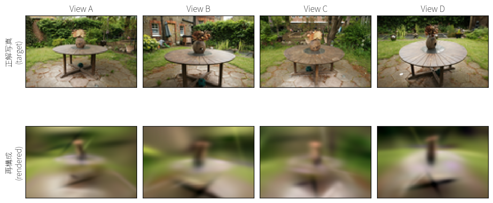
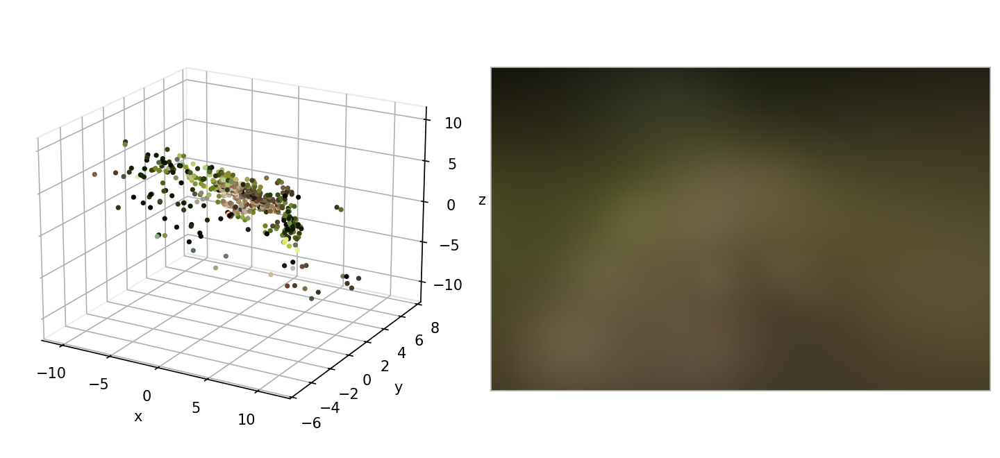
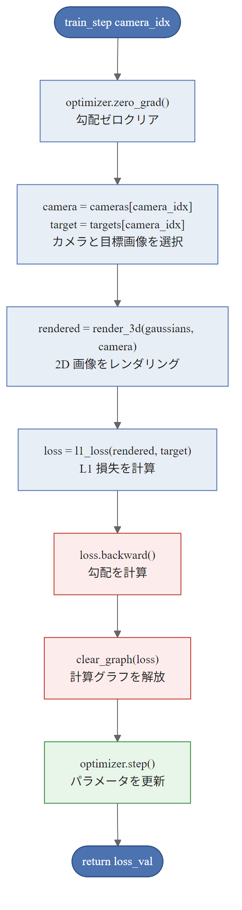
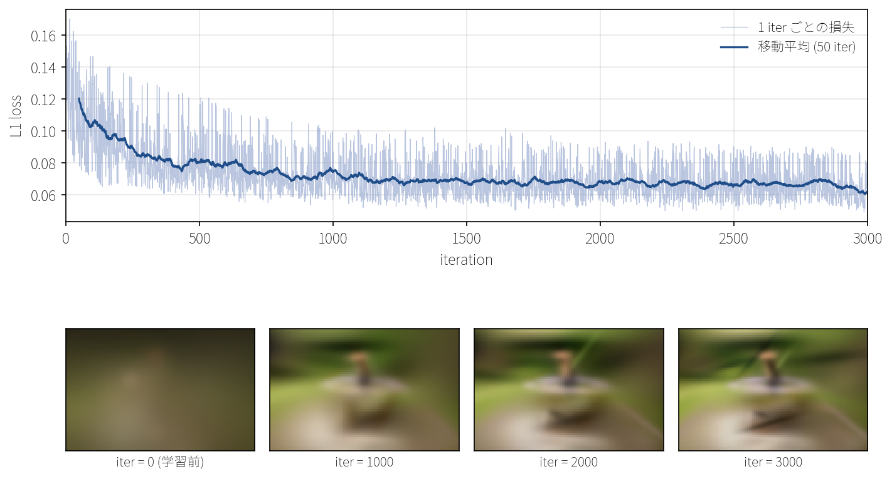

## この章で作るもの

第8章までで、3DガウシアンをEWA Splattingで2D画面に射影し、α合成で重ねるレンダリングが完成しました。勾配も位置・スケール・クォータニオン・不透明度・色の全パラメータに流れます。

この章ではいよいよ、これまでに作ってきた要素を組み合わせて、実際の写真データからの3D再構成にトライします。3DGS本来の改善要素はまだ入れていないので出力品質は図9.1のようにぼやけていますが、第10章以降で順に改善していきます。



これから作る学習ループに渡す入力は3つあります。**写真**、各写真の**カメラの位置と向き**、それに3Dガウシアンの初期配置を決めるための**初期3D点群**です。学習はガウシアンの位置・スケール・色を動かしていく作業なので、最初にガウシアンをどこに置くかを決めておく必要があります。3DGSではシーンの形状をおおまかに表す3D点群を用意し、その各点に1つずつ3Dガウシアンを置いて初期化、そこから複数視点の写真を教師にしてパラメータを更新するのが標準的な手順です。本章でもこの構成に沿い、損失にはL1を使います。

カメラの位置と向き、それに初期点群は写真から直接は得られないので、複数枚の写真から両方を自動推定する既存ツール**COLMAP**を前処理として使い、その出力を学習ループに渡します。

### 学習目標

- COLMAPの出力ファイル構造を理解し、データ読み込みを実装できる
- 点群から3Dガウシアンを初期化できる（K近傍距離によるスケール設定、RGB固定色）
- 素直な学習ループの `GaussianTrainer` を構築し、L1学習を実行できる
- 108x70px・200ガウシアン・3000イテレーションの設定で学習を回し、学習に使っていない視点でもシーンの形状と色がおおまかに再現されることを確認する

### この章で作成・修正するファイル

| ファイル | 種別 | 内容 |
|---------|------|------|
| `data_loader.py` | 新規 | COLMAPバイナリファイルの読み込みとデータセット管理 |
| `initialization.py` | 新規 | 点群からガウシアンの初期パラメータを設定 |
| `trainer.py` | 新規 | 素直な学習ループ（`GaussianTrainer`） |

### 前提知識

- 第5章: Adamオプティマイザ、`l1_loss`、計算グラフのクリア
- 第6章: 3Dガウシアンのパラメータ構造（位置・スケール・クォータニオン・不透明度・色）
- 第7章: カメラモデル（外部パラメータ `W`, `t` と内部パラメータ `fx, fy, cx, cy`）
- 第8章: 素朴版3Dレンダラー `render_3d` と `projection.py`

---

## 9.1 COLMAPデータの読み込み

### COLMAPとは

COLMAPは、複数の写真からカメラの位置と3D点群を自動推定するソフトウェアです。Structure from Motion（SfM）と呼ばれる技術を使い、以下の3つの情報を出力します。

1. **cameras.bin**: カメラの内部パラメータ（焦点距離、主点（画像の中心座標 $c_x$, $c_y$））
2. **images.bin**: 各写真のカメラ位置と向き（外部パラメータ）
3. **points3D.bin**: 3D点群（座標と色）

3DGSはCOLMAPの出力をそのまま入力として使います。COLMAPが「写真間の対応関係」を解いてくれるおかげで、3DGS側は3D表現の最適化に集中できます。

> **補足: Structure from Motion (SfM)**: 複数の写真から「カメラの動き（各写真での位置と向き）」と「シーンの3D構造（点群）」を同時に推定するコンピュータビジョンの技術です。"Structure" が3D構造、"Motion" がカメラの動きに対応します。カメラパラメータも3D点座標もどちらも未知なので、各画像から特徴点（建物の角、模様のエッジなど）を検出して画像間で対応付けたうえで、両者を一緒に動かしながら整合のとれた値を探していきます。この「カメラ側と3D点側を同時に最適化する」中心的な工程が**バンドル調整**（Bundle Adjustment）で、再投影誤差（3D点をカメラで写したときの予測位置と実際の2D観測位置のずれ）が最小になるよう反復的に収束させます。

### データセットの準備

この章では、Mip-NeRF 360データセットのgardenシーン（CC-BY 4.0ライセンス）を使います。以下のURLからダウンロードして展開してください。

```
https://brentyi.github.io/viser-example-assets/colmap_garden.zip
```

展開後、以下のディレクトリ構造になるように配置します。`data/` ディレクトリはプロジェクトルート（`chapters/` と同階層）に置きます。本章のインライン確認コードや `train_garden.py` はプロジェクトルート（`data/` と `chapters/` が見えるディレクトリ）から実行してください。

```
data/
└── colmap_garden/
    ├── sparse/
    │   └── 0/
    │       ├── cameras.bin    # カメラ内部パラメータ
    │       ├── images.bin     # 各画像の外部パラメータ
    │       └── points3D.bin   # 3D点群
    └── images_8/              # 元画像の1/8サイズ版
        ├── DSC07956.JPG
        ├── DSC07957.JPG
        └── ...
```

`sparse/0/` にはCOLMAPが出力した3つのバイナリファイルが入っています。`images_8/` は元の高解像度画像を1/8に縮小したもので、学習時にさらにリサイズして使います。元の画像サイズが大きい場合、このように予め縮小した画像フォルダを用意しておくのが一般的です。

### ColmapDatasetでデータを読み込む

本書のGitHubリポジトリから `data_loader.py` をダウンロードし、その中の `ColmapDataset` クラスを使って COLMAP の出力をまとめて読み込みます。コンストラクタには `base_path`（COLMAPデータセットのルートパス）、`images_folder`（画像フォルダ名、デフォルト `"images_8"`）、`resize`（リサイズ後の解像度、`(width, height)` のタプル）の3つを渡します。読み込み後は次の属性からデータを参照できます。以下、画像枚数を $M$、3D点群の数を $N$、リサイズ後の画像の高さと幅をそれぞれ $H$, $W$ と表します。

| 属性 | 形状・型 | 内容 |
|:---|:---|:---|
| `cameras` | 長さ $M$ の `Camera` オブジェクトのリスト | 各画像のカメラパラメータ。第7章で定義した内部パラメータ `fx, fy, cx, cy` と外部パラメータ `W, t` を保持 |
| `images` | 長さ $M$ のリスト、各要素が形状 $(H, W, 3)$ の `float64` 配列、値域 `[0, 1]` | 各画像のRGB値。`uint8` の `[0, 255]` を 255 で割って正規化した値 |
| `points3D` | 形状 $(N, 3)$ の `float64` NumPy 配列 | COLMAP が推定した3D点群の座標。各行が点の `(x, y, z)`（garden シーンでは $N$ ≈ 14万） |
| `point_colors` | 形状 $(N, 3)$ の `uint8` NumPy 配列、値域 `[0, 255]` | `points3D` の各点に対応するRGB色。各行が点の `(R, G, B)` |
| `image_names` | 長さ $M$ の `str` のリスト | 各画像の元ファイル名（例: `"DSC07956.JPG"`） |

動作確認です。garden データセットを読み込んでみましょう。

```python exec
from data_loader import ColmapDataset

dataset = ColmapDataset("data/colmap_garden", resize=(108, 70))
print(f"画像数: {len(dataset)}")
print(f"点群数: {dataset.points3D.shape[0]}")
print(f"画像形状: {dataset.images[0].shape}")
print(f"カメラ: fx={dataset.cameras[0].fx:.1f}, "
      f"fy={dataset.cameras[0].fy:.1f}")
```

```text output
画像数: 185
点群数: 138766
画像形状: (70, 108, 3)
カメラ: fx=80.06, fy=80.23
```

185枚の写真と約14万個の3D点がロードされました。画像形状の `(70, 108, 3)` は NumPy 配列が（行数, 列数, チャンネル）の順なので、縦70・横108 を意味します。

> **補足: ColmapDataset の中で行っていること**
> COLMAP の出力は `cameras.bin` / `images.bin` / `points3D.bin` の3つのバイナリファイルで、`data_loader.py` にはこれらを読み出すヘルパ関数 `read_cameras_binary` / `read_images_binary` / `read_points3D_binary` が用意されています。`ColmapDataset` はこれらを呼び出してデータを統合し、画像ファイルの読み込みと解像度スケールの調整（COLMAP の元解像度・実ファイルの解像度・`resize` で指定するリサイズ後の解像度のずれを、焦点距離と主点の比率倍で吸収する処理）までを行います。バイナリレイアウト・ヘルパ関数の入出力・解像度スケール導出・`ColmapDataset` 本体の実装は付録Eに掲載しています。

---

## 9.2 点群からガウシアンを初期化（固定色）

COLMAPの3D点群を3Dガウシアンの初期値に変換します。なぜ点群からの初期化が重要なのでしょうか。ランダムな位置から始めると、ガウシアンがシーン内の正しい場所に移動するまでに膨大なイテレーションが必要です。COLMAPの点群はすでにシーンの形状を反映しているため、良い初期値になります。



各3D点を1つの3Dガウシアンに対応させ、パラメータを次のように設定します。

- **位置**: 点の座標をそのまま使う
- **スケール**: 周囲の点が密集している場所は小さく、疎な場所は大きくする
- **回転**: 回転なしの単位クォータニオン $[1, 0, 0, 0]$ から始める
- **不透明度**: ほぼ透明な $0.1$ から始める
- **色**: COLMAPが記録しているRGB値を $[0, 1]$ に正規化した固定値を使う

色については、現時点では方向によらない固定値として扱います。視点によって色が変わるような金属・プラスチック的な表面の表現は、第10章の球面調和関数（SH）で導入します。

### 初期スケールの計算

各ガウシアンの初期スケール（大きさ）は、その点の周りにどれくらい他の点が集まっているかを使って決めます。ある点から近い順に $K$ 個の点を取り、それらまでの距離の平均を初期スケールとして使います。本書ではこの $K$ 個を **K近傍点** と呼び、$K = 3$ で進めます。近傍点が近いほどスケールは小さく、遠いほど大きくなるので、シーンの密度に適応した初期化になります。

`initialization.py` を新規作成します。

```python exec file=initialization.py
"""
点群からガウシアンを初期化する。
第9章: 実写データからの再構成

COLMAPの3D点群から3Dガウシアンの初期パラメータを設定する。
位置=点座標、色=RGBを[0,1]に正規化した固定値、
スケール=K近傍点の平均距離、クォータニオン=単位。
"""

import numpy as np
from gaussian3d import Gaussian3D


def compute_knn_distances(positions, k=3):
    """K近傍点の平均距離を計算する。

    各点について、最も近いK個の点との距離の平均を返す。
    この距離はガウシアンの初期スケールの目安になる。
    点が密集している場所は小さなガウシアン、疎な場所は大きなガウシアンとなり、
    シーンの密度に適応した初期化ができる。

    scipy等は使わず、NumPyの距離行列で素朴に計算する。

    Args:
        positions: (N, 3) の点群座標
        k: 近傍点数（デフォルト 3）

    Returns:
        (N,) の平均距離配列
    """
    N = positions.shape[0]

    # 距離行列を計算: (N, N)
    # ||a - b||^2 = ||a||^2 + ||b||^2 - 2 * a @ b^T
    sq_norms = np.sum(positions ** 2, axis=1)  # (N,)
    # sq_norms[:, None] は (N,) を (N, 1) に変形する操作（reshapeと同じ）。
    # (N, 1) + (1, N) のブロードキャストで (N, N) の行列が得られる
    dist_sq = sq_norms[:, None] + sq_norms[None, :] - 2.0 * positions @ positions.T
    # 数値誤差で負になることを防ぐ
    dist_sq = np.maximum(dist_sq, 0.0)
    distances = np.sqrt(dist_sq)  # (N, N)

    # 自分自身との距離を大きな値に設定（除外するため）
    # np.fill_diagonal は行列の対角成分を指定値で上書きする関数
    np.fill_diagonal(distances, np.inf)

    # 各点について最近傍K個のインデックスを取得
    # kがN-1より大きい場合に対応
    actual_k = min(k, N - 1)
    # argsortで全ソート → 先頭K個を取得（素朴だが確実）
    sorted_indices = np.argsort(distances, axis=1)  # (N, N)
    knn_indices = sorted_indices[:, :actual_k]  # (N, k)

    # K近傍の距離の平均
    mean_dists = np.zeros(N)
    for i in range(N):
        mean_dists[i] = np.mean(distances[i, knn_indices[i]])

    return mean_dists
```

距離行列の計算では、各点ペアの差を直接計算する代わりに、二乗ノルムの和と内積に分解する方法を使っています。2点 $\boldsymbol{a}, \boldsymbol{b}$ 間の距離の二乗を展開すると $(\boldsymbol{a}-\boldsymbol{b}) \cdot (\boldsymbol{a}-\boldsymbol{b}) = \boldsymbol{a} \cdot \boldsymbol{a} - 2 \boldsymbol{a} \cdot \boldsymbol{b} + \boldsymbol{b} \cdot \boldsymbol{b}$ となります。つまり

$$
\|\boldsymbol{a} - \boldsymbol{b}\|^2 = \|\boldsymbol{a}\|^2 + \|\boldsymbol{b}\|^2 - 2 \boldsymbol{a} \cdot \boldsymbol{b} \tag{9.1}
$$

です。この展開により、全点ペアの距離をループなしで一括計算できます。

具体例で確認します。3点 $\boldsymbol{p}_0 = (1, 0, 0)$、$\boldsymbol{p}_1 = (0, 2, 0)$、$\boldsymbol{p}_2 = (1, 1, 1)$ を考えます。各点の二乗ノルム $\|\boldsymbol{p}\|^2$ は成分の二乗和 $p_x^2 + p_y^2 + p_z^2$ なので、$\|\boldsymbol{p}_0\|^2 = 1$、$\|\boldsymbol{p}_1\|^2 = 4$、$\|\boldsymbol{p}_2\|^2 = 3$ となり、コード上は `sq_norms = [1, 4, 3]` です。

`sq_norms[:, None]` は列ベクトル `[[1], [4], [3]]`、`sq_norms[None, :]` は行ベクトル `[[1, 4, 3]]` です。これらをブロードキャストで足すと、列ベクトルの各行と行ベクトルの各列が足し合わされて $3 \times 3$ 行列ができます。

$$
\begin{pmatrix} 1 \\ 4 \\ 3 \end{pmatrix} + \begin{pmatrix} 1 & 4 & 3 \end{pmatrix} = \begin{pmatrix} 1+1 & 1+4 & 1+3 \\ 4+1 & 4+4 & 4+3 \\ 3+1 & 3+4 & 3+3 \end{pmatrix} = \begin{pmatrix} 2 & 5 & 4 \\ 5 & 8 & 7 \\ 4 & 7 & 6 \end{pmatrix}
$$

この行列の $(i, j)$ 成分は `sq_norms[i] + sq_norms[j]`、つまり点 $\boldsymbol{p}_i$ と $\boldsymbol{p}_j$ の二乗ノルムの和 $\|\boldsymbol{p}_i\|^2 + \|\boldsymbol{p}_j\|^2$ で、式(9.1) の右辺前2項に相当します。

次に内積行列 `positions @ positions.T` を計算します。行列積の結果の $(i, j)$ 成分は `positions` の行 $i$ と `positions.T` の列 $j$（= `positions` の行 $j$）の内積、つまり $\boldsymbol{p}_i \cdot \boldsymbol{p}_j$ です。たとえば $(1, 1)$ 成分は $\boldsymbol{p}_1 \cdot \boldsymbol{p}_1 = 0 \cdot 0 + 2 \cdot 2 + 0 \cdot 0 = 4$、$(1, 2)$ 成分は $\boldsymbol{p}_1 \cdot \boldsymbol{p}_2 = 0 \cdot 1 + 2 \cdot 1 + 0 \cdot 1 = 2$ です。全成分を計算すると次の行列になります。

$$
\begin{pmatrix} 1 & 0 & 0 \\ 0 & 2 & 0 \\ 1 & 1 & 1 \end{pmatrix} \begin{pmatrix} 1 & 0 & 1 \\ 0 & 2 & 1 \\ 0 & 0 & 1 \end{pmatrix} = \begin{pmatrix} 1 & 0 & 1 \\ 0 & 4 & 2 \\ 1 & 2 & 3 \end{pmatrix}
$$

これが式(9.1) の右辺第3項 $\boldsymbol{a} \cdot \boldsymbol{b}$ の全ペア版です。ノルム和の行列から内積行列の $2$ 倍を引けば、各成分 $(i, j)$ が $\|\boldsymbol{p}_i - \boldsymbol{p}_j\|^2$ である距離二乗行列が得られます。

$$
\begin{pmatrix} 2 & 5 & 4 \\ 5 & 8 & 7 \\ 4 & 7 & 6 \end{pmatrix} - 2 \cdot \begin{pmatrix} 1 & 0 & 1 \\ 0 & 4 & 2 \\ 1 & 2 & 3 \end{pmatrix} = \begin{pmatrix} 0 & 5 & 2 \\ 5 & 0 & 3 \\ 2 & 3 & 0 \end{pmatrix}
$$

たとえば $(1, 2)$ 成分は $\|(0, 2, 0) - (1, 1, 1)\|^2 = 1 + 1 + 1 = 3$ で、これは確かに $\boldsymbol{p}_1$ と $\boldsymbol{p}_2$ の距離 $\sqrt{3}$ の二乗です。ループを回さずに全ペアの距離を一括計算できていることが確認できます。

距離二乗行列ができたら、各点について「自分以外で最も近いK個」を選び、それらまでの距離の平均を取ればK近傍平均距離が求まります。コード上は次の4ステップです。

1. `distances = np.sqrt(dist_sq)` で距離二乗から距離に直す
2. `np.fill_diagonal(distances, np.inf)` で対角成分（自分自身までの距離 $0$）を $\infty$ に置き換え、自分を近傍候補から除外する
3. `np.argsort(distances, axis=1)[:, :K]` で各行のソート後インデックスを取り、その先頭 $K$ 個＝K近傍点のインデックスを得る。`np.argsort` は値ではなくソートしたときのインデックスの並びを返す関数で、たとえば `np.argsort([3, 1, 2])` は小さい順に元の index 1, 2, 0 が並ぶので `[1, 2, 0]` を返す
4. ステップ3で得たインデックスを使って距離行列から該当する $K$ 個の距離を取り出し（`distances[i, knn_indices[i]]`）、`np.mean` で平均を取る

たとえば $\boldsymbol{p}_0$ の行は対角を $\infty$ にすると $[\infty, \sqrt{5}, \sqrt{2}]$ で、$K=2$ なら距離の小さい順に $\boldsymbol{p}_2$（距離 $\sqrt{2}$）と $\boldsymbol{p}_1$（距離 $\sqrt{5}$）が選ばれ、平均は $(\sqrt{2} + \sqrt{5})/2 \approx 1.825$ です。

> **補足**: 距離行列は $(N, N)$ サイズで、各要素は8バイトの数値（NumPy のデフォルト float64）です。つまりメモリ使用量は点数 $N$ の二乗に比例します。点数が2倍になればメモリは4倍、10倍になれば100倍。こうした「$N$ のべき乗で増える」増え方を計算量・メモリ量の記法で $O(N^2)$ と書きます。
>
> 具体的には $N = 200$ 程度なら $200 \times 200 \times 8 \approx 320\,\text{KB}$ で問題ありませんが、garden データセットの全点群 $N = 138{,}766$ をそのまま渡すと、距離行列だけで $138{,}766 \times 138{,}766 \times 8 \approx 144\,\text{GB}$ となりメモリに収まりません。
>
> 実用ではこの $O(N^2)$ を避けるため、より効率的な近傍探索ライブラリを使うのが標準で、たとえば gsplat は scikit-learn の `NearestNeighbors` を呼び出しています。本書では CPU+NumPy で学習を回す都合からガウシアン数を数百程度に抑えており、入力点数もそれと同じ規模になります。この規模であれば $O(N^2)$ の総当たりでもメモリ・計算量ともに問題にならないため、読みやすさを優先して素朴な実装にしました。後述の `initialize_gaussians` で点数を制限してから呼び出します。

動作確認です。

```python exec
from initialization import compute_knn_distances
import numpy as np

positions = np.array([
    [0.0, 0.0, 0.0],
    [1.0, 0.0, 0.0],
    [0.0, 1.0, 0.0],
    [0.0, 0.0, 1.0],
])
dists = compute_knn_distances(positions, k=2)
print(dists)
```

```text output
[1.         1.20710678 1.20710678 1.20710678]
```

原点の2近傍は距離1.0の点が3つのうち2つなので平均1.0です。他の点は、原点（距離1.0）と別の1点（距離 $\sqrt{2} \approx 1.414$）が近傍となるため、平均は約 $1.207$ になっています。

### ガウシアンの初期化

位置・スケール・回転・不透明度・色のパラメータをまとめて設定する関数です。`n_gaussians` を指定すると、入力点群からランダムにその数だけ点を選んで使います。

`initialization.py` の末尾に追加します。

```python exec file=initialization.py mode=append
def initialize_gaussians(positions, colors, n_gaussians=None, k_nearest=3):
    """点群から3Dガウシアンを初期化する。

    各3D点を1つのガウシアンに変換する。

    初期化の方針:
    - 位置: 点座標をそのまま使用
    - スケール: K近傍点の平均距離を使い、log(平均距離)をscale_rawに設定
      （exp(scale_raw) が実際のスケールになるため）
    - 回転: 単位クォータニオン [1, 0, 0, 0]（回転なし）
    - 不透明度: sigmoid_inv(0.1) ≈ -2.197（ほぼ透明な状態から開始）
    - 色: RGBを [0, 1] に正規化した固定色。視点依存色は第10章のSHで導入する

    Args:
        positions: (M, 3) の点群座標
        colors: (M, 3) のRGB色（0-255の整数）
        n_gaussians: 使用する点の数。Noneなら全点を使用
        k_nearest: KNN近傍数（デフォルト 3）

    Returns:
        Gaussian3D オブジェクトのリスト
    """
    M = positions.shape[0]

    # 点数制限がある場合、ランダムにサンプリング
    if n_gaussians is not None and n_gaussians < M:
        indices = np.random.choice(M, n_gaussians, replace=False)
        positions = positions[indices]
        colors = colors[indices]
        M = n_gaussians

    # K近傍平均距離を計算
    mean_dists = compute_knn_distances(positions, k=k_nearest)

    # 距離が0の場合（重複点）に備えて下限を設定
    mean_dists = np.maximum(mean_dists, 1e-6)

    # スケールの初期値: log(平均距離)
    scale_raw = np.log(mean_dists)  # (M,)

    # 色の初期値: RGB [0, 255] を [0, 1] に正規化した固定色
    colors_normalized = colors.astype(np.float64) / 255.0  # (M, 3)

    # 不透明度の初期値: sigmoid_inv(0.1)
    opacity_raw = np.log(0.1 / 0.9)  # ≈ -2.197

    # ガウシアンを作成
    gaussians = []
    for i in range(M):
        g = Gaussian3D(
            position=positions[i],
            scale_raw=np.full(3, scale_raw[i]),  # 等方的スケール
            quaternion_raw=[1.0, 0.0, 0.0, 0.0],
            opacity_raw=opacity_raw,
            color=colors_normalized[i],
        )
        gaussians.append(g)

    return gaussians
```

各パラメータの初期値の意味を整理します。

- **スケール**: `scale_raw = log(K近傍平均距離)` なので `exp(scale_raw) = K近傍平均距離`。等方的（3軸同じ）に設定します
- **回転**: 単位クォータニオン $[1, 0, 0, 0]$ は回転なしを意味します
- **不透明度**: 不透明度 $0.1$（ほぼ透明）から始めます。最初から濃く塗ってしまうと、手前のガウシアンが奥のガウシアンを覆い隠して奥側に勾配が流れず、奥のガウシアンが学習されにくくなるためです。第6章で見たとおり実際の不透明度は `opacity_raw` を sigmoid に通して得ます。sigmoid 関数は

    $$\text{sigmoid}(x) = \frac{1}{1 + e^{-x}}$$

    で定義され、出力は $0$ から $1$ の値を取ります。`opacity_raw` の初期値は $\text{sigmoid}(x) = 0.1$ となる $x$ なので、$\text{sigmoid}(x) = p$ を $x$ について解いた式 $x = \log \frac{p}{1-p}$ に $p = 0.1$ を代入して

    $$x = \log \frac{0.1}{1 - 0.1} = \log \frac{0.1}{0.9} \approx -2.197$$

    を `opacity_raw` の初期値として設定します
- **色**: RGB値を $[0, 1]$ の範囲に正規化した固定値。全方向から見て同じ色になります

動作確認です。小さなダミー点群で初期化してみましょう。

```python exec
from initialization import initialize_gaussians
import numpy as np

positions = np.array([[0.0, 0.0, 0.0], [1.0, 0.0, 0.0], [0.0, 1.0, 0.0]])
colors = np.array([[255, 0, 0], [0, 255, 0], [0, 0, 255]], dtype=np.uint8)
gaussians = initialize_gaussians(positions, colors)
g = gaussians[0]
print(f"position: {g.position.data}")
print(f"color: {g.color.data}")
print(f"scale_raw: {g.scale_raw.data}")
print(f"opacity_raw: {float(g.opacity_raw.data):.3f}")
```

```text output
position: [0. 0. 0.]
color: [1. 0. 0.]
scale_raw: [0. 0. 0.]
opacity_raw: -2.197
```

原点のガウシアンの色は赤 $(1.0, 0.0, 0.0)$、スケールは $\log(1.0) = 0.0$（K近傍平均距離が $1.0$）、`opacity_raw` は $\log(0.1/0.9) \approx -2.197$ で、これに sigmoid を通すと不透明度 $0.1$ になります。

---

## 9.3 GaussianTrainer（素直な学習ループ）

学習ループを管理する `GaussianTrainer` クラスを作ります。1ステップの処理は、カメラ選択 → レンダリング → L1 損失 → backward → Adamで更新の流れで、フック抽象や差し替え点は設けず、`render_3d` と `l1_loss` を直接呼びます。以降の章では、このファイルを直接編集して機能を足していく方針です。



`trainer.py` を新規作成します。第5章で作成した `loss.py` の `l1_loss` と、第8章で追加した `render.py` の `render_3d` を使います。まずは冒頭部分です。

```python exec file=trainer.py
"""
ガウシアントレーナー。
第9章: 実写データからの再構成

素朴版ラスタライザ（第8章の render_3d）と L1 損失を使って
3Dガウシアン群を学習する、素直な学習ループ。

差し替え抽象やコールバックは入れない。以降の章では、
このファイルを直接編集して機能を足していく方針。
"""

import numpy as np
from autograd import Tensor, clear_graph
from loss import l1_loss
from render import render_3d


class GaussianTrainer:
    """3Dガウシアンの学習を管理するクラス。

    Attributes:
        gaussians: Gaussian3D オブジェクトのリスト
        cameras: Camera オブジェクトのリスト
        targets: 目標画像のリスト。各要素は (H, W, 3) のNumPy配列
        optimizer: Adam オプティマイザ
        bg_color: 背景色 (R, G, B)
    """

    def __init__(self, gaussians, cameras, targets, optimizer,
                 bg_color=(0, 0, 0)):
        """
        Args:
            gaussians: Gaussian3D オブジェクトのリスト
            cameras: Camera オブジェクトのリスト
            targets: 目標画像のリスト（[0, 1] のfloat配列）
            optimizer: Adam オプティマイザ
            bg_color: 背景色 (R, G, B)
        """
        self.gaussians = gaussians
        self.cameras = cameras
        self.targets = targets
        self.optimizer = optimizer
        self.bg_color = bg_color
```

### 学習ステップ

1ステップは「勾配クリア → カメラ選択 → レンダリング → 損失計算 → backward + 計算グラフ解放 → パラメータ更新」の6工程です。`train_step` メソッドを `GaussianTrainer` クラスの末尾に追加します。

```python
    def train_step(self, camera_idx):
        """1ステップの学習を実行する。

        手順:
        1. 勾配ゼロクリア
        2. カメラと目標画像を選択
        3. render_3d でレンダリング
        4. l1_loss で損失計算
        5. backward + 計算グラフ解放
        6. オプティマイザ更新

        Args:
            camera_idx: 使用するカメラのインデックス

        Returns:
            損失値（float）
        """
        # 1. 勾配ゼロクリア
        self.optimizer.zero_grad()

        # 2. カメラと目標画像を選択
        camera = self.cameras[camera_idx]
        target_image = self.targets[camera_idx]

        # 3. レンダリング（素朴版ラスタライザ）
        rendered = render_3d(self.gaussians, camera, bg_color=self.bg_color)

        # 4. 損失計算（L1）
        target = Tensor(target_image)
        loss = l1_loss(rendered, target)
        loss_val = float(loss.data)

        # 5. backward + 計算グラフ解放（メモリリーク防止）
        loss.backward()
        clear_graph(loss)

        # 6. オプティマイザ更新
        self.optimizer.step()

        return loss_val
```

`loss.backward()` の直後に `clear_graph(loss)` を呼んでいます。第5章で導入したこの関数は、backward 完了後に不要な計算グラフの参照を解放します。各 `Tensor` が保持する `_children` や `_backward` への参照を `None` に設定し、Pythonのガベージコレクタがメモリを回収できるようにします。数百から数千イテレーションの学習ではこの解放が必要です。

### 学習ループ

各イテレーションでランダムにカメラを選択し、`train_step` を呼ぶループです。`train` メソッドを `GaussianTrainer` クラスの末尾に追加します。

```python
    def train(self, n_iters, log_interval=100):
        """学習ループを実行する。

        各イテレーションでランダムにカメラを選択し、train_stepを呼ぶ。

        Args:
            n_iters: イテレーション数
            log_interval: ログ出力間隔

        Returns:
            losses: 損失値のリスト
        """
        n_cameras = len(self.cameras)
        losses = []

        for i in range(n_iters):
            # ランダムにカメラを選択
            camera_idx = np.random.randint(n_cameras)
            loss_val = self.train_step(camera_idx)
            losses.append(loss_val)

            if (i + 1) % log_interval == 0:
                avg_loss = np.mean(losses[-log_interval:])
                print(f"Iteration {i + 1}/{n_iters}, "
                      f"Loss: {avg_loss:.4f}")

        return losses
```

毎回ランダムなカメラを選ぶことで、全視点に満遍なく勾配が流れます。順番に回すと特定の視点のクセに過剰適合しやすくなるため、シャッフルしながら回すのが一般的です。

---

## 9.4 L1 学習の実行と評価

ここまでで必要なモジュールが全て揃いました。COLMAPデータを読み込み、ガウシアンを初期化し、L1 損失で学習を実行します。オプティマイザにパラメータを渡す際は、第6章で定義した `Gaussian3D` の `params` 属性を使います。この属性は各ガウシアンが持つ学習対象 `Tensor`（位置・スケール・クォータニオン・不透明度・色）のリストを返します。

以下を `chapters/chapter-09/train_garden.py` として保存し、プロジェクトルートから実行してください。

```python exec file=train_garden.py
"""gardenデータセットでL1学習を実行する。"""

import numpy as np

from data_loader import ColmapDataset
from initialization import initialize_gaussians
from trainer import GaussianTrainer
from optim import Adam


np.random.seed(42)

# --- 1. データセット読み込み ---
print("データセットを読み込み中...")
dataset = ColmapDataset("data/colmap_garden", resize=(108, 70))

# gardenシーンの全 185 視点を train 50 / test 10 に分割する。
# 等間隔に train を抜き、その合間から 10 視点を test に回す。
# test 視点は学習中に一度も見せず、最後の評価でだけ使う。
# 学習に使っていない視点で成立するかを確認するのが目的（novel view 評価）。
n_total = len(dataset)
stride = n_total // 50  # 185 // 50 = 3
train_idx = [i * stride for i in range(50)]
remaining = [i for i in range(n_total) if i not in set(train_idx)]
test_stride = len(remaining) // 10
test_idx = [remaining[i * test_stride] for i in range(10)]

train_cams = [dataset.cameras[i] for i in train_idx]
train_imgs = [dataset.images[i] for i in train_idx]
test_cams = [dataset.cameras[i] for i in test_idx]
test_imgs = [dataset.images[i] for i in test_idx]
print(f"  train: {len(train_cams)}視点, test: {len(test_cams)}視点, "
      f"点群: {dataset.points3D.shape[0]}")

# --- 2. ガウシアン初期化 ---
print("ガウシアンを初期化中...")
gaussians = initialize_gaussians(
    dataset.points3D, dataset.point_colors,
    n_gaussians=200,
)
print(f"  ガウシアン数: {len(gaussians)}")

# --- 3. オプティマイザ設定 ---
# g.params は第6章で定義した Gaussian3D の属性で、
# 各ガウシアンが持つ学習対象（position, scale_raw,
# quaternion_raw, opacity_raw, color）の Tensor リストを返す。
# 全ガウシアン分を1つのリストにまとめて Adam に渡す。
params = []
for g in gaussians:
    params.extend(g.params)
optimizer = Adam(params, lr=0.005)

# --- 4. トレーナー設定 ---
trainer = GaussianTrainer(
    gaussians=gaussians,
    cameras=train_cams,
    targets=train_imgs,
    optimizer=optimizer,
    bg_color=(0, 0, 0),
)

# --- 5. 学習実行 ---
print("学習開始...")
losses = trainer.train(n_iters=3000, log_interval=150)
```

学習が終わったら、再構成の品質を**PSNR**（Peak Signal-to-Noise Ratio）で評価します。PSNRは予測画像と正解画像の類似度を測る指標で、以下の式で計算します。

$$
\text{PSNR} = -10 \log_{10}(\text{MSE}) \tag{9.2}
$$

一般的なPSNRの定義では分子に $\text{MAX}_I^2$（画素値の最大値の二乗）が入りますが、画素値を $[0, 1]$ の範囲に正規化しているため $\text{MAX}_I = 1$ となり、省略できます。MSE（Mean Squared Error）は各ピクセルの差の二乗の平均です。PSNRの単位はdB（デシベル）で、値が大きいほど高画質です。目安として、20dB以下は粗い再構成、25〜30dB で実用的な品質、30dB以上で高品質とされます。

学習時は `train_step` が計算グラフを構築しますが、評価時は結果画像だけが必要なので、`render_3d` を直接呼ぶ方が効率的です。

引き続き `train_garden.py` の末尾に追加します。

```python exec file=train_garden.py mode=append
# --- 6. 評価 ---
# 学習に使った train 視点と、一度も見せていない test 視点の
# 両方で PSNR を測る。test の方が大きく下がるようなら過学習。
from render import render_3d
from PIL import Image


def mean_psnr(cams, imgs):
    psnrs = []
    for cam, tgt in zip(cams, imgs):
        rendered = render_3d(gaussians, cam, bg_color=(0, 0, 0)).data
        mse = np.mean((rendered - tgt) ** 2)
        psnrs.append(-10 * np.log10(mse) if mse > 0 else float("inf"))
    return float(np.mean(psnrs)), psnrs


print("\n評価中...")
train_mean, _ = mean_psnr(train_cams, train_imgs)
test_mean, test_psnrs = mean_psnr(test_cams, test_imgs)
print(f"  train 平均 PSNR: {train_mean:.2f} dB  ({len(train_cams)} 視点)")
print(f"  test  平均 PSNR: {test_mean:.2f} dB  ({len(test_cams)} 視点)")
for i, p in enumerate(test_psnrs[:4]):
    print(f"    test[{i}] PSNR = {p:.2f} dB")

# test 先頭 4 視点の target / rendered を並べて保存
for i in range(min(4, len(test_cams))):
    tgt = test_imgs[i]
    rendered = np.clip(render_3d(gaussians, test_cams[i],
                                  bg_color=(0, 0, 0)).data, 0, 1)
    side_by_side = np.concatenate([tgt, rendered], axis=1)
    img_u8 = (side_by_side * 255.0).astype(np.uint8)
    Image.fromarray(img_u8).save(f"_garden_test{i}_target_vs_rendered.png")

print("\n学習完了。test 視点の target/rendered を _garden_test*.png に出力。")
```

実行すると、以下のようなコンソール出力が得られます。損失値の絶対値は乱数シードや実行環境、NumPyのバージョンにより変動するため、以下の出力例と完全には一致しない場合があります。重要なのは損失が減少する傾向が見られることです。

```
データセットを読み込み中...
  train: 50視点, test: 10視点, 点群: 138766
ガウシアンを初期化中...
  ガウシアン数: 200
学習開始...
Iteration  150/3000, Loss: 0.1141
Iteration  300/3000, Loss: 0.0934
Iteration  600/3000, Loss: 0.0816
Iteration 1200/3000, Loss: 0.0712
Iteration 1800/3000, Loss: 0.0664
Iteration 2400/3000, Loss: 0.0644
Iteration 3000/3000, Loss: 0.0634

評価中...
  train 平均 PSNR: 20.63 dB  (50 視点)
  test  平均 PSNR: 20.51 dB  (10 視点)
    test[0] PSNR = 19.55 dB
    test[1] PSNR = 17.67 dB
    test[2] PSNR = 20.90 dB
    test[3] PSNR = 20.52 dB

学習完了。test 視点の target/rendered を _garden_test*.png に出力。
```

損失は3000イテレーションの間に0.162から0.063まで減少し、学習に使った50視点の平均PSNRは20.63dB、学習に使っていない10視点の平均PSNRは20.51dBになりました。trainとtestの差が0.1dB程度と小さく、特定視点にだけ張り付く過学習は起きず、3Dガウシアン群は「どの方向から見ても破綻しないようにシーンの形を揃える」方向に収束しています。



図9.4下段は学習中に一度も勾配を受け取っていないtest視点です。iter=0では初期点群の色がそのまま投影されてぼんやりとした色の塊にしか見えませんが、iter=1000では中央のテーブル・花瓶・背景の緑が立ち上がり、iter=3000まで回すと細部のコントラストが上がっていきます。この視点を1度も教師として使っていないにもかかわらず構造が浮かび上がるのは、各ガウシアンが50視点全部に対して同時に整合するよう最適化された結果、シーンの3D形状そのものを表現するに至ったということです。自動微分エンジン、3Dガウシアン表現、EWA射影、素朴版ラスタライザ、ここまで積み上げてきたモジュール群が連携して、実写の写真から3Dシーンを再構成しています。

::widget{name="ch9-garden"}

とはいえ、正解画像と比較するとまだかなりぼやけています。これは現時点の実装に以下の制約があるためです。

- **ガウシアン数が固定で少ない**: 200 個のガウシアンでシーン全体をカバーしようとしているため、細部を表現する余力がありません。ガウシアンが足りない領域はぼやけたままになります
- **固定色**: 各ガウシアンはどの方向から見ても同じ色です。金属やプラスチックのように視点によって色が変わる表面は表現できません
- **L1損失のみ**: ピクセルごとの差の平均を最小化しているので、画像の構造的なシャープさを直接的には求めていません
- **素朴版ラスタライザ**: 第8章の `render_3d` は全ガウシアンと全ピクセルの直積で計算するため、解像度やガウシアン数を上げると急速に遅くなります

これらの制約は以降の章で順に解消していきます。

本章で追加したCOLMAPバイナリの読込検証、K近傍距離の数値確認、L1 学習の単調減少、小規模合成シーンでの PSNR 下限確認は、本書のリポジトリの `chapters/chapter-09/test.py` に登録されていて、実行すれば一括検証できます。

---

## 9.5 章末まとめと次の章以降へ

この章では COLMAP 出力を入力とし、点群を初期値として各点に1つずつガウシアンを置き、L1 損失で 50 視点の写真を教師に学習するパイプラインを作りました。garden シーンの 108x70 / 200 ガウシアン / 3000 イテレーションで、損失が 0.162 から 0.063 に下がり、train 50 視点の平均 PSNR が 20.63 dB、学習に使っていない test 10 視点の平均 PSNR が 20.51 dB に達しました。低解像度・少数ガウシアンの小さな設定ですが、合成ではなく実写の写真から、しかも学習に使っていない別の視点でも破綻しない 3D シーンが再構成される挙動を確認できています。

### ここまでで作ったもの

第1章から本章までで、3D Gaussian Splatting の学習パイプラインを一通り自分の手で組み立てました。

- **第1〜3章**: 2Dガウシアンの表現と加重和レンダリング、α合成、スカラー自動微分の基礎
- **第4〜5章**: テンソル自動微分、Adam オプティマイザ、L1 損失、2D画像フィッティングで学習ループの型を作る
- **第6章**: 3Dガウシアン（位置・スケール・クォータニオン・不透明度・色）
- **第7章**: ピンホールカメラモデルと座標変換
- **第8章**: 透視投影のヤコビアンとEWA Splatting、素朴版の3Dレンダラー `render_3d`
- **第9章**: COLMAP データの読み込み、点群からの初期化、素直な学習ループで実写シーンの再構成

現時点では、色は視点非依存の固定値、ラスタライザは全ガウシアン × 全ピクセルの直積で処理する素朴版、損失は L1 のみです。これらが速度・品質の両面でボトルネックであることも、学習結果から見えています。

### 以降の章で加える機能

以降の章では、この `trainer.py` を土台にして、各章で本体のコードを直接編集する形で機能を足していきます。各章の冒頭で「`trainer.py` の〜行目をこう書き換えます」「`projection.py` の色計算部分をこう置き換えます」という差分を本文で示しながら進めていきます。

- **球面調和関数（SH）**: 各ガウシアンの色を視点方向の関数として表現します。`projection.py` の色計算に SH 評価を差し込み、視点依存の反射やハイライトを扱えるようにします
- **タイルベースラスタライザ**: 画面をタイルに分割し、各タイルに影響するガウシアンだけを処理することで、素朴版の速度限界を大きく押し上げます
- **SSIM 損失**: L1 に構造的類似度（SSIM）の項を加え、画像のシャープさを直接最適化します
- **Adaptive Density Control（ADC）**: 学習中にガウシアンを分裂・複製・剪定し、不足している領域にガウシアンを追加して細部の表現力を伸ばします
- **手動 backward**: α合成の backward を自動微分ではなく手書きのループに置き換え、3〜10 倍の高速化により 256x256px での学習を現実的にします
- **全体統合とビューア**: これから積み上げた機能を統合し、学習結果を任意視点で眺められるビューアを組みます

それぞれの章で、この章で作った素直な `GaussianTrainer` がどう進化していくかを、差分ベースで追っていきます。

### この章で学んだこと

- **COLMAPバイナリの読み込み**: cameras.bin / images.bin / points3D.bin の 3 ファイルをヘルパ関数で読み出し、カメラパラメータ・画像外部パラメータ・3D点群を取得しました（バイナリ形式の解析手順は付録Eを参照）
- **内部パラメータのスケール**: 画像リサイズ時は焦点距離と主点もリサイズ比率に合わせてスケールしないと、3D→2D射影がずれます
- **K近傍距離によるスケール初期化**: 距離行列から各点の近傍密度を計算し、シーンの密度に適応したガウシアンの大きさを設定しました
- **素直な学習ループ**: `render_3d` と `l1_loss` を直接呼ぶ、拡張点を持たない `GaussianTrainer` を実装し、以降の章で直接編集していく出発点にしました
- **L1 損失による学習**: garden シーンの train 50 / test 10 視点 / 108x70px / 200 ガウシアン / 3000 イテレーションで、損失 0.162 → 0.063、train 平均 PSNR 20.63 dB、test 平均 PSNR 20.51 dB に到達しました

